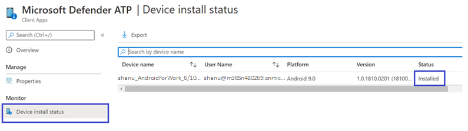

# Microsoft Intune으로 엔드포인트용 Microsoft Defender(Android용) 배포Deploy Microsoft Defender for Endpoint for Android with Microsoft Intune 

[!INCLUDE [Microsoft 365 Defender rebranding](../../includes/microsoft-defender.md)]

**적용 대상:****Applies to:**
- [엔드포인트용 Microsoft Defender](https://go.microsoft.com/fwlink/p/?linkid=2154037) [Microsoft Defender for Endpoint](https://go.microsoft.com/fwlink/p/?linkid=2154037)
- [Microsoft 365 DefenderMicrosoft 365 Defender](https://go.microsoft.com/fwlink/?linkid=2118804)

> 끝점용 Microsoft Defender를 경험하고 싶나요?Want to experience Microsoft Defender for Endpoint? [무료 평가판에 등록합니다.Sign up for a free trial.](https://www.microsoft.com/microsoft-365/windows/microsoft-defender-atp?ocid=docs-wdatp-exposedapis-abovefoldlink) 

Intune 회사 포털 등록 장치에서 Android용 끝점용 Defender를 배포하는 방법을 학습합니다.Learn how to deploy Defender for Endpoint for Android on Intune Company Portal enrolled devices. Intune 장치 등록에 대한 자세한 내용은 [장치 등록을 참조하세요.](https://docs.microsoft.com/mem/intune/user-help/enroll-device-android-company-portal)For more information about Intune device enrollment, see  [Enroll your device](https://docs.microsoft.com/mem/intune/user-help/enroll-device-android-company-portal).

> [!NOTE]
> **Android용 끝점용 Defender는 [이제 Google Play에서 사용할 수 있습니다.](https://play.google.com/store/apps/details?id=com.microsoft.scmx)****Defender for Endpoint for Android is now available on [Google Play](https://play.google.com/store/apps/details?id=com.microsoft.scmx)**  
> Intune에서 Google Play에 연결하여 장치 관리자 및 Android Enterprise 관리 모드로 끝점용 Defender 앱을 배포할 수 있습니다.You can connect to Google Play from Intune to deploy Defender for Endpoint app across Device Administrator and Android Enterprise entrollment modes.
앱 업데이트는 Google Play를 통해 자동으로 진행됩니다.Updates to the app are automatic via Google Play.

## 장치 관리자 등록 장치에 배포Deploy on Device Administrator enrolled devices

**Intune 회사 포털에서 Android용 끝점용 Defender 배포 - 장치 관리자 등록 장치****Deploy Defender for Endpoint for Android on Intune Company Portal - Device Administrator enrolled devices**

Intune 회사 포털 - 장치 관리자가 등록한 디바이스에서 Android용 끝점용 Defender를 배포하는 방법을 확인합니다.Learn how to deploy Defender for Endpoint for Android on Intune Company Portal - Device Administrator enrolled devices. 

### Android 스토어 앱으로 추가Add as Android store app

1. [Microsoft Endpoint Manager 관리 센터에서](https://go.microsoft.com/fwlink/?linkid=2109431) 앱 Android 앱 Android 스토어 앱  \>  \> **\> 추가로 이동하고** 선택을 **선택합니다.**In [Microsoft Endpoint Manager admin center](https://go.microsoft.com/fwlink/?linkid=2109431) , go to **Apps** \> **Android Apps** \> **Add \> Android store app** and choose **Select**.

   

2. 앱 **추가 페이지에서** 앱 정보 *섹션에 다음을* 입력합니다.On the **Add app** page and in the *App Information* section enter: 

   - **이름****Name** 
   - **설명****Description**
   - **Microsoft로 게시자.****Publisher** as Microsoft.
   - **앱 스토어 URL** https://play.google.com/store/apps/details?id=com.microsoft.scmx as(Endpoint 앱용 Defender 앱 Google Play 스토어 URL)**App store URL** as https://play.google.com/store/apps/details?id=com.microsoft.scmx (Defender for Endpoint app Google Play Store URL) 

   다른 필드는 선택 사항입니다.Other fields are optional. **다음** 을 선택합니다.Select **Next**.

   

3. 배정 *섹션에서* 필수 섹션으로 **이동하여** 그룹 **추가를 선택합니다.**In the *Assignments* section, go to the **Required** section and select **Add group.** 그런 다음 Android 앱용 끝점용 Defender를 대상으로 할 사용자 그룹을 선택할 수 있습니다.You can then choose the user group(s) that you would like to target Defender for Endpoint for Android app. **Select(선택)를** 선택하고 **Next(다음)를 선택합니다.**Choose **Select** and then **Next**.

    >[!NOTE]
    >선택한 사용자 그룹은 Intune에 등록된 사용자로 구성됩니다.The selected user group should consist of Intune enrolled users.

    > [!div class="mx-imgBorder"]

    > 

4. **검토+만들기 섹션에서** 입력한 정보가 모두 올바른지 확인한 다음 만들기를 **선택합니다.**In the **Review+Create** section, verify that all the information entered is correct and then select **Create**.

    잠시 후 Endpoint용 Defender 앱이 성공적으로 만들어지며 알림이 페이지의 오른쪽 위 모서리에 표시됩니다.In a few moments, the Defender for Endpoint app would be created successfully, and a notification would show up at the top-right corner of the page.

    

5. 표시되는 앱 정보 페이지의 모니터 섹션에서 장치  설치 상태를 선택하여 장치 설치가 성공적으로 완료되어 있는지 확인합니다. In the app information page that is displayed, in the **Monitor** section, select **Device install status** to verify that the device installation has completed successfully.

    > [!div class="mx-imgBorder"]
    > 

### 온보더링 완료 및 상태 확인Complete onboarding and check status

1. Android용 끝점용 Defender가 장치에 설치되면 앱 아이콘이 표시됩니다.Once Defender for Endpoint for Android has been installed on the device, you'll see the app icon.

    

2. Microsoft Defender ATP 앱 아이콘을 탭하고 화면 지침에 따라 앱 온보딩을 완료합니다.Tap the Microsoft Defender ATP app icon and follow the on-screen instructions to complete onboarding the app. 세부 정보에는 Android용 끝점용 Defender에 필요한 Android 사용 권한의 최종 사용자 수락이 포함됩니다.The details include end-user acceptance of Android permissions required by Defender for Endpoint for Android.

3. 온보딩에 성공하면 장치가 Microsoft Defender 보안 센터의 장치 목록에 표시될 것입니다.Upon successful onboarding, the device will start showing up on the Devices list in Microsoft Defender Security Center.

    

## Android Enterprise 등록 장치에 배포Deploy on Android Enterprise enrolled devices

Android용 Endpoint용 Defender는 Android Enterprise 등록 장치를 지원합니다.Defender for Endpoint for Android supports Android Enterprise enrolled devices.

Intune에서 지원하는 등록 옵션에 대한 자세한 내용은 [등록 옵션 을 참조하세요.](https://docs.microsoft.com/mem/intune/enrollment/android-enroll)For more information on the enrollment options supported by Intune, see [Enrollment Options](https://docs.microsoft.com/mem/intune/enrollment/android-enroll).

**현재 회사 프로필이 있는 개인 소유 장치 및 회사 소유의 완전히 관리되는 사용자 장치 등록은 배포에 지원됩니다.****Currently, Personally owned devices with work profile and Corporate-owned fully managed user device enrollments are supported for deployment.**

## Android용 끝점용 Microsoft Defender를 관리되는 Google Play 앱으로 추가Add Microsoft Defender for Endpoint for Android as a Managed Google Play app

아래 단계에 따라 관리되는 Google Play에 끝점용 Microsoft Defender 앱을 추가합니다.Follow the steps below to add Microsoft Defender for Endpoint app into your managed Google Play.

1. [Microsoft Endpoint Manager 관리 센터에서](https://go.microsoft.com/fwlink/?linkid=2109431) 앱 Android 앱 추가로  \>  \> **이동하여** **관리되는 Google Play 앱 을 선택합니다.**In [Microsoft Endpoint Manager admin center](https://go.microsoft.com/fwlink/?linkid=2109431) , go to **Apps** \> **Android Apps** \> **Add** and select **Managed Google Play app**.

    > [!div class="mx-imgBorder"]
    > 

2. 이후에 로드되는 관리되는 Google Play 페이지에서 검색 상자로 이동하여 **Microsoft Defender를 검색합니다.**On your managed Google Play page that loads subsequently, go to the search box and lookup **Microsoft Defender.** 검색은 관리되는 Google Play에 끝점용 Microsoft Defender 앱을 표시해야 합니다.Your search should display the Microsoft Defender for Endpoint app in your Managed Google Play. 앱 검색 결과에서 끝점용 Microsoft Defender 앱을 클릭합니다.Click on the Microsoft Defender for Endpoint app from the Apps search result.

    

3. 다음에 나오는 앱 설명 페이지에서 끝점용 Defender에서 앱 세부 정보를 볼 수 있습니다.In the App description page that comes up next, you should be able to see app details on Defender for Endpoint. 페이지에서 정보를 검토한 다음 승인 을 **선택합니다.**Review the information on the page and then select **Approve**.

    > [!div class="mx-imgBorder"]
    > 

4. Endpoint용 Defender가 작동하기 위해 획득하는 사용 권한을 제공합니다.You'll be presented with the permissions that Defender for Endpoint obtains for it to work. 검토한 다음 승인 **을 선택합니다.**Review them and then select **Approve**.

    

5. 승인 설정 페이지가 표시됩니다.You'll be presented with the Approval settings page. 이 페이지에서는 Android용 Endpoint용 Defender가 요청하는 새 앱 권한을 처리하기 위한 기본 설정을 확인할 수 있습니다.The page confirms your preference to handle new app permissions that Defender for Endpoint for Android might ask. 선택을 검토하고 원하는 옵션을 선택합니다.Review the choices and select your preferred option. **완료** 를 선택합니다.Select **Done**.

    기본적으로 관리되는 Google Play는 앱이 새 권한을 요청할 때 *승인된 유지를 선택합니다.*By default, managed Google Play selects *Keep approved when app requests new permissions*

    > [!div class="mx-imgBorder"]
    > 

6. 사용 권한 처리 선택이 끝나면 동기화를 선택하여 끝점용 Microsoft Defender를 앱 목록에 동기화합니다. After the permissions handling selection is made, select **Sync** to sync Microsoft Defender for Endpoint to your apps list.

    > [!div class="mx-imgBorder"]
    > 

7. 동기화는 몇 분 후에 완료됩니다.The sync will complete in a few minutes.

    

8. Android 앱 **화면에서** 새로 고침 단추를 선택하면 Microsoft Defender ATP가 앱 목록에 표시됩니다.Select the **Refresh** button in the Android apps screen and Microsoft Defender ATP should be visible in the apps list.

    > [!div class="mx-imgBorder"]
    > 

9. Endpoint용 Defender는 Intune을 통해 관리되는 장치에 대한 앱 구성 정책을 지원합니다.Defender for Endpoint supports App configuration policies for managed devices via Intune. 이 기능을 사용하여 적용 가능한 Android 사용 권한을 자동으로 그라데이터하여 최종 사용자가 이러한 사용 권한을 수락할 필요가 없습니다.This capability can be leveraged to autogrant applicable Android permission(s), so the end user does not need to accept these permission(s).

    1. 앱 **페이지에서** 정책 > 앱 구성 정책 > 관리 > **이동합니다.**In the **Apps** page, go to **Policy > App configuration policies > Add > Managed devices**.

       

    1. 앱 **구성 정책 만들기 페이지에서** 다음 세부 정보를 입력합니다.In the **Create app configuration policy** page, enter the following details:
    
        - 이름: Microsoft Defender ATP.Name: Microsoft Defender ATP.
        - **플랫폼으로 Android Enterprise를** 선택하십시오.Choose **Android Enterprise** as platform.
        - 프로필 **유형으로만 작업** 프로필을 선택하십시오.Choose **Work Profile only** as Profile Type.
        - 앱 **선택을 클릭하고** **Microsoft Defender ATP를 선택하고** 확인을 선택한 후 다음을 **선택합니다.** Click **Select App**, choose **Microsoft Defender ATP**, select **OK** and then **Next**.
    
        > [!div class="mx-imgBorder"]
        > 

    1. 설정 **페이지에서** 사용 권한 섹션으로 이동하여 추가를 클릭하여 지원되는 사용 권한 목록을 확인합니다.In the **Settings** page, go to the Permissions section click on Add to view the list of supported permissions. 사용 권한 추가 섹션에서 다음 사용 권한을 선택합니다.In the Add Permissions section, select the following permissions:

       - 외부 저장소(읽기)External storage (read)
       - 외부 저장소(쓰기)External storage (write)

       그런 다음 **확인** 을 선택합니다.Then select **OK**.

       > [!div class="mx-imgBorder"]
      > 

    1. 이제 두 사용 권한이 모두 나열되어 있으며 이제 사용 권한 상태 드롭다운에서 자동grant를 선택하고 다음 을 선택하여 둘 다 자동 그라데이트할 수 **있습니다.** You should now see both the permissions listed and now you can autogrant both by choosing autogrant in the **Permission state** drop-down and then select **Next**.

       > [!div class="mx-imgBorder"]
       > 

    1. 할당 **페이지에서** 이 앱 구성 정책을 할당할 사용자 그룹을 선택합니다.In the **Assignments** page, select the user group to which this app config policy would be assigned to. 그룹 **선택을 클릭하여** 해당 그룹을 포함하고 선택한 후 다음 을 **선택합니다.**Click **Select groups to include** and selecting the applicable group and then selecting **Next**.  여기서 선택한 그룹은 일반적으로 Endpoint Android용 Microsoft Defender 앱을 할당할 그룹과 동일합니다.The group selected here is usually the same group to which you would assign Microsoft Defender for Endpoint Android app. 

       > [!div class="mx-imgBorder"]
       > 
    

     1. 다음에 **나오는 검토 + 만들기** 페이지에서 모든 정보를 검토하고 만들기를 **선택합니다.**In the **Review + Create** page that comes up next, review all the information and then select **Create**.  
    
        이제 저장소 권한을 자동으로 확장하기 위한 Defender에 대한 앱 구성 정책이 선택한 사용자 그룹에 할당됩니다.The app configuration policy for Defender for Endpoint autogranting the storage permission is now assigned to the selected user group.

        > [!div class="mx-imgBorder"]
        > 

10. 속성 할당 편집 목록에서 **Microsoft Defender ATP** \>  \> **앱을** \> **선택합니다.**Select **Microsoft Defender ATP** app in the list \> **Properties** \> **Assignments** \> **Edit**.

    

11. 앱을 필수 *앱으로* 사용자 그룹에 할당합니다.Assign the app as a *Required* app to a user group. 회사 포털 앱을  통해 다음에 디바이스를 동기화하는 동안 회사 프로필에 자동으로 설치됩니다.It is automatically installed in the *work profile* during the next sync of the device via Company Portal app. 이 할당은 필수 섹션 그룹 추가로 가고  사용자 그룹을 선택하고 선택을 클릭하여 \>  완료할 **수 있습니다.**This assignment can be done by navigating to the *Required* section \> **Add group,** selecting the user group and click **Select**.

    > [!div class="mx-imgBorder"]
    > 

12. 응용 **프로그램 편집 페이지에서** 위에 입력한 모든 정보를 검토합니다.In the **Edit Application** page, review all the information that was entered above. 그런 다음 **검토 + 저장을 선택한** 다음 다시 **저장을** 선택하여 배정을 시작합니다.Then select **Review + Save** and then **Save** again to commence assignment.

### Always-on VPN의 자동 설정Auto Setup of Always-on VPN 
Endpoint용 Defender는 Intune을 통해 관리되는 장치에 대한 장치 구성 정책을 지원합니다.Defender for Endpoint supports Device configuration policies for managed devices via Intune. 이 기능을 활용하여 Android Enterprise 등록 장치에서 **Always-on VPN의** 자동 설정에 활용할 수 있으므로 최종 사용자는 온보드하는 동안 VPN 서비스를 설정할 필요가 없습니다.This capability can be leveraged to **Auto setup of Always-on VPN** on Android Enterprise enrolled devices, so the end user does not need to set up VPN service while onboarding.
1.  장치에서 **구성** 프로필 만들기 프로필 플랫폼 Android 엔터프라이즈 장치 등록 유형에 따라 다음 중 하나에서 장치 제한  >    >    >   선택을 선택합니다. On **Devices**, select **Configuration Profiles** > **Create Profile** > **Platform** > **Android Enterprise** Select **Device restrictions** under one of the following, based on your device enrollment type 
- **완전히 관리, 전용 및 Corporate-Owned 프로필****Fully Managed, Dedicated, and Corporate-Owned Work Profile**
- **개인 소유의 작업 프로필****Personally owned Work Profile**

**만들기** 를 선택합니다.Select **Create**.
 
   > 
    
2. **구성 설정** 구성 **프로필을** 고유하게 식별하는 **이름** 및 설명을 제공합니다.**Configuration Settings** Provide a **Name** and a **Description** to uniquely identify the configuration profile. 

   > 
   
 3. 연결을 **선택하고** VPN을 구성합니다.Select **Connectivity** and configure VPN:
- 항상 **VPN 설정** 작업 프로필에서 VPN 클라이언트를 설정하여 가능하면 VPN에 자동으로 연결하고 다시 연결하도록 합니다.Enable **Always-on VPN** Setup a VPN client in the work profile to automatically connect and reconnect to the VPN whenever possible. 특정 디바이스에서 항상 사용되는 VPN에 대해 VPN 클라이언트를 하나만 구성할 수 있으므로 단일 디바이스에 항상 실행형 VPN 정책이 두 개 이상 배포되지 않습니다.Only one VPN client can be configured for always-on VPN on a given device, so be sure to have no more than one always-on VPN policy deployed to a single device. 
- VPN **클라이언트** 드롭다운 목록에서 사용자 지정을 선택합니다. 이 경우 웹 보호 기능을 제공하는 데 사용되는 끝점 VPN용 Defender VPN입니다.Select **Custom** in VPN client dropdown list Custom VPN in this case is Defender for Endpoint VPN which is used to provide the Web Protection feature. 
    > [!NOTE]
    > 이 VPN의 자동 설치를 작동하려면 Microsoft Defender ATP 앱을 사용자 장치에 설치해야 합니다.Microsoft Defender ATP app must be installed on user’s device, in order to functioning of auto setup of this VPN.

- Google  Play 스토어에서 Microsoft Defender ATP 앱의 패키지 ID를 입력합니다.Enter **Package ID** of the Microsoft Defender ATP app in Google Play store. Defender 앱 URL의 https://play.google.com/store/apps/details?id=com.microsoft.scmx 경우 패키지 ID는 **com.microsoft.scmx입니다.**For the Defender app URL https://play.google.com/store/apps/details?id=com.microsoft.scmx, Package ID is **com.microsoft.scmx**  
- **잠금 모드** 구성되지 않습니다(기본값)**Lockdown mode** Not configured (Default) 

     
   
4. **배정** 할당  **페이지에서** 이 앱 구성 정책을 할당할 사용자 그룹을   선택합니다.**Assignment** In the **Assignments** page, select the user group to which this app config policy would be assigned to. 그룹 **선택을** 클릭하여 해당 그룹을 포함 및 선택하고 다음을 **클릭합니다.**Click **Select groups** to include and selecting the applicable group and then click **Next**. 여기서 선택한 그룹은 일반적으로 Endpoint Android용 Microsoft Defender 앱을 할당할 그룹과 동일합니다.The group selected here is usually the same group to which you would assign Microsoft Defender for Endpoint Android app. 

     

5. 다음에 **나오는 검토 + 만들기** 페이지에서 모든 정보를 검토하고 만들기를 **선택합니다.**In the **Review + Create** page that comes up next, review all the information and then select **Create**. 이제 장치 구성 프로필이 선택한 사용자 그룹에 할당됩니다.The device configuration profile is now assigned to the selected user group.    

    

## 온보더링 완료 및 상태 확인Complete onboarding and check status

1. 장치 설치 상태를 클릭하여 Android용 끝점용 Microsoft Defender의 설치 **상태를 확인합니다.**Confirm the installation status of Microsoft Defender for Endpoint for Android by clicking on the **Device Install Status**. 디바이스가 여기에 표시되는지 확인합니다.Verify that the device is displayed here.

    > [!div class="mx-imgBorder"]
    > 

2. 장치에서 작업 프로필로 가면 온보더링 상태의 유효성을 **검사할 수 있습니다.**On the device, you can validate the onboarding status by going to the **work profile**. 끝점용 Defender를 사용할 수 있으며, 작업 프로필을 사용하여 개인 소유 장치에 **등록하는지 확인**Confirm that Defender for Endpoint is available and that you are enrolled to the **Personally owned devices with work profile**.  회사 소유의 완전히 관리되는 사용자 장치에 등록한 경우 디바이스에 단일 프로필이 있습니다. 여기서 끝점용 Defender를 사용할 수 있습니다.If you are enrolled to a **Corporate-owned, fully managed user device**, you will have a single profile on the device where you can confirm that Defender for Endpoint is available.

    

3. 앱이 설치되면 앱을 열고 사용 권한을 수락한 다음 온보더링이 성공해야 합니다.When the app is installed, open the app and accept the permissions and then your onboarding should be successful.

    

4. 이 단계에서 장치는 Android용 끝점용 Defender에 성공적으로 온보딩됩니다.At this stage the device is successfully onboarded onto Defender for Endpoint for Android. 장치 페이지로 이동하여 [Microsoft Defender 보안](https://securitycenter.microsoft.com) 센터에서 이를 확인할 **수** 있습니다.You can verify this on the [Microsoft Defender Security Center](https://securitycenter.microsoft.com) by navigating to the **Devices** page.

    

## 관련 항목Related topics
- [엔드포인트용 Microsoft Defender(Android용) 개요Overview of Microsoft Defender for Endpoint for Android](microsoft-defender-endpoint-android.md)
- [엔드포인트용 Microsoft Defender(Android용) 기능 구성Configure Microsoft Defender for Endpoint for Android features](android-configure.md)
