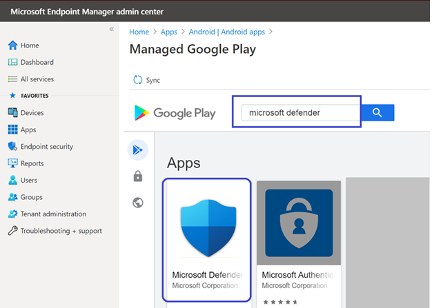
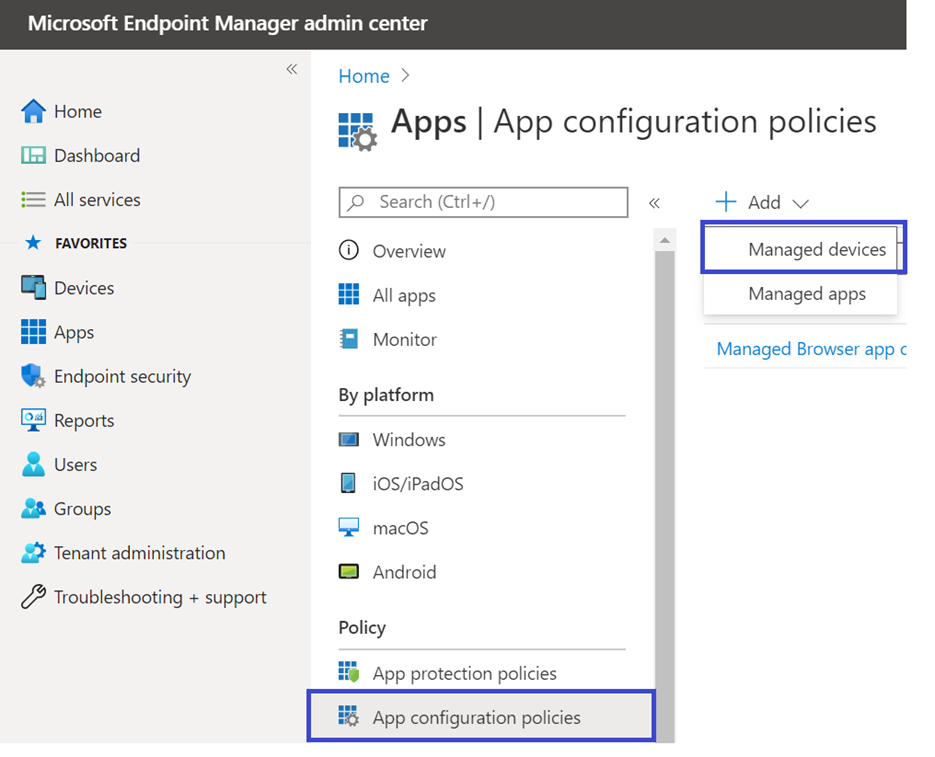

# Microsoft Intune으로 Microsoft Defender for Endpoint(Android용) 배포 

[!INCLUDE [Microsoft 365 Defender rebranding](../../includes/microsoft-defender.md)]

**적용 대상:**
- [엔드포인트용 Microsoft Defender](https://go.microsoft.com/fwlink/p/?linkid=2154037)
- [Microsoft 365 Defender](https://go.microsoft.com/fwlink/?linkid=2118804)

> 끝점용 Microsoft Defender를 경험하고 싶나요? [무료 평가판에 등록합니다.](https://www.microsoft.com/microsoft-365/windows/microsoft-defender-atp?ocid=docs-wdatp-exposedapis-abovefoldlink) 

Intune 회사 포털 등록 디바이스에서 Android에 Endpoint용 Defender를 배포하는 방법을 학습합니다. Intune 장치 등록에 대한 자세한 내용은 [장치 등록을 참조하세요.](https://docs.microsoft.com/mem/intune/user-help/enroll-device-android-company-portal)

> [!NOTE]
> **Android의 끝점용 Defender는 [이제 Google Play에서 사용할 수 있습니다.](https://play.google.com/store/apps/details?id=com.microsoft.scmx)**  
> Intune에서 Google Play에 연결하여 장치 관리자 및 Android Enterprise 관리 모드로 끝점용 Defender 앱을 배포할 수 있습니다.
앱 업데이트는 Google Play를 통해 자동으로 진행됩니다.

## 장치 관리자 등록 장치에 배포

**Intune 회사 포털에서 Android에서 끝점용 Defender 배포 - 장치 관리자 등록 장치**

Intune 회사 포털 - 장치 관리자가 등록한 디바이스에서 Android에 Endpoint용 Defender를 배포하는 방법을 학습합니다. 

### Android 스토어 앱으로 추가

1. [Microsoft Endpoint Manager 관리 센터에서](https://go.microsoft.com/fwlink/?linkid=2109431) 앱 Android 앱 Android 스토어 앱  \>  \> **\> 추가로 이동하고** 선택을 **선택합니다.**

   

2. 앱 **추가 페이지에서** 앱 정보 *섹션에 다음을* 입력합니다. 

   - **이름** 
   - **설명**
   - **Microsoft로 게시자.**
   - **앱 스토어 URL** https://play.google.com/store/apps/details?id=com.microsoft.scmx as(Endpoint 앱용 Defender 앱 Google Play 스토어 URL) 

   다른 필드는 선택 사항입니다. **다음** 을 선택합니다.

   

3. 배정 *섹션에서* 필수 섹션으로 **이동하여** 그룹 **추가를 선택합니다.** 그런 다음 Android 앱에서 끝점용 Defender를 대상으로 할 사용자 그룹을 선택할 수 있습니다. **Select(선택)를** 선택하고 **Next(다음)를 선택합니다.**

    >[!NOTE]
    >선택한 사용자 그룹은 Intune에 등록된 사용자로 구성됩니다.

    > [!div class="mx-imgBorder"]

    > 

4. **검토+만들기 섹션에서** 입력한 정보가 모두 올바른지 확인한 다음 만들기를 **선택합니다.**

    잠시 후 Endpoint용 Defender 앱이 성공적으로 만들어지며 알림이 페이지의 오른쪽 위 모서리에 표시됩니다.

    

5. 표시되는 앱 정보 페이지의 모니터 섹션에서 장치  설치 상태를 선택하여 장치 설치가 성공적으로 완료되어 있는지 확인합니다. 

    > [!div class="mx-imgBorder"]
    > 

### 온보더링 완료 및 상태 확인

1. Android의 끝점용 Defender가 장치에 설치되면 앱 아이콘이 표시됩니다.

    

2. 끝점용 Microsoft Defender 앱 아이콘을 탭하고 화면 지침에 따라 앱 온보딩을 완료합니다. 세부 정보에는 Android의 끝점용 Defender에 필요한 Android 사용 권한의 최종 사용자 수락이 포함됩니다.

3. 온보딩에 성공하면 장치가 Microsoft Defender 보안 센터의 장치 목록에 표시될 것입니다.

    

## Android Enterprise 등록 장치에 배포

Android의 끝점용 Defender는 Android Enterprise 등록 장치를 지원합니다.

Intune에서 지원하는 등록 옵션에 대한 자세한 내용은 [등록 옵션 을 참조하세요.](https://docs.microsoft.com/mem/intune/enrollment/android-enroll)

**현재 회사 프로필이 있는 개인 소유 장치 및 회사 소유의 완전히 관리되는 사용자 장치 등록은 배포에 지원됩니다.**

## Android에서 끝점용 Microsoft Defender를 관리되는 Google Play 앱으로 추가

아래 단계에 따라 관리되는 Google Play에 끝점용 Microsoft Defender 앱을 추가합니다.

1. [Microsoft Endpoint Manager 관리 센터에서](https://go.microsoft.com/fwlink/?linkid=2109431) 앱 Android 앱 추가로  \>  \> **이동하여** **관리되는 Google Play 앱 을 선택합니다.**

    > [!div class="mx-imgBorder"]
    > 

2. 이후에 로드되는 관리되는 Google Play 페이지에서 검색 상자로 이동하여 **Microsoft Defender를 검색합니다.** 검색은 관리되는 Google Play에 끝점용 Microsoft Defender 앱을 표시해야 합니다. 앱 검색 결과에서 끝점용 Microsoft Defender 앱을 클릭합니다.

    

3. 다음에 나오는 앱 설명 페이지에서 끝점용 Defender에서 앱 세부 정보를 볼 수 있습니다. 페이지에서 정보를 검토한 다음 승인 을 **선택합니다.**

    > [!div class="mx-imgBorder"]
    > 

4. Endpoint용 Defender가 작동하기 위해 획득하는 사용 권한을 제공합니다. 검토한 다음 승인 **을 선택합니다.**

    

5. 승인 설정 페이지가 표시됩니다. 이 페이지에서는 Android의 끝점용 Defender가 요청하는 새 앱 권한을 처리하기 위한 기본 설정을 확인할 수 있습니다. 선택을 검토하고 원하는 옵션을 선택합니다. **완료** 를 선택합니다.

    기본적으로 관리되는 Google Play는 앱이 새 권한을 요청할 때 *승인된 유지를 선택합니다.*

    > [!div class="mx-imgBorder"]
    > 

6. 사용 권한 처리 선택이 끝나면 동기화를 선택하여 끝점용 Microsoft Defender를 앱 목록에 동기화합니다. 

    > [!div class="mx-imgBorder"]
    > 

7. 동기화는 몇 분 후에 완료됩니다.

    

8. Android 앱 **화면에서** 새로 고침 단추를 선택하면 끝점용 Microsoft Defender가 앱 목록에 표시됩니다.

    > [!div class="mx-imgBorder"]
    > 

9. Endpoint용 Defender는 Intune을 통해 관리되는 장치에 대한 앱 구성 정책을 지원합니다. 이 기능을 사용하여 적용 가능한 Android 사용 권한을 자동으로 그라데이터하여 최종 사용자가 이러한 사용 권한을 수락할 필요가 없습니다.

    1. 앱 **페이지에서** 정책 > 앱 구성 정책 > 관리 > **이동합니다.**

       

    1. 앱 **구성 정책 만들기 페이지에서** 다음 세부 정보를 입력합니다.
    
        - 이름: 끝점용 Microsoft Defender.
        - **플랫폼으로 Android Enterprise를** 선택하십시오.
        - 프로필 **유형으로만 작업** 프로필을 선택하십시오.
        - 앱 **선택을 클릭하고** **Microsoft Defender ATP를 선택하고** 확인을 선택한 후 다음을 **선택합니다.** 
    
        > [!div class="mx-imgBorder"]
        > 

    1. 설정 **페이지에서** 사용 권한 섹션으로 이동하여 추가를 클릭하여 지원되는 사용 권한 목록을 확인합니다. 사용 권한 추가 섹션에서 다음 사용 권한을 선택합니다.

       - 외부 저장소(읽기)
       - 외부 저장소(쓰기)

       그런 다음 **확인** 을 선택합니다.

       > [!div class="mx-imgBorder"]
      > 

    1. 이제 두 사용 권한이 모두 나열되어 있으며 이제 사용 권한 상태 드롭다운에서 자동grant를 선택하고 다음 을 선택하여 둘 다 자동 그라데이트할 수 **있습니다.** 

       > [!div class="mx-imgBorder"]
       > 

    1. 할당 **페이지에서** 이 앱 구성 정책을 할당할 사용자 그룹을 선택합니다. 그룹 **선택을 클릭하여** 해당 그룹을 포함하고 선택한 후 다음 을 **선택합니다.**  여기서 선택한 그룹은 일반적으로 Endpoint Android용 Microsoft Defender 앱을 할당할 그룹과 동일합니다. 

       > [!div class="mx-imgBorder"]
       > 
    

     1. 다음에 **나오는 검토 + 만들기** 페이지에서 모든 정보를 검토하고 만들기를 **선택합니다.**  
    
        이제 저장소 권한을 자동으로 확장하기 위한 Defender에 대한 앱 구성 정책이 선택한 사용자 그룹에 할당됩니다.

        > [!div class="mx-imgBorder"]
        > 

10. 속성 할당 편집 목록에서 **Microsoft Defender ATP** \>  \> **앱을** \> **선택합니다.**

    

11. 앱을 필수 *앱으로* 사용자 그룹에 할당합니다. 회사 포털 앱을  통해 다음에 디바이스를 동기화하는 동안 회사 프로필에 자동으로 설치됩니다. 이 할당은 필수 섹션 그룹 추가로 가고  사용자 그룹을 선택하고 선택을 클릭하여 \>  완료할 **수 있습니다.**

    > [!div class="mx-imgBorder"]
    > 

12. 응용 **프로그램 편집 페이지에서** 위에 입력한 모든 정보를 검토합니다. 그런 다음 **검토 + 저장을 선택한** 다음 다시 **저장을** 선택하여 배정을 시작합니다.

### Always-on VPN의 자동 설정 
Endpoint용 Defender는 Intune을 통해 관리되는 장치에 대한 장치 구성 정책을 지원합니다. 이 기능을 활용하여 Android Enterprise 등록 장치에서 **Always-on VPN의** 자동 설정에 활용할 수 있으므로 최종 사용자는 온보드하는 동안 VPN 서비스를 설정할 필요가 없습니다.
1.  장치에서 **구성** 프로필 만들기 프로필 플랫폼 Android 엔터프라이즈 장치 등록 유형에 따라 다음 중 하나에서 장치 제한  >    >    >   선택을 선택합니다.  
- **완전히 관리, 전용 및 Corporate-Owned 프로필**
- **개인 소유의 작업 프로필**

**만들기** 를 선택합니다.
 
   > 
    
2. **구성 설정** 구성 **프로필을** 고유하게 식별하는 **이름** 및 설명을 제공합니다. 

   > 
   
 3. 연결을 **선택하고** VPN을 구성합니다.
- 항상 **VPN 설정** 작업 프로필에서 VPN 클라이언트를 설정하여 가능하면 VPN에 자동으로 연결하고 다시 연결하도록 합니다. 특정 디바이스에서 항상 사용되는 VPN에 대해 VPN 클라이언트를 하나만 구성할 수 있으므로 단일 디바이스에 항상 실행형 VPN 정책이 두 개 이상 배포되지 않습니다. 
- VPN **클라이언트** 드롭다운 목록에서 사용자 지정을 선택합니다. 이 경우 웹 보호 기능을 제공하는 데 사용되는 끝점 VPN용 Defender VPN입니다. 
    > [!NOTE]
    > 이 VPN의 자동 설치를 작동하려면 사용자의 장치에 끝점용 Microsoft Defender 앱을 설치해야 합니다.

- Google  Play 스토어에서 끝점용 Microsoft Defender 앱의 패키지 ID를 입력합니다. Defender 앱 URL의 https://play.google.com/store/apps/details?id=com.microsoft.scmx 경우 패키지 ID는 **com.microsoft.scmx입니다.**  
- **잠금 모드** 구성되지 않습니다(기본값) 

     
   
4. **배정** 할당  **페이지에서** 이 앱 구성 정책을 할당할 사용자 그룹을   선택합니다. 그룹 **선택을** 클릭하여 해당 그룹을 포함 및 선택하고 다음을 **클릭합니다.** 여기서 선택한 그룹은 일반적으로 Endpoint Android용 Microsoft Defender 앱을 할당할 그룹과 동일합니다. 

     

5. 다음에 **나오는 검토 + 만들기** 페이지에서 모든 정보를 검토하고 만들기를 **선택합니다.** 이제 장치 구성 프로필이 선택한 사용자 그룹에 할당됩니다.    

    

## 온보더링 완료 및 상태 확인

1. 장치 설치 상태를 클릭하여 Android에서 끝점용 Microsoft Defender의 설치 **상태를 확인합니다.** 디바이스가 여기에 표시되는지 확인합니다.

    > [!div class="mx-imgBorder"]
    > 

2. 장치에서 작업 프로필로 가면 온보더링 상태의 유효성을 **검사할 수 있습니다.** 끝점용 Defender를 사용할 수 있으며, 작업 프로필을 사용하여 개인 소유 장치에 **등록하는지 확인**  회사 소유의 완전히 관리되는 사용자 장치에 등록한 경우 디바이스에 단일 프로필이 있습니다. 여기서 끝점용 Defender를 사용할 수 있습니다.

    

3. 앱이 설치되면 앱을 열고 사용 권한을 수락한 다음 온보더링이 성공해야 합니다.

    

4. 이 단계에서 장치는 Android의 끝점용 Defender에 성공적으로 온보딩됩니다. 장치 페이지로 이동하여 [Microsoft Defender 보안](https://securitycenter.microsoft.com) 센터에서 이를 확인할 **수** 있습니다.

    

## 관련 항목
- [Microsoft Defender for Endpoint(iOS용) 개요](microsoft-defender-endpoint-android.md)
- [Microsoft Defender for Endpoint(Android용) 기능 구성](android-configure.md)
