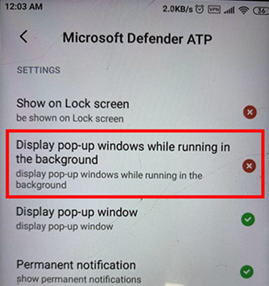

# Android용 끝점용 Microsoft Defender 문제 해결

[!INCLUDE [Microsoft 365 Defender rebranding](../../includes/microsoft-defender.md)]

**적용 대상:**
- [엔드포인트용 Microsoft Defender](https://go.microsoft.com/fwlink/p/?linkid=2154037) 
- [Microsoft 365 Defender](https://go.microsoft.com/fwlink/?linkid=2118804)

> 끝점용 Microsoft Defender를 경험하고 싶나요? [무료 평가판에 등록합니다.](https://www.microsoft.com/microsoft-365/windows/microsoft-defender-atp?ocid=docs-wdatp-exposedapis-abovefoldlink) 

장치를 등록할 때 앱이 설치된 후 로그인 문제가 표시될 수 있습니다.

등록하는 동안 장치에 앱을 설치한 후 로그인 문제가 발생할 수 있습니다.

이 문서에서는 로그인 문제를 해결하기 위한 해결법을 제공합니다.  

## 로그인 실패 - 예기치 않은 오류
**로그인 실패:** *예기치 않은 오류, 나중에 시도*

**메시지:**

예기치 않은 오류, 나중에 시도

**원인:**

장치에 "Microsoft Authenticator" 앱의 이전 버전이 설치되어 있습니다.

**해결 방법:**

Google Play 스토어에서 최신 버전 [및 Microsoft Authenticator를](https://play.google.com/store/apps/details?androidid=com.azure.authenticator) 설치하고 다시 시도

## 로그인 실패 - 잘못된 라이선스

**로그인 실패: 라이선스가** *잘못되었습니다. 관리자에게 문의하세요.*

**메시지:** *라이선스가 잘못되었습니다. 관리자에게 문의하세요.*

**원인:**

Microsoft 365 라이선스가 할당되지 않은 경우 또는 조직에 Microsoft 365 Enterprise 구독 라이선스가 없습니다.

**해결 방법:**

관리자에게 문의하십시오.

## 일부 OEM 장치에서 피싱 페이지가 차단되지 않습니다.

**다음에 적용됩니다.** 특정 OEM만

-   **Xiaomi**

Android용 끝점용 Defender에서 감지한 피싱 및 유해한 웹 위협은 일부 Xiaomi 장치에서 차단되지 않습니다. 이러한 장치에서는 다음 기능이 작동하지 않습니다.

**원인:**

Xiaomi 장치에는 새로운 사용 권한 모델이 포함되어 있습니다. 이렇게 하면 Android용 Endpoint용 Defender가 백그라운드에서 실행되는 동안 팝업 창을 표시하지 못합니다.

Xiaomi 장치 권한: "백그라운드에서 실행되는 동안 팝업 창 표시"

**해결 방법:**

Xiaomi 디바이스에 대해 필요한 권한을 사용하도록 설정

- 백그라운드에서 실행되는 동안 팝업 창을 표시합니다.
