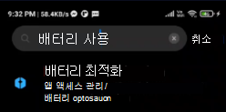
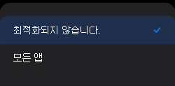
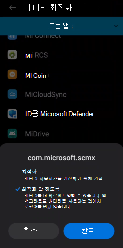

# Android의 엔드포인트용 Microsoft Defender 문제 해결

[!INCLUDE [Microsoft 365 Defender rebranding](../../includes/microsoft-defender.md)]

**적용 대상:**
- [엔드포인트용 Microsoft Defender](https://go.microsoft.com/fwlink/p/?linkid=2154037)
- [Microsoft 365 Defender](https://go.microsoft.com/fwlink/?linkid=2118804)

> 엔드포인트용 Microsoft Defender를 경험하고 싶으신가요? [무료 평가판을 신청하세요.](https://signup.microsoft.com/create-account/signup?products=7f379fee-c4f9-4278-b0a1-e4c8c2fcdf7e&ru=https://aka.ms/MDEp2OpenTrial?ocid=docs-wdatp-exposedapis-abovefoldlink)

장치를 등록할 때 앱이 설치된 후 로그인 문제가 표시될 수 있습니다.

등록하는 동안 장치에 앱을 설치한 후 로그인 문제가 발생할 수 있습니다.

이 문서에서는 로그인 문제를 해결하기 위한 해결법을 제공합니다.

## 로그인 실패 - 예기치 않은 오류

**로그인 실패:** *예기치 않은 오류, 나중에 시도*

:::image type="content" alt-text="로그인 실패 오류의 이미지 예기치 않은 오류입니다." source="images/f9c3bad127d636c1f150d79814f35d4c.png":::

**메시지:**

예기치 않은 오류, 나중에 시도

**원인:**

이전 버전의 "Microsoft Authenticator" 앱이 장치에 설치되어 있습니다.

**해결 방법:**

Google Play 스토어에서 최신 [Microsoft Authenticator](https://play.google.com/store/apps/details?androidid=com.azure.authenticator) 설치하고 다시 시도

## 로그인 실패 - 잘못된 라이선스

**로그인 실패: 라이선스가** *잘못되었습니다. 관리자에게 문의하세요.*

:::image type="content" alt-text="로그인에 실패한 이미지가 관리자에게 문의하시기 바랍니다." source="images/920e433f440fa1d3d298e6a2a43d4811.png":::

**메시지:** *라이선스가 잘못되었습니다. 관리자에게 문의하세요.*

**원인:**

사용자에게 Microsoft 365 라이선스가 할당되지 않은 경우 또는 조직에 Microsoft 365 Enterprise 대한 라이선스가 없습니다.

**해결 방법:**

관리자에게 문의하십시오.

## 안전하지 않은 사이트 보고

피싱 웹 사이트는 개인 또는 재무 정보를 얻기 위해 신뢰할 수 있는 웹 사이트를 가장합니다. 피싱  사이트일 수 있는 웹 사이트를 보고하려는 경우 네트워크 보호에 대한 피드백 제공 페이지를 방문하세요.

## 일부 OEM 장치에서 피싱 페이지가 차단되지 않습니다.

**다음에 적용됩니다.** 특정 OEM만

- **Xiaomi**

Android용 끝점용 Defender에서 감지한 피싱 및 유해한 웹 위협은 일부 Xiaomi 장치에서 차단되지 않습니다. 이러한 장치에서는 다음 기능이 작동하지 않습니다.

**원인:**

Xiaomi 장치에는 새로운 사용 권한 모델이 포함되어 있습니다. 이렇게 하면 Android용 Endpoint용 Defender가 백그라운드에서 실행되는 동안 팝업 창을 표시하지 못합니다.

Xiaomi 장치 권한: "백그라운드에서 실행되는 동안 팝업 창 표시"

**해결 방법:**

Xiaomi 디바이스에 대해 필요한 권한을 사용하도록 설정

- 백그라운드에서 실행되는 동안 팝업 창을 표시합니다.

## 일부 OEM 장치에서 온보드하는 동안 '영구 보호'에 대한 사용 권한을 허용할 수 없습니다.

**다음에 적용됩니다.** 특정 OEM 장치만 해당합니다.

- **Xiaomi with Android 11**

Defender 앱은 앱 온보딩의 일부로 디바이스에 배터리 최적화/영구 보호  권한을 요청하고 허용을 선택하면 권한을 설정할 수 없는 오류가 반환됩니다. "영구 보호"라는 마지막 권한에만 영향을 미치게 됩니다. 

**원인:**

Xiaomi는 Android 11에서 배터리 최적화 권한을 변경했습니다. Defender는 배터리 최적화를 무시하도록 이 설정을 구성할 수 없습니다.

**해결 방법:**

OEM과 협력하여 앱 온보더링 화면에서 이 권한을 사용하도록 설정하는 솔루션을 찾고 있습니다. 이 문제가 해결되면 설명서를 업데이트할 것입니다.
사용자는 다음 단계에 따라 장치 설정에서 동일한 사용 권한을 사용하도록 설정할 수 있습니다. 

1. 디바이스에서 **설정** 로 이동하세요.

2. 배터리 **최적화를 검색하고 선택합니다.**

   

3. 특수 **앱 액세스에서** 배터리 **최적화를 선택합니다.**

   

4. 드롭다운을 변경하여 모든 **앱을 표시하세요.**

   

   

5. "Microsoft Defender 끝점"을 찾은 다음 **최적화 안 를 선택합니다.**

   

Microsoft Defender 끝점 온보딩 화면으로 돌아가서 허용 을 선택하면 대시보드 화면으로 리디렉션됩니다.

## 앱에서 내 피드백 보내기

사용자가 위 섹션에서 아직 해결되지 않은 문제가 표시되거나 나열된 단계를 사용하여 해결할 수 없는 경우  사용자는 진단 데이터와 함께 앱에서 내 피드백을 제공할 **수 있습니다.** 그런 다음 팀에서 로그를 조사하여 올바른 솔루션을 제공할 수 있습니다. 사용자는 다음 단계에 따라 동일한 작업을 할 수 있습니다.

1.  장치에서 **MDE 응용** 프로그램을 열고  왼쪽 위 모서리의 프로필 아이콘을 클릭합니다.

    :::image type="content" alt-text="프로필 아이콘을 클릭합니다." source="images/select-profile-icon-1.jpg":::

2.  "도움말 &"를 선택합니다.

    :::image type="content" alt-text="도움말 및 피드백을 선택합니다." source="images/selecthelpandfeedback2.png":::

3.  "Microsoft에 피드백 보내기"를 선택합니다.

    :::image type="content" alt-text="Microsoft에 피드백 보내기 를 선택합니다." source="images/send-feedback-to-microsoft-3.jpg":::

4.  제공된 옵션에서 선택합니다. 문제를 보고하려면 "문제를 보고하고 싶습니다."를 선택합니다.

    :::image type="content" alt-text="문제 보고." source="images/report-issue-4.jpg":::

5.  마주하고 있는 문제의 세부 정보를 제공하고 "진단 데이터 보내기"를 선택하십시오. 팀이 해결 방법이나 추가 단계를 사용하여 연락할 수 있도록 "전자 메일 주소 포함"을 검사하는 것이 좋습니다.

    :::image type="content" alt-text="세부 정보를 추가하고 진단 데이터를 첨부합니다." source="images/finalsubmit5.png":::

6.  "제출"을 클릭하여 의견을 보내주세요.
