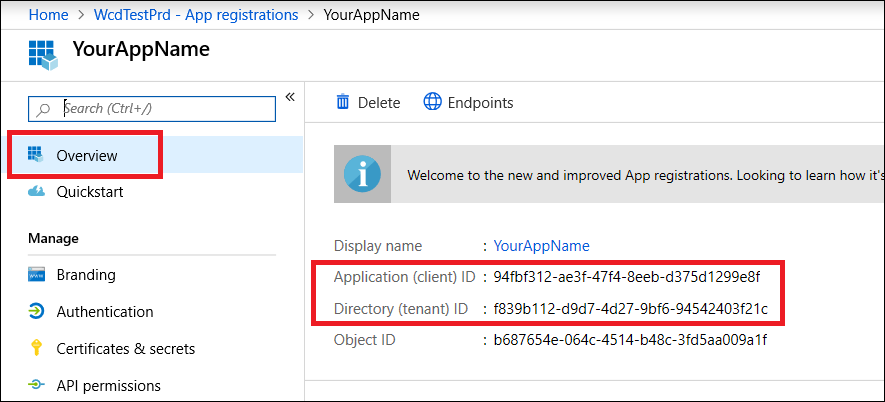

# <a name="microsoft-defender-for-endpoint-api---hello-world"></a>Endpoint API용 Microsoft Defender API - Hello World

[!INCLUDE [Microsoft 365 Defender rebranding](../../includes/microsoft-defender.md)]


**적용 대상:**
- [엔드포인트용 Microsoft Defender](https://go.microsoft.com/fwlink/?linkid=2154037)


- 엔드포인트용 Microsoft Defender를 경험하고 싶으신가요? [무료 평가판을 신청하세요.](https://signup.microsoft.com/create-account/signup?products=7f379fee-c4f9-4278-b0a1-e4c8c2fcdf7e&ru=https://aka.ms/MDEp2OpenTrial?ocid=docs-wdatp-exposedapis-abovefoldlink)

[!include[Microsoft Defender for Endpoint API URIs for US Government](../../includes/microsoft-defender-api-usgov.md)]

[!include[Improve request performance](../../includes/improve-request-performance.md)]


## <a name="get-alerts-using-a-simple-powershell-script"></a>간단한 PowerShell 스크립트를 사용하여 알림 표시

### <a name="how-long-it-takes-to-go-through-this-example"></a>이 예제를 진행하는 데 얼마나 걸리나요?

다음 두 단계에서만 5분 정도 걸립니다.

- 응용 프로그램 등록
- 예제 사용: 짧은 PowerShell 스크립트의 복사/붙여넣기만 필요

### <a name="do-i-need-a-permission-to-connect"></a>연결할 수 있는 권한이 필요한가요?

응용 프로그램 등록 단계의 경우  Azure AD(Azure AD) 테넌트에 Azure Active Directory 전역 관리자 역할이 있어야 합니다.

### <a name="step-1---create-an-app-in-azure-active-directory"></a>1단계 - 앱에서 앱 Azure Active Directory

1. 전역 관리자 [사용자로 Azure에](https://portal.azure.com) **로그온합니다.**

2. 앱 등록 **Azure Active Directory** \> **새** \> **등록으로 이동합니다.**

   

3. 등록 양식에서 응용 프로그램의 이름을 선택하고 등록을 **클릭합니다.**

4. 응용 프로그램이 끝점용 Defender에 액세스하여 '모든 경고 읽기' 권한을 **할당하도록 허용합니다.**

   - 응용 프로그램 페이지에서 **조직에서** 사용하는 API 권한 추가 API를 클릭하고 \>  \>  **windowsDefenderATP를 > WindowsDefenderATP를** **클릭합니다.**

   - **참고:** WindowsDefenderATP가 원래 목록에 나타나지 않습니다. 표시하려면 텍스트 상자에 이름을 쓰기 시작해야 합니다.

   

   - 응용 **프로그램 권한** \> **경고.읽기.>** 권한 추가 클릭 **선택**

   

   **중요 참고** 사항: 관련 권한을 선택해야 합니다. '모든 경고 읽기'는 예시일 뿐입니다.

     예를 들어

     - 고급 [쿼리를 실행하려면](run-advanced-query-api.md)'고급 쿼리 실행' 사용 권한을 선택합니다.
     - 컴퓨터 [격리하려면](isolate-machine.md)'컴퓨터 격리' 사용 권한을 선택합니다.
     - 필요한 사용 권한을 확인하려면 호출할  API의 사용 권한 섹션을 참조하세요.

5. 동의 **부여를 클릭합니다.**

   - **참고:** 권한을 추가할 때마다 새  사용 권한을 적용하기 위해 동의 부여를 클릭해야 합니다.

   

6. 응용 프로그램에 비밀을 추가합니다.

   - 인증서를 **&,** 비밀에 설명을 추가하고 추가를 **클릭합니다.**

    **중요:** 추가를 클릭한 후 생성된 **비밀 값을 복사합니다.** 나가면 검색할 수 없습니다!

    

7. 응용 프로그램 ID 및 테넌트 ID를 기록해 써야 합니다.

   - 응용 프로그램 페이지에서 개요로 **이동하여** 다음을 복사합니다.

   

완료되었습니다! 응용 프로그램을 성공적으로 등록했습니다.

### <a name="step-2---get-a-token-using-the-app-and-use-this-token-to-access-the-api"></a>2단계 - 앱을 사용하여 토큰을 다운로드하고 이 토큰을 사용하여 API에 액세스합니다.

- 아래 스크립트를 PowerShell ISE 또는 텍스트 편집기로 복사하고 **"** Get-Token.ps1"
- 이 스크립트를 실행하면 토큰이 생성되고 ""라는 이름의 작업 **폴더에Latest-token.txt.**

   ```powershell
   # That code gets the App Context Token and save it to a file named "Latest-token.txt" under the current directory
   # Paste below your Tenant ID, App ID and App Secret (App key).

   $tenantId = '' ### Paste your tenant ID here
   $appId = '' ### Paste your Application ID here
   $appSecret = '' ### Paste your Application secret here

   $resourceAppIdUri = 'https://api.securitycenter.microsoft.com'
   $oAuthUri = "https://login.microsoftonline.com/$TenantId/oauth2/token"
   $authBody = [Ordered] @{
       resource = "$resourceAppIdUri"
       client_id = "$appId"
       client_secret = "$appSecret"
       grant_type = 'client_credentials'
   }
   $authResponse = Invoke-RestMethod -Method Post -Uri $oAuthUri -Body $authBody -ErrorAction Stop
   $token = $authResponse.access_token
   Out-File -FilePath "./Latest-token.txt" -InputObject $token
   return $token
   ```

- 다음을 검사합니다.
  - 스크립트를 실행합니다.
  - 브라우저에서 다음으로 이동하세요. <https://jwt.ms/>
  - 토큰(Latest-token.txt 복사합니다.
  - 위쪽 상자에 붙여 넣습니다.
  - "역할" 섹션을 찾아 봐야 합니다. Alert.Read.All 역할을 찾아야 합니다.

  

### <a name="lets-get-the-alerts"></a>경고를 받을 수 있습니다!

- 아래 스크립트는 **Get-Token.ps1** API에 액세스하고 지난 48시간 동안의 알림을 받을 것입니다.
- 이전 스크립트 파일을 저장한 폴더에 이 스크립트를 **Get-Token.ps1.**
- 스크립트는 스크립트와 동일한 폴더에 데이터를 사용하여 두 개의 파일(json 및 csv)을 만듭니다.

  ```powershell
  # Returns Alerts created in the past 48 hours.

  $token = ./Get-Token.ps1       #run the script Get-Token.ps1  - make sure you are running this script from the same folder of Get-Token.ps1

  # Get Alert from the last 48 hours. Make sure you have alerts in that time frame.
  $dateTime = (Get-Date).ToUniversalTime().AddHours(-48).ToString("o")

  # The URL contains the type of query and the time filter we create above
  # Read more about other query options and filters at   Https://TBD- add the documentation link
  $url = "https://api.securitycenter.microsoft.com/api/alerts?`$filter=alertCreationTime ge $dateTime"

  # Set the WebRequest headers
  $headers = @{
      'Content-Type' = 'application/json'
      Accept = 'application/json'
      Authorization = "Bearer $token"
  }

  # Send the webrequest and get the results.
  $response = Invoke-WebRequest -Method Get -Uri $url -Headers $headers -ErrorAction Stop

  # Extract the alerts from the results.
  $alerts =  ($response | ConvertFrom-Json).value | ConvertTo-Json

  # Get string with the execution time. We concatenate that string to the output file to avoid overwrite the file
  $dateTimeForFileName = Get-Date -Format o | foreach {$_ -replace ":", "."}

  # Save the result as json and as csv
  $outputJsonPath = "./Latest Alerts $dateTimeForFileName.json"
  $outputCsvPath = "./Latest Alerts $dateTimeForFileName.csv"

  Out-File -FilePath $outputJsonPath -InputObject $alerts
  ($alerts | ConvertFrom-Json) | Export-CSV $outputCsvPath -NoTypeInformation
  ```

모두 완료했습니다! 다음을 성공적으로 완료했습니다.

- 생성 및 등록 및 응용 프로그램
- 경고를 읽을 수 있는 해당 응용 프로그램에 대한 사용 권한 부여
- API 연결
- PowerShell 스크립트를 사용하여 지난 48시간 동안 생성된 경고 반환

## <a name="related-topic"></a>관련 항목

- [끝점 API용 Microsoft Defender](exposed-apis-list.md)
- [응용 프로그램 컨텍스트를 통해 끝점용 Microsoft Defender 액세스](exposed-apis-create-app-webapp.md)
- [사용자 컨텍스트를 통해 끝점용 Microsoft Defender 액세스](exposed-apis-create-app-nativeapp.md)
