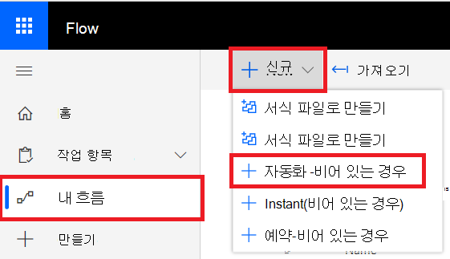

# Microsoft Power Automate(이전 Microsoft Flow) 및 Azure Functions

[!INCLUDE [Microsoft 365 Defender rebranding](../../includes/microsoft-defender.md)]

**적용 대상:**
- [엔드포인트용 Microsoft Defender](https://go.microsoft.com/fwlink/p/?linkid=2154037)
- [Microsoft 365 Defender](https://go.microsoft.com/fwlink/?linkid=2118804)

- 엔드포인트용 Microsoft Defender를 경험하고 싶으신가요? [무료 평가판을 신청하세요.](https://signup.microsoft.com/create-account/signup?products=7f379fee-c4f9-4278-b0a1-e4c8c2fcdf7e&ru=https://aka.ms/MDEp2OpenTrial?ocid=docs-wdatp-exposedapis-abovefoldlink)

모든 최신 보안 운영 센터의 표준 요구 사항은 보안 절차를 자동화하는 것입니다. 전문 사이버 방어자 부족으로 SOC가 가장 효율적인 방식으로 작동하고 자동화가 반드시 있어야 합니다. Microsoft Power Automate 정확히 구축된 여러 커넥터를 지원할 수 있습니다. 몇 분 내에 종단간 프로시저 자동화를 빌드할 수 있습니다.

Microsoft Defender API에는 다양한 기능이 있는 공식 Power Automate 커넥터가 있습니다.

> [!NOTE]
> 프리미엄 커넥터 라이선싱 선행 조건에 대한 자세한 내용은 프리미엄 커넥터에 대한 라이선싱을 [참조합니다.](/power-automate/triggers-introduction#licensing-for-premium-connectors)

## 사용 예제

다음 예제에서는 테넌트에서 새 Flow 트리거되는 새 경고를 만드는 방법을 보여 주며,

1. [Microsoft](https://flow.microsoft.com)Power Automate 로그인합니다.

2. Go to **My flows** \> **New** \> **Automated-from blank**.

    

3. 사용자 이름 Flow 트리거로 "Microsoft Defender ATP 트리거"를 검색한 다음 새 경고 트리거를 선택합니다.

    

이제 새 Flow 발생할 때마다 트리거되는 이벤트가 있습니다.

이제 다음 단계를 선택하면 됩니다.
예를 들어 경고의 심각도가 높음인 경우 장치를 격리하고 장치에 대한 전자 메일을 보낼 수 있습니다.
경고 트리거는 경고 ID와 컴퓨터 ID만 제공합니다. 커넥터를 사용하여 이러한 엔터티를 확장할 수 있습니다.

### 커넥터를 사용하여 Alert 엔터티 사용

1. 새 **단계를 위해 Microsoft Defender ATP를** 선택 합니다.

2. 경고 **- 단일 경고 API를 를 선택 합니다.**

3. 마지막 단계에서 **경고 ID를** 입력으로 **설정**

    

### 경고 심각도 높음인 경우 장치 격리

1. 조건을 **새** 단계로 추가합니다.

2. 경고 심각도가 **높음과 같은지** 검사합니다.

   그렇다면 **Microsoft Defender ATP - 컴퓨터** ID 및 설명을 사용하여 컴퓨터 격리 작업을 추가합니다.

    

3. 경고 및 Isolation에 대한 전자 메일을 보내기 위한 새 단계를 추가합니다. 메일 또는 Gmail과 같이 사용하기 쉬운 여러 전자 메일 Outlook 있습니다.

4. 흐름을 저장합니다.

고급 헌팅  쿼리를 실행하여 예약된 흐름을 만들 수 있습니다.

## 관련 항목
- [끝점 API용 Microsoft Defender](apis-intro.md)
