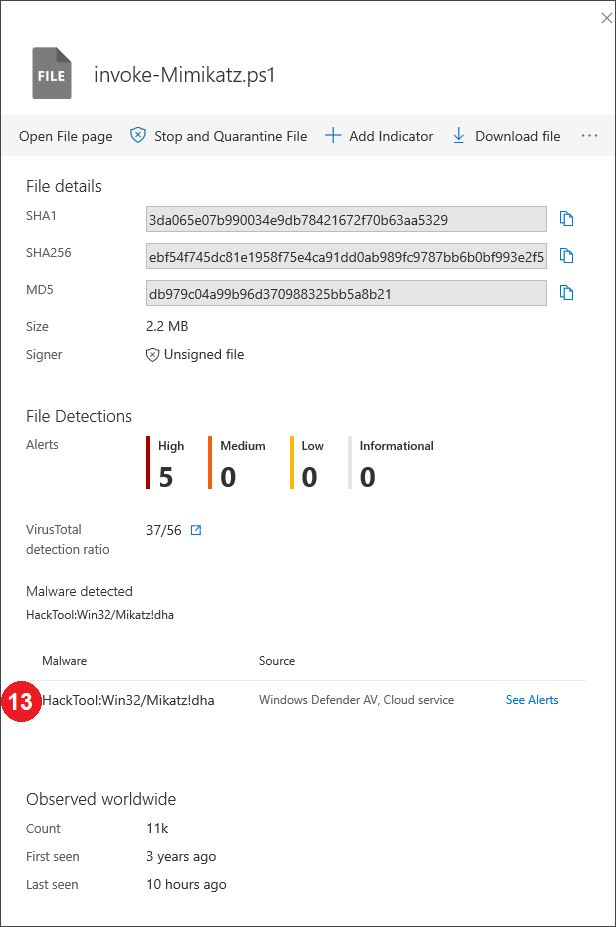
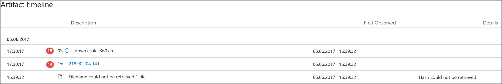

# 끝점 검색 API 필드에 대한 Microsoft DefenderMicrosoft Defender for Endpoint detections API fields

[!INCLUDE [Microsoft 365 Defender rebranding](../../includes/microsoft-defender.md)]

**적용 대상:****Applies to:**
- [엔드포인트용 Microsoft DefenderMicrosoft Defender for Endpoint](https://go.microsoft.com/fwlink/p/?linkid=2154037)
- [Microsoft 365 DefenderMicrosoft 365 Defender](https://go.microsoft.com/fwlink/?linkid=2118804)

>Endpoint용 Defender를 경험하고 싶나요?Want to experience Defender for Endpoint? [무료 평가판에 등록합니다.Sign up for a free trial.](https://www.microsoft.com/microsoft-365/windows/microsoft-defender-atp?ocid=docs-wdatp-apiportalmapping-abovefoldlink)

검색 API의 일부로 노출되는 데이터 필드와 이러한 필드가 검색 API에 매핑되는 방법을 Microsoft 365 Defender.Understand what data fields are exposed as part of the detections API and how they map to Microsoft 365 Defender.

>[!Note]
>- [Endpoint용 Defender 경고는](alerts.md) 하나 이상의 검색으로 구성됩니다.[Defender for Endpoint Alert](alerts.md) is composed from one or more detections.
>- **Microsoft Defender ATP 검색은** 장치 및 관련 경고 세부 정보에서 발생한 의심스러운 이벤트로 **구성됩니다.****Microsoft Defender ATP Detection** is composed from the suspicious event occurred on the Device and its related **Alert** details.
>- 끝점 경고용 Microsoft Defender 경고 API는 경고 소비를 위한 최신 API로, 각 경고에 대한 자세한 관련 증거 목록을 포함 합니다.The Microsoft Defender for Endpoint Alert API is the latest API for alert consumption and contain a detailed list of related evidence for each alert. 자세한 내용은 [Alert 메서드](alerts.md) 및 속성 및 목록 [경고를 참조하세요.](get-alerts.md)For more information, see [Alert methods and properties](alerts.md) and [List alerts](get-alerts.md).

## 검색 API 필드 및 포털 매핑Detections API fields and portal mapping
다음 표에는 검색 API 페이로드에 노출되는 사용 가능한 필드가 나열되어 있습니다.The following table lists the available fields exposed in the detections API payload. 채워진 값에 대한 예제와 포털에 데이터가 반영되는 방식에 대한 참조를 보여줍니다.It shows examples for the populated values and a reference on how data is reflected on the portal.

ArcSight 필드 열에는 끝점용 Defender 필드와 ArcSight의 기본 제공 필드 간의 기본 매핑이 포함되어 있습니다.The ArcSight field column contains the default mapping between the Defender for Endpoint fields and the built-in fields in ArcSight. SIEM 통합 기능을 사용하도록 설정하면 포털에서 매핑 파일을 다운로드할 수 있으며 조직의 요구에 따라 매핑 파일을 수정할 수 있습니다.You can download the mapping file from the portal when you enable the SIEM integration feature and you can modify it to match the  needs of your organization. 자세한 내용은 [Endpoint용 Defender에서 SIEM 통합 사용 을 참조하세요.](enable-siem-integration.md)For more information, see [Enable SIEM integration in Defender for Endpoint](enable-siem-integration.md).

필드 번호는 아래 이미지의 번호와 일치합니다.Field numbers match the numbers in the images below.

> [!div class="mx-tableFixed"]
> 
> | 포털 레이블Portal   label   | SIEM 필드 이름SIEM field name           | ArcSight 필드ArcSight field      | 예제 값Example value                                                                      | 설명Description                                                                                                                                                                    |
> |------------------|---------------------------|---------------------|------------------------------------------------------------------------------------|--------------------------------------------------------------------------------------------------------------------------------------------------------------------------------|
> | 11                | AlertTitleAlertTitle                | namename                | Microsoft Defender AV에서 'Mikatz' 높은 심각도 맬웨어 검색Microsoft Defender AV detected 'Mikatz' high-severity malware | 모든 검색에 사용할 수 있는 값입니다.Value available for every Detection.                                                                                                                                               |
> | 2 2                | 심각도Severity                  | deviceSeveritydeviceSeverity      | 높음High                                                                             | 모든 검색에 사용할 수 있는 값입니다.Value available for every Detection.                                                                                                                                               |
> | 3 3                | 범주Category                  | deviceEventCategorydeviceEventCategory | 맬웨어Malware                                                               | 모든 검색에 사용할 수 있는 값입니다.Value available for every Detection.                                                                                                                                               |
> | 4 4                | 검색 원본Detection source                    | sourceServiceNamesourceServiceName   | 바이러스 검사Antivirus                                                                 | Microsoft Defender 바이러스 백신 또는 Defender for Endpoint.Microsoft Defender Antivirus or  Defender for Endpoint. 모든 검색에 사용할 수 있는 값입니다.Value available for every Detection.                                                                                         |
> | 5 5                | MachineNameMachineName               | sourceHostNamesourceHostName      | desktop-4a5ngd6desktop-4a5ngd6                                                                           | 모든 검색에 사용할 수 있는 값입니다.Value available for every Detection.                                                                                                                                               |
> | 6 6                | FileNameFileName                  | fileNamefileName            | Robocopy.exeRobocopy.exe                                                                       | 파일 또는 프로세스와 관련된 검색에 사용할 수 있습니다.Available for detections associated   with a file or process.                                                                                                                      |
> | 7 7                | FilePathFilePath                  | filePathfilePath            | C:\Windows\System32\Robocopy.exeC:\Windows\System32\Robocopy.exe                                                   | 파일 또는 프로세스와 관련된 검색에 사용할 수 있습니다.Available for detections associated   with a file or process.                                                                                                                     |
> | 8 8                | UserDomainUserDomain                | sourceNtDomainsourceNtDomain      | CONTOSOCONTOSO                                                                            | 활동을 실행하는 사용자 컨텍스트의 도메인으로, 끝점 동작 기반 검색을 위해 Defender에 사용할 수 있습니다.The domain of the user context   running the activity, available for Defender for Endpoint behavioral based detections.                                                           |
> | 9 9                | UserNameUserName                  | sourceUserNamesourceUserName      | liz.beanliz.bean                                                                           | 활동을 실행하는 사용자 컨텍스트로, 끝점 동작 기반 검색을 위해 Defender에 사용할 수 있습니다.The user context running the   activity, available for Defender for Endpoint behavioral based detections.                                                                           |
> | 10 10               | Sha1Sha1                      | fileHashfileHash            | 3da065e07b990034e9db7842167f70b63aa53293da065e07b990034e9db7842167f70b63aa5329                                           | 파일 또는 프로세스와 관련된 검색에 사용할 수 있습니다.Available for detections associated   with a file or process.                                                                                                                      |
> | 11 11               | Sha256Sha256                    | deviceCustomString6deviceCustomString6 | ebf54f745dc81e1958f75e4ca91dd0ab989fc9787bb6b0bf993e2f5ebf54f745dc81e1958f75e4ca91dd0ab989fc9787bb6b0bf993e2f5                   | Microsoft Defender AV 감지에 사용할 수 있습니다.Available for Microsoft Defender AV detections.                                                                                                                                    |
> | 12 12               | Md5Md5                       | deviceCustomString5deviceCustomString5 | db979c04a99b96d370988325bb5a8b21db979c04a99b96d370988325bb5a8b21                                                   | Microsoft Defender AV 감지에 사용할 수 있습니다.Available for Microsoft Defender AV detections.                                                                                                                                    |
> | 1313               | ThreatNameThreatName                | deviceCustomString1deviceCustomString1  | HackTool:Win32/Mikatz!dhaHackTool:Win32/Mikatz!dha                                                         | Microsoft Defender AV 감지에 사용할 수 있습니다.Available for Microsoft Defender AV detections.                                                                                                                                    |
> | 14 14               | IpAddressIpAddress                 | sourceAddresssourceAddress       | 218.90.204.141218.90.204.141                                                                     | 네트워크 이벤트와 관련된 검색에 사용할 수 있습니다.Available for detections associated   to network events. 예를 들어 '악성 네트워크 대상에 대한 통신'을 들 수 있습니다.For example, 'Communication to a malicious network   destination'.                                                        |
> | 1515               | UrlUrl                       | requestUrlrequestUrl          | down.esales360.cndown.esales360.cn                                                                  | 네트워크 이벤트와 관련된 검색에 사용할 수 있습니다.Available for detections associated to   network events. 예를 들어 '악성 네트워크 대상에 대한 통신'을 들 수 있습니다.For example, 'Communication to a malicious network   destination'.                                                         |
> | 16 16               | RemediationIsSuccessRemediationIsSuccess      | deviceCustomNumber2deviceCustomNumber2 | TRUETRUE                                                                               | Microsoft Defender AV 감지에 사용할 수 있습니다.Available for Microsoft Defender AV detections. ArcSight 값은 TRUE이면 1, FALSE이면 0입니다.ArcSight value is 1 when TRUE and 0 when FALSE.                                                                                    |
> | 17 17               | WasExecutingWhileDetectedWasExecutingWhileDetected | deviceCustomNumber1deviceCustomNumber1 | FALSEFALSE                                                                              | Microsoft Defender AV 감지에 사용할 수 있습니다.Available for Microsoft Defender AV detections. ArcSight 값은 TRUE이면 1, FALSE이면 0입니다.ArcSight value is 1 when TRUE and 0 when FALSE.                                                                                    |
> | 18 18               | AlertIdAlertId                   | externalIdexternalId          | 636210704265059241_673569822636210704265059241_673569822                                                       | 모든 검색에 사용할 수 있는 값입니다.Value available for every Detection.                                                                                                                                               |
> | 1919               | LinkToWDATPLinkToWDATP               | flexString1flexString1         | `https://securitycenter.windows.com/alert/636210704265059241_673569822`            | 모든 검색에 사용할 수 있는 값입니다.Value available for every Detection.                                                                                                                                               |
> | 2020               | AlertTimeAlertTime                 | deviceReceiptTimedeviceReceiptTime   | 2017-05-07T01:56:59.3191352Z2017-05-07T01:56:59.3191352Z                                                       | 이벤트가 발생한 시간입니다.The time the event occurred. 모든 검색에 사용할 수 있는 값입니다.Value available for every Detection.                                                                                       |
> |  2121               | MachineDomainMachineDomain             | sourceDnsDomainsourceDnsDomain     | contoso.comcontoso.com                                                                        | AAD에 가입된 디바이스와 관련이 없는 도메인 이름입니다.Domain name not relevant for AAD   joined devices. 모든 검색에 사용할 수 있는 값입니다.Value available for every Detection.                                                                                           |
> | 2222               | 배우Actor                     | deviceCustomString4deviceCustomString4 | BORONBORON                                                                                   | 알려진 배우 그룹과 관련된 경고에 사용할 수 있습니다.Available for alerts related to a   known actor group.                                                                                                                         |
> | 21+521+5             | ComputerDnsNameComputerDnsName           | 매핑 없음No mapping          | liz-bean.contoso.comliz-bean.contoso.com                                                               | 디바이스의 정식 도메인 이름입니다.The device fully qualified   domain name. 모든 검색에 사용할 수 있는 값입니다.Value available for every Detection.                                                                                                    |
> |                  | LogOnUsersLogOnUsers                | sourceUserIdsourceUserId        | contoso\liz-bean;   contoso\jay-hardeecontoso\liz-bean;   contoso\jay-hardee                                             | 이벤트 당시 대화형 로그온 사용자/s의 도메인 및 사용자입니다.The domain and user of the   interactive logon user/s at the time of the event. 참고: Windows 10 버전 1607의 디바이스에서는 도메인 정보를 사용할 수 없습니다.Note: For devices on   Windows 10 version 1607, the domain information will not be available. |
> |                  | InternalIPv4ListInternalIPv4List          | 매핑 없음No mapping          | 192.168.1.7, 10.1.14.1192.168.1.7, 10.1.14.1                                                             | 활성 네트워크 인터페이스에 대한 IPV4 내부 IP 목록입니다.List of IPV4 internal IPs for active network interfaces.                                                                                                                                                                               |
> |                  | InternalIPv6ListInternalIPv6List          | 매핑 없음No mapping          | fd30:0000:0000:0001:ff4e:003e:0009:000e, FE80:CD00:0000:0CDE:1257:0000:211E:729Cfd30:0000:0000:0001:ff4e:003e:0009:000e,   FE80:CD00:0000:0CDE:1257:0000:211E:729C | 활성 네트워크 인터페이스에 대한 IPV6 내부 IP 목록입니다.List of IPV6 internal IPs for active network interfaces.                                                                                                                                                                               |
| | LinkToMTPLinkToMTP | 매핑 없음No mapping | `https://security.microsoft.com/alert/da637370718981685665_16349121` | 모든 검색에 사용할 수 있는 값입니다.Value available for every Detection.
| | IncidentLinkToMTPIncidentLinkToMTP | 매핑 없음No mapping | `"https://security.microsoft.com/incidents/byalert?alertId=da637370718981685665_16349121&source=SIEM` | 모든 검색에 사용할 수 있는 값입니다.Value available for every Detection.
| | IncidentLinkToWDATPIncidentLinkToWDATP | 매핑 없음No mapping | `https://securitycenter.windows.com/incidents/byalert?alertId=da637370718981685665_16349121&source=SIEM` | 모든 검색에 사용할 수 있는 값입니다.Value available for every Detection.
> | 내부 필드Internal   field | LastProcessedTimeUtcLastProcessedTimeUtc      | 매핑 없음No mapping          | 2017-05-07T01:56:58.9936648Z2017-05-07T01:56:58.9936648Z                                                       | 이벤트가 백엔드에 도착한 시간입니다.Time when event arrived at the   backend. 이 필드는 검색된 시간 범위에 대한 요청 매개 변수를 설정할 때 사용할 수 있습니다.This field can be used when setting the request parameter for the range of time that detections are retrieved.                         |
> |                  | 일부가 아닌 경우Not part of the schema    | deviceVendordeviceVendor        |                                                                                    | ArcSight 매핑의 정적 값 - 'Microsoft'.Static value in the ArcSight   mapping - 'Microsoft'.                                                                                                                          |
> |                  | 일부가 아닌 경우Not part of the schema    | deviceProductdeviceProduct       |                                                                                    | ArcSight 매핑의 정적 값 - 'Microsoft Defender ATP'.Static value in the ArcSight   mapping - 'Microsoft Defender ATP'.                                                                                                               |
> |                  | 일부가 아닌 경우Not part of the schema    | deviceVersiondeviceVersion       |                                                                                    | ArcSight 매핑의 정적 값 - '2.0'으로, 매핑 버전을 식별하는 데 사용됩니다.Static value in the ArcSight   mapping - '2.0', used to identify the mapping versions.                                                                                         

## 관련 항목Related topics
- [끝점용 Microsoft Defender에서 SIEM 통합 사용Enable SIEM integration in Microsoft Defender for Endpoint](enable-siem-integration.md)
- [끝점 검색을 위해 Microsoft Defender를 끌어오도록 ArcSight 구성Configure ArcSight to pull Microsoft Defender for Endpoint detections](configure-arcsight.md)
- [REST API를 사용하여 끝점 검색을 위한 Microsoft Defender 끌어오기Pull Microsoft Defender for Endpoint detections using REST API](pull-alerts-using-rest-api.md)
- [SIEM 도구 통합 문제 해결Troubleshoot SIEM tool integration issues](troubleshoot-siem.md)
