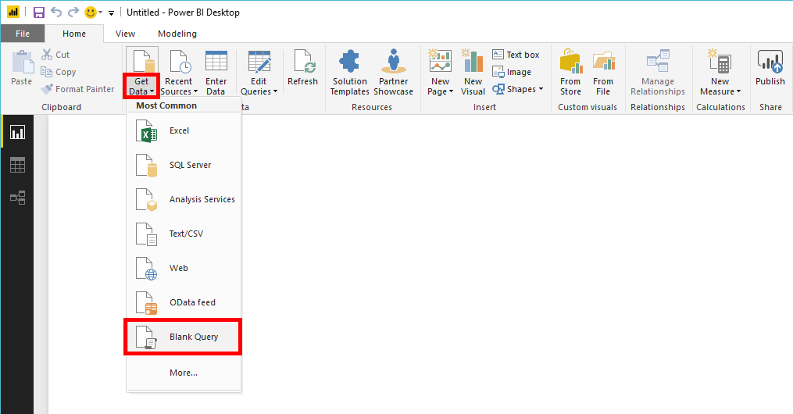
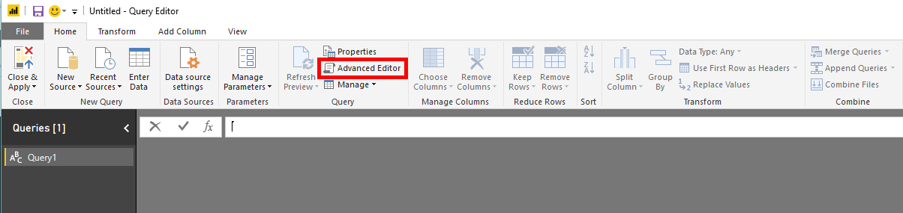
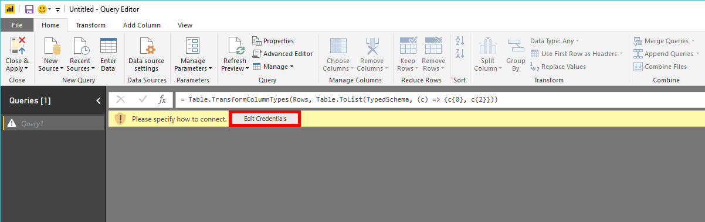
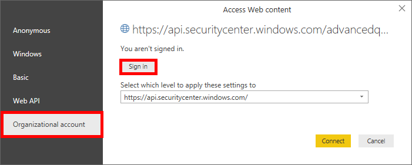
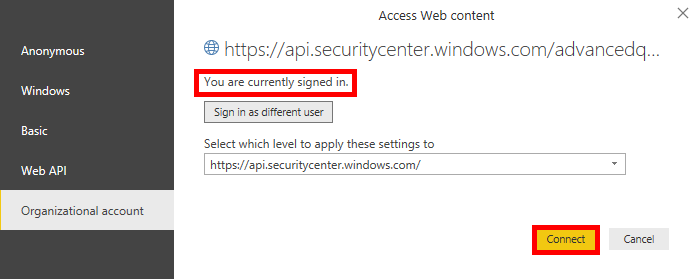

# <a name="create-custom-reports-using-power-bi"></a>사용자 지정 보고서를 사용하여 Power BI

[!INCLUDE [Microsoft 365 Defender rebranding](../../includes/microsoft-defender.md)]

**적용 대상:**
- [엔드포인트용 Microsoft Defender](https://go.microsoft.com/fwlink/p/?linkid=2154037)
- [Microsoft 365 Defender](https://go.microsoft.com/fwlink/?linkid=2118804)


- 엔드포인트용 Microsoft Defender를 경험하고 싶으신가요? [무료 평가판을 신청하세요.](https://signup.microsoft.com/create-account/signup?products=7f379fee-c4f9-4278-b0a1-e4c8c2fcdf7e&ru=https://aka.ms/MDEp2OpenTrial?ocid=docs-wdatp-exposedapis-abovefoldlink)

[!include[Microsoft Defender for Endpoint API URIs for US Government](../../includes/microsoft-defender-api-usgov.md)]

[!include[Improve request performance](../../includes/improve-request-performance.md)]

이 섹션에서는 끝점 API용 Power BI 보고서 만들기를 배우게 됩니다.

첫 번째 예제에서는 고급 헌팅 API에 Power BI 방법을 보여 주며, 두 번째 예제에서는 OData API에 대한 연결(예: Machine Actions 또는 Alerts)을 보여 제공합니다.

## <a name="connect-power-bi-to-advanced-hunting-api"></a>커넥트 Power BI 헌팅 API로

- Microsoft Power BI

- 데이터 **빈 쿼리** \> **다운로드를 클릭합니다.**

  

- 고급 **편집기를 클릭합니다.**

  

- 아래를 복사하여 편집기에 붙여 넣습니다.

```
    let
        AdvancedHuntingQuery = "DeviceEvents | where ActionType contains 'Anti' | limit 20",

        HuntingUrl = "https://api.securitycenter.microsoft.com/api/advancedqueries",

        Response = Json.Document(Web.Contents(HuntingUrl, [Query=[key=AdvancedHuntingQuery]])),

        TypeMap = #table(
            { "Type", "PowerBiType" },
            {
                { "Double",   Double.Type },
                { "Int64",    Int64.Type },
                { "Int32",    Int32.Type },
                { "Int16",    Int16.Type },
                { "UInt64",   Number.Type },
                { "UInt32",   Number.Type },
                { "UInt16",   Number.Type },
                { "Byte",     Byte.Type },
                { "Single",   Single.Type },
                { "Decimal",  Decimal.Type },
                { "TimeSpan", Duration.Type },
                { "DateTime", DateTimeZone.Type },
                { "String",   Text.Type },
                { "Boolean",  Logical.Type },
                { "SByte",    Logical.Type },
                { "Guid",     Text.Type }
            }),

        Schema = Table.FromRecords(Response[Schema]),
        TypedSchema = Table.Join(Table.SelectColumns(Schema, {"Name", "Type"}), {"Type"}, TypeMap , {"Type"}),
        Results = Response[Results],
        Rows = Table.FromRecords(Results, Schema[Name]),
        Table = Table.TransformColumnTypes(Rows, Table.ToList(TypedSchema, (c) => {c{0}, c{2}}))

    in Table
```

- 완료를 **클릭합니다.**

- 자격 **증명 편집을 클릭합니다.**

    

- 조직 **계정 로그인** \> **선택**

    

- 자격 증명을 입력하고 로그인 대기

- 사용자 **커넥트**

    

- 이제 쿼리 결과가 표로 표시될 것이고 그 위에 시각화 빌드를 시작할 수 있습니다!

- 이 테이블을 복제하고 이름을 변경한 다음 내부에서 고급 헌팅 쿼리를 편집하여 원하는 데이터를 얻을 수 있습니다.

## <a name="connect-power-bi-to-odata-apis"></a>커넥트 Power BI OData API에 대한 데이터

- 위의 예제와 유일한 차이점은 편집기 내부의 쿼리입니다.

- 아래를 복사하여 편집기에 붙여넣어 조직에서 모든 **컴퓨터** 작업을 끌어오세요.

```
    let

        Query = "MachineActions",

        Source = OData.Feed("https://api.securitycenter.microsoft.com/api/" & Query, null, [Implementation="2.0", MoreColumns=true])
    in
        Source
```

- 경고 및 컴퓨터 **에** 대해 동일한 작업을 할 수 **있습니다.**
- 쿼리 필터에 OData 쿼리를 사용할 수 있습니다. 자세한 내용은 [OData 쿼리 사용을 참조](exposed-apis-odata-samples.md)

## <a name="power-bi-dashboard-samples-in-github"></a>Power BI 대시보드 샘플을 GitHub

자세한 내용은 보고서 [서식 Power BI 참조하세요.](https://github.com/microsoft/MicrosoftDefenderATP-PowerBI)

## <a name="sample-reports"></a>예제 보고서

보고서 샘플에 대한 Microsoft Defender Power BI 볼 수 있습니다. 자세한 내용은 코드 샘플 [찾아보기를 참조하세요.](/samples/browse/?products=mdatp)

## <a name="related-topics"></a>관련 항목

- [끝점 API용 Defender](apis-intro.md)
- [고급 헌팅 API](run-advanced-query-api.md)
- [OData 쿼리 사용](exposed-apis-odata-samples.md)
