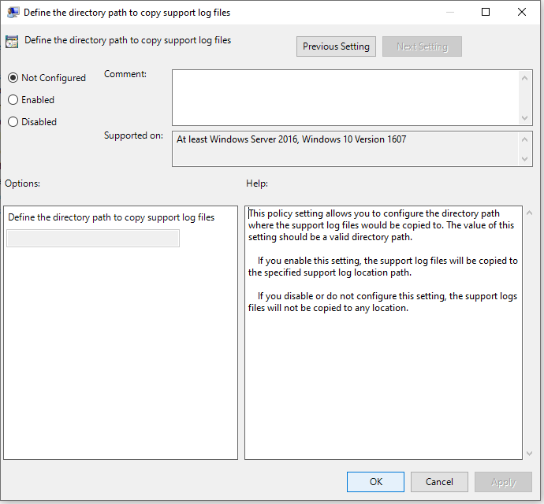
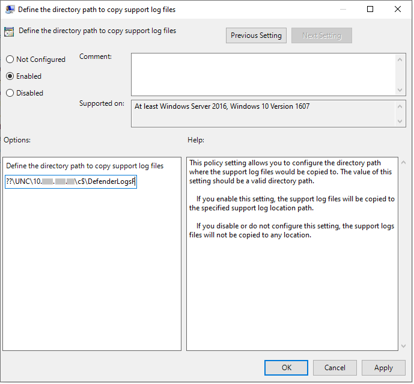

# <a name="collect-microsoft-defender-antivirus-diagnostic-data"></a>진단 Microsoft Defender 바이러스 백신 데이터 수집

[!INCLUDE [Microsoft 365 Defender rebranding](../../includes/microsoft-defender.md)]


**적용 대상:**

- [엔드포인트용 Microsoft Defender](/microsoft-365/security/defender-endpoint/)

이 문서에서는 Microsoft 지원 및 엔지니어링 팀에서 사용할 수 있는 진단 데이터를 수집하여 데이터 센터를 사용할 때 발생할 수 있는 문제를 해결하는 Microsoft Defender 바이러스 백신.

> [!NOTE]
> 조사 또는 응답 프로세스의 일부로 장치에서 조사 패키지를 수집할 수 있습니다. 방법: 장치에서 [조사 패키지를 수집합니다.](/windows/security/threat-protection/microsoft-defender-atp/respond-machine-alerts#collect-investigation-package-from-devices)

동일한 문제가 발생하는 두 개 이상의 장치에서 다음 단계를 수행하여 .cab 진단 파일을 얻게 됩니다.

1. 다음과 같이 관리자 수준 명령 프롬프트 버전을 열 수 있습니다.

    a. 시작 **메뉴를** 열 수 있습니다.

    b. **cmd 를 입력합니다.** 명령 프롬프트를 **마우스 오른쪽 단추로 클릭한** 다음 **관리자 권한으로 실행을 선택합니다.**

    c. 관리자 자격 증명을 지정하거나 프롬프트를 승인합니다.

2. 검색할 디렉터리로 Microsoft Defender 바이러스 백신. 기본적으로 는 `C:\Program Files\Windows Defender` 입니다.

   > [!NOTE]
   > 업데이트된 [Microsoft Defender](https://support.microsoft.com/help/4052623/update-for-microsoft-defender-antimalware-platform)맬웨어 방지 플랫폼 버전을 실행하는 경우 다음 위치에서 `MpCmdRun` `C:\ProgramData\Microsoft\Windows Defender\Platform\<version>` 실행하세요. .

3. 다음 명령을 입력한 다음 **Enter를 누르기**

    ```Dos
    mpcmdrun.exe -GetFiles
    ```

4. 다양한 .cab 로그가 포함된 파일도 생성됩니다. 파일 위치는 명령 프롬프트의 출력에 지정됩니다. 기본적으로 위치는 `C:\ProgramData\Microsoft\Microsoft Defender\Support\MpSupportFiles.cab` 입니다.

   > [!NOTE]
   > cab 파일을 다른 경로 또는 UNC 공유로 리디렉션하기 위해 다음 명령을 사용 합니다.
   >
   > `mpcmdrun.exe -GetFiles -SupportLogLocation <path>`
   >
   > 자세한 내용은 진단 데이터를 [UNC 공유로 리디렉션을 참조하세요.](#redirect-diagnostic-data-to-a-unc-share)

5. 이러한 .cab 파일을 Microsoft 지원에서 액세스할 수 있는 위치에 복사합니다. 예를 들어 사용자와 공유할 수 있는 암호로 OneDrive 폴더를 예로 들 수 있습니다.

> [!NOTE]
> 업데이트 준수에 문제가 있는 경우 업데이트 준수 <a href="mailto:ucsupport@microsoft.com?subject=WDAV assessment issue&body=I%20am%20encountering%20the%20following%20issue%20when%20using%20Windows%20Defender%20AV%20in%20Update%20Compliance%3a%20%0d%0aI%20have%20provided%20at%20least%202%20support%20.cab%20files%20at%20the%20following%20location%3a%20%3Caccessible%20share%2c%20including%20access%20details%20such%20as%20password%3E%0d%0aMy%20OMS%20workspace%20ID%20is%3a%20%0d%0aPlease%20contact%20me%20at%3a"></a>지원 전자 메일 서식 파일을 사용하여 전자 메일을 보내고 다음 정보를 사용하여 서식 파일을 작성합니다.
>
> 업데이트 준수에서 업데이트를 사용할 Microsoft Defender 바이러스 백신 문제가 발생했습니다.
>
> 다음 위치에서 최소 2개 이상의 .cab 파일을 제공했습니다.
>
> \<accessible share, including access details such as password\>
>
> 내 OMS 작업 영역 ID는:
>
> 다음의 경우 문의하시기 바랍니다.

## <a name="redirect-diagnostic-data-to-a-unc-share"></a>진단 데이터를 UNC 공유로 리디렉션

중앙 리포지토리에서 진단 데이터를 수집하기 위해 SupportLogLocation 매개 변수를 지정할 수 있습니다.

```Dos
mpcmdrun.exe -GetFiles -SupportLogLocation <path>
```

진단 데이터를 지정된 경로에 복사합니다. 경로를 지정하지 않으면 진단 데이터가 지원 로그 위치 구성에 지정된 위치에 복사됩니다.

SupportLogLocation 매개 변수를 사용하면 다음과 같은 폴더 구조가 대상 경로에 만들어집니다.

```Dos
<path>\<MMDD>\MpSupport-<hostname>-<HHMM>.cab
```

<br>

****

|필드|설명|
|---|---|
|path|명령줄에 지정된 경로 또는 구성에서 검색된 경로|
|MMDD|진단 데이터가 수집된 월 및 일(예: 0530)|
|hostname|진단 데이터가 수집된 장치의 호스트 이름|
|HHMM|진단 데이터가 수집된 시간 및 분(예: 1422)|
|

> [!NOTE]
> 파일 공유를 사용할 때 진단 패키지를 수집하는 데 사용되는 계정에 공유에 대한 쓰기 권한이 있는지 확인하세요.

## <a name="specify-location-where-diagnostic-data-is-created"></a>진단 데이터를 만들 위치 지정

GPO(그룹 정책 개체).cab 진단 파일을 만들 위치를 지정할 수도 있습니다.

1. 로컬 그룹 정책 편집기를 열고 에서 SupportLogLocation GPO를 `HKEY_LOCAL_MACHINE\SOFTWARE\Policies\Microsoft\Windows Defender\SupportLogLocation` 찾습니다.

2. 지원 로그 파일을 복사하려면 디렉터리 경로 **정의 를 선택합니다.**

   

   

      
        
       
3. 정책 편집기 내에서 사용 을 **선택합니다.**

4. 옵션 필드에서 지원 로그 파일을 복사할 디렉터리 경로를 **지정합니다.**
      
5. **확인 또는 적용을** **선택합니다.**

## <a name="see-also"></a>참고 항목

- [보고 Microsoft Defender 바이러스 백신 문제 해결](troubleshoot-reporting.md)
