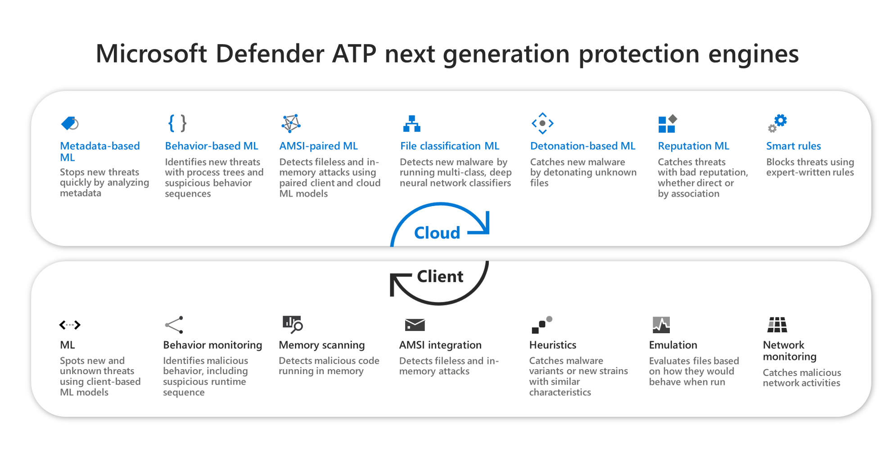

# 즉각적 차단 켜기

**적용 대상:**

- [엔드포인트용 Microsoft Defender](/microsoft-365/security/defender-endpoint/)

이 문서에서는 "즉각적 차단"으로 불리우는 바이러스 백신/맬웨어 방지 기능을 설명하고 조직에 대해 즉각적 차단을 사용하는 방법을 설명합니다.

> [!TIP]
> 이 문서는 조직의 보안 설정을 관리하는 엔터프라이즈 관리자 및 IT 전문가를 대상으로 합니다. 엔터프라이즈 관리자나 IT 전문가는 아니지만 즉각적 차단에 관한 질문이 있다면 [엔터프라이즈 관리자 또는 IT 전문가가 아니세요?](#not-an-enterprise-admin-or-it-pro) 구역을 참조하세요.

## “즉각적 차단”이란 무엇인가요?

즉각적 차단은 몇 초 내에 새로운 맬웨어를 검색하고 차단하는 차세대 보호의 위협 방지 기능입니다. 특정 보안 설정을 사용하면 즉각적 차단이 사용됩니다. 이러한 설정은 다음을 포함합니다.

- 클라우드 제공 보호;
- 지정된 샘플 제출 시간 제한(예: 50초); 및
- 높은 파일 차단 수준.

대부분의 엔터프라이즈 조직에서 즉각적 차단 사용에 필요한 설정은 Microsoft Defender 바이러스 백신 배포로 구성됩니다.

## 작동 방법

Microsoft Defender 바이러스 백신은 의심스러우나 검색되지 않은 파일을 발견하면 클라우드 보호 백 엔드를 쿼리합니다. 클라우드 백 엔드는 파일에 대한 추론, 기계 학습, 자동화된 분석을 적용하여 파일이 악성인지 위협이 아닌지 여부를 확인합니다.

Microsoft Defender 바이러스 백신은 여러 검색 및 방지 기술을 사용하여 정확하고 지능적인 실시간 보호를 제공합니다.

  

> [!TIP]
> 자세한 내용은 [(블로그) 차세대 보호 엔드포인트용 Microsoft Defender의 핵심 고급 기술 알아보기](https://www.microsoft.com/security/blog/2019/06/24/inside-out-get-to-know-the-advanced-technologies-at-the-core-of-microsoft-defender-atp-next-generation-protection/)를 참조하세요.

## 즉각적 차단에 대해 알아야 할 몇 가지

- Windows 10 버전 1803 이상에서는 즉각적 차단을 통해 이식 불가능한 실행 파일(예: JS, VBS 또는 매크로) 및 실행 파일을 차단할 수 있습니다.

- 즉각적 차단은 인터넷에서 다운로드하거나 인터넷 영역에서 발생하는 실행 파일 및 이식 불가능한 실행 파일에 대해서만 클라우드 보호 백 엔드를 사용합니다. 이전에 검색되지 않은 파일인지 확인하기 위해 클라우드 백 엔드를 통해 .exe 파일의 해시 값을 검사합니다.

- 클라우드 백 엔드에서 결정을 할 수 없는 경우 Microsoft Defender 바이러스 백신에서 파일을 잠그고 클라우드에 복사본을 업로드합니다. 클라우드는 추가 분석을 수행하여 파일이 악성인지 위협이 아닌지 여부에 따라 앞으로 발생하는 모든 경우에 대해 파일을 실행하거나 차단하도록 결정합니다.

- 대부분의 경우 이 프로세스를 통해 새 맬웨어에 대한 응답 시간을 초 단위로 줄일 수 있습니다.

- 클라우드 기반 보호 서비스가 파일을 분석하는 동안 [파일 실행을 금지할 시간을 지정](configure-cloud-block-timeout-period-microsoft-defender-antivirus.md)할 수 있습니다. 또한 파일이 차단될 때 [사용자의 데스크톱에 표시되는 메시지를 사용자 지정](/windows/security/threat-protection//windows-defender-security-center/wdsc-customize-contact-information.md)할 수 있습니다. 회사 이름, 연락처 정보 및 메시지 URL을 변경할 수 있습니다.

## Microsoft Intune으로 즉각적 차단 켜기

> [!TIP]
> Microsoft Intune은 이제 Microsoft Endpoint Manager의 일부입니다.

1. Microsoft Endpoint Manager 관리 센터(<https://endpoint.microsoft.com>)에서 **장치** \> **구성 프로필** 로 이동합니다.

2. **장치 제한** 프로필 유형을 사용하여 프로필을 선택하거나 만듭니다.

3. 장치 제한 프로필의 **구성 설정** 에서 **Microsoft Defender 바이러스 백신** 에 있는 다음 설정을 수행하거나 확인합니다.

   - **클라우드 제공 보호**: 사용
   - **파일 차단 수준**: 높음
   - **클라우드에서 파일을 검사하는 시간 확장**: 50
   - **샘플 제출 전 사용자에게 메시지 표시**: 묻지 않고 모든 데이터 보내기

   :::image type="content" source="../../media/intune-block-at-first-sight.png" alt-text="즉각적 Intune 구성 블록":::

4. 설정을 저장합니다.

> [!TIP]
>
> - 파일 차단 수준을 **높음** 으로 설정하면 강력한 검색 수준이 적용됩니다. 파일 차단으로 인해 적법한 파일이 가양성 검색으로 드물게 오인되는 경우, 보안 운영 팀에서 [격리된 파일을 복원](./restore-quarantined-files-microsoft-defender-antivirus.md)하는 옵션을 사용할 수 있습니다.
> - Intune에서 Microsoft Defender 바이러스 백신 장치 제한을 구성하는 방법에 대한 자세한 내용은 [Microsoft Intune에서 장치 제한 설정 구성](/intune/device-restrictions-configure)을 참조하세요.
> - Intune의 Microsoft Defender 바이러스 백신 장치 제한 목록은 [Intune에서 Windows 10(및 최신 버전) 설정에 대한 장치 제한](/intune/device-restrictions-windows-10#microsoft-defender-antivirus)을 참조하세요.

## Microsoft Endpoint Manager를 사용하여 즉각적 차단 켜기

> [!TIP]
> Microsoft Endpoint Configuration Manager는 이제 Microsoft Endpoint Manager의 일부입니다.

1. Microsoft Endpoint Manager(<https://endpoint.microsoft.com>)에서 **엔드포인트 보안** \> **바이러스 백신** 으로 이동합니다.

2. 기존 정책을 선택하거나 **Microsoft Defender 바이러스 백신** 프로필 유형을 사용하여 새 정책을 만듭니다.

3. 다음 구성 설정을 수행하거나 확인합니다.

   - **클라우드 제공 보호 켜기**: 예
   - **클라우드 제공 보호 수준**: 높음
   - **Defender Cloud 확장 시간 초과(초)**: 50

   :::image type="content" source="images/endpointmgr-antivirus-cloudprotection.png" alt-text="Endpoint Manager의 즉각적 차단 설정":::

4. Microsoft Defender 바이러스 백신 프로필을 **모든 사용자**, **모든 장치** 또는 **모든 사용자 및 장치** 와 같은 그룹에 적용합니다.

## 그룹 정책으로 즉각적 차단 켜기

> [!NOTE]
> Intune 또는 Microsoft Endpoint Manager를 사용하여 즉각적 차단을 켜는 것이 좋습니다.

1. 그룹 정책 관리 컴퓨터에서 [그룹 정책 관리 콘솔](/previous-versions/windows/it-pro/windows-server-2008-R2-and-2008/cc731212(v=ws.11))을 열고 구성하려는 그룹 정책 개체를 마우스 오른쪽 단추로 클릭한 다음 **편집** 을 선택합니다.

2. **그룹 정책 관리 편집기** 를 사용하여 **컴퓨터 구성**\>**관리 템플릿**\>**Windows 구성 요소**\>**Microsoft Defender 바이러스 백신**\>**MAPS** 로 이동합니다.

3. MAPS 섹션에서 **'즉각적 차단' 기능 구성** 을 두 번 클릭하여 **사용함** 으로 설정한 다음 **확인** 을 선택합니다.

    > [!IMPORTANT]
    > **항상 확인(0)** 으로 설정하면 장치의 보호 상태가 낮아집니다. **보내지 않음(2)** 으로 설정하면 즉각적 차단 기능이 작동하지 않습니다.

4. MAPS 섹션에서 **추가 분석 필요시 파일 샘플 보내기** 를 두 번 클릭하여 **사용함** 으로 설정합니다. **추가 분석이 필요할 때 파일 샘플 보내기** 에서 **모든 샘플 보내기** 를 선택한 다음 **확인** 을 선택합니다.

5. 평소와 같이 네트워크에서 그룹 정책 개체를 다시 배포합니다.

## 개별 클라이언트 장치에서 즉각적 차단을 사용하는지 확인

Windows 보안 앱을 사용하는 개별 클라이언트 장치에 즉각적 차단 기능이 설정되어 있는지 확인할 수 있습니다. **클라우드 제공 보호** 와 **자동 샘플 제출** 이 모두 켜져 있는 한 즉각적 차단이 자동으로 사용 설정됩니다.

1. Windows 보안 앱을 엽니다.

2. **바이러스 및 위협 방지** 를 선택한 다음 **바이러스 및 위협 방지 설정** 에서 **설정 관리** 를 선택합니다.

   :::image type="content" source="../../media/wdav-protection-settings-wdsc.png" alt-text="Windows 보안 앱의 바이러스 및 위협 방지 설정 레이블 스크린샷":::

3. **클라우드 제공 보호** 및 **자동 샘플 제출** 이 모두 켜져있는지 확인합니다.

> [!NOTE]
>
> - 그룹 정책을 사용하여 필수 구성 요소 설정을 구성하고 배포하는 경우 이 섹션에 설명된 설정은 회색으로 표시되어 개별 엔드포인트에서 사용할 수 없게 됩니다.
> - 설정이 Windows 설정에서 업데이트되기 전에 먼저 그룹 정책 개체를 통해 수행한 변경을 개별 엔드포인트에 배포해야 합니다.

## 즉각적 차단이 작동 중인지 확인

기능이 제대로 작동하는지 확인하려면 [즉각적 차단 샘플 파일](https://demo.wd.microsoft.com/Page/BAFS)을 다운로드합니다. 파일을 다운로드하려면 보안 관리자 또는 전역 관리자 역할이 할당된 Azure Active Directory 계정이 필요합니다.

클라우드 지원 보호가 제대로 작동하는지 확인하려면 [네트워크와 클라우드 간 연결 확인](configure-network-connections-microsoft-defender-antivirus.md#validate-connections-between-your-network-and-the-cloud) 지침을 따릅니다.

## 즉각적 차단 끄기

> [!CAUTION]
> 즉각적 차단을 끄면 장치와 네트워크의 보호 상태가 낮아집니다.

실제로 즉각적 차단 보호를 사용하지 않고 필수 구성 요소 설정을 유지하려는 경우 즉각적 차단을 사용하지 않도록 선택할 수 있습니다. 이 기능이 네트워크에 어떤 영향을 주는지 확인하기 위해 일시적으로 즉각적 차단을 끌 수 있습니다. 그러나 즉각적 차단 보호를 영구적으로 사용 중지하는 것은 권장되지 않습니다.

### Microsoft Endpoint Manager를 사용하여 즉각적 차단 끄기

1. Microsoft Endpoint Manager 관리 센터(<https://endpoint.microsoft.com>)로 이동하여 로그인합니다.

2. **엔드포인트 보안** \> **바이러스 백신** 으로 이동한 다음 Microsoft Defender 바이러스 백신 정책을 선택합니다.

3. **관리** 에서 **속성** 을 선택합니다.

4. **구성 설정** 옆의 **편집** 을 선택합니다.

5. 다음 설정 중 하나 이상을 변경합니다.

   - **클라우드 제공 보호 켜기** 를 **아니요** 또는 **구성되지 않음** 으로 설정합니다.
   - **클라우드 제공 보호 켜기** 를 **구성되지 않음** 으로 설정합니다.
   - **Defender Cloud 확장 시간 초과(초)** 확인란을 선택 취소합니다.

6. 설정을 검토한 후 저장합니다.

### 그룹 정책을 사용하여 즉각적 차단 끄기

1. 그룹 정책 관리 컴퓨터에서 [그룹 정책 관리 콘솔](/previous-versions/windows/it-pro/windows-server-2008-R2-and-2008/cc731212(v=ws.11))을 열고 구성하려는 그룹 정책 개체를 마우스 오른쪽 단추로 클릭한 다음 **편집** 을 선택합니다.

2. **그룹 정책 관리 편집기** 를 사용해서 **컴퓨터 구성** 으로 이동하여 **관리 템플릿** 을 선택합니다.

3. **Windows 구성 요소** \> **Microsoft Defender 바이러스 백신** \> **MAPS** 를 확장합니다.

4. **'즉각적 차단' 기능 구성** 을 두 번 클릭하고 옵션을 **사용 안 함** 으로 설정합니다.

    > [!NOTE]
    > 즉각적 차단을 사용하지 않아도 필수 구성 요소 그룹 정책이 사용 중지되거나 변경되지 않습니다.

## 엔터프라이즈 관리자나 IT 전문가가 아니세요?

엔터프라이즈 관리자 또는 IT 전문가는 아니지만 즉각적 차단에 대한 질문이 있는 경우 이 섹션을 참조하세요. 즉각적 차단은 맬웨어를 몇 초 내에 검색하고 차단하는 위협 방지 기능입니다. "즉각적 차단"이라 불리우는 특정 설정이 있는 것은 아니지만 장치에 특정 설정이 구성되면 이 기능이 사용됩니다.

### 자신의 장치에서 즉각적 차단을 켜거나 끄는 것을 관리하는 방법

조직에서 관리하지 않는 개인 장치가 있는 경우 즉각적 차단을 켜거나 끄는 방법에 대해 궁금할 수 있습니다. Windows 보안 앱을 사용하여 즉각적 차단을 관리할 수 있습니다.

1. Windows 10 또는 Windows 11 컴퓨터에서 Windows 보안 앱을 엽니다.

2. **바이러스 및 위협 방지** 를 선택합니다.

3. **바이러스 및 위협 방지 설정** 에서 **설정 관리** 를 선택합니다.

4. 다음 단계 중 하나를 수행합니다.

   - 즉각적 차단을 사용하려면 **클라우드 제공 보호** 와 **자동 샘플 제출** 이 모두 켜져 있는지 확인합니다.

   - 즉각적 차단을 사용하지 않으려면 **클라우드 제공 보호** 또는 **자동 샘플 제출** 을 끕니다.

     > [!CAUTION]
     > 즉각적 차단을 끄면 장치의 보호 수준이 낮아집니다. 즉각적 차단을 영구적으로 사용 중지하는 것은 권장되지 않습니다.

## 참고 항목

- [Windows 10의 Microsoft Defender 바이러스 백신](microsoft-defender-antivirus-in-windows-10.md)
- [클라우드 제공 보호 사용](enable-cloud-protection-microsoft-defender-antivirus.md)
- [Windows 보안으로 보호 유지](https://support.microsoft.com/windows/stay-protected-with-windows-security-2ae0363d-0ada-c064-8b56-6a39afb6a963)
