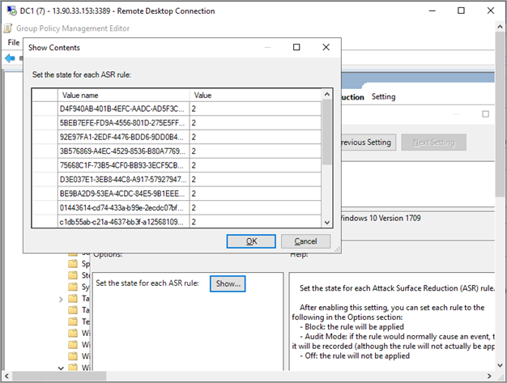

# 그룹 정책을 Windows 장치 온보드

[!INCLUDE [Microsoft 365 Defender rebranding](../../includes/microsoft-defender.md)]

**적용 대상:**

- 그룹 정책
- [엔드포인트용 Microsoft Defender](https://go.microsoft.com/fwlink/p/?linkid=2154037)
- [Microsoft 365 Defender](https://go.microsoft.com/fwlink/?linkid=2118804)

> Endpoint용 Defender를 경험하고 싶나요? [무료 평가판을 신청하세요.](https://signup.microsoft.com/create-account/signup?products=7f379fee-c4f9-4278-b0a1-e4c8c2fcdf7e&ru=https://aka.ms/MDEp2OpenTrial?ocid=docs-wdatp-configureendpointsgp-abovefoldlink)

> [!NOTE]
> GP(그룹 정책) 업데이트를 사용하여 패키지를 배포하려면 Windows Server 2008 R2 이상에 있어야 합니다.
>
> Windows Server 2019 및 Windows Server 2022의 경우 그룹 정책 기본 설정에서 만드는 XML 파일의 NT AUTHORITY\Well-Known-System-Account를 NT AUTHORITY\SYSTEM으로 대체해야 할 수 있습니다.

## 그룹 정책을 사용하여 장치 온보딩

[PDF](https://download.microsoft.com/download/5/6/0/5609001f-b8ae-412f-89eb-643976f6b79c/mde-deployment-strategy.pdf) 또는 Visio  끝점용 Defender 배포에서 다양한 경로를 확인할 수 있습니다.

1. 서비스 온보더링 마법사에서 .zip ** 다운로드한 GP 구성 패키지 파일(WindowsDefenderATPOnboardingPackage.zip)을 열 수 있습니다. 포털에서 패키지를 Microsoft 365 Defender [있습니다.](https://security.microsoft.com/)
    1. 탐색 창에서 **끝점 설정** \> **관리** \>  \> **온보더링** 을 선택합니다.  
    2. 운영 Windows 10 Windows 또는 11을 선택합니다.
    3. 배포 **방법 필드에서** 그룹 정책 **을 선택합니다.**
    4. 패키지 **다운로드를** 클릭하고 파일 .zip 저장합니다.

2. 디바이스에서 액세스할 수 있는 .zip 읽기 전용 공유 위치로 파일 콘텐츠의 추출 *OptionalParamsPolicy라는* 폴더와 *WindowsDefenderATPOnboardingScript.cmd* 파일이 있습니다.

3. 새 GPO를 만들려면 GPMC(그룹 정책 관리 콘솔)를 열고 구성할 그룹 정책 개체를 마우스 오른쪽 단추로 클릭하고 새로 만들기 를 **클릭합니다.**   표시되는 대화 상자에 새 GPO의 이름을 입력하고 확인 을 **클릭합니다.**

4. GPMC(그룹 정책 관리 콘솔)를 열고 구성할 GPO(그룹 정책 개체)를 마우스 오른쪽 단추로 클릭하고 편집을 **클릭합니다.** 

5. 그룹 정책 **관리 편집기에서** 컴퓨터 **구성,** **기본** 설정, 제어판 **설정으로 이동합니다.**

6. 예약된 **작업 을** 마우스 오른쪽 단추로 클릭하고 새로 고침을 클릭한 다음 직접 실행 **작업(최소 Windows 7)을 클릭합니다.**

7. 작업 **창이** 열리면 일반 **탭으로** 이동됩니다. 보안 **옵션에서** **사용자** 또는 그룹 변경을 클릭하고 SYSTEM을 입력한 다음 이름 **확인을** 클릭한 다음 확인을 **클릭합니다.** 작업이 실행될 사용자 계정으로 NT AUTHORITY\SYSTEM이 표시됩니다.

8. 사용자가 **로그온되어** 있는지 여부에 따라  실행을 선택하고 가장 높은 권한으로 실행 확인란을 선택합니다.

9. 이름 필드에 예약된 작업에 대한 적절한 이름(예: Endpoint Deployment용 Defender)을 입력합니다.

10. 작업 **탭으로 이동하여** 새로 **추가...를 선택합니다.** 작업 **필드에서 프로그램** **시작이 선택되어 있도록** 합니다. 공유 *WindowsDefenderATPOnboardingScript.cmd* 파일의 파일 서버 FQDN(FQDN)을 사용하여 UNC 경로를 입력합니다.

11. 확인을 **선택하고** 열려 있는 GPMC 창을 닫습니다.

12. GPO를 OU(조직 구성 단위)에 연결하려면 마우스 오른쪽 단추를 클릭하고 **기존 GPO 연결 을 선택합니다.** 표시되는 대화 상자에서 연결하고자 하는 그룹 정책 개체를 선택합니다. **확인** 을 클릭합니다.

> [!TIP]
> 장치를 온보드한 후 검색 테스트를 실행하여 장치가 서비스에 제대로 온보드되었는지 확인할 수 있습니다. 자세한 내용은 새로 온보딩된 Endpoint 디바이스용 Defender에서 검색 테스트 [실행을 참조하세요.](run-detection-test.md)

## 끝점 구성 설정에 대한 추가 Defender

각 디바이스에 대해 심층 분석을 위해 파일을 제출하기 위해 요청을 할 때 장치에서 샘플을 수집할 수 Microsoft 365 Defender 수 있습니다.

GP(그룹 정책)를 사용하여 심층 분석 기능에 사용되는 샘플 공유 설정과 같은 설정을 구성할 수 있습니다.

### 샘플 수집 설정 구성

1. GP 관리 장치에서 구성 패키지에서 다음 파일을 복사합니다.

    - _AtpConfiguration.admx를_ _C: Windows \\ 정책 \\ 정의에 복사_

    - _AtpConfiguration.adml을_ _C: Windows \\ \\ PolicyDefinitions \\ en-US에 복사_

    그룹 정책 관리 템플릿에 대한 중앙 저장소를 사용하는 경우 [구성](https://support.microsoft.com/help/3087759/how-to-create-and-manage-the-central-store-for-group-policy-administra)패키지에서 다음 파일을 복사합니다.

    - _AtpConfiguration.admx를_ _\\ \\ \<forest.root\> \\ SysVol \\ \<forest.root\> \\ 정책 \\ 정책데 정의에 복사_

    - _AtpConfiguration.adml을_ _\\ \\ \<forest.root\> \\ SysVol \\ \<forest.root\> \\ 정책 \\ 정책데 정의itions \\ en-US에 복사_

2. 그룹 정책 [관리 콘솔을 열고](/internet-explorer/ie11-deploy-guide/group-policy-and-group-policy-mgmt-console-ie11)구성할 GPO를 마우스 오른쪽 단추로 클릭하고 편집을 **클릭합니다.**

3. 그룹 정책 **관리 편집기에서** 컴퓨터 **구성으로 이동하십시오.**

4. **정책,** 관리 **템플릿을 클릭합니다.**

5. 구성 **Windows 클릭한** 다음 **ATP Windows Defender 클릭합니다.**

6. 장치에서 샘플 공유를 사용하도록 설정하거나 사용하지 않도록 선택하십시오.

> [!NOTE]
> 값을 설정하지 않은 경우 기본값은 샘플 컬렉션을 사용하도록 설정하는 것입니다.

## 기타 권장 구성 설정

### 끝점 보호 구성 업데이트

온보딩 스크립트를 구성한 후 동일한 그룹 정책을 계속 편집하여 끝점 보호 구성을 추가합니다. Windows 10 또는 Server 2019, Windows 11 또는 Windows Server 2022를 실행하는 시스템에서 그룹 정책 편집을 수행하여 필요한 모든 Microsoft Defender 바이러스 백신 기능을 사용할 수 있도록 합니다. 그룹 정책 개체를 닫았다가 다시 열고 Defender ATP 구성 설정을 등록해야 할 수 있습니다.

모든 정책은 에 `Computer Configuration\Policies\Administrative Templates` 있습니다.

**정책 위치:** \Windows 구성 요소\Windows Defender ATP

정책|설정
---|---
샘플 컬렉션 사용\사용 안 하도록 설정|사용 - "컴퓨터의 샘플 수집 사용" 확인

 

**정책 위치:** \Windows 구성 요소\Microsoft Defender 바이러스 백신

정책|설정
---|---
잠재적으로 원치 않는 응용 프로그램에 대한 검색 구성|사용, 차단

 

**정책 위치:** \Windows 구성 요소\Microsoft Defender 바이러스 백신\MAPS

정책|설정
---|---
Microsoft MAPS에 가입|사용, 고급 지도
추가 분석이 필요한 경우 파일 샘플 보내기 | 사용, 안전한 샘플 보내기

 

**정책 위치:** \Windows 구성 요소\Microsoft Defender 바이러스 백신\실시간 보호

정책|설정
---|---
실시간 보호 끄기|사용 안 함
동작 모니터링 켜기|사용
다운로드한 모든 파일 및 첨부 파일 검색|사용
컴퓨터에서 파일 및 프로그램 활동 모니터링|사용

 

**정책 위치:** \Windows 구성 요소\Microsoft Defender 바이러스 백신\검사

이러한 설정은 끝점의 주기적인 검색을 구성합니다. 매주 빠른 검사, 성능 허용을 수행하는 것이 좋습니다.

정책|설정
---|---
예약된 검사를 실행하기 전에 최신 바이러스 및 스파이웨어 보안 인텔리전스 확인 |사용

 

**정책 위치:** \Windows 구성 요소\Microsoft Defender 바이러스 백신\Microsoft Defender Exploit Guard\공격 표면 감소

공격 표면 감소 규칙 사용자 지정에서 공격 표면 감소 GUID의 현재 [목록을 얻습니다.](customize-attack-surface-reduction.md)

1. 공격 표면 **축소 구성 정책을 열** 수 있습니다.

1. **사용하도록 설정** 을 선택합니다.

1. 표시 **단추를** 선택합니다.

1. 값 이름 필드에 **값이** 2인 각 GUID를 추가합니다.

   그러면 각 감사에 대해 설정됩니다.

   

정책|설정
---|---
제어된 폴더 액세스 구성| 사용, 감사 모드

## 검색 테스트를 실행하여 온보더링 확인

장치를 온보드한 후 검색 테스트를 실행하여 장치가 서비스에 제대로 온보드되었는지 확인할 수 있습니다. 자세한 내용은 새로 온보딩된 끝점 디바이스용 Microsoft Defender에서 검색 테스트 [실행을 참조하세요.](run-detection-test.md)

## 그룹 정책을 사용하여 디바이스 오프보드

보안상의 이유로, 오프보드 장치에 사용된 패키지는 다운로드한 날짜 30일 후에 만료됩니다. 장치에 전송된 만료된 오프보더 패키지는 거부됩니다. 오프보더 패키지를 다운로드할 때 패키지 만료 날짜에 대한 알림을 하게 되고 패키지 이름에도 포함됩니다.

> [!NOTE]
> 온보드 및 오프보더 정책을 동일한 장치에 동시에 배포하면 안 됩니다. 그렇지 않으면 예측할 수 없는 충돌이 발생할 수 있습니다.

1. 에서 오프보더 패키지를 Microsoft 365 Defender [포털](https://security.microsoft.com/):
    1. 탐색 창에서 **끝점 설정** 관리 \>  \>  오프보링 \> **을 선택합니다.**
    2. 운영 Windows 10 Windows 또는 11을 선택합니다.
    3. 배포 **방법 필드에서** 그룹 정책 **을 선택합니다.**
    4. 패키지 **다운로드를** 클릭하고 파일 .zip 저장합니다.

2. 디바이스에서 액세스할 수 있는 .zip 읽기 전용 공유 위치로 파일 콘텐츠의 추출 이름이 *WindowsDefenderATPOffboardingScript_valid_until_YYYY-MM-DD.cmd 입니다.*

3. GPMC(그룹 정책 관리 콘솔)를 열고 구성할 GPO(그룹 정책 개체)를 마우스 오른쪽 단추로 클릭하고 편집을 **클릭합니다.** 

4. 그룹 정책 **관리 편집기에서** 컴퓨터 **구성,** 기본 설정, 제어판 **설정으로 이동합니다.** 

5. 예약된 **작업 을 마우스 오른쪽** 단추로 클릭하고 새로 고를 **클릭한** 다음 직접 실행 **작업을 클릭합니다.**

6. 작업 **창이** 열리면 일반 **탭으로** 이동됩니다. 보안 옵션 에서 로컬 시스템 사용자 계정(BUILTIN\SYSTEM)을 **선택합니다.**

7. 사용자가 **로그온되어** 있는지 여부에 따라 실행을 선택하고 가장 높은 권한으로 실행 **확인란을** 선택합니다.

8. 이름 필드에 예약된 작업에 대한 적절한 이름(예: Endpoint Deployment용 Defender)을 입력합니다.

9. 작업 **탭으로** 이동하여 새로 **고치기... 를 선택합니다.** 작업 **필드에서 프로그램** **시작이 선택되어 있도록** 합니다. 파일 서버의 FQDN(FQDN)을 사용하여 공유 *WindowsDefenderATPOffboardingScript_valid_until_YYYY-MM-DD.cmd* 파일의 UNC 경로를 입력합니다.

10. 확인을 **선택하고** 열려 있는 GPMC 창을 닫습니다.

> [!IMPORTANT]
> 오프보더링을 통해 디바이스가 포털에 센서 데이터 전송을 중지하지만, 디바이스에서 전송한 모든 경고에 대한 참조를 포함하여 장치의 데이터는 최대 6개월 동안 보존됩니다.

## 장치 구성 모니터링

그룹 정책을 사용하는 경우 디바이스에서 정책 배포를 모니터링할 수 있는 옵션이 없습니다. 모니터링은 포털에서 직접 수행하거나 다른 배포 도구를 사용하여 수행될 수 있습니다.

## 포털을 사용하여 장치 모니터링

1. 포털 [Microsoft 365 Defender 로 이동](https://security.microsoft.com/)
2. 장치 **인벤토리 를 클릭합니다.**
3. 장치가 나타나는지 확인

> [!NOTE]
> 디바이스 목록 에 장치가 표시될 때 며칠이 **걸릴 수 있습니다.** 여기에는 정책이 장치에 배포되는 데 걸리는 시간, 사용자가 로그온하는 데 걸리는 시간 및 끝점에서 보고를 시작하는 데 걸리는 시간이 포함됩니다.

## Defender AV 정책 설정

새 그룹 정책을 만들거나 이러한 설정을 다른 정책과 함께 그룹화합니다. 이는 고객 환경 및 다양한 OU(조직 구성 단위)를 대상으로 하여 서비스를 롤아웃하는 방법에 따라 달라집니다.

1. GP를 선택하거나 새 GP를 만든 후 GP를 편집합니다.

2. 컴퓨터 구성 **정책** 관리 템플릿 및  >    >    >  **Windows 구성 요소 Microsoft Defender 바이러스 백신**  >    >  **검색합니다.**

    :::image type="content" source="images/realtime-protect.png" alt-text="실시간 보호.":::

1. Quarantine 폴더에서 항목을 Quarantine 폴더에서 제거하도록 구성합니다.

    :::image type="content" source="images/removal-items-quarantine1.png" alt-text="제거 항목 폴더를 분리합니다.":::

    :::image type="content" source="images/config-removal-items-quarantine2.png" alt-text="config-removal quarantine.":::

4. 검사 폴더에서 검사 설정을 구성합니다.

    :::image type="content" source="images/gpo-scans.png" alt-text="gpo 검사.":::

### 실시간 보호로 모든 파일 모니터링

컴퓨터 구성 **정책** 관리 템플릿 및 \>  \>  \> **Windows 구성 요소 Microsoft Defender 바이러스 백신** \>  \> **검색합니다.**

:::image type="content" source="images/config-monitor-incoming-outgoing-file-act.png" alt-text="들어오는 파일 활동에 대한 모니터링을 구성합니다.":::

### 스마트 Windows Defender 설정 구성

1. Computer **Configuration** \> **Policies** \> **Administrative Templates** \> **Windows Components Windows Defender** \> **SmartScreen** \> **Explorer로 연결합니다.**

    :::image type="content" source="images/config-windows-def-smartscr-explorer.png" alt-text="Windows Defender 스마트 화면 탐색기를 구성합니다.":::
 
2. Computer **Configuration**  >  **Policies**  >  **Administrative Templates**  >  **Windows Components Windows Defender**  >  **SmartScreen**  >  Microsoft Edge.

    :::image type="content" source="images/config-windows-def-smartscr-explorer.png" alt-text="config windows defender smart screen Edge.":::

### 잠재적으로 원치 않는 응용 프로그램 구성

컴퓨터 구성 **정책** 관리 템플릿 Windows \>  \>  \> **구성 요소 Microsoft Defender 바이러스 백신.** \> 

:::image type="content" source="images/config-potential-unwanted-apps.png" alt-text="잠재적 원치 않는 앱을 구성합니다.":::

:::image type="content" source="images/config-potential-unwanted-apps2.png" alt-text="config potential.":::

### 클라우드 보호 구성 및 자동으로 샘플 보내기

MAPS에서 **컴퓨터** 구성 정책 관리 \>  \>  \> **템플릿 Windows 구성** \> **Microsoft Defender 바이러스 백신** \> **찾아볼 수 있습니다.**

:::image type="content" source="images/gpo-maps1.png" alt-text="maps.":::

:::image type="content" source="images/gpo-maps-block-atfirst-sight.png" alt-text="차단 시 차단합니다.":::

:::image type="content" source="images/gpo-maps-join-ms-maps.png" alt-text="Microsoft 지도에 가입합니다.":::

:::image type="content" source="images/send-file-sample-further-analysis-require.png" alt-text="추가 분석이 필요한 경우 파일 샘플 보내기":::

### 서명 업데이트 확인

컴퓨터 구성 **정책** 관리 템플릿 및 \>  \>  \> **Windows 구성 요소** \> **Microsoft Defender 바이러스 백신** \> **업데이트 찾아보기**

:::image type="content" source="images/signature-update-1.png" alt-text="서명 업데이트.":::

:::image type="content" source="images/signature-update-2.png" alt-text="서명 정의 업데이트.":::

### 클라우드 제공 시간 제한 및 보호 수준 구성

 \>  \>  \>  \>  \> **MpEngine의** 컴퓨터 구성 정책 관리 템플릿 Windows 구성 Microsoft Defender 바이러스 백신 찾아볼 수 있습니다.
클라우드 보호 수준 정책을 **Default Microsoft Defender 바이러스 백신 차단** 정책으로 구성하면 정책이 비활성화됩니다. 이는 보호 수준을 Windows 기본값으로 설정하는 데 필요한 것입니다.

:::image type="content" source="images/config-extended-cloud-check.png" alt-text="클라우드 검사를 구성합니다.":::

:::image type="content" source="images/cloud-protection-level.png" alt-text="클라우드 보호 수준 구성.":::

## 관련 항목

- [Windows 사용하여 장치 온보드 Microsoft Endpoint Configuration Manager](configure-endpoints-sccm.md)
- [모바일 Windows 도구를 사용하여 장치 온보드](configure-endpoints-mdm.md)
- [로컬 스크립트를 Windows 장치 온보딩](configure-endpoints-script.md)
- [비영구 VDI(가상 데스크톱 인프라) 장치 온보딩](configure-endpoints-vdi.md)
- [새로 온보딩된 끝점 디바이스용 Microsoft Defender에서 검색 테스트 실행](run-detection-test.md)
- [끝점 온보딩 문제에 대한 Microsoft Defender 문제 해결](troubleshoot-onboarding.md)
