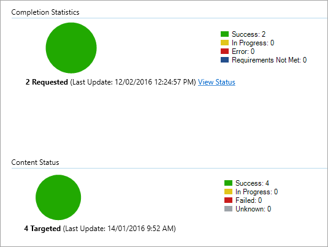

# <a name="onboard-the-windows-10-devices-using-configuration-manager"></a>Configuration Manager를 Windows 10 장치 온보드

[!INCLUDE [Microsoft 365 Defender rebranding](../../includes/microsoft-defender.md)]

**적용 대상:**

- [엔드포인트용 Microsoft Defender](https://go.microsoft.com/fwlink/p/?linkid=2154037)
- [Microsoft 365 Defender](https://go.microsoft.com/fwlink/?linkid=2118804)
- Microsoft Endpoint Configuration Manager 분기
- System Center 2012 R2 Configuration Manager

> Endpoint용 Defender를 경험하고 싶나요? [무료 평가판을 신청하세요.](https://signup.microsoft.com/create-account/signup?products=7f379fee-c4f9-4278-b0a1-e4c8c2fcdf7e&ru=https://aka.ms/MDEp2OpenTrial?ocid=docs-wdatp-configureendpointssccm-abovefoldlink)

## <a name="supported-client-operating-systems"></a>지원되는 클라이언트 운영 체제

실행 중인 Configuration Manager 버전에 따라 다음 클라이언트 운영 체제를 온보드할 수 있습니다.

- **Configuration Manager 버전 1910 및 이전**:
  - 클라이언트 컴퓨터에서 Windows 10
- **Configuration Manager 버전 2002 이상**:

  Configuration Manager 버전 2002부터 다음 운영 체제를 온보드할 수 있습니다.

  - Windows 8.1
  - Windows 10
  - Windows Server 2012 R2
  - Windows Server 2016
  - Windows Server 2016 버전 1803 이상
  - Windows Server 2019

> [!NOTE]
> R2, Windows Server 2012, Windows Server 2016 및 Windows Server 2019를 온보드하는 방법에 대한 자세한 내용은 [onboard Windows servers을 참조하십시오.](configure-server-endpoints.md)

### <a name="onboard-devices-using-system-center-configuration-manager"></a>장치를 사용하여 온보드 System Center Configuration Manager


[](images/onboard-config-mgr.png#lightbox)

[PDF](https://github.com/MicrosoftDocs/microsoft-365-docs/raw/public/microsoft-365/security/defender-endpoint/downloads/mdatp-deployment-strategy.pdf) 또는 Visio [](https://github.com/MicrosoftDocs/microsoft-365-docs/raw/public/microsoft-365/security/defender-endpoint/downloads/mdatp-deployment-strategy.vsdx) Microsoft Defender for Endpoint 배포에서 다양한 경로를 확인할 수 있습니다.

1. 서비스 온보더링 마법사에서 ** 다운로드한 .zip(WindowsDefenderATPOnboardingPackage.zip)를 구성 관리자 구성 패키지 패키지를 열 수 있습니다. 포털에서 패키지를 Microsoft 365 Defender [있습니다.](https://security.microsoft.com/)
    1. 탐색 창에서 **끝점 설정** \> **관리** \>  \> **온보더링** 을 선택합니다.
    2. 운영 Windows 10 로 실행을 선택합니다.
    3. 배포 **방법 필드에서** System Center Configuration Manager **2012/2012 R2/1511/1602 를 선택합니다.**
    4. 패키지 **다운로드를** 선택하고 파일 .zip 저장합니다.

2. 패키지를 배포할 네트워크 관리자가 액세스할 수 있는 .zip 공유 읽기 전용 위치로 파일 파일의 내용을 추출합니다. *이름이 WindowsDefenderATPOnboardingScript.cmd인 파일이 있습니다.*

3. System Center [R2 Configuration Manager](/previous-versions/system-center/system-center-2012-R2/gg699369\(v=technet.10\)) 문서의 단계에 따라 패키지를 배포합니다.

   패키지를 배포할 미리 정의한 장치 컬렉션을 선택하십시오.

> [!NOTE]
> Endpoint용 Defender는 [OOBE(첫 경험)](https://answers.microsoft.com/windows/wiki/windows_10/how-to-complete-the-windows-10-out-of-box/47e3f943-f000-45e3-8c5c-9d85a1a0cf87) 단계에서 온보딩을 지원하지 않습니다. 설치 또는 업그레이드를 실행한 후 사용자가 OOBE를 Windows 합니다.
>
> Configuration Manager 응용 프로그램에 검색 규칙을 만들어 장치가 지속적으로 온보더된지 확인할 수 있습니다. 응용 프로그램은 패키지 및 프로그램과 다른 유형의 개체입니다.
> 장치가 아직 온보드되지 않은 경우(보류 중인 OOBE 완료 또는 다른 이유로 인해) 규칙에서 상태 변경이 감지될 때까지 Configuration Manager가 디바이스를 다시 시도합니다.
>
> 이 동작은 "OnboardingState" 레지스트리 값(형식이 REG_DWORD) = 1이면 검색 규칙을 만들어 수행할 수 있습니다.
> 이 레지스트리 값은 "HKLM\SOFTWARE\Microsoft\Windows Advanced Threat Protection\Status" 아래에 있습니다.
자세한 내용은 [Configure Detection Methods in System Center 2012 R2 Configuration Manager을 참조하십시오.](/previous-versions/system-center/system-center-2012-R2/gg682159\(v=technet.10\)#step-4-configure-detection-methods-to-indicate-the-presence-of-the-deployment-type)

### <a name="configure-sample-collection-settings"></a>샘플 수집 설정 구성

각 디바이스에 대해 심층 분석을 위해 파일을 제출하기 위해 요청을 할 때 장치에서 샘플을 수집할 수 있는지 여부를 Microsoft 365 Defender 구성 값을 설정할 수 있습니다.

> [!NOTE]
> 이러한 구성 설정은 일반적으로 Configuration Manager를 통해 수행됩니다.

Configuration Manager에서 구성 항목에 대한 준수 규칙을 설정하여 장치에서 샘플 공유 설정을 변경할 수 있습니다.

이 규칙은  불만이 있는지 확인하도록 대상 디바이스의 레지스트리 키 값을 설정하는 수정 준수 규칙 구성 항목입니다.

구성은 다음 레지스트리 키 항목을 통해 설정됩니다.

```text
Path: "HKLM\SOFTWARE\Policies\Microsoft\Windows Advanced Threat Protection"
Name: "AllowSampleCollection"
Value: 0 or 1
```

여기서 키 형식은 D-WORD입니다. 가능한 값은 다음과 같습니다.

- 0: 이 장치에서 샘플 공유를 허용하지 않습니다.
- 1: 이 장치에서 모든 파일 형식을 공유할 수 있습니다.

레지스트리 키가 없는 경우의 기본값은 1입니다.

규정 준수에 System Center Configuration Manager 대한 자세한 내용은 [System Center 2012 R2 Configuration Manager의](/previous-versions/system-center/system-center-2012-R2/gg682139\(v=technet.10\))규정 준수 설정 소개를 참조하세요.

## <a name="other-recommended-configuration-settings"></a>기타 권장 구성 설정

장치를 서비스에 온보드한 후 다음과 같은 권장 구성 설정을 사용하여 포함된 위협 방지 기능을 활용하는 것이 중요합니다.

### <a name="device-collection-configuration"></a>장치 컬렉션 구성

Endpoint Configuration Manager 버전 2002 이상을 사용하는 경우 서버 또는 다운 수준 클라이언트를 포함하기 위해 배포를 확장할 수 있습니다.

### <a name="next-generation-protection-configuration"></a>차세대 보호 구성

권장되는 구성 설정은 다음과 같습니다.

#### <a name="scan"></a>검사

- USB 드라이브와 같은 이동식 저장 장치 검색: 예

#### <a name="real-time-protection"></a>실시간 보호

- 동작 모니터링 사용: 예
- 다운로드할 때 및 설치 전에 사용자방지 응용 프로그램으로부터 보호 사용: 예

#### <a name="cloud-protection-service"></a>클라우드 보호 서비스

- 클라우드 보호 서비스 멤버십 유형: 고급 멤버십

#### <a name="attack-surface-reduction"></a>공격 표면 감소

사용 가능한 모든 규칙을 감사로 구성합니다.

> [!NOTE]
> 이러한 활동을 차단하면 합법적인 비즈니스 프로세스가 중단될 수 있습니다. 가장 좋은 방법은 모든 것을 감사로 설정하고, 켜기에 안전한 설정을 식별한 다음, 가짓 긍정 검색이 없는 끝점에서 해당 설정을 사용하도록 설정하는 것입니다.

#### <a name="network-protection"></a>네트워크 보호

감사 또는 차단 모드에서 네트워크 보호를 사용하도록 설정하기 전에 지원 페이지에서 얻을 수 있는 맬웨어 방지 플랫폼 업데이트를 설치해야 [합니다.](https://support.microsoft.com/help/4560203/windows-defender-anti-malware-platform-binaries-are-missing)

#### <a name="controlled-folder-access"></a>제어된 폴더 액세스

감사 모드에서 기능을 30일 이상 사용하도록 설정 이 기간이 지난 후 검색을 검토하고 보호된 Director에 쓸 수 있는 응용 프로그램 목록을 생성합니다.

자세한 내용은 제어된 폴더 [액세스 평가를 참조하세요.](evaluate-controlled-folder-access.md)

## <a name="run-a-detection-test-to-verify-onboarding"></a>검색 테스트를 실행하여 온보더링 확인
장치를 온보드한 후 검색 테스트를 실행하여 장치가 서비스에 제대로 온보드되었는지 확인할 수 있습니다. 자세한 내용은 새로 온보딩된 끝점 디바이스용 Microsoft Defender에서 검색 테스트 [실행을 참조하세요.](run-detection-test.md)


## <a name="offboard-devices-using-configuration-manager"></a>Configuration Manager를 사용하여 디바이스 오프보드

보안상의 이유로, 오프보드 장치에 사용된 패키지는 다운로드한 날짜 30일 후에 만료됩니다. 장치에 전송된 만료된 오프보더 패키지는 거부됩니다. 오프보더 패키지를 다운로드할 때 패키지 만료 날짜에 대한 알림을 하게 되고 패키지 이름에도 포함됩니다.

> [!NOTE]
> 온보드 및 오프보더 정책을 동일한 장치에 동시에 배포하면 안 됩니다. 그렇지 않으면 예측할 수 없는 충돌이 발생할 수 있습니다.

### <a name="offboard-devices-using-microsoft-endpoint-manager-current-branch"></a>현재 분기를 사용하여 Microsoft Endpoint Manager 오프보드

현재 분기에 Microsoft Endpoint Manager 경우 오프보링 구성 파일 [만들기를 참조합니다.](/configmgr/protect/deploy-use/windows-defender-advanced-threat-protection#create-an-offboarding-configuration-file)

### <a name="offboard-devices-using-system-center-2012-r2-configuration-manager"></a>System Center 2012 R2 Configuration Manager를 사용하여 장치 오프보드

1. 에서 오프보더 패키지를 Microsoft 365 Defender [포털](https://security.microsoft.com/):
    1. 탐색 창에서 **끝점 설정** 관리 \>  \>  오프보링 \> **을 선택합니다.**  
    1. 운영 Windows 10 로 실행을 선택합니다.
    1. 배포 **방법 필드에서** System Center Configuration Manager **2012/2012 R2/1511/1602 를 선택합니다.**
    1. 패키지 **다운로드를** 선택하고 파일 .zip 저장합니다.

2. 패키지를 배포할 네트워크 관리자가 액세스할 수 있는 .zip 공유 읽기 전용 위치로 파일 파일의 내용을 추출합니다. 이름이 *WindowsDefenderATPOffboardingScript_valid_until_YYYY-MM-DD.cmd 입니다.*

3. System Center [R2 Configuration Manager](/previous-versions/system-center/system-center-2012-R2/gg699369\(v=technet.10\)) 문서의 단계에 따라 패키지를 배포합니다.

   패키지를 배포할 미리 정의한 장치 컬렉션을 선택하십시오.

> [!IMPORTANT]
> 오프보더링을 통해 디바이스가 포털에 센서 데이터 전송을 중지하지만, 디바이스에서 전송한 모든 경고에 대한 참조를 포함하여 장치의 데이터는 최대 6개월 동안 보존됩니다.

## <a name="monitor-device-configuration"></a>장치 구성 모니터링

현재 분기를 Microsoft Endpoint Manager Configuration Manager 콘솔에서 기본 제공 Defender for Endpoint 대시보드를 사용하세요. 자세한 내용은 [Endpoint용 Defender - 모니터링을 참조하세요.](/configmgr/protect/deploy-use/windows-defender-advanced-threat-protection#monitor)

2012 R2 System Center 사용하는 경우 모니터링은 다음 두 부분으로 구성됩니다.

1. 구성 패키지가 올바르게 배포되어 네트워크의 디바이스에서 실행 중(또는 성공적으로 실행) 확인

2. 장치가 Endpoint용 Defender 서비스를 준수하는지 확인합니다(장치가 온보딩 프로세스를 완료하고 서비스에 데이터를 계속 보고할 수 있도록 보장).

### <a name="confirm-the-configuration-package-has-been-correctly-deployed"></a>구성 패키지가 올바르게 배포되어 있는지 확인

1. Configuration Manager 콘솔에서  탐색 창 아래쪽의 모니터링을 클릭합니다.

2. **개요를** 선택한 다음 배포 **를 선택합니다.**

3. 패키지 이름이 있는 배포에서 선택합니다.

4. 완료 통계 및 콘텐츠 **상태의** 상태 **표시기를 검토합니다.**

    배포에 실패한 **경우(오류,** 요구 사항이 충족되지 않은 장치 **또는** 실패 상태인 **장치)** 장치 문제를 해결해야 할 수 있습니다. 자세한 내용은 Endpoint 온보딩 문제에 [대한 Microsoft Defender 문제 해결을 참조하세요.](troubleshoot-onboarding.md)

    

### <a name="check-that-the-devices-are-compliant-with-the-microsoft-defender-for-endpoint-service"></a>장치가 끝점용 Microsoft Defender 서비스를 준수하는지 확인

System Center 2012 R2 Configuration Manager에서 구성 항목에 대한 준수 규칙을 설정하여 배포를 모니터링할 수 있습니다.

이 규칙은  대상 디바이스에서 레지스트리 키 값을 모니터링하는 수정되지 않는 준수 규칙 구성 항목입니다.

다음 레지스트리 키 항목을 모니터링합니다.

```console
Path: "HKLM\SOFTWARE\Microsoft\Windows Advanced Threat Protection\Status"
Name: "OnboardingState"
Value: "1"
```

자세한 내용은 [System Center 2012 R2 Configuration Manager의](/previous-versions/system-center/system-center-2012-R2/gg682139\(v=technet.10\))규정 준수 설정 소개를 참조하세요.

## <a name="related-topics"></a>관련 항목

- [그룹 정책을 Windows 10 장치 온보드](configure-endpoints-gp.md)
- [모바일 장치 관리 도구를 사용하여 Windows 10 장치 온보딩](configure-endpoints-mdm.md)
- [로컬 스크립트를 사용하여 Windows 10 장치 온보딩](configure-endpoints-script.md)
- [비영구 VDI(가상 데스크톱 인프라) 장치 온보딩](configure-endpoints-vdi.md)
- [새로 온보딩된 엔드포인트 디바이스용 Microsoft Defender에서 검색 테스트 실행](run-detection-test.md)
- [끝점 온보딩 문제에 대한 Microsoft Defender 문제 해결](troubleshoot-onboarding.md)
