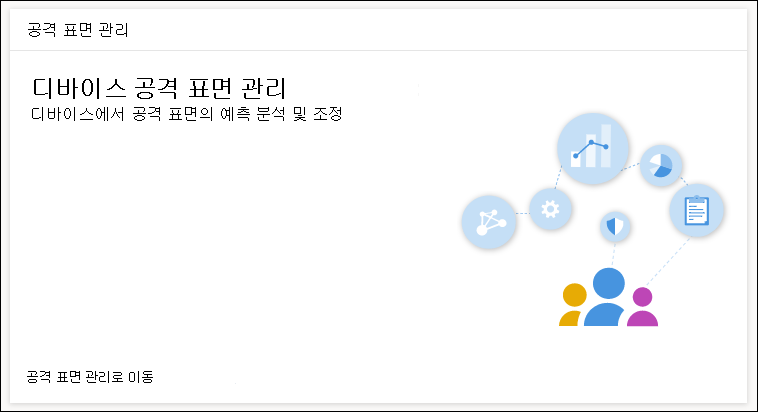

# ASR 규칙 배포 및 검색 최적화Optimize ASR rule deployment and detections

[!INCLUDE [Microsoft 365 Defender rebranding](../../includes/microsoft-defender.md)]

**적용 대상:****Applies to:**
- [엔드포인트용 Microsoft DefenderMicrosoft Defender for Endpoint](https://go.microsoft.com/fwlink/p/?linkid=2154037)
- [Microsoft 365 DefenderMicrosoft 365 Defender](https://go.microsoft.com/fwlink/?linkid=2118804)

> Endpoint용 Defender를 경험하고 싶나요?Want to experience Defender for Endpoint? [무료 평가판에 등록합니다.](https://www.microsoft.com/en-us/WindowsForBusiness/windows-atp?ocid=docs-wdatp-onboardconfigure-abovefoldlink)[Sign up for a free trial](https://www.microsoft.com/en-us/WindowsForBusiness/windows-atp?ocid=docs-wdatp-onboardconfigure-abovefoldlink).

[ASR(공격 표면 감소) 규칙은](./attack-surface-reduction.md) 일반적인 맬웨어 악용을 식별하고 방지합니다.[Attack surface reduction (ASR) rules](./attack-surface-reduction.md) identify and prevent typical malware exploits. 잠재적으로 악성 코드가 실행될 수 있는 경우와 방법을 제어합니다.They control when and how potentially malicious code can run. 예를 들어 JavaScript 또는 VBScript가 다운로드된 실행 파일을 시작하지 못하게 방지하고, Office 매크로에서 Win32 API 호출을 차단하고, USB 드라이브에서 실행되는 프로세스를 차단할 수 있습니다.For example, they can prevent JavaScript or VBScript from launching a downloaded executable, block Win32 API calls from Office macros, and block processes that run from USB drives.

 
*공격 표면 관리 카드**Attack surface management card*

공격 *표면 관리 카드는* 다음에 사용할 수 있는 Microsoft 365 보안 센터의 도구 진입점입니다.The *Attack surface management card* is an entry point to tools in Microsoft 365 security center that you can use to:

* ASR 규칙이 현재 조직에 배포되는 방법을 이해합니다.Understand how ASR rules are currently deployed in your organization.
* ASR 검색을 검토하고 가능한 잘못된 검색을 식별합니다.Review ASR detections and identify possible incorrect detections.
* 제외의 영향을 분석하고 제외할 파일 경로 목록을 생성합니다.Analyze the impact of exclusions and generate the list of file paths to exclude.

Go **to attack surface management**  >  **Monitoring & reports > Attack surface reduction rules > Add exclusions 를 선택합니다.**Select **Go to attack surface management** > **Monitoring & reports > Attack surface reduction rules > Add exclusions**. Microsoft 365 보안 센터의 다른 섹션으로 이동할 수 있습니다.From there, you can navigate to other sections of Microsoft 365 security center.

 
*Microsoft 365 보안 센터의 공격 표면 축소 규칙 페이지의 제외 추가 탭*The ***Add exclusions** tab in the Attack surface reduction rules page in Microsoft 365 security center*

> [!NOTE]
> Microsoft 365 보안 센터에 액세스하려면 Microsoft 365 E3 또는 E5 라이선스와 Azure Active Directory에서 특정 역할이 있는 계정이 필요합니다.To access Microsoft 365 security center, you need a Microsoft 365 E3 or E5 license and an account that has certain roles on Azure Active Directory. [필요한 라이선스 및 사용 권한에 대해 읽어 읽습니다.](https://docs.microsoft.com/office365/securitycompliance/microsoft-security-and-compliance#required-licenses-and-permissions)[Read about required licenses and permissions](https://docs.microsoft.com/office365/securitycompliance/microsoft-security-and-compliance#required-licenses-and-permissions).

Microsoft 365 보안 센터의 ASR 규칙 배포에 대한 자세한 내용은 ASR 규칙 배포 및 검색 모니터링 및 관리를 [참조하세요.](https://docs.microsoft.com/office365/securitycompliance/monitor-devices#monitor-and-manage-asr-rule-deployment-and-detections)For more information about ASR rule deployment in Microsoft 365 security center, see [Monitor and manage ASR rule deployment and detections](https://docs.microsoft.com/office365/securitycompliance/monitor-devices#monitor-and-manage-asr-rule-deployment-and-detections).

**관련 항목****Related topics**

* [장치가 올바르게 구성되어 있는지 확인Ensure your devices are configured properly](configure-machines.md)
* [끝점용 Microsoft Defender에 장치 온보딩Get devices onboarded to Microsoft Defender for Endpoint](configure-machines-onboarding.md)
* [끝점 보안 기준에 대한 Microsoft Defender 준수 모니터링Monitor compliance to the Microsoft Defender for Endpoint security baseline](configure-machines-security-baseline.md)
