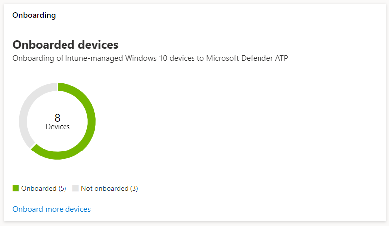

# 끝점용 Microsoft Defender에 장치 온보딩

[!INCLUDE [Microsoft 365 Defender rebranding](../../includes/microsoft-defender.md)]

**적용 대상:**
- [엔드포인트용 Microsoft Defender](https://go.microsoft.com/fwlink/p/?linkid=2154037)
- [Microsoft 365 Defender](https://go.microsoft.com/fwlink/?linkid=2118804)

> 엔드포인트용 Microsoft Defender를 경험하고 싶으신가요? [무료 평가판을 신청하세요.](https://signup.microsoft.com/create-account/signup?products=7f379fee-c4f9-4278-b0a1-e4c8c2fcdf7e&ru=https://aka.ms/MDEp2OpenTrial?ocid=docs-wdatp-onboardconfigure-abovefoldlink)

각 온보드 장치는 추가 끝점 감지 및 응답(EDR) 센서를 추가하고 네트워크의 위반 활동에 대한 가시성을 향상합니다. 또한 온보더링을 통해 장치가 취약한 구성 요소와 보안 구성 문제를 확인할 수 있으며 공격 중에 중요한 수정 작업을 받을 수 있습니다.

장치의 온보더링을 추적하고 관리하기 전에 다음을 진행합니다.

- [Intune 관리에 장치 등록](configure-machines.md#enroll-devices-to-intune-management)
- [필요한 사용 권한이 있는지 확인](configure-machines.md#obtain-required-permissions)

## 보호되지 않는 장치 검색 및 추적

**온보딩** 카드는 실제로 끝점용 Defender에 온보딩된 Windows 10 장치 수를 Intune 관리 Windows 10 비교하여 온보딩 속도에 대한 간략한 개요를 제공합니다.

*Intune에서 관리하는 총 장치 수와 비교한 온보더 장치를 보여 Windows 10 카드*

> [!NOTE]
> Intune 프로필을 사용하지 않는 보안 센터 구성 관리자, 온보딩 스크립트 또는 기타 온보딩 방법을 사용한 경우 데이터 불일치가 발생할 수 있습니다. 이러한 불일치 문제를 해결하려면 끝점 온보딩용 Defender에 대한 해당 Intune 구성 프로필을 만들고 해당 프로필을 장치에 할당합니다.

## Intune 프로필을 사용하여 더 많은 장치 온보드

Endpoint용 Defender는 디바이스를 온보딩하기 위한 몇 가지 [편리한 Windows 10 있습니다.](onboard-configure.md) 그러나 Intune 관리 장치의 경우 Intune 프로필을 활용하여 Endpoint용 Defender 센서를 편리하게 배포하여 디바이스를 선택해 효과적으로 이러한 장치를 서비스에 온보딩할 수 있습니다.

**온보더링 카드에서** 더 많은 디바이스 온보더를 **선택하여** Intune에서 프로필을 만들고 할당합니다. 이 링크를 통해 Intune의 장치 준수 페이지로 이동하여 온보더링 상태를 비슷한 개요로 제공합니다.

*Intune 장치 관리의 끝점 장치 준수 페이지용 Microsoft Defender*

> [!TIP]
> **또는 Microsoft Defender ATP의** 모든 서비스 및 Intune > 장치 준수에서 > 끝점 온보딩 준수를 위한 Defend [Microsoft Azure er](https://portal.azure.com/) > 있습니다> 있습니다.

> [!NOTE]
> 최신 장치 데이터를 보려면 ATP 센서가 없는 장치 목록을 **클릭합니다.**

장치 준수 페이지에서 Endpoint용 Defender 센서 배포를 위한 구성 프로필을 만들고 해당 프로필을 온보딩할 디바이스에 할당합니다. 이렇게 하여 다음 중 하나를 사용할 수 있습니다.

- 미리 **정의한 장치 구성** 프로필로 시작하도록 ATP 센서를 구성하려면 장치 구성 프로필 만들기를 선택합니다.
- 처음부터 장치 구성 프로필을 만드시다.

자세한 내용은 Intune 장치 구성 프로필을 사용하여 끝점용 Defender에 장치를 온보딩하는 [방법을 읽어보아야 합니다.](/intune/advanced-threat-protection#onboard-devices-by-using-a-configuration-profile)

> 엔드포인트용 Microsoft Defender를 경험하고 싶으신가요? [무료 평가판을 신청하세요.](https://signup.microsoft.com/create-account/signup?products=7f379fee-c4f9-4278-b0a1-e4c8c2fcdf7e&ru=https://aka.ms/MDEp2OpenTrial?ocid=docs-wdatp-onboardconfigure-belowfoldlink)

## 관련 항목

- [장치가 올바르게 구성되어 있는지 확인](configure-machines.md)
- [엔드포인트 보안 기준에 대한 Defender 준수 강화](configure-machines-security-baseline.md)
- [ASR 규칙 배포 및 검색 최적화](configure-machines-asr.md)
