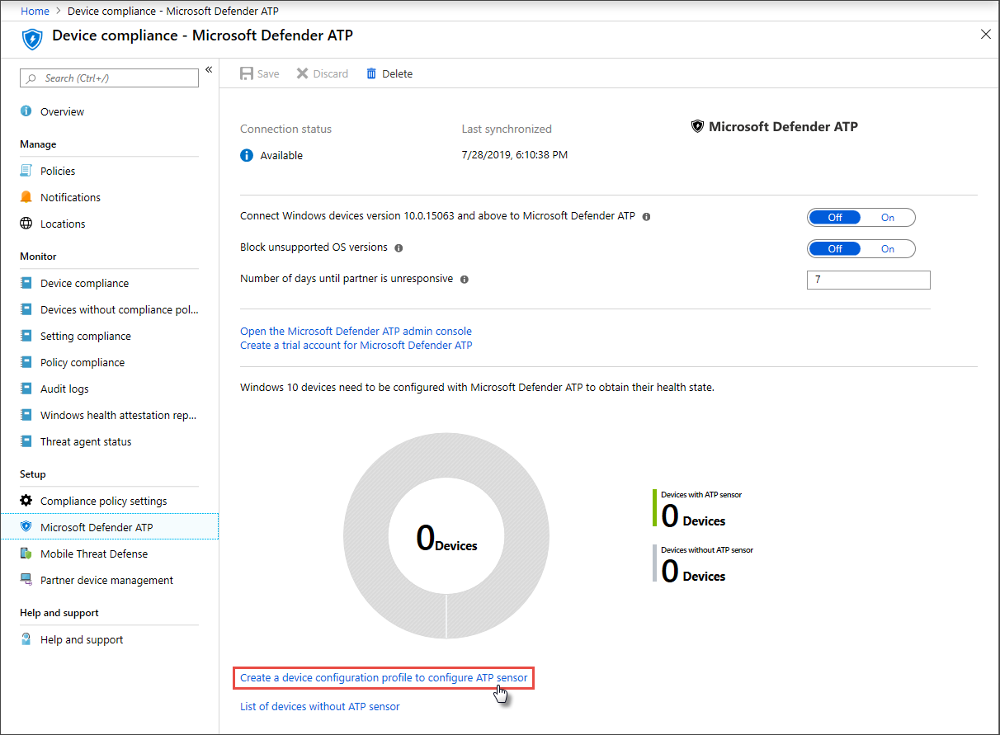

# 끝점용 Microsoft Defender에 장치 온보딩Get devices onboarded to Microsoft Defender for Endpoint

[!INCLUDE [Microsoft 365 Defender rebranding](../../includes/microsoft-defender.md)]

**적용 대상:****Applies to:**
- [엔드포인트용 Microsoft DefenderMicrosoft Defender for Endpoint](https://go.microsoft.com/fwlink/p/?linkid=2154037)
- [Microsoft 365 DefenderMicrosoft 365 Defender](https://go.microsoft.com/fwlink/?linkid=2118804)

>끝점용 Microsoft Defender를 경험하고 싶나요?Want to experience Microsoft Defender for Endpoint? [무료 평가판에 등록합니다.Sign up for a free trial.](https://www.microsoft.com/microsoft-365/windows/microsoft-defender-atp?ocid=docs-wdatp-onboardconfigure-abovefoldlink)

각 온보드 장치는 추가 끝점 감지 및 응답(EDR) 센서를 추가하고 네트워크의 위반 활동에 대한 가시성을 향상합니다.Each onboarded device adds an additional endpoint detection and response (EDR) sensor and increases visibility over breach activity in your network. 또한 온보더링을 통해 장치가 취약한 구성 요소와 보안 구성 문제를 확인할 수 있으며 공격 중에 중요한 수정 작업을 받을 수 있습니다.Onboarding also ensures that a device can be checked for vulnerable components as well security configuration issues and can receive critical remediation actions during attacks.

장치의 온보더링을 추적하고 관리하기 전에 다음을 진행합니다.Before you can track and manage onboarding of devices:
- [Intune 관리에 장치 등록Enroll your devices to Intune management](configure-machines.md#enroll-devices-to-intune-management)
- [필요한 사용 권한이 있는지 확인Ensure you have the necessary permissions](configure-machines.md#obtain-required-permissions)

## 보호되지 않는 장치 검색 및 추적Discover and track unprotected devices

**온보딩** 카드는 실제로 끝점용 Defender에 온보딩된 Windows 10 장치 수를 Intune 관리 Windows 10 비교하여 온보딩 속도에 대한 간략한 개요를 제공합니다.The **Onboarding** card provides a high-level overview of your onboarding rate by comparing the number of Windows 10 devices that have actually onboarded to Defender for Endpoint against the total number of Intune-managed Windows 10 devices.

 
*Intune에서 관리하는 총 장치 수와 비교한 온보더 장치를 보여 Windows 10 카드**Card showing onboarded devices compared to the total number of Intune-managed Windows 10 device*

>[!NOTE]
>Intune 프로필을 사용하지 않는 보안 센터 구성 관리자, 온보딩 스크립트 또는 기타 온보딩 방법을 사용한 경우 데이터 불일치가 발생할 수 있습니다.If you used Security Center Configuration Manager, the onboarding script, or other onboarding methods that don’t use Intune profiles, you might encounter data discrepancies. 이러한 불일치 문제를 해결하려면 끝점 온보딩용 Defender에 대한 해당 Intune 구성 프로필을 만들고 해당 프로필을 장치에 할당합니다.To resolve these discrepancies, create a corresponding Intune configuration profile for Defender for Endpoint onboarding and assign that profile to your devices.

## Intune 프로필을 사용하여 더 많은 장치 온보드Onboard more devices with Intune profiles

Endpoint용 Defender는 디바이스를 온보딩하기 위한 몇 가지 [편리한 Windows 10 있습니다.](onboard-configure.md)Defender for Endpoint provides several convenient options for [onboarding Windows 10 devices](onboard-configure.md). 그러나 Intune 관리 장치의 경우 Intune 프로필을 활용하여 Endpoint용 Defender 센서를 편리하게 배포하여 디바이스를 선택해 효과적으로 이러한 장치를 서비스에 온보딩할 수 있습니다.For Intune-managed devices, however, you can leverage Intune profiles to conveniently deploy the Defender for Endpoint sensor to select devices, effectively onboarding these devices to the service.

**온보더링 카드에서** 더 많은 디바이스 온보더를 **선택하여** Intune에서 프로필을 만들고 할당합니다.From the **Onboarding** card, select **Onboard more devices** to create and assign a profile on Intune. 이 링크를 통해 Intune의 장치 준수 페이지로 이동하여 온보더링 상태를 비슷한 개요로 제공합니다.The link takes you to the device compliance page on Intune, which provides a similar overview of your onboarding state.

 
   *Intune 장치 관리의 끝점 장치 준수 페이지용 Microsoft Defender**Microsoft Defender for Endpoint device compliance page on Intune device management*

>[!TIP]
>**또는 Intune** 및 장치 준수 > 모든 서비스에서 Microsoft Azure  포털의 끝점 온보딩 준수를 위한 Defender > 수 > Microsoft Defender ATP.Alternatively, you can navigate to the Defender for Endpoint onboarding compliance page in the [Microsoft Azure portal](https://portal.azure.com/) from **All services > Intune > Device compliance > Microsoft Defender ATP**.

>[!NOTE]
> 최신 장치 데이터를 보려면 ATP 센서가 없는 장치 목록을 **클릭합니다.**If you want to view the most up-to-date device data, click on **List of devices without ATP sensor**.

장치 준수 페이지에서 Endpoint용 Defender 센서 배포를 위한 구성 프로필을 만들고 해당 프로필을 온보딩할 디바이스에 할당합니다.From the device compliance page, create a configuration profile specifically for the deployment of the Defender for Endpoint sensor and assign that profile to the devices you want to onboard. 이렇게 하여 다음 중 하나를 사용할 수 있습니다.To do this, you can either:

- 미리 **정의한 장치 구성** 프로필로 시작하도록 ATP 센서를 구성하려면 장치 구성 프로필 만들기를 선택합니다.Select **Create a device configuration profile to configure ATP sensor** to start with a predefined device configuration profile.
- 처음부터 장치 구성 프로필을 만드시다.Create the device configuration profile from scratch.

자세한 내용은 Intune 장치 구성 프로필을 사용하여 끝점용 Defender에 장치를 온보딩하는 [방법을 읽어보아야 합니다.](/intune/advanced-threat-protection#onboard-devices-by-using-a-configuration-profile)For more information, [read about using Intune device configuration profiles to onboard devices to Defender for Endpoint](/intune/advanced-threat-protection#onboard-devices-by-using-a-configuration-profile).

>끝점용 Microsoft Defender를 경험하고 싶나요?Want to experience Microsoft Defender for Endpoint? [무료 평가판에 등록합니다.Sign up for a free trial.](https://www.microsoft.com/microsoft-365/windows/microsoft-defender-atp?ocid=docs-wdatp-onboardconfigure-belowfoldlink)

## 관련 항목Related topics
- [장치가 올바르게 구성되어 있는지 확인Ensure your devices are configured properly](configure-machines.md)
- [엔드포인트 보안 기준에 대한 Defender 준수 강화Increase compliance to the Defender for Endpoint security baseline](configure-machines-security-baseline.md)
- [ASR 규칙 배포 및 검색 최적화Optimize ASR rule deployment and detections](configure-machines-asr.md)
