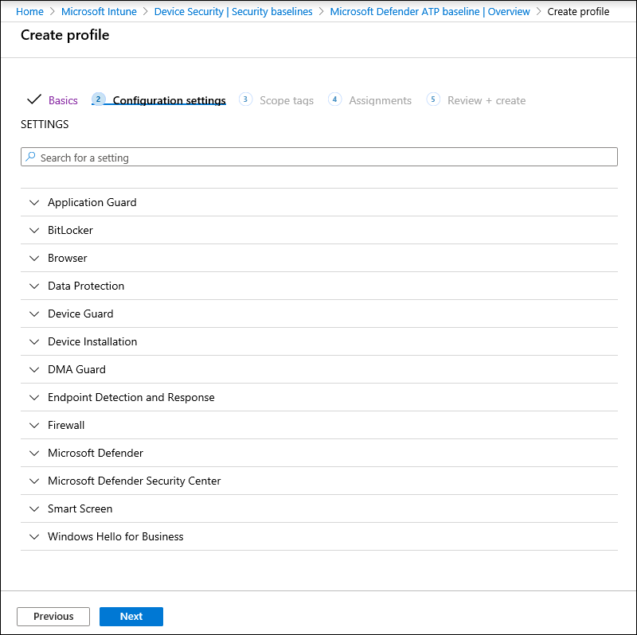

# 엔드포인트 보안 기준에 대한 Microsoft Defender 준수 강화

[!INCLUDE [Microsoft 365 Defender rebranding](../../includes/microsoft-defender.md)]

**적용 대상:**
- [엔드포인트용 Microsoft Defender](https://go.microsoft.com/fwlink/p/?linkid=2154037)
- [Microsoft 365 Defender](https://go.microsoft.com/fwlink/?linkid=2118804)

> Endpoint용 Defender를 경험하고 싶나요? [무료 평가판을 신청하세요.](https://signup.microsoft.com/create-account/signup?products=7f379fee-c4f9-4278-b0a1-e4c8c2fcdf7e&ru=https://aka.ms/MDEp2OpenTrial?ocid=docs-wdatp-onboardconfigure-abovefoldlink)

보안 기준은 보안 전문가와 시스템 관리자 및 전문가의 지침에 따라 Windows 보장합니다. 배포 시 엔드포인트용 Defender 보안 기준은 엔드포인트 보안 컨트롤에 대한 Defender를 설정하여 최적의 보호를 제공합니다.

보안 기준 및 구성 프로필을 사용하여 Intune에 보안 기준이 할당되는 방법을 이해하려면 이 [FAQ를 읽어 하세요.](/intune/security-baselines#q--a)

보안 기준에 대한 규정 준수를 배포하고 추적하기 전에 다음을 진행합니다.

- [Intune 관리에 장치 등록](configure-machines.md#enroll-devices-to-intune-management)
- [필요한 사용 권한이 있는지 확인](configure-machines.md#obtain-required-permissions)

## 끝점용 Microsoft Defender와 Intune Windows 기준 비교

Windows Intune 보안 기준은 브라우저 설정, PowerShell 설정, 브라우저 설정 등 Windows 실행 중인 장치를 안전하게 구성하는 데 필요한 포괄적인 권장 설정 집합을 Microsoft Defender 바이러스 백신. 반면 끝점용 Defender 기준은 끝점 검색 및 응답(EDR)에 대한 설정과 Windows Intune 보안 기준에 있는 설정을 포함하여 끝점 스택에 대한 Defender의 모든 보안 컨트롤을 최적화하는 설정을 제공합니다. 각 기준에 대한 자세한 내용은 다음을 참조하세요.

- [Windows 대한 보안 기준 설정](/intune/security-baseline-settings-windows)
- [Intune에 대한 끝점 기준 설정에 대한 Microsoft Defender](/intune/security-baseline-settings-defender-atp)

끝점용 Defender에 온보딩된 장치는 초기에 보안을 강화하기 위한 Windows Intu Windows ne 보안 기준과 끝점 보안 컨트롤에 대한 Defender를 최적으로 구성하기 위해 위에 계층화된 끝점 보안 기준의 두 기준을 모두 배포하는 것이 가장 이상적입니다. 위험 및 위협에 대한 최신 데이터를 사용하여 기준이 발전함에 따라 충돌을 최소화하기 위해 항상 출시되는 즉시 모든 제품에 최신 버전의 기준을 적용합니다.

> [!NOTE]
> 끝점용 Defender 보안 기준은 실제 장치에 최적화되어 있으며 현재 VM(가상 컴퓨터) 또는 VDI 끝점에서 사용하지 않는 것이 좋습니다. 특정 기준 설정은 가상화된 환경에서 원격 대화형 세션에 영향을 줄 수 있습니다.

## 끝점 보안 기준에 대한 Defender 준수 모니터링

장치 **구성 관리의** 보안 기준 카드는 끝점 보안 기준에 Windows 10 장치 전반에 걸쳐 규정 준수에 대한 개요를 제공합니다. 

*엔드포인트 보안 기준에 대한 Defender 준수를 보여주는 카드*

각 디바이스에는 다음 상태 유형 중 하나가 부여됩니다.

- **기준 일치:** 장치 설정이 기준의 모든 설정과 일치합니다.
- **기준과 일치하지 않는 경우:** 하나 이상의 장치 설정이 기준과 일치하지 않습니다.
- **잘못 구성:** 하나 이상의 기준 설정이 장치에 제대로 구성되지 않은 상태일 때 충돌, 오류 또는 보류 중인 상태입니다.
- **해당되지 않습니다.** 장치에 하나 이상의 기준 설정이 적용되지 않습니다.

특정 장치를 검토하려면 카드에서 보안 **기준 구성을** 선택합니다. 이렇게하면 Intune 장치 관리로 연결됩니다. 이 목록에서 디바이스 **이름 및 상태에** 대한 장치 상태를 선택합니다.

> [!NOTE]
> 장치 구성 관리 페이지에 표시된 집계된 데이터와 Intune의 개요 화면에 표시되는 데이터가 불일치할 수 있습니다.

## 끝점용 Microsoft Defender 보안 기준 검토 및 할당

장치 구성 관리는 끝점 보안 기준에 Windows 10 Microsoft Defender가 할당된 디바이스의 기준 준수만 모니터링합니다. Intune 장치 관리에서 기준을 편리하게 검토하고 장치에 할당할 수 있습니다.

1. **Intune** 장치 관리로 이동하려면 보안 기준 카드에서 보안 기준 구성을 선택합니다.  유사한 기준 준수 개요가 표시됩니다.

   > [!TIP]
   > 또는 Microsoft Defender ATP 기준에 대한 모든 서비스> Intune > 장치 보안 > 보안 기준에서 Microsoft Azure 포털에서 끝점용 **Defender 보안 기준으로 >** 있습니다.

2. 새 프로필을 만들 수 있습니다.

    
   *Intune의 끝점용 Microsoft Defender 보안 기준 개요*

3. 프로필을 만들 때 기준에 따라 특정 설정을 검토하고 조정할 수 있습니다.

    
   *Intune에서 프로필을 만들 때 보안 기준 옵션*

4. 프로필을 적절한 장치 그룹에 할당합니다.

    
   *Intune에서 보안 기준 프로필 할당*

5. 프로필을 만들어 저장하고 할당된 장치 그룹에 배포합니다.

    
   *Intune에서 보안 기준 프로필 만들기*

> [!TIP]
> Intune의 보안 기준은 장치를 포괄적으로 보호하고 보호하는 편리한 방법을 제공합니다. [Intune의 보안 기준에 대해 자세히 알아보시고](/intune/security-baselines)

> 엔드포인트용 Microsoft Defender를 경험하고 싶으신가요? [무료 평가판을 신청하세요.](https://signup.microsoft.com/create-account/signup?products=7f379fee-c4f9-4278-b0a1-e4c8c2fcdf7e&ru=https://aka.ms/MDEp2OpenTrial?ocid=docs-wdatp-onboardconfigure-belowfoldlink)

## 관련 항목

- [장치가 올바르게 구성되어 있는지 확인](configure-machines.md)
- [끝점용 Microsoft Defender에 장치 온보딩](configure-machines-onboarding.md)
- [ASR 규칙 배포 및 검색 최적화](configure-machines-asr.md)
