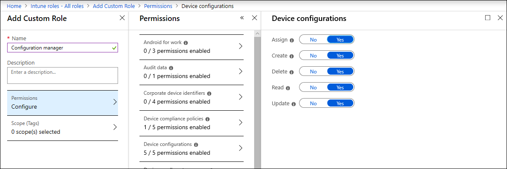

# 장치가 올바르게 구성되어 있는지 확인

[!INCLUDE [Microsoft 365 Defender rebranding](../../includes/microsoft-defender.md)]

**적용 대상:**
- [엔드포인트용 Microsoft Defender](https://go.microsoft.com/fwlink/p/?linkid=2154037)
- [Microsoft 365 Defender](https://go.microsoft.com/fwlink/?linkid=2118804)

> Endpoint용 Defender를 경험하고 싶나요? [무료 평가판을 신청하세요.](https://signup.microsoft.com/create-account/signup?products=7f379fee-c4f9-4278-b0a1-e4c8c2fcdf7e&ru=https://aka.ms/MDEp2OpenTrial?ocid=docs-wdatp-onboardconfigure-abovefoldlink)

적절히 구성된 장치를 사용하면 위협에 대한 전반적인 탄력성을 높이고 공격을 감지하고 대응할 수 있는 기능을 향상시킬 수 있습니다. 보안 구성 관리는 디바이스를 보장하는 데 도움이 됩니다.

- 엔드포인트용 Microsoft Defender에 온보딩
- 끝점 보안 기준 구성에 대한 Defender 충족 또는 초과
- 전략적 공격 표면 완화가 있습니다.

탐색 **메뉴에서** 구성 관리를 클릭하여 장치 구성 관리 페이지를 열 수 있습니다.

*장치 구성 관리 페이지*

조직 수준에서 구성 상태를 추적하고, 보안 센터 및 Microsoft Intune 및 Microsoft 365 보안 센터의 장치 관리 페이지에 대한 직접적인 딥 링크를 통해 불량 온보더링 범위, 규정 준수 문제 및 최적화된 공격 표면 완화에 대응하여 신속하게 조치를 취할 수 있습니다.

이렇게 하면 다음을 통해 혜택을 받을 수 있습니다.

- 디바이스에서 이벤트를 포괄적으로 확인
- 원시 이벤트를 처리하고 위반 활동 및 위협 표시기를 식별하기 위한 강력한 위협 인텔리전스 및 강력한 장치 학습 기술
- 악의적인 위험 요소 설치, 시스템 파일 및 프로세스의 하이재킹, 데이터 유출 및 기타 위협 활동의 설치를 효율적으로 중지하도록 구성된 전체 보안 기능 스택
- 생산성에 대한 영향을 최소화하면서 위협 활동에 대한 전략적 방어를 극대화하는 최적화된 공격 표면 완화

## Intune 관리에 장치 등록

장치 구성 관리는 Intune 장치 관리와 밀접하게 작동하여 조직의 디바이스 인벤토리 및 기준 보안 구성을 설정합니다. Intune 관리 디바이스에서 구성 문제를 추적하고 관리할 Windows 있습니다.

장치가 올바르게 구성되었는지 확인하려면 먼저 Intune 관리에 등록합니다. Intune 등록은 강력하며 여러 가지 등록 옵션을 Windows 있습니다. Intune 등록 옵션에 대한 자세한 내용은 장치 등록 [설정에 대해 Windows 읽어 보십시오.](/intune/windows-enroll)

> [!NOTE]
> Intune에 Windows 등록하려면 관리자에게 라이선스가 이미 할당되어 있어야 합니다. [장치 등록에 대한 라이선스 할당에 대해 읽어 읽습니다.](/intune/licenses-assign)

> [!TIP]
> Intune을 통해 장치 관리를 최적화하려면 [끝점용 Defender에 Intune을 연결합니다.](/intune/advanced-threat-protection#enable-windows-defender-atp-in-intune)

## 필요한 사용 권한 얻기

기본적으로 Azure AD에서 전역 관리자 또는 Intune 서비스 관리자 역할이 할당된 사용자만 장치를 온보드하고 보안 기준을 배포하는 데 필요한 장치 구성 프로필을 관리하고 할당할 수 있습니다.

다른 역할이 할당된 경우 필요한 사용 권한이 있는지 확인

- 장치 구성에 대한 모든 권한
- 보안 기준에 대한 모든 권한
- 장치 준수 정책에 대한 읽기 권한
- 조직에 대한 읽기 권한

*Intune에 대한 장치 구성 권한*

> [!TIP]
> Intune에 대한 사용 권한을 할당하는 데 대한 자세한 내용은 사용자 지정 [역할 만들기를 읽어 보아야 합니다.](/intune/create-custom-role#to-create-a-custom-role)

## 이 섹션의 내용

항목|설명
:---|:---
[끝점용 Defender에 장치 온보딩](configure-machines-onboarding.md)|Intune 관리 장치의 온보더링 상태를 추적하고 Intune을 통해 더 많은 장치를 온보드합니다. 
[엔드포인트 보안 기준에 대한 Defender 준수 강화](configure-machines-security-baseline.md)|기준 준수 및 비준수 추적 더 많은 Intune 관리 장치에 보안 기준을 배포합니다.
[ASR 규칙 배포 및 검색 최적화](configure-machines-asr.md)|규칙 배포를 검토하고 보안 센터에서 영향 분석 도구를 사용하여 Microsoft 365 조정합니다.

> Endpoint용 Defender를 경험하고 싶나요? [무료 평가판을 신청하세요.](https://signup.microsoft.com/create-account/signup?products=7f379fee-c4f9-4278-b0a1-e4c8c2fcdf7e&ru=https://aka.ms/MDEp2OpenTrial?ocid=docs-wdatp-onboardconfigure-belowfoldlink)
