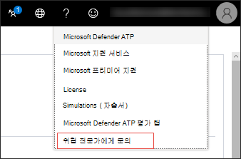
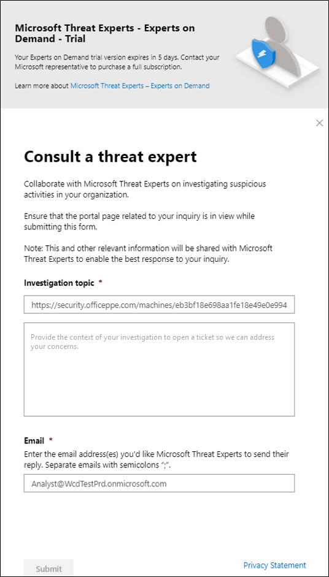

# Microsoft 위협 전문가 기능 구성 및 관리

[!INCLUDE [Microsoft 365 Defender rebranding](../../includes/microsoft-defender.md)]

**적용 대상:**
- [엔드포인트용 Microsoft Defender](https://go.microsoft.com/fwlink/p/?linkid=2154037)
- [Microsoft 365 Defender](https://go.microsoft.com/fwlink/?linkid=2118804)

> Endpoint용 Defender를 경험하고 싶나요? [무료 평가판을 신청하세요.](https://signup.microsoft.com/create-account/signup?products=7f379fee-c4f9-4278-b0a1-e4c8c2fcdf7e&ru=https://aka.ms/MDEp2OpenTrial?ocid=docs-wdatp-assignaccess-abovefoldlink)

## 시작하기 전에

> [!NOTE]
> Microsoft 위협 전문가 - 대상 공격 알림 관리 위협 헌팅 서비스에 적용하기 전에 Microsoft 기술 서비스 공급자 및 계정 팀과 자격 요구 사항을 논의합니다.

실험실 설정이 아니라 장치가 등록된 환경에 Endpoint용 Defender를 배포해야 합니다.

Endpoint 고객용 Defender인 경우 Microsoft 위협 전문가 **-** 대상 지정 공격 알림을 신청하여 가장 중요한 위협을 식별할 수 있도록 특별 인사이트 및 분석을 통해 신속하게 대응할 수 있습니다. 계정 팀 또는 Microsoft 담당자에게 문의하여 Microsoft 위협 전문가 **-** 요구 시 전문가에게 문의하여 위협 전문가에게 관련 탐지 및 가해자에 대한 자문을 구하세요.

## 대상 Microsoft 위협 전문가 - 대상 공격 알림 서비스

이미 Endpoint용 Defender 고객인 경우 다음을 통해 Microsoft Defender 보안 센터.

1. 탐색 창에서 일반 설정 > 고급 > - > Microsoft 위협 전문가 **알림으로 이동합니다.**

2. **적용** 을 클릭합니다.

    

3. Microsoft에서 응용 프로그램에서 다시 연락할 수 있도록 이름과 전자 메일 주소를 입력합니다.

    

4. 개인 정보 [취급 방침을 읽은](https://privacy.microsoft.com/privacystatement)다음 완료되면 **제출을** 클릭합니다. 응용 프로그램이 승인되면 환영 전자 메일을 받게 됩니다.

    

수락하면 환영 전자 메일이 표시되면  적용 단추가 "설정" 토글로 변경되는 것을 볼 수 있습니다. 대상 공격 알림 서비스에서 자신을 꺼내려면 토글 "꺼진" 토글을  밀어 페이지 아래쪽의 기본 설정 저장을 클릭합니다.

## 대상이 지정한 공격 알림을 볼 수 있는 위치는 Microsoft 위협 전문가

다음 중간을 통해 Microsoft 위협 전문가 대상 공격 알림을 받을 수 있습니다.

- Endpoint 포털의 인시던트에 대한 **Defender** 페이지
- Endpoint 포털의 경고 대시보드에 대한 **Defender**
- OData 경고 [API 및](/windows/security/threat-protection/microsoft-defender-atp/get-alerts) REST [API](/windows/security/threat-protection/microsoft-defender-atp/pull-alerts-using-rest-api)
- [고급 헌팅의 DeviceAlertEvents](/windows/security/threat-protection/microsoft-defender-atp/advanced-hunting-devicealertevents-table) 테이블
- 전자 메일 구성을 선택한 경우

전자 메일을 통해 대상 공격 알림을 받으면 전자 메일 알림 규칙을 생성합니다.

### 전자 메일 알림 규칙 만들기

알림 받는 사람에 대한 전자 메일 알림을 보내는 규칙을 만들 수 있습니다. 자세한  [내용은 전자](configure-email-notifications.md) 메일 알림을 생성, 편집, 삭제 또는 문제 해결하도록 알림 알림 구성을 참조하세요.

## 대상 공격 알림 보기

전자 메일 알림을 받도록 시스템을 구성한 후 Microsoft 위협 전문가 대상 공격 알림 수신을 시작할 것입니다.

1. 전자 메일의 링크를 클릭하여 위협 전문가로 태그가 지정된 대시보드의 해당 경고 컨텍스트로 **이동하세요.**

2. 대시보드에서 전자 메일에서 확인한 동일한 경고 항목을 선택하여 세부 정보를 볼 수 있습니다.

## 구독 - Microsoft 위협 전문가 전문가

이 서비스는 구독 서비스로 사용할 수 있습니다. 이미 Endpoint용 Defender 고객인 경우 Microsoft 담당자에게 문의하여 Microsoft 위협 전문가 - 전문가에게 문의할 수 있습니다.

## 조직의 의심스러운 사이버 보안 활동에 대한 Microsoft 위협 전문가에게 문의

적시에 정확한 응답을 Microsoft 위협 전문가 내에서 직접 참여할 수 있는 Microsoft Defender 보안 센터 파트너와 파트너가 될 수 있습니다. 전문가는 복잡한 위협, 사용자가 수신하는 대상이 지정되는 공격 알림을 더 잘 이해하거나, 알림, 잠재적으로 손상된 장치 또는 포털 대시보드에 표시될 위협 인텔리전스 컨텍스트에 대한 추가 정보가 필요한 경우를 보다 잘 이해할 수 있는 인사이트를 제공합니다.

> [!NOTE]
>
> - 조직의 사용자 지정된 위협 인텔리전스 데이터와 관련된 경고 문의는 현재 지원되지 않습니다. 자세한 내용은 보안 운영 또는 인시던트 대응 팀에 문의합니다.
> - 보안 센터 포털에서 보안 설정 관리 권한이 있는 경우 "위협 전문가에게 문의" 요청을 제출할 수 있습니다. 

1. 조사할 관련 정보(예: 인시던트 페이지)를 사용하여 포털 **페이지로** 이동합니다. 조사 요청을 보내기 전에 관련 경고 또는 장치에 대한 페이지가 보기에 표시되도록 합니다.

2. 오른쪽 위 메뉴에서 **?** 아이콘을 선택합니다. 그런 다음 위협 **전문가에게 문의를 선택합니다.**

    

    플라이아웃 화면이 열립니다. 다음 화면은 평가판 구독을 사용 중일 때 표시됩니다.

    

    다음 화면에는 전체 구독 - 전문가 Microsoft 위협 전문가 구독이 표시됩니다.

    

    문의 **항목 필드에는** 조사 요청에 대한 관련 페이지에 대한 링크가 미리 채워진 것입니다. 예를 들어 요청을 할 때 확인한 인시던트, 경고 또는 장치 세부 정보 페이지에 대한 링크입니다.

3. 다음 필드에서 조사를 시작할 수 있는 Microsoft 위협 전문가 충분한 정보를 제공합니다.

4. 전자 메일 주소와 대응하는 데 사용할 전자 메일 주소를 Microsoft 위협 전문가.

> [!NOTE]
> Microsoft 서비스 허브를 통해 전문가 관련 사례의 상태를 추적하려면 기술 계정 관리자에게 문의하세요.

이 비디오를 시청하여 Microsoft 서비스 허브에 대한 간략한 개요를 확인할 수 있습니다.

> [!VIDEO https://www.microsoft.com/videoplayer/embed/RE4pk9f]

## 전문가 - 요구 시 전문가와 Microsoft 위협 전문가 수 있는 샘플 조사 항목

### 경고 정보

- 이진수 이진에 대한 새로운 유형의 경고가 표시됩니다. [AlertID]. 이 경고와 추가 조사 방법과 관련한 자세한 정보를 알려 주시겠습니까?
- 악성 PowerShell 스크립트를 실행하려고 하지만 다른 경고를 생성하는 두 가지 유사한 공격을 관찰했습니다. 하나는 "의심스러운 PowerShell 명령줄"이고 다른 하나는 "O365에서 제공한 표시에 따라 악성 파일이 검색되었습니다."입니다. 차이점은 무엇입니까?
- 오늘은 프로필이 높은 사용자의 장치에서 비정상적인 로그인 실패 수에 대한 이상한 경고가 표시됩니다. 이러한 로그인 시도에 대한 추가 증거를 찾을 수 없습니다. Endpoint용 Defender는 이러한 시도를 어떻게 볼 수 있나요? 어떤 유형의 로그인을 모니터링하나요?
- "시스템 유틸리티의 의심스러운 동작이 관찰되었습니다."라는 경고에 대한 더 많은 컨텍스트 또는 정보를 얻을 수 있습니다.

### 가능한 컴퓨터 손상

- "알 수 없는 프로세스가 관찰되었습니다."가 관찰되는 이유에 대한 답변을 도울 수 있습니다. 이 메시지 또는 경고는 많은 장치에서 자주 표시됩니다. 이 메시지 또는 경고가 악의적인 활동과 관련이 있는지를 명확히 하여 감사드립니다.
- [월]에 동일한 시스템에서 이전 [맬웨어 이름] 맬웨어 검색과 유사한 동작으로 [날짜]에 다음 시스템에서 가능한 손상의 유효성을 검사할 수 있나요?

### 위협 인텔리전스 세부 정보

- 사용자에게 악성 Word 문서를 전달하는 피싱 전자 메일을 검색했습니다. 악성 Word 문서에서 일련의 의심스러운 이벤트가 발생하여 [맬웨어 이름] 맬웨어에 대한 여러 Microsoft Defender 경고가 트리거되었습니다. 이 맬웨어에 대한 정보가 있나요? 그렇다면 링크를 보낼 수 있나요?
- 최근에 산업을 대상으로 하는 위협에 대한 [소셜 미디어 참조, 예: Twitter 또는 블로그] 게시물을 보했습니다. 이 위협 요소에 대해 끝점용 보호 Defender가 제공하는 보호 기능을 이해하는 데 도움이 될 수 있나요?

### Microsoft 위협 전문가 알림 통신

- 인시던트 대응 팀이 수신한 대상 공격 알림을 해결할 수 있나요?
- I received this targeted attack notification from Microsoft 위협 전문가. 자체 인시던트 대응 팀이 없습니다. 지금 할 수 있는 일과 인시던트가 어떻게 포함될 수 있나요?
- I received a targeted attack notification from Microsoft 위협 전문가. 인시던트 대응 팀에 전달할 수 있는 어떤 데이터를 제공할 수 있나요?

  > [!NOTE]
  > Microsoft 위협 전문가 서비스는 인시던트 대응 서비스가 아니라 관리되는 사이버 보안 헌팅 서비스입니다. 그러나 인시던트 대응이 필요한 문제를 해결하기 위해 자체 인시던트 대응 팀과 의할 수 있습니다. 자체 인시던트 대응 팀이 없는 경우 Microsoft의 도움을 요청하는 경우 CSS CIRT(사이버 보안 인시던트 대응 팀)에 참여할 수 있습니다. 티켓을 열어 문의를 해결할 수 있습니다.

## 시나리오

### 관리되는 헌팅 문의에 대한 진행률 보고서 받기

응답은 Microsoft 위협 전문가 따라 다릅니다. 2일 이내에 위협 전문가  문의에 대한 진행 상황 보고서를 전자 메일로 보내 다음 범주의 조사 상태를 전달합니다.

- 조사를 계속하려면 추가 정보가 필요합니다.
- 기술 컨텍스트를 확인하려면 파일 또는 여러 파일 샘플이 필요합니다.
- 조사에 더 많은 시간이 필요합니다.
- 초기 정보가 조사를 이행하기에 충분했습니다.

조사를 계속 진행하기 위해 신속하게 대응하는 것이 중요합니다.

## 관련 항목

- [Microsoft 위협 전문가 개요](microsoft-threat-experts.md)
- [Microsoft 위협 전문가 개요의 Microsoft 365 참조](/microsoft-365/security/mtp/microsoft-threat-experts)
