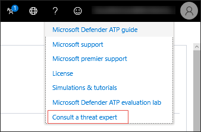

# Microsoft 위협 전문가 기능 구성 및 관리Configure and manage Microsoft Threat Experts capabilities

[!INCLUDE [Microsoft 365 Defender rebranding](../../includes/microsoft-defender.md)]

**적용 대상:****Applies to:**
- [엔드포인트용 Microsoft DefenderMicrosoft Defender for Endpoint](https://go.microsoft.com/fwlink/p/?linkid=2154037)
- [Microsoft 365 DefenderMicrosoft 365 Defender](https://go.microsoft.com/fwlink/?linkid=2118804)

>Endpoint용 Defender를 경험하고 싶나요?Want to experience Defender for Endpoint? [무료 평가판에 등록합니다.Sign up for a free trial.](https://www.microsoft.com/microsoft-365/windows/microsoft-defender-atp?ocid=docs-wdatp-assignaccess-abovefoldlink)

## 시작하기 전에Before you begin 
> [!NOTE]
> Microsoft 위협 전문가 - 대상 공격 알림 관리 위협 헌팅 서비스에 적용하기 전에 Microsoft 기술 서비스 공급자 및 계정 팀과 자격 요구 사항을 논의합니다.Discuss the eligibility requirements with your Microsoft Technical Service provider and account team before you apply to Microsoft Threat Experts - Targeted Attack Notification managed threat hunting service.

실험실 설정이 아니라 장치가 등록된 환경에 Endpoint용 Defender를 배포해야 합니다.Ensure that you have Defender for Endpoint deployed in your environment with devices enrolled, and not just on a laboratory set-up.

Endpoint 고객용 Defender인 경우 Microsoft 위협 전문가 **-** 대상 지정 공격 알림을 신청하여 가장 중요한 위협을 식별할 수 있도록 특별 인사이트 및 분석을 통해 신속하게 대응할 수 있습니다.If you're a Defender for Endpoint customer, you need to apply for **Microsoft Threat Experts - Targeted Attack Notifications** to get special insights and analysis to help identify the most critical threats, so you can respond to them quickly. 계정 팀 또는 Microsoft 담당자에게 문의하여 Microsoft 위협 전문가 **-** 요구 시 전문가에게 문의하여 위협 전문가에게 관련 탐지 및 가해자에 대한 자문을 구하세요.Contact your account team or Microsoft representative to subscribe to **Microsoft Threat Experts - Experts on Demand** to consult with our threat experts on relevant detections and adversaries.

## 대상 Microsoft 위협 전문가 - 대상 공격 알림 서비스Apply for Microsoft Threat Experts - Targeted Attack Notifications service 
이미 Endpoint용 Defender 고객인 경우 다음을 통해 Microsoft Defender 보안 센터.If you're already a Defender for Endpoint customer, you can apply through the Microsoft Defender Security Center. 

1. 탐색 창에서 일반 설정 > 고급 > - > Microsoft 위협 전문가 **알림으로 이동합니다.**From the navigation pane, go to **Settings > General > Advanced features > Microsoft Threat Experts - Targeted Attack Notifications**.

2. **적용** 을 클릭합니다.Click **Apply**.

    

3. Microsoft에서 응용 프로그램에서 다시 연락할 수 있도록 이름과 전자 메일 주소를 입력합니다.Enter your name and email address so that Microsoft can get back to you on your application.

    

4. 개인 정보 [취급 방침을 읽은](https://privacy.microsoft.com/en-us/privacystatement)다음 완료되면 **제출을** 클릭합니다.Read the [privacy statement](https://privacy.microsoft.com/en-us/privacystatement), then click **Submit** when you're done. 응용 프로그램이 승인되면 환영 전자 메일을 받게 됩니다.You will receive a welcome email once your application is approved.

    

수락하면 환영 전자 메일이 표시되면  적용 단추가 "설정" 토글로 변경되는 것을 볼 수 있습니다.When accepted, you will receive a welcome email and you will see the **Apply** button change to a toggle that is “on”. 대상 공격 알림 서비스에서 자신을 꺼내려면 토글 "꺼진" 토글을  밀어 페이지 아래쪽의 기본 설정 저장을 클릭합니다.In case you want to take yourself out of the Targeted Attack Notifications service, slide the toggle “off” and click **Save preferences** at the bottom of the page. 

## 대상이 지정한 공격 알림을 볼 수 있는 위치는 Microsoft 위협 전문가Where you'll see the targeted attack notifications from Microsoft Threat Experts 
다음 중간을 통해 Microsoft 위협 전문가 대상 공격 알림을 받을 수 있습니다.You can receive targeted attack notification from Microsoft Threat Experts through the following medium:  
- Endpoint 포털의 인시던트에 대한 **Defender** 페이지The Defender for Endpoint portal's **Incidents** page 
- Endpoint 포털의 경고 대시보드에 대한 **Defender**The Defender for Endpoint portal's **Alerts** dashboard  
- OData 경고 [API 및](/windows/security/threat-protection/microsoft-defender-atp/get-alerts) REST [API](/windows/security/threat-protection/microsoft-defender-atp/pull-alerts-using-rest-api)OData alerting [API](/windows/security/threat-protection/microsoft-defender-atp/get-alerts) and [REST API](/windows/security/threat-protection/microsoft-defender-atp/pull-alerts-using-rest-api)
- [고급 헌팅의 DeviceAlertEvents](/windows/security/threat-protection/microsoft-defender-atp/advanced-hunting-devicealertevents-table) 테이블[DeviceAlertEvents](/windows/security/threat-protection/microsoft-defender-atp/advanced-hunting-devicealertevents-table) table in Advanced hunting
- 전자 메일 구성을 선택한 경우Your email, if you choose to configure it 

전자 메일을 통해 대상 공격 알림을 받으면 전자 메일 알림 규칙을 생성합니다.To receive targeted attack notifications through email, create an email notification rule.

### 전자 메일 알림 규칙 만들기Create an email notification rule 
알림 받는 사람에 대한 전자 메일 알림을 보내는 규칙을 만들 수 있습니다.You can create rules to send email notifications for notification recipients. 자세한  [내용은 전자](configure-email-notifications.md) 메일 알림을 생성, 편집, 삭제 또는 문제 해결하도록 알림 알림 구성을 참조하세요.See  [Configure alert notifications](configure-email-notifications.md) to create, edit, delete, or troubleshoot email notification, for details.

## 대상 공격 알림 보기View the targeted attack notification  
전자 메일 알림을 받도록 시스템을 구성한 후 Microsoft 위협 전문가 대상 공격 알림 수신을 시작할 것입니다.You'll start receiving targeted attack notification from Microsoft Threat Experts in your email after you have configured your system to receive email notification.  

1. 전자 메일의 링크를 클릭하여 위협 전문가로 태그가 지정된 대시보드의 해당 경고 컨텍스트로 **이동하세요.**Click the link in the email to go to the corresponding alert context in the dashboard tagged with **Threat experts**. 

2. 대시보드에서 전자 메일에서 확인한 동일한 경고 항목을 선택하여 세부 정보를 볼 수 있습니다.From the dashboard, select the same alert topic that you got from the email, to view the details.  

## 구독 - Microsoft 위협 전문가 전문가Subscribe to Microsoft Threat Experts - Experts on Demand
이 서비스는 구독 서비스로 사용할 수 있습니다.This is available as a subscription service. 이미 Endpoint용 Defender 고객인 경우 Microsoft 담당자에게 문의하여 Microsoft 위협 전문가 - 전문가에게 문의할 수 있습니다.If you're already a Defender for Endpoint customer, you can contact your Microsoft representative to subscribe to Microsoft Threat Experts - Experts on Demand. 

## 조직의 의심스러운 사이버 보안 활동에 대한 Microsoft 위협 전문가에게 문의Consult a Microsoft threat expert about suspicious cybersecurity activities in your organization 
적시에 정확한 응답을 Microsoft 위협 전문가 내에서 직접 참여할 수 있는 Microsoft Defender 보안 센터 파트너와 파트너가 될 수 있습니다.You can partner with Microsoft Threat Experts who can be engaged directly from within the Microsoft Defender Security Center for timely and accurate response. 전문가는 복잡한 위협, 사용자가 수신하는 대상이 지정되는 공격 알림을 더 잘 이해하거나, 알림, 잠재적으로 손상된 장치 또는 포털 대시보드에 표시될 위협 인텔리전스 컨텍스트에 대한 추가 정보가 필요한 경우를 보다 잘 이해할 수 있는 인사이트를 제공합니다.Experts provide insights to better understand complex threats, targeted attack notifications that you get, or if you need more information about the alerts, a potentially compromised device, or a threat intelligence context that you see on your portal dashboard. 

> [!NOTE]
> - 조직의 사용자 지정된 위협 인텔리전스 데이터와 관련된 경고 문의는 현재 지원되지 않습니다.Alert inquiries related to your organization's customized threat intelligence data are currently not supported. 자세한 내용은 보안 운영 또는 인시던트 대응 팀에 문의합니다.Consult your security operations or incident response team for details.
> - 보안 센터 포털에서 보안 설정 관리 권한이 있는 경우 "위협 전문가에게 문의" 요청을 제출할 수 있습니다. You need to have the **Manage security settings** permission in the Security Center portal to be able to submit a "Consult a threat expert" inquiry.

1. 조사할 관련 정보(예: 인시던트 페이지)를 사용하여 포털 **페이지로** 이동합니다.Navigate to the portal page with the relevant information that you'd like to investigate, for example, the **Incident** page. 조사 요청을 보내기 전에 관련 경고 또는 장치에 대한 페이지가 보기에 표시되도록 합니다.Ensure that the page for the relevant alert or device is in view before you send an investigation request. 

2. 오른쪽 위 메뉴에서 **?**From the upper right-hand menu, click the **?** 아이콘을 선택합니다.icon. 그런 다음 위협 **전문가에게 문의를 선택합니다.**Then, select **Consult a threat expert**. 

    

    플라이아웃 화면이 열립니다.A flyout screen opens. 다음 화면은 평가판 구독을 사용 중일 때 표시됩니다.The following screen shows when you are on a trial subscription.

    

    다음 화면에는 전체 구독 - 전문가 Microsoft 위협 전문가 구독이 표시됩니다.The following screen shows when you are on a full Microsoft Threat Experts - Experts on-Demand subscription.

    

    문의 **항목 필드에는** 조사 요청에 대한 관련 페이지에 대한 링크가 미리 채워진 것입니다.The **Inquiry topic** field is pre-populated with the link to the relevant page for your investigation request. 예를 들어 요청을 할 때 확인한 인시던트, 경고 또는 장치 세부 정보 페이지에 대한 링크입니다.For example, a link to the incident, alert, or device details page that you were at when you made the request.

3.  다음 필드에서 조사를 시작할 수 있는 Microsoft 위협 전문가 충분한 정보를 제공합니다.In the next field, provide enough information to give the Microsoft Threat Experts enough context to start the investigation.
  
4. 전자 메일 주소와 대응하는 데 사용할 전자 메일 주소를 Microsoft 위협 전문가.Enter the email address that you'd like to use to correspond with Microsoft Threat Experts.

> [!NOTE]
> Microsoft 서비스 허브를 통해 전문가 관련 사례의 상태를 추적하려면 기술 계정 관리자에게 문의하세요.If you would like to track the status of your Experts on Demand cases through Microsoft Services Hub, reach out to your Technical Account Manager. 

이 비디오를 시청하여 Microsoft 서비스 허브에 대한 간략한 개요를 확인할 수 있습니다.Watch this video for a quick overview of the Microsoft Services Hub.

>[!VIDEO https://www.microsoft.com/videoplayer/embed/RE4pk9f] 

   
## 전문가 - 요구 시 전문가와 Microsoft 위협 전문가 수 있는 샘플 조사 항목Sample investigation topics that you can consult with Microsoft Threat Experts - Experts on Demand 

**경고 정보****Alert information**
- 이진수 이진에 대한 새로운 유형의 경고가 표시됩니다. [AlertID].We see a new type of alert for a living-off-the-land binary: [AlertID]. 이 경고와 추가 조사 방법과 관련한 자세한 정보를 알려 주시겠습니까?Can you tell us something more about this alert and how we can investigate further?
- 악성 PowerShell 스크립트를 실행하려고 하지만 다른 경고를 생성하는 두 가지 유사한 공격을 관찰했습니다.We’ve observed two similar attacks, which try to execute malicious PowerShell scripts but generate different alerts. 하나는 "의심스러운 PowerShell 명령줄"이고 다른 하나는 "O365에서 제공한 표시에 따라 악성 파일이 검색되었습니다."입니다.One is "Suspicious PowerShell command line" and the other is "A malicious file was detected based on indication provided by O365". 차이점은 무엇입니까?What is the difference?
- 오늘은 프로필이 높은 사용자의 장치에서 비정상적인 로그인 실패 수에 대한 이상한 경고가 표시됩니다.I receive an odd alert today for abnormal number of failed logins from a high profile user’s device. 이러한 로그인 시도에 대한 추가 증거를 찾을 수 없습니다.I cannot find any further evidence around these sign-in attempts. Endpoint용 Defender는 이러한 시도를 어떻게 볼 수 있나요?How can Defender for Endpoint see these attempts? 어떤 유형의 로그인을 모니터링하나요?What type of sign-ins are being monitored?
- "시스템 유틸리티의 의심스러운 동작이 관찰되었습니다."라는 경고에 대한 더 많은 컨텍스트 또는 정보를 얻을 수 있습니다.Can you give more context or insights about this alert: “Suspicious behavior by a system utility was observed”. 

**가능한 컴퓨터 손상****Possible machine compromise**
- "알 수 없는 프로세스가 관찰되었습니다."가 관찰되는 이유에 대한 답변을 도울 수 있습니다.Can you help answer why we see “Unknown process observed?” 이 메시지 또는 경고는 많은 장치에서 자주 표시됩니다.This message or alert is seen frequently on many devices. 이 메시지 또는 경고가 악의적인 활동과 관련이 있는지를 명확히 하여 감사드립니다.We appreciate any input to clarify whether this message or alert is related to malicious activity.
- [월]에 동일한 시스템에서 이전 [맬웨어 이름] 맬웨어 검색과 유사한 동작으로 [날짜]에 다음 시스템에서 가능한 손상의 유효성을 검사할 수 있나요?Can you help validate a possible compromise on the following system on [date] with similar behaviors as the previous [malware name] malware detection on the same system in [month]?

**위협 인텔리전스 세부 정보****Threat intelligence details**
- 사용자에게 악성 Word 문서를 전달하는 피싱 전자 메일을 검색했습니다.We detected a phishing email that delivered a malicious Word document to a user. 악성 Word 문서에서 일련의 의심스러운 이벤트가 발생하여 [맬웨어 이름] 맬웨어에 대한 여러 Microsoft Defender 경고가 트리거되었습니다.The malicious Word document caused a series of suspicious events, which triggered multiple Microsoft Defender alerts for [malware name] malware. 이 맬웨어에 대한 정보가 있나요?Do you have any information on this malware? 그렇다면 링크를 보낼 수 있나요?If yes, can you send me a link?
- 최근에 산업을 대상으로 하는 위협에 대한 [소셜 미디어 참조, 예: Twitter 또는 블로그] 게시물을 보했습니다.I recently saw a [social media reference, for example, Twitter or blog] post about a threat that is targeting my industry. 이 위협 요소에 대해 끝점용 보호 Defender가 제공하는 보호 기능을 이해하는 데 도움이 될 수 있나요?Can you help me understand what protection Defender for Endpoint provides against this threat actor? 

**Microsoft 위협 전문가 알림 통신****Microsoft Threat Experts’ alert communications** 
- 인시던트 대응 팀이 수신한 대상 공격 알림을 해결할 수 있나요?Can your incident response team help us address the targeted attack notification that we got?
- I received this targeted attack notification from Microsoft 위협 전문가.I received this targeted attack notification from Microsoft Threat Experts. 자체 인시던트 대응 팀이 없습니다.We don’t have our own incident response team. 지금 할 수 있는 일과 인시던트가 어떻게 포함될 수 있나요?What can we do now, and how can we contain the incident?
- I received a targeted attack notification from Microsoft 위협 전문가.I received a targeted attack notification from Microsoft Threat Experts. 인시던트 대응 팀에 전달할 수 있는 어떤 데이터를 제공할 수 있나요?What data can you provide to us that we can pass on to our incident response team?

  >[!NOTE]
  >Microsoft 위협 전문가 서비스는 인시던트 대응 서비스가 아니라 관리되는 사이버 보안 헌팅 서비스입니다.Microsoft Threat Experts is a managed cybersecurity hunting service and not an incident response service. 그러나 전문가는 필요한 경우 조사를 Microsoft CSG(Cybersecurity Solutions Group)의 DART(검색 및 대응 팀) 서비스로 원활하게 전환할 수 있습니다.However, the experts can seamlessly transition the investigation to Microsoft Cybersecurity Solutions Group (CSG)'s  Detection and Response Team (DART) services, when necessary. 인시던트 대응이 필요한 문제를 해결하기 위해 자체 인시던트 대응 팀에 참여할 수도 있습니다.You can also opt to engage with your own incident response team to address issues that requires an incident response. 

## 시나리오Scenario

### 관리되는 헌팅 문의에 대한 진행률 보고서 받기Receive a progress report about your managed hunting inquiry 
응답은 Microsoft 위협 전문가 따라 다릅니다.Response from Microsoft Threat Experts varies according to your inquiry. 2일 이내에 위협 전문가  문의에 대한 진행 상황 보고서를 전자 메일로 보내 다음 범주의 조사 상태를 전달합니다.They will email a progress report to you about your **Consult a threat expert** inquiry within two days, to communicate the investigation status from the following categories: 
- 조사를 계속하려면 추가 정보가 필요합니다.More information is needed to continue with the investigation 
- 기술 컨텍스트를 확인하려면 파일 또는 여러 파일 샘플이 필요합니다.A file or several file samples are needed to determine the technical context 
- 조사에 더 많은 시간이 필요합니다.Investigation requires more time   
- 초기 정보가 조사를 이행하기에 충분했습니다.Initial information was enough to conclude the investigation 

조사를 계속 진행하기 위해 신속하게 대응하는 것이 중요합니다.It is crucial to respond in quickly to keep the investigation moving. 

## 관련 항목Related topic
- [Microsoft 위협 전문가 개요Microsoft Threat Experts overview](microsoft-threat-experts.md)
- [Microsoft 위협 전문가 개요의 Microsoft 365 참조Microsoft Threat Experts in Microsoft 365 Overview](/microsoft-365/security/mtp/microsoft-threat-experts)
