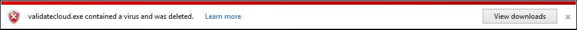
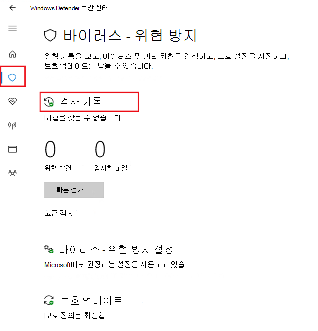

# <a name="configure-and-validate-microsoft-defender-antivirus-network-connections"></a><span data-ttu-id="20835-104">Microsoft Defender 바이러스 백신 네트워크 연결 구성 및 유효성 검사</span><span class="sxs-lookup"><span data-stu-id="20835-104">Configure and validate Microsoft Defender Antivirus network connections</span></span>

[!INCLUDE [Microsoft 365 Defender rebranding](../../includes/microsoft-defender.md)]


<span data-ttu-id="20835-105">**적용 대상:**</span><span class="sxs-lookup"><span data-stu-id="20835-105">**Applies to:**</span></span>

- [<span data-ttu-id="20835-106">엔드포인트용 Microsoft Defender</span><span class="sxs-lookup"><span data-stu-id="20835-106">Microsoft Defender for Endpoint</span></span>](/microsoft-365/security/defender-endpoint/)

<span data-ttu-id="20835-107">클라우드 제공 Microsoft Defender 바이러스 백신 제대로 작동하려면 끝점과 특정 Microsoft 서버 간의 연결을 허용하도록 네트워크를 구성해야 합니다.</span><span class="sxs-lookup"><span data-stu-id="20835-107">To ensure Microsoft Defender Antivirus cloud-delivered protection works properly, you need to configure your network to allow connections between your endpoints and certain Microsoft servers.</span></span> <span data-ttu-id="20835-108">이 문서에서는 방화벽 규칙을 사용하는 등 허용해야 하는 연결을 나열하고 연결 유효성을 검사하기 위한 지침을 제공합니다.</span><span class="sxs-lookup"><span data-stu-id="20835-108">This article lists the connections that must be allowed, such as by using firewall rules, and provides instructions for validating your connection.</span></span> <span data-ttu-id="20835-109">보호를 올바르게 구성하면 클라우드 제공 보호 서비스에서 최고의 가치를 받을 수 있습니다.</span><span class="sxs-lookup"><span data-stu-id="20835-109">Configuring your protection properly helps ensure that you receive the best value from your cloud-delivered protection services.</span></span>

<span data-ttu-id="20835-110">네트워크 연결에 대한 자세한 내용은 블로그 게시물 [Microsoft Active Protection Services](https://techcommunity.microsoft.com/t5/Configuration-Manager-Archive/Important-changes-to-Microsoft-Active-Protection-Service-MAPS/ba-p/274006) 끝점에 대한 중요한 변경 사항을 참조하세요.</span><span class="sxs-lookup"><span data-stu-id="20835-110">See the blog post [Important changes to Microsoft Active Protection Services endpoint](https://techcommunity.microsoft.com/t5/Configuration-Manager-Archive/Important-changes-to-Microsoft-Active-Protection-Service-MAPS/ba-p/274006) for some details about network connectivity.</span></span>

> [!TIP]
> <span data-ttu-id="20835-111">Microsoft Defender for Endpoint 데모 웹 [사이트를](https://demo.wd.microsoft.com?ocid=cx-wddocs-testground) 방문하여 demo.wd.microsoft.com 작동을 확인할 수 있습니다.</span><span class="sxs-lookup"><span data-stu-id="20835-111">You can also visit the Microsoft Defender for Endpoint demo website at [demo.wd.microsoft.com](https://demo.wd.microsoft.com?ocid=cx-wddocs-testground) to confirm the following features are working:</span></span>
>
> - <span data-ttu-id="20835-112">클라우드 제공 보호</span><span class="sxs-lookup"><span data-stu-id="20835-112">Cloud-delivered protection</span></span>
> - <span data-ttu-id="20835-113">빠른 학습(차단 시 차단 포함)</span><span class="sxs-lookup"><span data-stu-id="20835-113">Fast learning (including block at first sight)</span></span>
> - <span data-ttu-id="20835-114">잠재적으로 원치 않는 응용 프로그램 차단</span><span class="sxs-lookup"><span data-stu-id="20835-114">Potentially unwanted application blocking</span></span>

## <a name="allow-connections-to-the-microsoft-defender-antivirus-cloud-service"></a><span data-ttu-id="20835-115">클라우드 서비스에 대한 Microsoft Defender 바이러스 백신 허용</span><span class="sxs-lookup"><span data-stu-id="20835-115">Allow connections to the Microsoft Defender Antivirus cloud service</span></span>

<span data-ttu-id="20835-116">이 Microsoft Defender 바이러스 백신 클라우드 서비스는 끝점을 빠르고 강력하게 보호합니다.</span><span class="sxs-lookup"><span data-stu-id="20835-116">The Microsoft Defender Antivirus cloud service provides fast, strong protection for your endpoints.</span></span> <span data-ttu-id="20835-117">클라우드 제공 보호 서비스를 사용하도록 설정하는 것은 선택 사항이지만 끝점 및 네트워크 전체에서 맬웨어에 대한 중요한 보호 기능을 제공하기 때문에 이 서비스를 사용하도록 설정하는 것이 좋습니다.</span><span class="sxs-lookup"><span data-stu-id="20835-117">Enabling the cloud-delivered protection service is optional, however it's highly recommended because it provides important protection against malware on your endpoints and across your network.</span></span>

> [!NOTE]
> <span data-ttu-id="20835-118">Microsoft Defender 바이러스 백신 클라우드 서비스는 네트워크 및 끝점에 업데이트된 보호를 제공하는 메커니즘입니다.</span><span class="sxs-lookup"><span data-stu-id="20835-118">The Microsoft Defender Antivirus cloud service is a mechanism for delivering updated protection to your network and endpoints.</span></span> <span data-ttu-id="20835-119">클라우드 서비스라고 하지만 단순히 클라우드에 저장된 파일을 보호하는 것이 아니라 분산 리소스와 기계 학습을 사용하여 기존 보안 인텔리전스 업데이트보다 훨씬 빠른 속도로 끝점에 보호 기능을 제공합니다.</span><span class="sxs-lookup"><span data-stu-id="20835-119">Although it's called a cloud service, it's not simply protection for files stored in the cloud, rather it uses distributed resources and machine learning to deliver protection to your endpoints at a rate that is far faster than traditional Security intelligence updates.</span></span>

<span data-ttu-id="20835-120">Intune, Microsoft Endpoint Configuration Manager, 그룹 정책, PowerShell cmdlet 또는 Windows 보안 앱에서 서비스를 사용하도록 설정하는 데 대한 자세한 내용은 클라우드 제공 보호 사용을 참조하세요. [](enable-cloud-protection-microsoft-defender-antivirus.md)</span><span class="sxs-lookup"><span data-stu-id="20835-120">See [Enable cloud-delivered protection](enable-cloud-protection-microsoft-defender-antivirus.md) for details on enabling the service with Intune, Microsoft Endpoint Configuration Manager, Group Policy, PowerShell cmdlets, or on individual clients in the Windows Security app.</span></span> 

<span data-ttu-id="20835-121">서비스를 사용하도록 설정한 후 네트워크 또는 방화벽과 끝점 간의 연결을 허용하도록 구성해야 할 수 있습니다.</span><span class="sxs-lookup"><span data-stu-id="20835-121">After you've enabled the service, you may need to configure your network or firewall to allow connections between it and your endpoints.</span></span>

<span data-ttu-id="20835-122">보호는 클라우드 서비스이기 때문에 Office 365 컴퓨터는 인터넷에 액세스할 수 있어야 합니다.</span><span class="sxs-lookup"><span data-stu-id="20835-122">Because your protection is a cloud service, computers must have access to the internet and reach the Microsoft Defender for Office 365 machine learning services.</span></span> <span data-ttu-id="20835-123">모든 종류의 네트워크 검사에서 URL을 `*.blob.core.windows.net` 제외하지 않습니다.</span><span class="sxs-lookup"><span data-stu-id="20835-123">Don't exclude the URL `*.blob.core.windows.net` from any kind of network inspection.</span></span> 

<span data-ttu-id="20835-124">아래 표에는 서비스 및 해당 관련 URL이 나열됩니다.</span><span class="sxs-lookup"><span data-stu-id="20835-124">The table below lists the services and their associated URLs.</span></span> <span data-ttu-id="20835-125">이러한 URL에 대한 액세스를 거부하는 방화벽 또는 네트워크 필터링 규칙이 없는지 확인하거나 해당 URL에 대해 특별히 허용 규칙을 만들어야 할 수 있습니다(URL `*.blob.core.windows.net` 제외).</span><span class="sxs-lookup"><span data-stu-id="20835-125">Make sure that there are no firewall or network filtering rules denying access to these URLs, or you may need to create an allow rule specifically for them (excluding the URL `*.blob.core.windows.net`).</span></span> <span data-ttu-id="20835-126">아래 언급 URL은 통신에 포트 443을 사용하고 있습니다.</span><span class="sxs-lookup"><span data-stu-id="20835-126">Below mention URLs are using port 443 for communication.</span></span>


| <span data-ttu-id="20835-127">**서비스**</span><span class="sxs-lookup"><span data-stu-id="20835-127">**Service**</span></span>| <span data-ttu-id="20835-128">**설명**</span><span class="sxs-lookup"><span data-stu-id="20835-128">**Description**</span></span> |<span data-ttu-id="20835-129">**URL**</span><span class="sxs-lookup"><span data-stu-id="20835-129">**URL**</span></span> |
| :--: | :-- | :-- |
| <span data-ttu-id="20835-130">Microsoft Defender 바이러스 백신(MAPS)라고도 하는 Microsoft 활성 보호 서비스 보호 서비스입니다.</span><span class="sxs-lookup"><span data-stu-id="20835-130">Microsoft Defender Antivirus cloud-delivered protection service, also referred to as Microsoft Active Protection Service (MAPS)</span></span>|<span data-ttu-id="20835-131">클라우드 제공 Microsoft Defender 바이러스 백신 제공하는 데 사용됩니다.</span><span class="sxs-lookup"><span data-stu-id="20835-131">Used by Microsoft Defender Antivirus to provide cloud-delivered protection</span></span>|`*.wdcp.microsoft.com` <br/> `*.wdcpalt.microsoft.com` <br/> `*.wd.microsoft.com`|
| <span data-ttu-id="20835-132">MICROSOFT 업데이트 서비스(MU)</span><span class="sxs-lookup"><span data-stu-id="20835-132">Microsoft Update Service (MU)</span></span> <br/> <span data-ttu-id="20835-133">Windows WU(업데이트 서비스)</span><span class="sxs-lookup"><span data-stu-id="20835-133">Windows Update Service (WU)</span></span>|  <span data-ttu-id="20835-134">보안 인텔리전스 및 제품 업데이트</span><span class="sxs-lookup"><span data-stu-id="20835-134">Security intelligence and product updates</span></span>   |`*.update.microsoft.com` <br/> `*.delivery.mp.microsoft.com`<br/> `*.windowsupdate.com` <br/><br/> <span data-ttu-id="20835-135">자세한 내용은 Connection [endpoints for Windows 참조](/windows/privacy/manage-windows-1709-endpoints#windows-update)</span><span class="sxs-lookup"><span data-stu-id="20835-135">For details see [Connection endpoints for Windows Update](/windows/privacy/manage-windows-1709-endpoints#windows-update)</span></span>|
|<span data-ttu-id="20835-136">보안 인텔리전스 업데이트 ADL(대체 다운로드 위치)</span><span class="sxs-lookup"><span data-stu-id="20835-136">Security intelligence updates Alternate Download Location (ADL)</span></span>|   <span data-ttu-id="20835-137">설치된 보안 인텔리전스가 Microsoft Defender 바이러스 백신 업데이트되지 않은 경우 보안 인텔리전스 업데이트의 대체 위치(7일 이상 후)</span><span class="sxs-lookup"><span data-stu-id="20835-137">Alternate location for Microsoft Defender Antivirus Security intelligence updates if the installed Security intelligence is out of date (7 or more days behind)</span></span>|    `*.download.microsoft.com`  </br> `*.download.windowsupdate.com`</br>  `go.microsoft.com`</br> `https://fe3cr.delivery.mp.microsoft.com/ClientWebService/client.asmx`|
| <span data-ttu-id="20835-138">맬웨어 제출 저장소</span><span class="sxs-lookup"><span data-stu-id="20835-138">Malware submission storage</span></span>|<span data-ttu-id="20835-139">업로드 양식 또는 자동 샘플 제출을 통해 Microsoft에 제출된 파일의 위치</span><span class="sxs-lookup"><span data-stu-id="20835-139">Upload location for files submitted to Microsoft via the Submission form or automatic sample submission</span></span>    | `ussus1eastprod.blob.core.windows.net` <br/>    `ussus2eastprod.blob.core.windows.net` <br/>    `ussus3eastprod.blob.core.windows.net` <br/>    `ussus4eastprod.blob.core.windows.net` <br/>    `wsus1eastprod.blob.core.windows.net` <br/>    `wsus2eastprod.blob.core.windows.net` <br/>    `ussus1westprod.blob.core.windows.net` <br/>    `ussus2westprod.blob.core.windows.net` <br/>    `ussus3westprod.blob.core.windows.net` <br/>    `ussus4westprod.blob.core.windows.net` <br/>    `wsus1westprod.blob.core.windows.net` <br/>    `wsus2westprod.blob.core.windows.net` <br/>    `usseu1northprod.blob.core.windows.net` <br/>    `wseu1northprod.blob.core.windows.net` <br/>    `usseu1westprod.blob.core.windows.net` <br/>    `wseu1westprod.blob.core.windows.net` <br/>    `ussuk1southprod.blob.core.windows.net` <br/>    `wsuk1southprod.blob.core.windows.net` <br/>    `ussuk1westprod.blob.core.windows.net` <br/>    `wsuk1westprod.blob.core.windows.net` |
| <span data-ttu-id="20835-140">CRL(인증서 해지 목록)</span><span class="sxs-lookup"><span data-stu-id="20835-140">Certificate Revocation List (CRL)</span></span>|<span data-ttu-id="20835-141">CRL을 Windows MAPS에 대한 SSL 연결을 만들 때 사용할 수 있습니다.</span><span class="sxs-lookup"><span data-stu-id="20835-141">Used by Windows when creating the SSL connection to MAPS for updating the CRL</span></span>   | `http://www.microsoft.com/pkiops/crl/` <br/> `http://www.microsoft.com/pkiops/certs` <br/>   `http://crl.microsoft.com/pki/crl/products` <br/> `http://www.microsoft.com/pki/certs` |
| <span data-ttu-id="20835-142">기호 저장소</span><span class="sxs-lookup"><span data-stu-id="20835-142">Symbol Store</span></span>|<span data-ttu-id="20835-143">수정 흐름 Microsoft Defender 바이러스 백신 중요한 특정 파일을 복원하는 데 사용됩니다.</span><span class="sxs-lookup"><span data-stu-id="20835-143">Used by Microsoft Defender Antivirus to restore certain critical files during remediation flows</span></span>  | `https://msdl.microsoft.com/download/symbols` |
| <span data-ttu-id="20835-144">유니버설 원격 분석 클라이언트</span><span class="sxs-lookup"><span data-stu-id="20835-144">Universal Telemetry Client</span></span>| <span data-ttu-id="20835-145">클라이언트 Windows 데이터를 전송하는 데 사용됩니다. Microsoft Defender 바이러스 백신 품질 모니터링을 위해 원격 분석 사용</span><span class="sxs-lookup"><span data-stu-id="20835-145">Used by Windows to send client diagnostic data; Microsoft Defender Antivirus uses telemetry for product quality monitoring purposes</span></span>   | <span data-ttu-id="20835-146">이 업데이트는 SSL(TCP 포트 443)을 사용하여 매니페스트를 다운로드하고 다음 DNS 끝점을 사용하는 진단 데이터를 Microsoft에 업로드합니다.   `vortex-win.data.microsoft.com`</span><span class="sxs-lookup"><span data-stu-id="20835-146">The update uses SSL (TCP Port 443) to download manifests and upload diagnostic data to Microsoft that uses the following DNS endpoints:   `vortex-win.data.microsoft.com`</span></span> <br/>   `settings-win.data.microsoft.com`|

## <a name="validate-connections-between-your-network-and-the-cloud"></a><span data-ttu-id="20835-147">네트워크와 클라우드 간의 연결 유효성 검사</span><span class="sxs-lookup"><span data-stu-id="20835-147">Validate connections between your network and the cloud</span></span>

<span data-ttu-id="20835-148">위에 나열된 URL을 허용한 후 Microsoft Defender 바이러스 백신 클라우드 서비스에 연결되어 있으며 정보를 올바르게 보고하고 수신하고 있는지 테스트하여 완전히 보호할 수 있습니다.</span><span class="sxs-lookup"><span data-stu-id="20835-148">After allowing the URLs listed above, you can test if you're connected to the Microsoft Defender Antivirus cloud service and are correctly reporting and receiving information to ensure you're fully protected.</span></span>

<span data-ttu-id="20835-149">**cmdline 도구를 사용하여 클라우드 제공 보호의 유효성을 검사합니다.**</span><span class="sxs-lookup"><span data-stu-id="20835-149">**Use the cmdline tool to validate cloud-delivered protection:**</span></span>

<span data-ttu-id="20835-150">Microsoft Defender 바이러스 백신 명령줄 유틸리티( )와 함께 다음 인수를 사용하여 네트워크가 Microsoft Defender 바이러스 백신 `mpcmdrun.exe` 통신할 수 있는지 확인합니다.</span><span class="sxs-lookup"><span data-stu-id="20835-150">Use the following argument with the Microsoft Defender Antivirus command-line utility (`mpcmdrun.exe`) to verify that your network can communicate with the Microsoft Defender Antivirus cloud service:</span></span>

```console
"%ProgramFiles%\Windows Defender\MpCmdRun.exe" -ValidateMapsConnection
```

> [!NOTE]
> <span data-ttu-id="20835-151">명령 프롬프트의 관리자 수준 버전을 열 필요가 있습니다.</span><span class="sxs-lookup"><span data-stu-id="20835-151">You need to open an administrator-level version of the command prompt.</span></span> <span data-ttu-id="20835-152">시작 메뉴에서 항목을 마우스 오른쪽  단추로 클릭하고 관리자 권한으로 실행을 클릭한 다음 사용 권한 프롬프트에서 **예를** 클릭합니다.</span><span class="sxs-lookup"><span data-stu-id="20835-152">Right-click the item in the Start menu, click **Run as administrator** and click **Yes** at the permissions prompt.</span></span> <span data-ttu-id="20835-153">이 명령은 버전 Windows 10 버전 1703 이상에서만 사용할 수 있습니다.</span><span class="sxs-lookup"><span data-stu-id="20835-153">This command will only work on Windows 10, version 1703 or higher.</span></span>

<span data-ttu-id="20835-154">자세한 내용은 명령줄 Microsoft Defender 바이러스 백신 사용하여 mpcmdrun.exe [관리를 참조하세요.](command-line-arguments-microsoft-defender-antivirus.md)</span><span class="sxs-lookup"><span data-stu-id="20835-154">For more information, see [Manage Microsoft Defender Antivirus with the mpcmdrun.exe commandline tool](command-line-arguments-microsoft-defender-antivirus.md).</span></span>

<span data-ttu-id="20835-155">**Microsoft에서 위조된 맬웨어 파일을 다운로드하려고 시도합니다.**</span><span class="sxs-lookup"><span data-stu-id="20835-155">**Attempt to download a fake malware file from Microsoft:**</span></span>

<span data-ttu-id="20835-156">클라우드에 제대로 연결되어 있는 경우 Microsoft Defender 바이러스 백신 감지하고 차단하는 샘플 파일을 다운로드할 수 있습니다.</span><span class="sxs-lookup"><span data-stu-id="20835-156">You can download a sample file that Microsoft Defender Antivirus will detect and block if you're properly connected to the cloud.</span></span>

<span data-ttu-id="20835-157">를 방문하여 파일을 [https://aka.ms/ioavtest](https://aka.ms/ioavtest) 다운로드합니다.</span><span class="sxs-lookup"><span data-stu-id="20835-157">Download the file by visiting [https://aka.ms/ioavtest](https://aka.ms/ioavtest).</span></span>

> [!NOTE]
> <span data-ttu-id="20835-158">이 파일은 실제 맬웨어 조각이 아니기 때문에</span><span class="sxs-lookup"><span data-stu-id="20835-158">This file is not an actual piece of malware.</span></span> <span data-ttu-id="20835-159">클라우드에 제대로 연결되어 있는지 테스트하도록 설계된 위조 파일입니다.</span><span class="sxs-lookup"><span data-stu-id="20835-159">It's a fake file that is designed to test if you're properly connected to the cloud.</span></span>

<span data-ttu-id="20835-160">제대로 연결된 경우 알림에 대한 Microsoft Defender 바이러스 백신 표시됩니다.</span><span class="sxs-lookup"><span data-stu-id="20835-160">If you're properly connected, you'll see a warning Microsoft Defender Antivirus notification.</span></span>

<span data-ttu-id="20835-161">사용자 Microsoft Edge 알림 메시지도 표시됩니다.</span><span class="sxs-lookup"><span data-stu-id="20835-161">If you're using Microsoft Edge, you'll also see a notification message:</span></span>


<span data-ttu-id="20835-163">다음을 사용하는 경우 유사한 메시지가 Internet Explorer.</span><span class="sxs-lookup"><span data-stu-id="20835-163">A similar message occurs if you're using Internet Explorer:</span></span>



<span data-ttu-id="20835-165">또한 검색된 앱의 검사 기록 섹션에서 **Quarantined threats(Quarantined threats)** 아래에 검색이 Windows 보안 있습니다. </span><span class="sxs-lookup"><span data-stu-id="20835-165">You'll also see a detection under **Quarantined threats** in the **Scan history** section in the Windows Security app:</span></span>

1. <span data-ttu-id="20835-166">작업 표시줄에서 방패 아이콘을 클릭하거나 **Defender의** 시작 메뉴를 검색하여 Windows 보안 앱을 열 수 있습니다.</span><span class="sxs-lookup"><span data-stu-id="20835-166">Open the Windows Security app by clicking the shield icon in the task bar or searching the start menu for **Defender**.</span></span>

2. <span data-ttu-id="20835-167">바이러스 & **보호** 타일(또는 왼쪽 메뉴 표시줄의 방패 아이콘)을 선택한 다음 검사 기록 **레이블을** 선택합니다.</span><span class="sxs-lookup"><span data-stu-id="20835-167">Select the **Virus & threat protection** tile (or the shield icon on the left menu bar) and then the **Scan history** label:</span></span>

    

3. <span data-ttu-id="20835-169">**Quarantined threats(Quarantined threats)** 섹션에서 **전체** 기록 보기를 선택하여 검색된 가짜 맬웨어를 표시합니다.</span><span class="sxs-lookup"><span data-stu-id="20835-169">Under the **Quarantined threats** section, select **See full history** to see the detected fake malware.</span></span>

   > [!NOTE]
   > <span data-ttu-id="20835-170">1703 Windows 10 이전 버전의 사용자 인터페이스가 다릅니다.</span><span class="sxs-lookup"><span data-stu-id="20835-170">Versions of Windows 10 before version 1703 have a different user interface.</span></span> <span data-ttu-id="20835-171">Microsoft Defender 바이러스 백신 [앱의 Windows 보안 참조하세요.](microsoft-defender-security-center-antivirus.md)</span><span class="sxs-lookup"><span data-stu-id="20835-171">See [Microsoft Defender Antivirus in the Windows Security app](microsoft-defender-security-center-antivirus.md).</span></span>

   <span data-ttu-id="20835-172">또한 Windows 로그에는 클라이언트 [Windows Defender ID 1116도 표시됩니다.](troubleshoot-microsoft-defender-antivirus.md)</span><span class="sxs-lookup"><span data-stu-id="20835-172">The Windows event log will also show [Windows Defender client event ID 1116](troubleshoot-microsoft-defender-antivirus.md).</span></span>

## <a name="related-articles"></a><span data-ttu-id="20835-173">관련 문서</span><span class="sxs-lookup"><span data-stu-id="20835-173">Related articles</span></span>

- [<span data-ttu-id="20835-174">Windows 10의 Microsoft Defender 바이러스 백신</span><span class="sxs-lookup"><span data-stu-id="20835-174">Microsoft Defender Antivirus in Windows 10</span></span>](microsoft-defender-antivirus-in-windows-10.md)

- [<span data-ttu-id="20835-175">클라우드 제공 보호 사용</span><span class="sxs-lookup"><span data-stu-id="20835-175">Enable cloud-delivered protection</span></span>](enable-cloud-protection-microsoft-defender-antivirus.md)

- [<span data-ttu-id="20835-176">명령줄 인수</span><span class="sxs-lookup"><span data-stu-id="20835-176">Command line arguments</span></span>](command-line-arguments-microsoft-defender-antivirus.md)

- [<span data-ttu-id="20835-177">Microsoft Active Protection Services 끝점에 대한 중요한 변경 사항</span><span class="sxs-lookup"><span data-stu-id="20835-177">Important changes to Microsoft Active Protection Services endpoint</span></span>](https://techcommunity.microsoft.com/t5/Configuration-Manager-Archive/Important-changes-to-Microsoft-Active-Protection-Service-MAPS/ba-p/274006)
