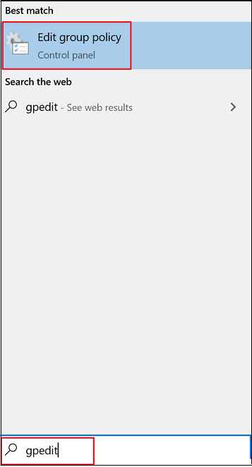

# 그룹 정책에서 Microsoft Defender 바이러스 백신 항상 보호 설정 및 구성

**적용 대상:**

- [엔드포인트용 Microsoft Defender](/microsoft-365/security/defender-endpoint/)

항상 보호는 알려진 의심스러운 활동 및 악의적인 활동을 기반으로 맬웨어를 식별하기 위한 실시간 보호, 동작 모니터링 및 추론으로 구성됩니다.

이러한 활동에는 기존 파일을 비정상적으로 변경하는 프로세스, 자동 시작 레지스트리 키 및 시작 위치(자동 시작 extensibility points 또는 ASEP라고도 불리며) 수정 또는 만들기, 파일 시스템 또는 파일 구조에 대한 기타 변경 사항과 같은 이벤트가 포함됩니다.

## 그룹 정책에서 Always-On 보호 사용 및 구성

로컬 그룹 **정책** 편집기를 사용하여 로컬 그룹 정책 편집기를 사용하여 항상 Microsoft Defender 바이러스 백신 설정을 사용하도록 설정하고 구성할 수 있습니다.

항상 보호를 사용하도록 설정하고 구성하려면

1. 다음과 **같이 로컬 그룹 정책 편집기를** 열 수 있습니다.

    1. 작업 Windows 10 Windows 11 상자에 **gpedit 를 입력합니다.**

    2. 최상의 **일치 아래에서** 그룹 정책 **편집을 선택하여** 로컬 그룹 정책 **편집기를 실행합니다.**
    
       

2. 로컬 그룹 정책 편집기 왼쪽 창에서 트리를 컴퓨터 구성 관리 템플릿 Windows  \>  \> **구성 요소** \> Microsoft Defender 바이러스 백신.

3. 맬웨어 Microsoft Defender 바이러스 백신 정책 설정을 구성합니다.

   오른쪽의  Microsoft Defender 바이러스 백신 창에서 맬웨어 방지 서비스가 정상 우선 순위로 시작하도록 허용을 두 번 클릭하고 사용으로 **설정합니다.**

   그런 다음 **확인** 을 선택합니다.

4. 다음과 Microsoft Defender 바이러스 백신 실시간 보호 정책 설정을 구성합니다.

    1. 세부 **Microsoft Defender 바이러스 백신** 창에서 실시간 보호를 두 **번 클릭합니다.** 또는 왼쪽 Microsoft Defender 바이러스 백신 **트리에서** 실시간 보호 **를 선택합니다.**

    2. 오른쪽의  실시간 보호 세부 정보 창에서 실시간 보호 정책 설정에 지정된 정책 설정을 두 번 [클릭합니다(이](#real-time-protection-policy-settings) 문서의 부분).

    3. 설정을 적절하게 구성하고 확인 을 **선택합니다.**

    4. 표의 각 설정에 대해 이전 단계를 반복합니다.

5. 다음과 Microsoft Defender 바이러스 백신 검사 정책 설정을 구성합니다.

    1. 왼쪽 **창의** Microsoft Defender 바이러스 백신 트리에서 스캔 을 **선택합니다.**
    
   2. 오른쪽의 **스캔** 세부 정보 창에서추학 켜기 를 두 번 **클릭하고** 사용으로 **설정합니다.** 

   3. **확인** 을 선택합니다.

6. 로컬 **그룹 정책 편집기를 닫습니다.**

### 실시간 보호 정책 설정

|설정|기본 설정|
|---|---|
|동작 모니터링 켜기 
 바이러스 백신 엔진은 파일 프로세스, 파일 및 레지스트리 변경 내용 및 끝점에서 의심스러우고 알려진 악의적인 활동이 있는 기타 이벤트를 모니터링합니다.|사용|
|다운로드한 모든 파일 및 첨부 파일 검색 
 다운로드한 파일 및 첨부 파일이 자동으로 검색됩니다. 이 검사는 다운로드 전과 Windows Defender 검색하는 SmartScreen 필터와 함께 작동됩니다.|사용|
|컴퓨터에서 파일 및 프로그램 활동 모니터링 
 Microsoft Defender 바이러스 백신 엔진은 파일 변경 내용(이동, 복사본 또는 수정과 같은 파일 쓰기) 및 일반 프로그램 활동(열리거나 실행되고 다른 프로그램이 실행되는 프로그램)을 기록합니다.|사용|
|원시 볼륨 쓰기 알림 켜기 
 원시 볼륨 쓰기에 대한 정보는 동작 모니터링을 통해 분석됩니다.|사용|
|실시간 보호를 사용할 때마다 프로세스 검색 켜기 
 실행 중인 프로세스에서 의심스러운 수정 또는 Microsoft Defender 바이러스 백신 검색할 수 있도록 독립적으로 설정할 수 있습니다. 이 기능은 실시간 보호를 일시적으로 사용하지 않도록 설정하고 사용하지 않도록 설정한 동안 시작된 프로세스를 자동으로 검색하려는 경우 유용합니다.|사용|
|검사할 다운로드한 파일 및 첨부 파일의 최대 크기 정의 
 크기를 킬로바이트로 정의할 수 있습니다.|사용|
|동작 모니터링 켜기에 대한 로컬 설정 다시 설정 구성 
 동작 모니터링 구성에 대한 로컬 오버라이드를 구성합니다. 이 설정은 그룹 정책에서만 설정할 수 있습니다. 이 설정을 사용하면 로컬 기본 설정이 그룹 정책보다 우선합니다. 이 설정을 사용하지 않도록 설정하거나 구성하지 않는 경우 그룹 정책이 로컬 기본 설정보다 우선합니다.|사용|
|다운로드한 모든 파일 및 첨부 파일을 검사하기 위한 로컬 설정 다시 설정 구성 
 다운로드한 모든 파일 및 첨부 파일에 대한 검사 구성에 대한 로컬 다시 설정을 구성합니다. 이 설정은 그룹 정책에서만 설정할 수 있습니다. 이 설정을 사용하면 로컬 기본 설정이 그룹 정책보다 우선합니다. 이 설정을 사용하지 않도록 설정하거나 구성하지 않는 경우 그룹 정책이 로컬 기본 설정보다 우선합니다.|사용|
|컴퓨터의 파일 및 프로그램 활동 모니터링에 대한 로컬 설정 다시 설정 구성 
 컴퓨터의 파일 및 프로그램 활동에 대한 모니터링 구성에 대한 로컬 다시 설정을 구성합니다. 이 설정은 그룹 정책에서만 설정할 수 있습니다. 이 설정을 사용하면 로컬 기본 설정이 그룹 정책보다 우선합니다. 이 설정을 사용하지 않도록 설정하거나 구성하지 않는 경우 그룹 정책이 로컬 기본 설정보다 우선합니다.|사용|
|실시간 보호를 켜도록 로컬 설정 다시 설정 구성 
 실시간 보호를 켜도록 구성에 대한 로컬 다시 설정을 구성합니다. 이 설정은 그룹 정책에서만 설정할 수 있습니다. 이 설정을 사용하면 로컬 기본 설정이 그룹 정책보다 우선합니다. 이 설정을 사용하지 않도록 설정하거나 구성하지 않는 경우 그룹 정책이 로컬 기본 설정보다 우선합니다.|사용|
|들어오는 파일 및 나올 파일 활동에 대한 모니터링을 위한 로컬 설정 오버라이드 구성 
 수신 및 전송 파일 활동에 대한 모니터링 구성에 대한 로컬 오버라이드를 구성합니다. 이 설정은 그룹 정책에서만 설정할 수 있습니다. 이 설정을 사용하면 로컬 기본 설정이 그룹 정책보다 우선합니다. 이 설정을 사용하지 않도록 설정하거나 구성하지 않는 경우 그룹 정책이 로컬 기본 설정보다 우선합니다.|사용|
|수신 및 전송 파일 및 프로그램 활동에 대한 모니터링 구성 
 들어오는 방향, 나갈 방향, 둘 다 또는 둘 다에 대해 모니터링이 진행될지 여부를 지정합니다. 이 작업은 특정 Windows 서버 또는 많은 양의 파일 변경 내용이 한 방향으로만 표시되고 네트워크 성능을 향상하려는 서버 역할을 정의한 Windows Server 설치와 관련이 있습니다. 네트워크에서 완전히 업데이트된 끝점 및 서버는 파일 변경의 수나 방향에 따라 성능에 거의 영향을 줄 수 없습니다.|사용(양방향)|

## 그룹 정책에서 실시간 보호를 사용하지 않도록 설정

> [!WARNING]
> 실시간 보호를 설정하면 끝점의 보호가 크게 감소하며 권장되지 않습니다.

기본 실시간 보호 기능은 기본적으로 사용하도록 설정되어 있지만 로컬 그룹 정책 편집기를 사용하여 사용하지 않도록 설정할 **수 있습니다.**

### 그룹 정책에서 실시간 보호를 사용하지 않도록 설정

1. 로컬 **그룹 정책 편집기를 열습니다.**

   1. 작업 Windows 10 Windows 11 상자에 **gpedit 를 입력합니다.**
   2. 최상의 **일치 아래에서** 그룹 정책 **편집을 선택하여** 로컬 그룹 정책 **편집기를 실행합니다.**

2. 로컬 그룹 정책 편집기 왼쪽 창에서 컴퓨터  구성 관리 템플릿 Windows 구성 요소 및 실시간 보호로 Microsoft Defender 바이러스 백신 \>  \>  \>  \> **확장합니다.**

3. 오른쪽의  실시간 보호 세부 정보 창에서 실시간 보호 끄기 를 **두 번 클릭합니다.**

4. 실시간 **보호** 설정 끄기 창에서 옵션을 사용으로 **설정합니다.**
   
5. 확인을 **선택합니다.**

6. 로컬 **그룹 정책 편집기를 닫습니다.**

## 참고 항목

- [동작, 추론 및 실시간 보호 구성](configure-protection-features-microsoft-defender-antivirus.md)
- [Windows 10의 Microsoft Defender 바이러스 백신](microsoft-defender-antivirus-in-windows-10.md)
