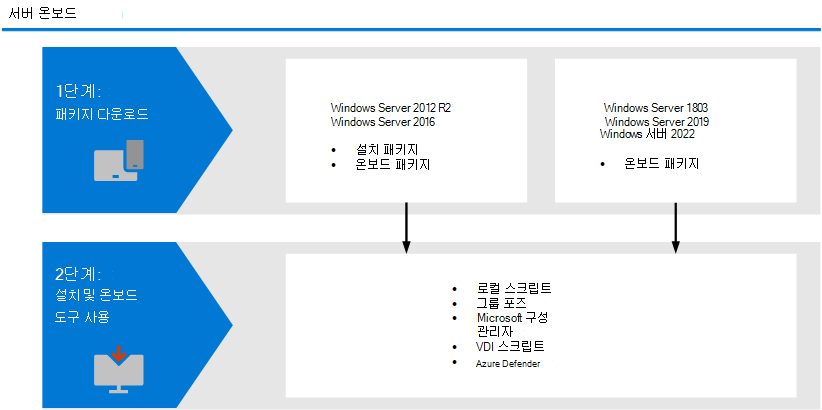

# <a name="onboard-windows-servers-to-the-microsoft-defender-for-endpoint-service"></a>끝점 Windows Microsoft Defender에 서버 온보딩

[!INCLUDE [Microsoft 365 Defender rebranding](../../includes/microsoft-defender.md)]

**적용 대상:**

- Windows Server 2012 R2
- Windows Server 2016
- Windows 서버 Semi-Annual 채널
- Windows Server 2019 이상
- Windows Server 2019 Core Edition
- Windows Server 2022

[!include[Prerelease information](../../includes/prerelease.md)]

> Endpoint용 Defender를 경험하고 싶나요? [무료 평가판을 신청하세요.](https://signup.microsoft.com/create-account/signup?products=7f379fee-c4f9-4278-b0a1-e4c8c2fcdf7e&ru=https://aka.ms/MDEp2OpenTrial?ocid=docs-wdatp-configserver-abovefoldlink)

Endpoint용 Defender는 Windows 서버 운영 체제를 포함하기 위해 지원을 확장합니다. 이 지원은 보안 콘솔을 통해 고급 공격 감지 및 조사 기능을 Microsoft 365 Defender 제공합니다. Windows Server에 대한 지원은 서버 활동, 커널 및 메모리 공격 감지 범위에 대한 심층적인 정보를 제공하며 대응 작업을 가능하게 합니다.

이 항목에서는 특정 Windows 서버를 끝점용 Microsoft Defender에 온보딩하는 방법을 설명합니다. 


라이선스 및 인프라에 필요한 사항을 실제로 설명하는 내용은 [Endpoint용 Defender로 Windows 서버 보호를 참조하세요.](https://techcommunity.microsoft.com/t5/What-s-New/Protecting-Windows-Server-with-Windows-Defender-ATP/m-p/267114#M128)

Windows 보안 서버의 기본 Windows 다운로드하고 사용하는 방법에 대한 지침은 Windows 보안 [참조하세요.](/windows/device-security/windows-security-baselines)

## <a name="windows-server-onboarding-overview"></a>Windows 서버 온보드 개요

서버를 성공적으로 온보드하려면 다음 일반 단계를 완료해야 합니다.




**Windows Server 2012 R2 및 Windows Server 2016(미리 보기)**
- 설치 및 온보더링 패키지 다운로드
- 응용 프로그램 설치
- 해당 도구에 대한 온보더링 단계 수행

**Windows 서버 Semi-Annual 채널 및 Windows Server 2019**

- 온보더링 패키지 다운로드
- 해당 도구에 대한 온보더링 단계 수행

### <a name="new-functionality-in-the-modern-unified-solution-for-windows-server-2012-r2-and-2016-preview"></a>R2 및 2016 Preview를 위한 최신 통합 Windows Server 2012 기능
R2 및 Windows Server 2012 R2의 이전 구현에서는 Windows Server 2016 MMA(Microsoft Monitoring Agent 사용이 필요했습니다. 

새로운 통합 솔루션 패키지를 사용하면 종속성 및 설치 단계를 제거하여 서버를 보다 쉽게 온보드할 수 있습니다. 또한 이 통합 솔루션 패키지는 다음과 같은 주요 개선 사항과 함께 제공됩니다.

- [Microsoft Defender 바이러스 백신](/microsoft-365/security/defender-endpoint/microsoft-defender-antivirus-windows) [R2에](/microsoft-365/security/defender-endpoint/next-generation-protection) 대한 차세대 보호 Windows Server 2012 기능
- [ASR(공격 표면 축소) 규칙](/microsoft-365/security/defender-endpoint/attack-surface-reduction-rules)
- [네트워크 보호](/microsoft-365/security/defender-endpoint/network-protection)
- [제어된 폴더 액세스](/microsoft-365/security/defender-endpoint/controlled-folders)
- [PUA(잠재적으로 원치 않는 응용 프로그램) 차단](/microsoft-365/security/defender-endpoint/detect-block-potentially-unwanted-apps-microsoft-defender-antivirus)
- [향상된 검색 기능](/microsoft-365/security/defender-endpoint/overview-endpoint-detection-response)
- [장치 및 파일에 대한](/microsoft-365/security/defender-endpoint/respond-machine-alerts) 확장된 응답 [기능](/microsoft-365/security/defender-endpoint/respond-file-alerts)
- [EDR 모드로 설정](/microsoft-365/security/defender-endpoint/edr-in-block-mode)
- [라이브 응답](/microsoft-365/security/defender-endpoint/live-response)
- [자동화된 조사 및 대응(AIR)](/microsoft-365/security/defender-endpoint/automated-investigations)
- [변조 방지](/microsoft-365/security/defender-endpoint/prevent-changes-to-security-settings-with-tamper-protection)

이전에 MMA를 사용하여 서버를 온보드한 경우 서버 [](server-migration.md) 마이그레이션에 제공된 지침을 따라 새 솔루션으로 마이그레이션합니다.

>[!NOTE]
>이 R2 및 Windows Server 2012 Windows Server 2016 미리 보기에 있는 동안 MMA(Microsoft Monitoring Agent)를 사용하여 이전 온보더링 방법을 계속 사용할 수 있습니다. 자세한 내용은 [MMA를 사용하여 끝점 설치 및 구성을 참조하세요.](onboard-downlevel.md#install-and-configure-microsoft-monitoring-agent-mma)

#### <a name="known-issues-and-limitations"></a>알려진 문제 및 제한 사항
다음은 R2 및 2016의 새로운 통합 솔루션 Windows Server 2012 적용됩니다.
- 프록시 서버에서 끝점 서비스 [URL에 대한 Microsoft Defender 액세스](/microsoft-365/security/defender-endpoint/configure-proxy-internet?enable-access-to-microsoft-defender-for-endpoint-service-urls-in-the-proxy-server) 사용에 지정된 연결 요구 사항이 충족되어 있는지 확인합니다. 서버 2019의 Windows 동일합니다. 
- 이전에는 OMS 게이트웨이에서 Microsoft Monitoring Agent(MMA)를 Windows Server 2016 OMS 게이트웨이에서 Defender 클라우드 서비스에 대한 연결을 제공할 수 있습니다. Windows Server 2019, Windows Server 2022 및 Windows 10의 끝점용 Microsoft Defender와 같은 새 솔루션은 이 게이트웨이를 지원하지 않습니다.
- 이 Windows Server 2016 설치된 Microsoft Defender 바이러스 백신 활성 상태 및 최신 상태인지 확인합니다. 업데이트 업데이트를 사용하여 최신 플랫폼 버전을 다운로드하고 설치할 Windows 있습니다. 또는 Microsoft 업데이트 카탈로그 또는 [](https://www.catalog.update.microsoft.com/Search.aspx?q=KB4052623) MMPC에서 수동으로 업데이트 [패키지를 다운로드합니다.](https://go.microsoft.com/fwlink/?linkid=870379&arch=x64)  
- R2에 Windows Server 2012 사용자 인터페이스가 Microsoft Defender 바이러스 백신. 또한 사용자 인터페이스의 Windows Server 2016 기본 작업만 허용합니다. 장치에서 로컬로 작업을 수행하려면 [PowerShell, WMI ](/microsoft-365/security/defender-endpoint/manage-atp-post-migration-other-tools)및 를 사용하여 끝점용 Microsoft Defender 관리를 MPCmdRun.exe. 따라서 사용자에게 의사 결정을 내리거나 특정 작업을 수행하라는 메시지가 표시되는 위치와 같이 사용자 조작을 구체적으로 하는 기능이 예상대로 작동하지 않을 수 있습니다. 일반적으로 사용자 인터페이스를 사용하지 않도록 설정하거나 사용하지 않도록 설정하거나 보호 기능에 영향을 줄 수 있는 관리되는 서버에서 사용자 상호 작용을 요구하지 않는 것이 좋습니다.
- 일부 공격 표면 감소 규칙을 모든 운영 체제에서 사용할 수 있는 것은 아니며, [ASR(공격 표면 축소) 규칙을 검토하십시오.](/microsoft-365/security/defender-endpoint/attack-surface-reduction-rules)
- 네트워크 [보호를 사용하도록 설정하려면](/microsoft-365/security/defender-endpoint/network-protection)추가 구성이 필요합니다.   
    -- Set-MpPreference -EnableNetworkProtection Enabled  
    -- Set-MpPreference -AllowNetworkProtectionOnWinServer 1  
    -- Set-MpPreference -AllowNetworkProtectionDownLevel 1  
    -- Set-MpPreference -AllowDatagramProcessingOnWinServer 1  
  또한 네트워크 트래픽이 많은 컴퓨터의 경우 이 기능을 광범위하게 사용하도록 설정하기 전에 해당 환경에서 성능 테스트를 하는 것이 좋습니다. 추가 리소스 사용량을 고려해야 할 수 있습니다.
 - R2 Windows Server 2012 시간 표시 막대에 네트워크 이벤트가 채워지지 않을 수 있습니다. This issue requires a Windows Update KB4645768 released as part of the October 12th patch Tuesday.
 - 운영 체제 업그레이드는 지원되지 않습니다. 업그레이드하기 전에 오프보드했다가 제거하시기 바랍니다.

## <a name="integration-with-azure-defender"></a>Azure Defender와 통합
끝점용 Microsoft Defender는 Azure Defender와 원활하게 통합됩니다. 서버를 자동으로 온보딩하고, Azure Defender가 모니터링하는 서버를 Endpoint용 Defender에 표시하고, Azure Defender 고객으로 자세한 조사를 실시할 수 있습니다. 

자세한 내용은 [Azure Defender와의 통합을 참조하세요.](azure-server-integration.md)

> [!NOTE]
> 최신 Windows Server 2012 미리 보기를 실행하는 R2 및 2016의 경우 경고 및 자동화된 배포를 위한 Azure Security Center/Server용 Azure Defender와의 통합은 아직 제공되지 않습니다. 이러한 컴퓨터에 새 솔루션을 설치할 수 있는 동안 Azure 보안 센터에 알림이 표시되지 않습니다.

## <a name="windows-server-2012-r2-and-windows-server-2016"></a>Windows Server 2012 R2 및 Windows Server 2016

> [!NOTE]
> 이 R2 및 Windows Server 2012 Windows Server 2016 미리 보기에 있는 동안 MMA(Microsoft Monitoring Agent)를 사용하여 이전 온보더링 방법을 계속 사용할 수 있습니다. 자세한 내용은 [MMA를 사용하여 끝점 설치 및 구성을 참조하세요.](onboard-downlevel.md#install-and-configure-microsoft-monitoring-agent-mma)


### <a name="prerequisites"></a>필수 조건

**R2의** Windows Server 2012 선행 최신 월별 롤업 패키지로 [](/troubleshoot/windows-client/deployment/standard-terminology-software-updates.md#monthly-rollup) 컴퓨터를 완전히 업데이트한 경우  추가 선행 구성이 없습니다.

설치 관리자 패키지는 업데이트를 통해 다음 구성 요소가 이미 설치되어 있는지 확인합니다.

- [고객 환경 및 진단 원격 분석에 대한 업데이트](https://support.microsoft.com/help/3080149/update-for-customer-experience-and-diagnostic-telemetry)
- [런타임의 유니버설 C 런타임에 대한 Windows](https://support.microsoft.com/topic/update-for-universal-c-runtime-in-windows-c0514201-7fe6-95a3-b0a5-287930f3560c)

**Windows Server 2016** 

설치 Microsoft Defender 바이러스 백신 활성 상태 및 최신 상태인지 확인합니다. 업데이트 업데이트를 사용하여 최신 플랫폼 버전을 다운로드하고 설치할 Windows 있습니다. 또는 Microsoft 업데이트 카탈로그 또는 [](https://www.catalog.update.microsoft.com/Search.aspx?q=KB4052623) MMPC에서 수동으로 업데이트 [패키지를 다운로드합니다.](https://go.microsoft.com/fwlink/?linkid=870379&arch=x64)

**R2 및 2016의 끝점용 Microsoft Defender에 Windows Server 2012 업데이트 패키지**

EDR 센서 구성 요소에 대한 정기적인 제품 개선 및 수정을 받으 Windows [업데이트 KB5005292가](https://go.microsoft.com/fwlink/?linkid=2168277) 적용되거나 승인되도록 합니다. 또한 보호 구성 요소를 업데이트된 유지 관리하기 위해 관리 Microsoft Defender 바이러스 백신 [기준을 적용하세요.](/microsoft-365/security/defender-endpoint/manage-updates-baselines-microsoft-defender-antivirus#monthly-platform-and-engine-versions)

### <a name="download-installation-and-onboarding-packages"></a>설치 및 온보더링 패키지 다운로드 

1. 다음 Microsoft Defender 보안 센터 **온보드 설정 > 장치** 관리 > 로 이동하세요.

2. R2 **Windows Server 2012 2016을 선택합니다.**

3. 설치 **패키지 다운로드를 선택하고** 설치 .msi 저장합니다. 설치 마법사를 통해 msi 패키지를 실행하거나 명령줄을 사용하여 [끝점용 Microsoft Defender 설치의](#install-microsoft-defender-for-endpoint-using-command-line)명령줄 단계를 따를 수 있습니다.
          
   > [!NOTE]
   > Microsoft Defender 바이러스 백신 수동 모드로 설정하지 않으면 설치가 시작되어 활성화됩니다. 자세한 내용은 수동 [모드로 Microsoft Defender 바이러스 백신 필요를 참조하세요.](microsoft-defender-antivirus-on-windows-server.md#passive-mode-and-windows-server)
 
4. **온보더링 패키지 다운로드를** 선택하고 .zip 저장합니다.

5. 설치 패키지를 설치하는 옵션을 사용하여 설치 패키지를 Microsoft Defender 바이러스 백신. (Microsoft Defender 바이러스 백신 [서버의 Windows 참조)](microsoft-defender-antivirus-on-windows-server.md)

6. 온보더링 단계 섹션에 [제공된 단계를 따릅니다.](#onboarding-steps)

### <a name="options-to-install-microsoft-defender-for-endpoint"></a>끝점용 Microsoft Defender 설치 옵션
이전 섹션에서 설치 패키지를 다운로드했습니다. 설치 패키지에는 모든 Microsoft Defender for Endpoint 구성 요소용 설치 관리자가 포함되어 있습니다.

### <a name="install-microsoft-defender-for-endpoint-using-command-line"></a>명령줄을 사용하여 끝점용 Microsoft Defender 설치
이전 단계의 설치 패키지를 사용하여 끝점용 Microsoft Defender를 설치합니다. 

다음 명령을 실행하여 끝점용 Microsoft Defender를 설치합니다.

```
Msiexec /i md4ws.msi /quiet
```

제거를 위해 먼저 적절한 오프보딩 스크립트를 사용하여 컴퓨터의 오프보딩이 해제되도록 합니다. 그런 다음 제어판 프로그램 프로그램 및 기능을 사용하여 \> \> 제거를 수행합니다.

또는 다음 제거 명령을 실행하여 끝점용 Microsoft Defender를 제거합니다.

```
Msiexec /x md4ws.msi /quiet
```
위의 명령이 성공하려면 설치에 사용한 패키지와 동일한 패키지를 사용해야 합니다.

스위치는 `/quiet` 모든 알림을 표시하지 않습니다.

> [!NOTE]
> Microsoft Defender 바이러스 백신 수동 모드로 자동 전환되지 않습니다. Microsoft가 아닌 바이러스 백신/맬웨어 방지 Microsoft Defender 바이러스 백신 실행 중인 경우 수동 모드에서 실행될 수 있습니다. 명령줄 설치의 경우 선택적 구성 요소가 Microsoft Defender 바이러스 백신 `FORCEPASSIVEMODE=1` 수동 모드로 즉시 설정됩니다.
>
> 자세한 내용은 수동 [모드로 Microsoft Defender 바이러스 백신 필요를 참조하세요.](microsoft-defender-antivirus-on-windows-server.md#passive-mode-and-windows-server)
> - Windows Server 2019 및 Windows Server 2022용 온보딩 패키지는 Microsoft Endpoint Manager 현재 스크립트를 제공합니다. Configuration Manager에서 스크립트를 배포하는 방법에 대한 자세한 내용은 Configuration Manager의 패키지 [및 프로그램을 참조하세요.](/configmgr/apps/deploy-use/packages-and-programs)
> - 로컬 스크립트는 개념 증명에 적합하지만 프로덕션 배포에는 사용되지 않습니다. 프로덕션 배포의 경우 그룹 정책을 사용하는 것이 Microsoft Endpoint Configuration Manager.

Windows Server에 대한 지원은 서버 활동, 커널 및 메모리 공격 감지 범위에 대한 심층적인 정보를 제공하며 대응 작업을 가능하게 합니다.

### <a name="install-microsoft-defender-for-endpoint-using-a-script"></a>스크립트를 사용하여 끝점용 Microsoft Defender 설치

설치 관리자 [스크립트를](server-migration.md#installer-script) 사용하여 설치, 제거 및 온보딩을 자동화할 수도 있습니다.

## <a name="windows-server-semi-annual-channel-and-windows-server-2019-and-windows-server-2022"></a>Windows Server Semi-Annual Channel 및 Windows Server 2019 및 Windows Server 2022

Windows Server 2019 및 Windows Server 2022용 온보딩 패키지는 Microsoft Endpoint Manager 현재 스크립트를 제공합니다. Configuration Manager에서 스크립트를 배포하는 방법에 대한 자세한 내용은 Configuration Manager의 패키지 [및 프로그램을 참조하세요.](/configmgr/apps/deploy-use/packages-and-programs)


### <a name="download-package"></a>패키지 다운로드

1. 다음 Microsoft Defender 보안 센터 **온보드 설정 > 장치** 관리 > 로 이동하세요.

2. 서버 **Windows 1803 및 2019를 선택합니다.**

3. 패키지 **다운로드를 선택합니다.** 저장한 WindowsDefenderATPOnboardingPackage.zip.

4. 온보더링 단계 섹션에 [제공된 단계를 따릅니다.](#onboarding-steps) 


## <a name="onboarding-steps"></a>온보더링 단계

1. 이제 필요한 온보더링 패키지를 다운로드한 후 [](configure-endpoints.md#endpoint-onboarding-tools) 서버에 대한 온보더링 도구 및 방법에 나열된 지침을 사용합니다.

2. 타사 맬웨어 방지 솔루션을 사용하는 경우 해당됩니다. 수동 모드 설정에 다음 Microsoft Defender 바이러스 백신 합니다. 올바르게 구성되어 있는지 확인합니다.

    1. 다음 레지스트리 항목을 설정하십시오.
       - 경로: `HKLM\SOFTWARE\Policies\Microsoft\Windows Advanced Threat Protection`
       - 이름: ForceDefenderPassiveMode
       - 유형: REG_DWORD
       - Value: 1

    2. 수동 모드가 구성되어 있는지 확인하도록 다음 PowerShell 명령을 실행합니다.
    
    ```PowerShell
    Get-WinEvent -FilterHashtable @{ProviderName="Microsoft-Windows-Sense" ;ID=84}
    ```
        
    > [!NOTE]
    > 서버용 Azure Defender와 끝점용 Microsoft Defender 간의 통합은 Windows Server 2022, Windows [Server 2019 및 WVD(Windows Virtual Desktop)를](/azure/security-center/release-notes#microsoft-defender-for-endpoint-integration-with-azure-defender-now-supports-windows-server-2019-and-windows-10-virtual-desktop-wvd-in-preview)지원하기 위해 확장되어 있습니다.

      

    3. 수동 모드 이벤트가 포함된 최근 이벤트가 발견된지 확인:

       


## <a name="verify-the-onboarding-and-installation"></a>온보더링 및 설치 확인

끝점에 Microsoft Defender 바이러스 백신 Microsoft Defender가 실행되고 있는지 확인 


## <a name="run-a-detection-test-to-verify-onboarding"></a>검색 테스트를 실행하여 온보더링 확인

장치를 온보드한 후 검색 테스트를 실행하여 장치가 서비스에 제대로 온보드되었는지 확인할 수 있습니다. 자세한 내용은 새로 온보딩된 끝점 디바이스용 Microsoft Defender에서 검색 테스트 [실행을 참조하세요.](run-detection-test.md)

> [!NOTE]
> 이 Microsoft Defender 바이러스 백신 실행은 필수는 아니며 권장됩니다. 다른 바이러스 백신 공급업체 제품이 기본 끝점 보호 솔루션인 경우 수동 모드에서 Defender 바이러스 백신을 실행할 수 있습니다. Microsoft Defender for Endpoint 센서(SENSE)가 실행되고 있는지 확인한 후에만 수동 모드가 설정되고 있는지 확인할 수 있습니다. 

1. 다음 명령을 실행하여 설치 Microsoft Defender 바이러스 백신 확인합니다.

    >[!NOTE]
    >이 verifcation 단계는 활성 맬웨어 방지 솔루션으로 Microsoft Defender 바이러스 백신 하는 경우만 필요합니다. 

   ```sc.exe query Windefend```

    결과가 '지정된 서비스가 설치된 서비스로 존재하지 않습니다'인 경우 해당 서비스를 설치해야 Microsoft Defender 바이러스 백신. 자세한 내용은 Microsoft Defender 바이러스 백신 [Server의 Windows 참조하세요.](microsoft-defender-antivirus-on-windows-server.md)

    그룹 정책을 사용하여 Microsoft Defender 바이러스 백신 서버에서 그룹 정책을 Windows 방법에 대한 자세한 내용은 [그룹](use-group-policy-microsoft-defender-antivirus.md)정책 설정을 사용하여 그룹 정책 구성 및 Microsoft Defender 바이러스 백신.

2. 다음 명령을 실행하여 끝점용 Microsoft Defender가 실행 중인지 확인

    ```sc.exe query sense```
    
    결과에 실행 중이 표시해야 합니다. 온보더링에 문제가 발생하는 경우 온보더링 [문제 해결을 참조합니다.](troubleshoot-onboarding.md)

## <a name="run-a-detection-test"></a>검색 테스트 실행
새로 온보딩된 장치에서 검색 테스트 실행의 단계에 따라 서버가 끝점 서비스에 대해 Defender에 보고하는지 확인합니다. [](run-detection-test.md)


## <a name="next-steps"></a>다음 단계
디바이스를 서비스에 성공적으로 온보딩한 후 끝점에 대한 Microsoft Defender의 개별 구성 요소를 구성해야 합니다. 채택 [순서에 따라](prepare-deployment.md#adoption-order) 다양한 구성 요소를 사용하도록 설정하는 것이 안내됩니다.


## <a name="offboard-windows-servers"></a>서버 Windows 오프보드

Windows Server 2012 클라이언트 장치에 사용할 수 있는 동일한 방법으로 Windows Server 2012 R2, Windows Server 2016, Windows Server(Windows Server), Windows Server 2019, Windows Server 2019 Core edition을 Windows 10 있습니다.

- [그룹 정책을 사용하여 오프보더](configure-endpoints-gp.md#offboard-devices-using-group-policy)
- [Configuration Manager를 사용하여 디바이스 오프보드](configure-endpoints-sccm.md#offboard-devices-using-configuration-manager)
- [모바일 장치 관리 도구를 사용하여 장치 오프보드 및 모니터링](configure-endpoints-mdm.md#offboard-and-monitor-devices-using-mobile-device-management-tools)
- [로컬 스크립트를 사용하여 디바이스 오프보딩](configure-endpoints-script.md#offboard-devices-using-a-local-script)

다른 Windows 서버 버전의 경우 서비스에서 서버 Windows 오프보드할 수 있는 두 가지 옵션이 있습니다.

- MMA 에이전트 제거
- 끝점용 Defender 작업 영역 구성 제거

>[!NOTE]
>*다른 Windows 서버 버전에 대한 이러한 오프보딩 지침은 MMA가 필요한 Windows Server 2016 및 Windows Server 2012 R2에 대해 이전의 Microsoft Defender for Endpoint를 실행하는 경우도 적용됩니다. 새로운 연결되지 않은 솔루션으로 마이그레이션하는 지침은 [Microsoft Defender for Endpoint의](/microsoft-365/security/defender-endpoint/server-migration)서버 마이그레이션 시나리오에 있습니다.

## <a name="related-topics"></a>관련 항목
- [이전 버전의 Windows 온보딩](onboard-downlevel.md)
- [그룹 정책을 통한 Windows 10 장치 온보딩](configure-endpoints.md)
- [Windows가 아닌 장치 온보딩](configure-endpoints-non-windows.md)
- [프록시 및 인터넷 연결 설정 구성](configure-proxy-internet.md)
- [새로 온보딩된 Endpoint 디바이스용 Defender에서 검색 테스트 실행](run-detection-test.md)
- [끝점 온보딩 문제에 대한 Microsoft Defender 문제 해결](troubleshoot-onboarding.md)
