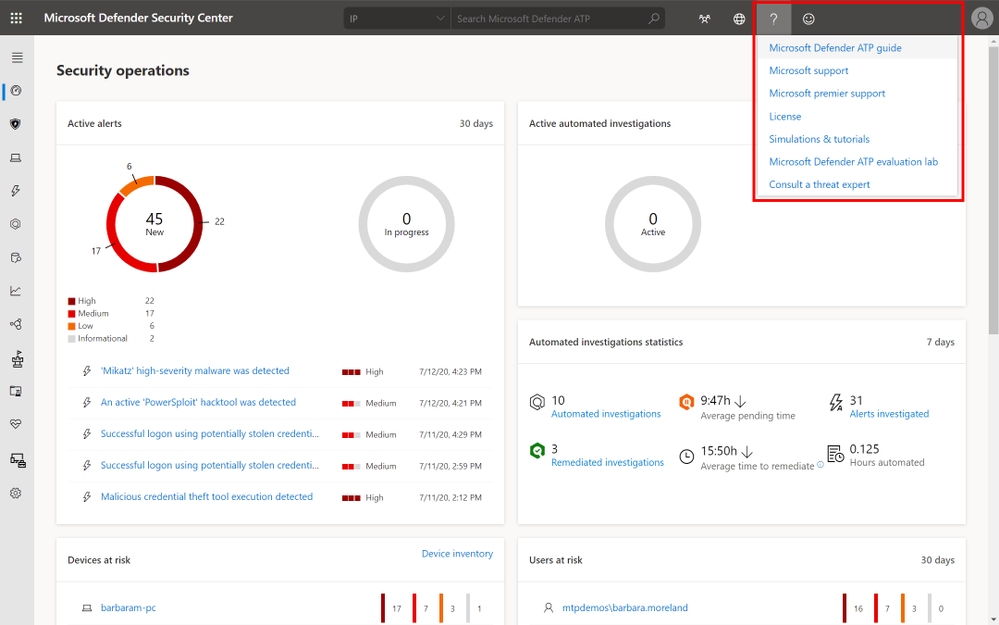

# 엔드포인트용 Microsoft Defender 지원 문의Contact Microsoft Defender for Endpoint support

[!INCLUDE [Microsoft 365 Defender rebranding](../../includes/microsoft-defender.md)]

**적용 대상:****Applies to:**
- [엔드포인트용 Microsoft DefenderMicrosoft Defender for Endpoint](https://go.microsoft.com/fwlink/p/?linkid=2154037)
- [Microsoft 365 DefenderMicrosoft 365 Defender](https://go.microsoft.com/fwlink/?linkid=2118804)

>Endpoint용 Defender를 경험하고 싶나요?Want to experience Defender for Endpoint? [무료 평가판에 등록합니다.Sign up for a free trial.](https://www.microsoft.com/microsoft-365/windows/microsoft-defender-atp?ocid=docs-wdatp-assignaccess-abovefoldlink)

Endpoint용 Defender는 최신의 고급 지원 환경을 제공하기 위해 지원 프로세스를 최근에 업그레이드했습니다.Defender for Endpoint has recently upgraded the support process to offer a more modern and advanced support experience. 

새 위젯을 통해 고객은 다음을 할 수 있습니다.The new widget allows customers to:
- 일반적인 문제에 대한 해결 방법 찾기Find solutions to common problems
- Microsoft 지원 팀에 지원 사례 제출Submit a support case to the Microsoft support team

## 필수 구성 요소Prerequisites
지원 사례를 열 수 있는 권한이 있는 특정 역할을 알아야 합니다.It's important to know the specific roles that have permission to open support cases.

최소한 서비스 지원 관리자 또는  헬프데스크 관리자 역할이 있어야 합니다.At a minimum, you must have a Service Support Administrator **OR** Helpdesk Administrator role.

사용 권한이 있는 역할에 대한 자세한 내용은 [Security Administrator permissions을 참조하십시오.](/azure/active-directory/users-groups-roles/directory-assign-admin-roles#security-administrator-permissions)For more information on which roles have permission see, [Security Administrator permissions](/azure/active-directory/users-groups-roles/directory-assign-admin-roles#security-administrator-permissions). 작업이 포함된 역할은 `microsoft.office365.supportTickets/allEntities/allTasks` 사례를 제출할 수 있습니다.Roles that include the action `microsoft.office365.supportTickets/allEntities/allTasks` can submit a case.

관리자 역할에 대한 일반 정보는 관리자 역할 [정보를 참조하세요.](/microsoft-365/admin/add-users/about-admin-roles?view=o365-worldwide&preserve-view=true)For general information on admin roles, see [About admin roles](/microsoft-365/admin/add-users/about-admin-roles?view=o365-worldwide&preserve-view=true).

## 위젯에 액세스Access the widget
새 지원 위젯에 액세스하는 방법은 다음 두 가지 중 하나일 수 있습니다.Accessing the new support widget can be done in one of two ways:

1.  포털 오른쪽 상단에서 물음표를 클릭한 다음 "Microsoft 지원"을 클릭합니다.Clicking on the question mark on the top right of the portal and then clicking on "Microsoft support":

    

2. 도움이 **필요하세요? 클릭**Clicking on the **Need help?**  단추를 누른 다음 Microsoft Defender 보안 센터.button in the bottom right of the Microsoft Defender Security Center:

    

위젯에는 다음 두 가지 옵션이 제공됩니다.In the widget you will be offered two options:

- 일반적인 문제에 대한 해결 방법 찾기Find solutions to common problems    
- 서비스 요청 열기Open a service request  

## 일반적인 문제에 대한 해결 방법 찾기Find solutions to common problems
이 옵션에는 질문과 관련이 있을 수 있는 문서가 포함되어 있습니다.This option includes articles that might be related to the question you may ask. 검색 상자에 질문을 입력하기만 하면 검색과 관련된 문서가 표시됩니다.Just start typing the question in the search box and articles related to your search will be surfaced.

제안된 문서로 충분하지 않은 경우 서비스 요청을 열 수 있습니다.In case the suggested articles are not sufficient, you can open a service request.

## 서비스 요청 열기Open a service request

Endpoint 지원에 대한 Defender에 문의하여 지원 티켓을 여는 방법을 자세히 알아보습니다.Learn how to open support tickets by contacting Defender for Endpoint support. 

> [!Note]
> Microsoft와의 지원 계약이 있는 경우 위젯에 프리미어 태그가 표시됩니다.If you have a permier support contract with Microsoft, you will see the premier tag on the widget. 그렇지 않은 경우 Microsoft 계정 관리자에게 문의하세요.If not, contact your Microsoft account manager.

### 지원 센터 문의Contact support
이 옵션은 헤드셋처럼 보이는 아이콘을 클릭하여 사용할 수 있습니다.This option is available by clicking the icon that looks like a headset. 그러면 다음 페이지를 통해 지원 사례를 제출합니다.You will then get the following page to submit your support case:

1. 직면하고 있는 문제의 제목과 설명과 전화 번호 및 전자 메일 주소를 입력합니다.Fill in a title and description for the issue you are facing, as well as a phone number and email address where we may reach you. 

2. (선택 사항) 지원 사례에 대한 추가 컨텍스트를 제공하기 위해 문제와 관련된 첨부 파일을 최대 5개까지 포함합니다.(Optional) Include up to five attachments that are relevant to the issue in order to provide additional context for the support case. 

3. 해당되는 경우 표준 시간대 및 대체 언어를 선택합니다.Select your time zone and an alternative language, if applicable. 요청이 Microsoft 지원 팀으로 전송됩니다.The request will be sent to Microsoft Support Team. 팀이 서비스 요청에 곧 응답합니다.The team will respond to your service request shortly.

## 관련 항목Related topics
- [서비스 문제 해결Troubleshoot service issues](troubleshoot-mdatp.md)
- [서비스 상태 확인Check service health](service-status.md)
