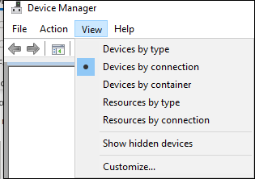

# <a name="how-to-control-usb-devices-and-other-removable-media-using-microsoft-defender-for-endpoint"></a>끝점용 Microsoft Defender를 사용하여 USB 장치 및 기타 이동식 미디어를 제어하는 방법

**적용 사항:** [끝점용 Microsoft Defender](https://go.microsoft.com/fwlink/p/?linkid=2069559)

Microsoft는 [](https://aka.ms/devicecontrolblog)이동식 미디어를 보호하는 계층적 접근 방식을 권장하며, 끝점용 Microsoft Defender는 권한이 없는 주변 장치의 위협이 장치를 중단하지 못하게 하는 여러 모니터링 및 제어 기능을 제공합니다.

1. [Endpoint 고급 헌팅용 Microsoft Defender에서 주변 장치용 플러그 앤 플레이 이벤트를 검색합니다.](#discover-plug-and-play-connected-events) 의심스러운 사용 활동을 식별하거나 조사합니다.

2. 특정 이동식 장치만 허용하거나 차단하고 위협을 방지하도록 구성합니다.
    1. [세부적인](#allow-or-block-removable-devices) 구성에 따라 이동식 장치를 허용하거나 차단하여 이동식 디스크에 대한 쓰기 액세스를 거부하고 USB 장치 ID를 사용하여 디바이스를 승인하거나 거부합니다. Azure AD(Azure AD) 사용자 및 디바이스의 개별 또는 Azure Active Directory 설정의 유연한 정책 할당

    2. [이동식 저장소 장치에서 도입된](#prevent-threats-from-removable-storage) 이동식 저장소의 위협을 방지합니다.
        - Microsoft Defender 바이러스 백신 RTP(실시간 보호)를 통해 이동식 저장소에서 맬웨어를 검색할 수 있습니다.
        - USB에서 실행된 트러블 및 부호 없는 프로세스를 차단하는 ASR(공격 표면 축소) USB 규칙입니다.
        - Thunderbolt에 대한 커널 DMA 보호를 포함한 DMA 공격을 완화하고 사용자가 로그인할 때까지 DMA를 차단하는 DMA(직접 메모리 액세스) 보호 설정

3. [사용자 지정 경고](#create-customized-alerts-and-response-actions) 및 응답 작업을 만들어 이러한 플러그 앤 플레이 이벤트 또는 사용자 지정 검색 규칙이 있는 Endpoint 이벤트에 대한 기타 Microsoft Defender를 기반으로 이동식 장치의 사용을 [모니터링합니다.](/microsoft-365/security/defender-endpoint/custom-detection-rules)

4. [각 주변 장치에서](#respond-to-threats) 보고하는 속성에 따라 주변 장치 위협에 실시간으로 대응합니다.

> [!NOTE]
> 이러한 위협 감소 조치는 맬웨어가 사용자 환경에 유입되는 것을 방지하는 데 도움이 됩니다. 엔터프라이즈 데이터를 환경에서 나가지 않고 보호하기 위해 데이터 손실 방지 조치도 구성할 수 있습니다. 예를 들어 Windows 10 [장치에서는 BitLocker](/windows/security/information-protection/bitlocker/bitlocker-overview.md) 및 Windows [Information Protection을](/windows/security/information-protection/create-wip-policy-using-intune-azure.md)구성하여 개인 장치에 저장된 경우에도 회사 데이터를 암호화하거나 [Storage/RemovableDiskDenyWriteAccess CSP를](/windows/client-management/mdm/policy-csp-storage#storage-removablediskdenywriteaccess) 사용하여 이동식 디스크에 대한 쓰기 액세스를 거부할 수 있습니다. 또한 끝점용 Microsoft Defender 및 Azure [Information](/windows/security/threat-protection/windows-defender-atp/information-protection-in-windows-overview) Protection을 사용하여 Windows 장치(탑재된 USB 장치 포함)의 파일을 분류하고 보호할 수 있습니다.

## <a name="discover-plug-and-play-connected-events"></a>플러그 앤 플레이 연결된 이벤트 검색

Microsoft Defender for Endpoint 고급 헌팅에서 플러그 앤 플레이 이벤트를 보고 의심스러운 사용 활동을 식별하거나 내부 조사를 수행할 수 있습니다.
Endpoint 고급 헌팅 쿼리에 대한 Defender의 예는 Microsoft [Defender for Endpoint hunting queries GitHub 참조합니다.](https://github.com/Microsoft/WindowsDefenderATP-Hunting-Queries)

샘플 Power BI 보고서 서식 파일은 고급 헌팅 쿼리에 사용할 수 있는 끝점용 Microsoft Defender에 사용할 수 있습니다. 장치 제어용 템플릿을 포함하여 이러한 샘플 템플릿을 사용하여 고급 헌팅 기능을 디바이스에 통합할 수 Power BI. 자세한 [GitHub 템플릿에 대한 Power BI 리포지토리를](https://github.com/microsoft/MDATP-PowerBI-Templates) 참조하세요. 통합에 [대한 자세한 내용은 Power BI](/microsoft-365/security/defender-endpoint/api-power-bi) 사용자 지정 보고서 만들기를 Power BI 참조합니다.

## <a name="allow-or-block-removable-devices"></a>이동식 장치 허용 또는 차단
다음 표에서는 Microsoft Defender for Endpoint가 세분화된 구성에 따라 이동식 장치를 허용하거나 차단하는 방법을 설명하고 있습니다.

<br>

****

|제어|설명|
|---|---|
|[USB 드라이브 및 기타 주변 장치 제한](#restrict-usb-drives-and-other-peripherals)|사용자가 권한이 부여된/권한이 없는 장치 또는 장치 유형 목록에 포함된 USB 드라이브 및 기타 주변 장치만 설치하도록 허용/차단할 수 있습니다.|
|[이동식 저장소 설치 및 사용 차단](#block-installation-and-usage-of-removable-storage)|이동식 저장소를 설치하거나 사용할 수 없습니다.|
|[특별히 승인된 주변 장치 설치 및 사용 허용](#allow-installation-and-usage-of-specifically-approved-peripherals)|펌웨어에서 특정 속성을 보고하는 승인된 주변 장치만 설치하고 사용할 수 있습니다.|
|[특별히 금지된 주변 장치 설치 방지](#prevent-installation-of-specifically-prohibited-peripherals)|펌웨어에서 특정 속성을 보고하는 금지된 주변 장치를 설치하거나 사용할 수 없습니다.|
|[일치하는 장치 인스턴스 ID를 사용하여 특별히 승인된 주변 장치의 설치 및 사용 허용](#allow-installation-and-usage-of-specifically-approved-peripherals-with-matching-device-instance-ids)|이러한 장치 인스턴스 ID 중 하나와 일치하는 승인된 주변 장치만 설치하고 사용할 수 있습니다.|
|[일치하는 장치 인스턴스 ID를 사용하여 특별히 금지된 주변 장치의 설치 및 사용 방지](#prevent-installation-and-usage-of-specifically-prohibited-peripherals-with-matching-device-instance-ids)|이러한 장치 인스턴스와 일치하는 금지된 주변 장치를 설치하거나 사용할 수 없습니다.|
|[서비스를 사용하는 서비스를 Bluetooth](#limit-services-that-use-bluetooth)|이러한 서비스를 사용할 수 있는 서비스를 제한할 수 Bluetooth.|
|

### <a name="restrict-usb-drives-and-other-peripherals"></a>USB 드라이브 및 기타 주변 장치 제한

맬웨어 감염 또는 데이터 손실을 방지하기 위해 조직은 USB 드라이브 및 기타 주변 장치를 제한할 수 있습니다. 다음 표에서는 Microsoft Defender for Endpoint가 USB 드라이브 및 기타 주변 장치 설치 및 사용을 방지하는 데 도움이 되는 방법을 보여 줍니다.

<br>

****

|제어|설명
|---|---|
|[USB 드라이브 및 기타 주변 장치 설치 및 사용 허용](#allow-installation-and-usage-of-usb-drives-and-other-peripherals)|사용자가 권한이 부여된 장치 또는 장치 유형 목록에 포함된 USB 드라이브 및 기타 주변 장치만 설치할 수 있도록 허용|
|[USB 드라이브 및 기타 주변 장치 설치 및 사용 방지](#prevent-installation-and-usage-of-usb-drives-and-other-peripherals)|사용자가 권한이 없는 장치 및 장치 유형 목록에 포함된 USB 드라이브 및 기타 주변 장치를 설치하지 못하도록 방지|
|

위의 모든 컨트롤은 Intune 관리 템플릿 을 [통해 설정할 수 있습니다.](/intune/administrative-templates-windows) 관련 정책은 Intune 관리자 템플릿에 있습니다.


> [!NOTE]
> Intune을 사용하여 Azure AD 사용자 및/또는 장치 그룹에 장치 구성 정책을 적용할 수 있습니다.
위의 정책은 장치 설치 [CSP](/windows/client-management/mdm/policy-csp-deviceinstallation) 설정 및 장치 설치 [GP를](/previous-versions/dotnet/articles/bb530324(v=msdn.10))통해 설정할 수도 있습니다.
>
> 프로덕션에서 적용하기 전에 파일럿 사용자 및 장치 그룹을 사용하여 이러한 설정을 항상 테스트하고 구체화합니다.
USB 장치 제어에 대한 자세한 내용은 [끝점용 Microsoft Defender 블로그를 참조하세요.](https://www.microsoft.com/security/blog/2018/12/19/windows-defender-atp-has-protections-for-usb-and-removable-devices/)

#### <a name="allow-installation-and-usage-of-usb-drives-and-other-peripherals"></a>USB 드라이브 및 기타 주변 장치 설치 및 사용 허용

USB 드라이브 및 기타 주변 장치 설치 및 사용을 허용하는 한 가지 방법은 모든 것을 허용하는 것입니다. 그런 다음 허용되는 USB 드라이버 및 기타 주변 장치 줄이기를 시작할 수 있습니다.

> [!NOTE]
> 권한이 없는 USB 주변 장치가 USB 속성을 스푸핑하는 펌웨어를 사용할 수 있기 때문에 특별히 승인된 USB 주변 장치만 허용하고 액세스할 수 있는 사용자를 제한하는 것이 좋습니다.

1. 다른 정책 설정에 설명되지 않은 장치를 **모든 사용자에게 설치하지** 않도록 설정
2. 모든 **장치 설정 클래스에** 대해 이러한 장치 설정 클래스와 일치하는 드라이버를 사용하여 디바이스 설치 [허용을 사용하도록 설정](/windows-hardware/drivers/install/system-defined-device-setup-classes-available-to-vendors)

이미 설치된 장치에 대한 정책을 적용하기 위해 이 설정이 있는 금지 정책을 적용합니다.

장치 설치 허용 정책을 구성할 때 모든 상위 특성도 허용해야 합니다. 장치 관리자를 열고 연결로 보기를 통해 디바이스의 부모를 볼 수 있습니다.



이 예제에서는 HID, 키보드 및 {36fc9e60-c465-11cf-8056-444553540000}을 추가해야 했습니다. 자세한 [내용은 Microsoft에서 제공하는 USB](/windows-hardware/drivers/usbcon/supported-usb-classes) 드라이버를 참조하세요.


특정 장치로 제한하려면 제한할 주변 장치의 장치 설정 클래스를 제거합니다. 그런 다음 추가할 장치 ID를 추가합니다. 장치 ID는 장치의 공급업체 ID 및 제품 ID 값을 기반으로 합니다. 장치 ID 형식에 대한 자세한 내용은 [표준 USB 식별자를 참조하세요.](/windows-hardware/drivers/install/standard-usb-identifiers)

장치 ID를 찾으면 장치 ID [찾기를 참조하세요.](#look-up-device-id)

예제:

1. 이러한 장치 설정과 일치하는 드라이버를 사용하여 디바이스 설치 허용에서 클래스 USBDevice를 **제거합니다.**
2. 이러한 장치 ID와 일치하는 장치의 설치 허용에서 허용할 장치 **ID를 추가합니다.**

#### <a name="prevent-installation-and-usage-of-usb-drives-and-other-peripherals"></a>USB 드라이브 및 기타 주변 장치 설치 및 사용 방지

장치 클래스 또는 특정 장치를 설치하지 못하게 하려는 경우 장치 설치 방지 정책을 사용할 수 있습니다.

1. 이러한 **장치 신원과** 일치하는 장치의 설치 방지를 사용하도록 설정하고 목록에 이러한 장치를 추가합니다.
2. 이러한 **장치 설정 클래스와 일치하는** 드라이버를 사용하여 디바이스 설치 방지를 사용하도록 설정

> [!NOTE]
> 장치 설치 방지 정책이 장치 설치 허용 정책보다 우선합니다.

이러한 **장치와** 일치하는 장치 설치 금지 정책을 사용하면 설치가 금지된 장치 목록을 Windows 수 있습니다.

이러한 장치 ID와 일치하는 디바이스를 설치하지 못하게 방지하려면

1. [설치하지](#look-up-device-id) 못하도록 할 디바이스에 Windows ID를 찾아보아야 합니다.

   

2. 이러한 **장치 신원과** 일치하는 장치 설치 금지를 사용하도록 설정하고 목록에 공급업체 또는 제품 ID를 추가합니다.

    

#### <a name="look-up-device-id"></a>장치 ID 보기

장치 관리자를 사용하여 장치 ID를 찾아 볼 수 있습니다.

1. 장치 관리자를 니다.
2. 보기를 **클릭하고** **연결하여 장치를 선택합니다.**
3. 트리에서 장치를 마우스 오른쪽 단추로 클릭하고 속성을 **선택합니다.**
4. 선택한 장치의 대화 상자에서 세부 정보 **탭을** 클릭합니다.
5. 속성 **드롭다운** 목록을 클릭하고 **하드웨어 ID 를 선택합니다.**
6. 위쪽 ID 값을 마우스 오른쪽 단추로 클릭하고 복사를 **선택합니다.**

장치 ID 형식에 대한 자세한 내용은 [표준 USB 식별자를 참조하세요.](/windows-hardware/drivers/install/standard-usb-identifiers)

공급업체의 ID에 대한 자세한 내용은 [USB 구성원을 참조하세요.](https://www.usb.org/members)

다음은 PowerShell을 사용하여 장치 공급업체 ID 또는 제품 ID(장치 ID의 일부)를 찾는 예입니다.

```powershell
Get-WMIObject -Class Win32_DiskDrive | Select-Object -Property *
```

이러한 **장치 설정** 클래스와 일치하는 드라이버를 사용하여 디바이스를 설치하지 못하도록 방지 정책을 사용하면 설치가 금지된 Windows 클래스를 지정할 수 있습니다.

특정 디바이스 클래스의 설치를 방지하는 경우:

1. 공급업체에서 사용할 수 있는 시스템 정의 장치 설정 클래스에서 장치 설정 클래스의 [GUID를 확인합니다.](/windows-hardware/drivers/install/system-defined-device-setup-classes-available-to-vendors)

2. 이러한 **장치 설정** 클래스와 일치하는 드라이버를 사용하여 디바이스 설치 방지를 사용하도록 설정하고 클래스 GUID를 목록에 추가합니다.

    > [!div class="mx-imgBorder"]
    > 

### <a name="block-installation-and-usage-of-removable-storage"></a>이동식 저장소 설치 및 사용 차단

1. Microsoft Endpoint Manager [센터에 로그인합니다.](https://endpoint.microsoft.com/)

2. 장치 **구성** \> **프로필 프로필** \> **만들기를 클릭합니다.**

    > [!div class="mx-imgBorder"]
    > 

3. 다음 설정을 사용합니다.
   - 이름: 프로필의 이름을 입력합니다.
   - 설명: 설명 입력
   - 플랫폼: Windows 10 이상
   - 프로필 유형: 장치 제한

   > [!div class="mx-imgBorder"]
   > 

4. 일반 **구성을** \> **클릭합니다.**

5. 이동식 **저장소 및** **USB 연결(모바일 전용)의** 경우 차단 을 **선택하십시오.** **이동식 저장소에는** USB 드라이브가 포함되어 있지만 **USB 연결(모바일** 전용)은 USB 충전을 제외하지만 모바일 장치에서만 다른 USB 연결을 포함합니다.

   

6. **확인을** 클릭하여 일반 설정 **및** 장치 **제한을 닫습니다.**

7. **만들기를** 클릭하여 프로필을 저장합니다.

### <a name="allow-installation-and-usage-of-specifically-approved-peripherals"></a>특별히 승인된 주변 장치 설치 및 사용 허용

설치가 허용된 주변 장치를 하드웨어 ID로 지정할 [수 있습니다.](/windows-hardware/drivers/install/device-identification-strings) 일반적인 식별자 구조 목록은 장치 식별자 [형식을 참조하세요.](/windows-hardware/drivers/install/device-identifier-formats) 구성을 롤아웃하기 전에 테스트하여 장치가 예상되는 장치를 차단하고 허용하는지 검사합니다. 하드웨어의 다양한 인스턴스를 테스트하는 것이 가장 이상적입니다. 예를 들어 USB 키를 하나만 테스트하지 않고 여러 개의 USB 키를 테스트합니다.

특정 장치 ID의 설치를 허용하는 SyncML 예제는 [DeviceInstallation/AllowInstallationOfMatchingDeviceIDs CSP를 참조하세요.](/windows/client-management/mdm/policy-csp-deviceinstallation#deviceinstallation-allowinstallationofmatchingdeviceids) 특정 디바이스 클래스를 허용하려면 [DeviceInstallation/AllowInstallationOfMatchingDeviceSetupClasses CSP를 참조하세요.](/windows/client-management/mdm/policy-csp-deviceinstallation#deviceinstallation-allowinstallationofmatchingdevicesetupclasses)
특정 디바이스의 설치를 허용하려면 [DeviceInstallation/PreventInstallationOfDevicesNotDescribedByOtherPolicySettings도 사용하도록 설정해야 합니다.](/windows/client-management/mdm/policy-csp-deviceinstallation#deviceinstallation-preventinstallationofdevicesnotdescribedbyotherpolicysettings)

### <a name="prevent-installation-of-specifically-prohibited-peripherals"></a>특별히 금지된 주변 장치 설치 방지

끝점용 Microsoft Defender는 다음 옵션 중 하나를 사용하여 금지된 주변 장치 설치 및 사용을 차단합니다.

- [관리 템플릿은](/intune/administrative-templates-windows) 일치하는 하드웨어 ID 또는 설치 클래스를 사용하는 모든 장치를 차단할 수 있습니다.
- Intune에서 사용자 지정 프로필을 사용하여 장치 설치 [CSP](/windows/client-management/mdm/policy-csp-deviceinstallation) 설정 특정 장치 [ID의](/windows/client-management/mdm/policy-csp-deviceinstallation#deviceinstallation-preventinstallationofmatchingdeviceids) 설치를 방지하거나 특정 장치 [클래스를 방지할 수 있습니다.](/windows/client-management/mdm/policy-csp-deviceinstallation#deviceinstallation-preventinstallationofmatchingdevicesetupclasses)

### <a name="allow-installation-and-usage-of-specifically-approved-peripherals-with-matching-device-instance-ids"></a>일치하는 장치 인스턴스 ID를 사용하여 특별히 승인된 주변 장치의 설치 및 사용 허용

설치가 허용된 주변 장치는 장치 [인스턴스의 ID로](/windows-hardware/drivers/install/device-instance-ids)지정할 수 있습니다. 구성을 롤아웃하기 전에 테스트하여 장치가 예상되는지 테스트합니다. 하드웨어의 다양한 인스턴스를 테스트하는 것이 가장 이상적입니다. 예를 들어 USB 키를 하나만 테스트하지 않고 여러 개의 USB 키를 테스트합니다.

[DeviceInstallation/AllowInstallationOfMatchingDeviceInstanceIDs](/windows/client-management/mdm/policy-csp-deviceinstallation#deviceinstallation-allowinstallationofmatchingdeviceinstanceids) 정책 설정을 구성하여 일치하는 장치 인스턴스 ID를 사용하여 승인된 주변 장치의 설치 및 사용을 허용할 수 있습니다.

### <a name="prevent-installation-and-usage-of-specifically-prohibited-peripherals-with-matching-device-instance-ids"></a>일치하는 장치 인스턴스 ID를 사용하여 특별히 금지된 주변 장치의 설치 및 사용 방지

설치가 금지된 주변 장치는 장치 [인스턴스의 ID로](/windows-hardware/drivers/install/device-instance-ids)지정할 수 있습니다. 구성을 롤아웃하기 전에 테스트하여 장치가 예상되는지 테스트합니다. 하드웨어의 다양한 인스턴스를 테스트하는 것이 가장 이상적입니다. 예를 들어 USB 키를 하나만 테스트하지 않고 여러 개의 USB 키를 테스트합니다.

[DeviceInstallation/PreventInstallationOfMatchingDeviceInstanceIDs](/windows/client-management/mdm/policy-csp-deviceinstallation#deviceinstallation-preventinstallationofmatchingdeviceinstanceids) 정책 설정을 구성하여 장치 인스턴스 ID가 일치하는 금지된 주변 장치를 설치하지 못하게 할 수 있습니다.

### <a name="limit-services-that-use-bluetooth"></a>서비스를 사용하는 서비스를 Bluetooth

Intune을 사용하여 "허용된 서비스" 를 통해 Bluetooth 수 있는 Bluetooth [수 있습니다.](/windows/client-management/mdm/policy-csp-bluetooth#servicesallowedlist-usage-guide) "허용된 Bluetooth" 설정의 기본 상태는 모든 것이 허용되는 것을 의미합니다.  서비스가 추가되는 즉시 허용되는 목록이 됩니다. 고객이 키보드 및 마우스 값을 추가하고 파일 전송 GUID를 추가하지 않는 경우 파일 전송이 차단됩니다.

> [!div class="mx-imgBorder"]
> 

## <a name="prevent-threats-from-removable-storage"></a>이동식 저장소의 위협 방지

이동식 저장소 장치는 조직에 추가 보안 위험을 도입할 수 있습니다. 끝점용 Microsoft Defender는 이동식 저장 장치에서 악성 파일을 식별하고 차단하는 데 도움이 될 수 있습니다.

또한 끝점용 Microsoft Defender는 외부 위협을 방지하기 위해 장치에서 USB 주변 장치를 사용하는 것을 방지할 수 있습니다. USB 주변 장치가 보고하는 속성을 사용하여 장치에서 설치 및 사용할 수 있는지 여부를 확인하여 이 기능을 실행합니다.

장치 설치 정책을 사용하여 USB 장치 또는 다른 장치 클래스를 차단하는 경우 전화와 같은 연결된 디바이스는 계속 충전할 수 있습니다.

> [!NOTE]
> 조직에 광범위하게 배포하기 전에 먼저 파일럿 사용자 및 장치 그룹을 사용하여 이러한 설정을 항상 테스트하고 구체화합니다.

다음 표에서는 끝점용 Microsoft Defender가 이동식 저장소의 위협을 방지하는 데 도움이 되는 방법을 설명하고 있습니다.

USB 장치 제어에 대한 자세한 내용은 [끝점용 Microsoft Defender 블로그를 참조하세요.](https://aka.ms/devicecontrolblog)

<br>

****

|제어|설명|
|---|---|
|[검색 Microsoft Defender 바이러스 백신 사용](#enable-microsoft-defender-antivirus-scanning)|실시간 Microsoft Defender 바이러스 백신 검사 또는 예약된 검사에 대한 검색을 사용하도록 설정할 수 있습니다.|
|[USB 주변 디바이스에서 트러블되지 않은 프로세스 및 부호 없는 프로세스 차단](#block-untrusted-and-unsigned-processes-on-usb-peripherals)|부호가 없는 USB 파일 또는 트러블되지 않은 USB 파일을 차단합니다.|
|[DMA(직접 메모리 액세스) 공격으로부터 보호](#protect-against-direct-memory-access-dma-attacks)|DMA 공격으로부터 보호하기 위한 설정을 구성합니다.|
|

> [!NOTE]
> 권한이 없는 USB 주변 장치가 USB 속성을 스푸핑하는 펌웨어를 사용할 수 있기 때문에 특별히 승인된 USB 주변 장치만 허용하고 액세스할 수 있는 사용자를 제한하는 것이 좋습니다.

### <a name="enable-microsoft-defender-antivirus-scanning"></a>검색 Microsoft Defender 바이러스 백신 사용

인증된 이동식 저장소를 Microsoft Defender 바이러스 백신 실시간 [](/microsoft-365/security/defender-endpoint/configure-real-time-protection-microsoft-defender-antivirus) 보호 또는 스캔을 사용하도록 설정하고 이동식 드라이브를 검색할 수 있도록 구성해야 합니다.

- 실시간 보호를 사용하도록 설정하면 파일에 액세스하고 실행하기 전에 파일을 검사합니다. 검사 범위에는 USB 드라이브와 같은 탑재된 이동식 장치에 있는 파일을 포함하여 모든 파일이 포함됩니다. [선택적으로 PowerShell](/samples/browse/?redirectedfrom=TechNet-Gallery) 스크립트를 실행하여 USB 드라이브가 탑재된 후 사용자 지정 스캔을 수행하여 이동식 장치가 Microsoft Defender 바이러스 백신 이동식 장치에서 모든 파일 검색을 시작할 수 있습니다. 그러나 검사 성능을 향상시키는 데 실시간 보호를 사용하도록 설정하는 것이 좋습니다( 특히 큰 저장 장치).

- 예약된 검사가 사용되는 경우 DisableRemovableDriveScanning 설정(기본적으로 사용)을 사용하지 않도록 설정하여 전체 검사 중에 이동식 장치를 검사해야 합니다. 이동식 장치는 DisableRemovableDriveScanning 설정에 관계없이 빠른 또는 사용자 지정 검사 중에 스캔됩니다.

> [!NOTE]
> 검색을 위해 실시간 모니터링을 사용하도록 설정하는 것이 좋습니다. Intune에서 장치 제한 구성 및 실시간 모니터링에서  Windows 10 모니터링에 대한 Microsoft Defender 바이러스 백신 \>  \>  \> **수 있습니다.**

<!-- Need to build out point in the preceding note.
-->

### <a name="block-untrusted-and-unsigned-processes-on-usb-peripherals"></a>USB 주변 디바이스에서 트러블되지 않은 프로세스 및 부호 없는 프로세스 차단

최종 사용자가 맬웨어에 감염된 이동식 장치를 연결할 수 있습니다.
감염을 방지하기 위해 회사에서 사인되지 않은 또는 트러블되지 않은 USB 파일을 차단할 수 있습니다.
또는 회사에서는 공격 표면 감소 [](/microsoft-365/security/defender-endpoint/attack-surface-reduction) 규칙의 감사 기능을 활용하여 USB 주변 디바이스에서 실행되는 트러러운 프로세스 및 부호 없는 프로세스의 활동을 모니터링할 수 있습니다.
USB에서 실행된 트러블되지 않은 프로세스와 부호 없는 프로세스는  각각 차단 또는 감사 전용으로 설정하여 수행될 수 있습니다. 
이 규칙을 사용하여 관리자는 SD 카드를 포함하여 USB 이동식 드라이브에서 사인되지 않은 실행 파일 또는 트러블되지 않은 실행 파일이 실행되지 않도록 방지하거나 감사할 수 있습니다.
영향을 받는 파일 형식에는 실행 파일(예: .exe, .dll 또는 .scr) 및 PowerShell(.ps), VisualBasic(.vbs) 또는 JavaScript(.js) 파일과 같은 스크립트 파일이 포함됩니다.

이러한 설정을 사용하려면 [실시간 보호를 사용하도록 설정해야 합니다.](/microsoft-365/security/defender-endpoint/configure-real-time-protection-microsoft-defender-antivirus)

1. 에 [로그인합니다Microsoft Endpoint Manager.](https://endpoint.microsoft.com/)

2. 구성 **정책** \> **Windows** \> **만들기** \> **를 클릭합니다.**

    

3. 다음 설정을 사용합니다.
   - 플랫폼: Windows 10 이상
   - 프로필 유형: 장치 제한

   > [!div class="mx-imgBorder"]
   > 

4. **만들기** 를 클릭합니다.

5. USB에서 **실행된** 부호 없는 프로세스 및 트러블되지 않은 프로세스의 경우 차단 을 **선택하십시오.**

   

6. **확인을** 클릭하여 설정 및 장치 **제한을 닫습니다.**

### <a name="protect-against-direct-memory-access-dma-attacks"></a>DMA(직접 메모리 액세스) 공격으로부터 보호

DMA 공격은 PC에 있는 중요한 정보가 공개되거나 공격자가 잠금 화면을 무시하거나 PC를 원격으로 제어할 수 있도록 하는 맬웨어 주입으로 이어질 수 있습니다. 다음 설정은 DMA 공격을 방지하는 데 도움이 됩니다.

1. Windows 10 버전 1803부터 Microsoft는 Thunderbolt 포트를 통해 DMA 공격으로부터 기본 보호를 제공하기 위해 [Thunderbolt에 대한 커널 DMA](/windows/security/information-protection/kernel-dma-protection-for-thunderbolt.md) 보호를 도입했습니다. Thunderbolt용 커널 DMA 보호는 시스템 제조업체에서 사용하도록 설정하며 사용자가 설정하거나 해제할 수 없습니다.

   Windows 10 버전 1809부터 [DMA Guard CSP를](/windows/client-management/mdm/policy-csp-dmaguard#dmaguard-deviceenumerationpolicy)구성하여 커널 DMA 보호 수준을 조정할 수 있습니다. 이 컨트롤은 장치 메모리의 고르지 않은 주변 장치(DMA-리마이앱)에 대한 추가 컨트롤입니다. 메모리를 차단하면 OS가 장치의 IOMMU(I/O 메모리 관리 단위)를 활용하여 주변 장치(메모리 샌드박스)에 의해 허용되지 않는 I/O 또는 메모리 액세스를 차단할 수 있습니다. 즉, OS는 주변 장치로 특정 메모리 범위를 할당합니다. 주변 장치에서 할당된 범위 외부의 메모리에 대한 읽기/쓰기를 시도하면 OS에서 해당 메모리를 차단합니다.

   장치 메모리의 연결을 지원하는 주변 장치는 항상 연결할 수 있습니다. 사용자가 로그인한 후에만 차단, 허용 또는 허용할 수 없는 주변 장치(기본값)

2. 커널 Windows 10 지원하지 않는 모든 시스템에서 다음을 할 수 있습니다.

   - [사용자가 로그인할 때까지 DMA 차단](/windows/client-management/mdm/policy-csp-dataprotection#dataprotection-allowdirectmemoryaccess)
   - [Thunderbolt 포트(USB 장치 포함)를 통해 모든 연결 차단](https://support.microsoft.com/help/2516445/blocking-the-sbp-2-driver-and-thunderbolt-controllers-to-reduce-1394-d)

## <a name="create-customized-alerts-and-response-actions"></a>사용자 지정된 경고 및 응답 작업 만들기

WDATP 커넥터 및 사용자 지정 검색 규칙을 사용하여 사용자 지정 경고 및 응답 작업을 만들 수 있습니다.

**Wdatp 커넥터 응답 작업:**

**조사:** 조사를 시작하고, 조사 패키지를 수집하고, 컴퓨터 격리

USB **장치에서 위협** 검사

**미리 정의한 집합을** 제외한 컴퓨터의 모든 응용 프로그램 실행 제한

MDATP 커넥터는 Outlook, Teams, Slack 등 200개가 넘는 미리 정의된 커넥터 중 하나입니다. 사용자 지정 커넥터를 만들 수 있습니다.

- [WDATP 커넥터 응답 작업에 대한 자세한 정보](/connectors/wdatp/)

**사용자 지정 검색 규칙 응답 작업:**

컴퓨터 및 파일 수준 작업을 모두 적용할 수 있습니다.

- [사용자 지정 검색 규칙 응답 작업에 대한 자세한 정보](/microsoft-365/security/defender-endpoint/custom-detection-rules)

장치 제어 관련 사전 헌팅 이벤트 및 사용자 지정 경고를 만드는 방법에 대한 예제에 대한 자세한 내용은 고급 헌팅 업데이트: USB 이벤트, 컴퓨터 수준 작업 및 [Schema 변경을 참조하세요.](https://techcommunity.microsoft.com/t5/Microsoft-Defender-ATP/Advanced-hunting-updates-USB-events-machine-level-actions-and/ba-p/824152)

## <a name="respond-to-threats"></a>위협에 대응

끝점 사용자 지정 검색 규칙에 대한 [Microsoft Defender를](/microsoft-365/security/defender-endpoint/custom-detection-rules)사용하여 사용자 지정 경고 및 자동 응답 작업을 만들 수 있습니다. 사용자 지정 검색 내의 응답 작업에는 컴퓨터 및 파일 수준 작업이 모두 있습니다. Microsoft [](https://powerapps.microsoft.com/) [Defender for Endpoint](/connectors/wdatp/)커넥터를 사용하여 Power Apps [](https://flow.microsoft.com/) 자동 Flow 및 자동 응답 작업을 만들 수도 있습니다. 커넥터는 조사, 위협 검사 및 실행 중인 응용 프로그램 제한을 위한 작업을 지원합니다. 이 커넥터는 Outlook, Teams, Slack 등을 포함하여 200개가 넘는 미리 정의된 커넥터 중 하나입니다. 사용자 지정 커넥터도 만들 수 있습니다. 커넥터에 [대한](/connectors/) 자세한 내용은 커넥터를 참조합니다.

예를 들어 두 방법 중 하나를 사용하면 USB 장치가 Microsoft Defender 바이러스 백신 때 자동으로 실행됩니다.

## <a name="related-topics"></a>관련 항목

- [사용자에 대한 실시간 보호 Microsoft Defender 바이러스 백신](/microsoft-365/security/defender-endpoint/configure-real-time-protection-microsoft-defender-antivirus)
- [Defender/AllowFullScanRemovableDriveScanning](/windows/client-management/mdm/policy-csp-defender#defender-allowfullscanremovabledrivescanning)
- [Policy/DeviceInstallation CSP](/windows/client-management/mdm/policy-csp-deviceinstallation)
- [이동식 장치의 사용자 지정 검사 수행](/samples/browse/?redirectedfrom=TechNet-Gallery)
- [사용자 지정 보고를 위한 Power BI 컨트롤 템플릿](https://github.com/microsoft/MDATP-PowerBI-Templates)
- [BitLocker](/windows/security/information-protection/bitlocker/bitlocker-overview.md)
- [Windows Information Protection](/windows/security/information-protection/windows-information-protection/create-wip-policy-using-intune-azure.md)
