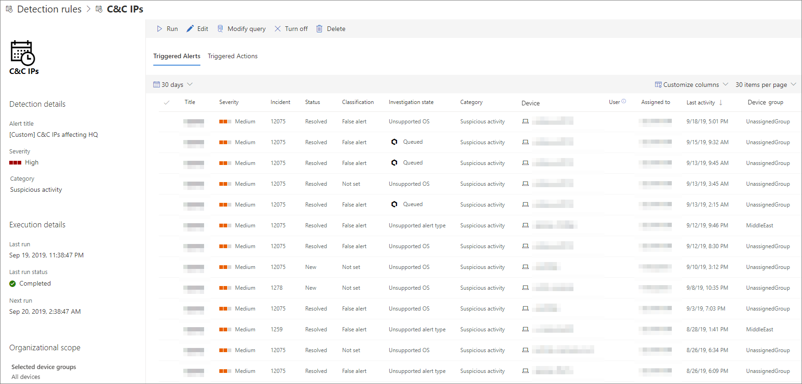

# 사용자 지정 검색 규칙 보기 및 관리View and manage custom detection rules

[!INCLUDE [Microsoft 365 Defender rebranding](../../includes/microsoft-defender.md)]

**적용 대상:****Applies to:**
- [엔드포인트용 Microsoft DefenderMicrosoft Defender for Endpoint](https://go.microsoft.com/fwlink/p/?linkid=2154037)
- [Microsoft 365 DefenderMicrosoft 365 Defender](https://go.microsoft.com/fwlink/?linkid=2118804)

>Endpoint용 Defender를 경험하고 싶나요?Want to experience Defender for Endpoint? [무료 평가판에 등록합니다.Sign up for a free trial.](https://www.microsoft.com/microsoft-365/windows/microsoft-defender-atp?ocid=docs-wdatp-assignaccess-abovefoldlink)

기존 사용자 지정 검색 [규칙을 관리하여](custom-detection-rules.md) 위협을 효과적으로 찾아 조치를 취하도록 합니다.Manage your existing [custom detection rules](custom-detection-rules.md) to ensure they are effectively finding threats and taking actions. 규칙 목록을 보고, 이전 실행을 확인하고, 트리거한 경고를 검토하는 방법을 탐색합니다.Explore how to view the list of rules, check their previous runs, and review the alerts they have triggered. 필요한 경우 규칙을 실행하고 수정할 수도 있습니다.You can also run a rule on demand and modify it.

## 필요한 사용 권한Required permissions

사용자 지정 검색을 만들거나 관리하려면 역할에 보안 설정 관리 **권한이 필요합니다.** To create or manage custom detections, [your role](user-roles.md#create-roles-and-assign-the-role-to-an-azure-active-directory-group) needs to have the **manage security settings** permission.

## 기존 규칙 보기View existing rules

모든 기존 사용자 지정 검색 규칙을 보기 위해 설정 **사용자** 지정  >  **검색으로 이동합니다.**To view all existing custom detection rules, navigate to **Settings** > **Custom detections**. 이 페이지에는 다음 실행 정보가 있는 모든 규칙이 나열됩니다.The page lists all the rules with the following run information:

- **마지막 실행**- 쿼리 일치를 확인하고 경고를 생성하기 위해 규칙을 마지막으로 실행한 경우**Last run**—when a rule was last run to check for query matches and generate alerts
- **마지막 실행 상태**- 규칙이 성공적으로 실행된지 여부**Last run status**—whether a rule ran successfully
- **다음 실행**-다음 예약된 실행**Next run**—the next scheduled run
- **상태**- 규칙이 켜져 있는지 여부**Status**—whether a rule has been turned on or off

## 규칙 세부 정보 보기, 규칙 수정 및 규칙 실행View rule details, modify rule, and run rule

사용자 지정 검색 규칙에 대한 포괄적인 정보를 표시하려면 설정 사용자 지정 검색의 규칙 목록에서 규칙  >  **이름을 선택합니다.**To view comprehensive information about a custom detection rule, select the name of rule from the list of rules in **Settings** > **Custom detections**. 선택한 규칙에 대한 페이지에는 다음 정보가 표시됩니다.A page about the selected rule displays the following information:

- 경고, 실행 상태 및 범위 세부 정보를 포함하여 규칙에 대한 일반 정보General information about the rule, including the details of the alert, run status, and scope
- 트리거된 경고 목록List of triggered alerts
- 트리거된 작업 목록List of triggered actions

 
*사용자 지정 검색 규칙 페이지**Custom detection rule page*

이 페이지에서 규칙에 대해 다음 작업을 수행할 수 있습니다.You can also take the following actions on the rule from this page:

- **를** 실행하여 규칙을 즉시 실행합니다.**Run**—run the rule immediately. 이 작업을 수행하면 다음 실행 간격도 다시 설정됩니다.This action also resets the interval for the next run.
- **편집**- 쿼리를 변경하지 않고 규칙 수정**Edit**—modify the rule without changing the query
- **쿼리 수정**-고급 헌팅에서 쿼리 편집**Modify query**—edit the query in advanced hunting
- **켜기**  /  **끄기**-규칙 사용 또는 실행 중지**Turn on** / **Turn off**—enable the rule or stop it from running
- **삭제**- 규칙을 끄고 제거**Delete**—turn off the rule and remove it

>[!TIP]
>정보를 빠르게 보고 표의 항목에 대한 작업을 수행하기 위해 표 왼쪽에 있는 [&#10003;] 열을 사용하세요.To quickly view information and take action on an item in a table, use the selection column [&#10003;] at the left of the table.

## 관련 항목Related topics
- [사용자 지정 검색 개요Custom detections overview](overview-custom-detections.md)
- [검색 규칙 만들기Create detection rules](custom-detection-rules.md)
- [지능형 헌팅 개요Advanced hunting overview](advanced-hunting-overview.md)
- [경고 보기 및 구성View and organize alerts](alerts-queue.md)
