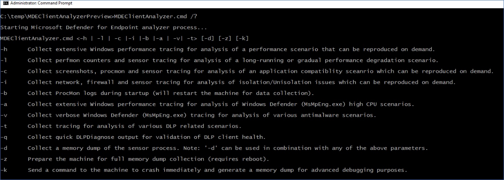

# Windows에서 고급 문제 해결을 위한 데이터 수집

**적용 대상:**
- [엔드포인트용 Microsoft Defender](https://go.microsoft.com/fwlink/p/?linkid=2146631)

Microsoft 지원 전문가와 공동 작업할 때 클라이언트 분석기를 사용하여 더 복잡한 시나리오의 문제 해결을 위한 데이터를 수집해야 할 수 있습니다. 분석기 스크립트는 해당 용도의 다른 매개 변수를 지원하며 조사해야 하는 관찰된 증상에 따라 특정 로그 집합을 수집할 수 있습니다.

'**MDEClientAnalyzer.cmd /?**' 실행 사용 가능한 매개 변수 목록과 해당 설명을 볼 수 있습니다.

> [!NOTE]
> 고급 문제 해결 매개 변수를 사용하는 경우  분석기에서 관련MpCmdRun.exe로그를 Microsoft Defender 바이러스 백신 호출합니다.

**-h** -  Windows 성능 레코더를 호출하여 표준 로그 집합 외에 일반적인 성능 추적을 수집합니다.

**-l** - 기본 제공 Windows [성능](/windows-server/remote/remote-desktop-services/rds-rdsh-performance-counters) 모니터를 호출하여 간단한 성능 추적을 수집합니다. 이 기능은 시간이 경과할 때 발생하는 성능 저하 문제를 감속하지만 요구 시 재현하기 어려운 경우 유용할 수 있습니다.

**-c** - 실시간 [파일](/sysinternals/downloads/procmon) 시스템, 레지스트리 및 프로세스/스레드 작업의 고급 모니터링을 위한 프로세스 모니터 호출 이 기능은 다양한 응용 프로그램 호환성 시나리오 문제를 해결할 때 특히 유용합니다.

**-i** - 기본 제공 netsh.exe명령을 호출하여 다양한 네트워크 관련 문제를 해결할 때 유용한 네트워크 및 Windows 방화벽 추적을 시작할 수 있습니다.

**-b** - '-c'과 동일하지만 다음 부팅 중에 프로세스 모니터 추적이 시작된 후 -b가 다시 사용될 때만 중지됩니다.

**-a** - Windows [성능](/windows-hardware/test/wpt/wpr-command-line-options) 레코더를 호출하여 바이러스 백신 프로세스(MsMpEng.exe)에 관련된 높은 CPU 문제 분석과 관련된 구체적인 성능 추적을 MsMpEng.exe.

**-v** - 대부분의MpCmdRun.exe [ 명령줄](/windows/security/threat-protection/microsoft-defender-antivirus/command-line-arguments-microsoft-defender-antivirus) 인수에 바이러스 백신을 사용하여 -trace 플래그를 지정합니다.

**-t** - 끝점 DLP와 관련된 모든 클라이언트 쪽 구성 요소의 전체 추적을 시작합니다. 이 기능은 파일에 대해 [DLP](/microsoft-365/compliance/endpoint-dlp-learn-about#endpoint-activities-you-can-monitor-and-take-action-on) 작업이 예상대로 수행되지 않는 시나리오에 유용합니다.

**-q** - DLPDiagnose.ps1 DLP에 대한 기본 구성 및 요구 사항의 유효성을 검사하는 분석기 '도구' 디렉터리에서 스크립트를 호출합니다.

**-d** - MsSense **S**.exe(Windows Server 2016 OS의 센서 프로세스) 및 관련 프로세스의 메모리 덤프를 수집합니다.

- \* 이 플래그는 위에서 언급한 플래그와 함께 사용할 수 있습니다.
- \*\* 현재는 MsSense.exe 또는 MsMpEng.exe [같은 PPL](/windows-hardware/drivers/install/early-launch-antimalware) 보호 프로세스의 메모리 덤프 캡처가 지원되지 않습니다.

**-z** - [CrashOnCtrlScroll을](/windows-hardware/drivers/debugger/forcing-a-system-crash-from-the-keyboard)통해 전체 컴퓨터 메모리 덤프 컬렉션을 준비하도록 컴퓨터의 레지스트리 키를 구성합니다. 이는 컴퓨터 고정 문제를 분석하는 데 유용합니다.

\* 가장 오른쪽에 있는 Ctrl 키를 누른 다음 SCROLL Lock 키를 두 번 누르고 있습니다.

**-k** - [NotMyFault](/sysinternals/downloads/notmyfault) 도구를 사용하여 시스템이 강제로 충돌하고 컴퓨터 메모리 덤프를 생성합니다. 이 기능은 다양한 OS 안정성 문제를 분석하는 데 유용합니다.

분석기 도구et에 번들로 묶인 'RemoteMDEClientAnalyzer.cmd'를 실행하여 분석기 및 위의 모든 시나리오 플래그를 원격으로 시작할 수 있습니다.

> [!NOTE]
>
> - RemoteMDEClientAnalyzer.cmd를 사용하는 경우 psexec로 호출하여 구성된 파일 공유에서 도구를 다운로드한 다음 파일을 통해 로컬로 PsExec.exe.
    CMD 스크립트는 '-r' 플래그를 사용하여 SYSTEM 컨텍스트 내에서 원격으로 실행되고 있으므로 사용자에게 메시지를 표시하지 않습니다.
> - MDEClientAnalyzer.cmd와 동일한 플래그를 사용하여 데이터 수집에 대한 시간(분)을 지정하라는 메시지가 사용자에게 표시되지 않도록 할 수 있습니다. 예시:
>
>    **MDEClientAnalyzer.cmd -r -i -m 5**
>
>   - **-r** - 도구가 원격(또는 비대화형 컨텍스트)에서 실행되고 있는 것을 나타냅니다.
>   - **-i** - 다른 관련 로그와 함께 네트워크 추적 컬렉션에 대한 시나리오 플래그
>   - **-m** \# - 실행할 시간(분)(위의 예에서는 5분)
