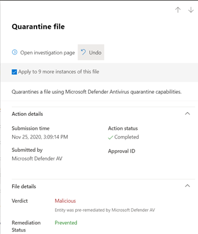

# Endpoint용 Microsoft Defender에서 가양성/가음성 처리

[!INCLUDE [Microsoft 365 Defender rebranding](../../includes/microsoft-defender.md)]

**적용 대상**

- [엔드포인트용 Microsoft Defender](https://go.microsoft.com/fwlink/p/?linkid=2146806) 

끝점 보호 솔루션에서 가짓 긍정은 엔터티가 실제로 위협이 아닌 경우에도 악성으로 검색되고 식별된 파일 또는 프로세스와 같은 엔터티입니다. 거짓 부정은 실제로 악의적이어도 위협으로 검색되지 않은 엔터티입니다. 끝점용 Microsoft Defender를 포함하여 모든 위협 방지 솔루션에서 [가긍성/부정이](microsoft-defender-endpoint.md)발생할 수 있습니다.

다행히 이러한 종류의 문제를 해결하고 줄이기 위한 단계를 수행하면 됩니다. [Microsoft Defender](../defender/microsoft-365-security-center-mde.md)보안 센터에 가음성/부정이 표시될 경우 보안 작업은 다음 프로세스를 사용하여 이를 해결하기 위한 단계를 취할 수 있습니다.

1.  [경고 검토 및 분류](#part-1-review-and-classify-alerts) 
2.  [수행된 수정 작업 검토](#part-2-review-remediation-actions)
3.  [제외 검토 및 정의](#part-3-review-or-define-exclusions)
4.  [분석을 위해 엔터티 제출](#part-4-submit-a-file-for-analysis)
5.  [위협 방지 설정 검토 및 조정](#part-5-review-and-adjust-your-threat-protection-settings)

이 문서에 설명된 작업을 수행한 후에도 여전히 가짓 긍정/음의 문제가 있는 경우 도움을 받을 수 있습니다. 도움이 [필요한 경우를 참조하세요.](#still-need-help)

> [!NOTE]
> 이 문서는 [끝점용 Microsoft Defender를](microsoft-defender-endpoint.md)사용하는 보안 운영자 및 보안 관리자를 위한 지침입니다.

## 1부: 경고 검토 및 분류

악의적  또는 의심스러운 것으로 감지된 것으로 감지된 것으로서 트리거된 경고가 표시되면 해당 엔터티에 대한 경고를 표시하지 않을 수 있습니다. 또한 반드시 가음성일 필요는 없지만 이의를 표시하지 않는 경고를 표시하지 않을 수도 있습니다. 경고도 분류하는 것이 좋습니다. 

경고를 관리하고 참/거짓 긍정을 분류하면 위협 방지 솔루션을 교육하는 데 도움이 되고 시간 경과에 따라 가짓 긍정 또는 거짓 부정 수를 줄일 수 있습니다. 이러한 단계를 수행하면 보안 팀이 우선 순위가 높은 작업 항목에 집중할 수 있도록 보안 작업 대시보드에서 노이즈를 줄이는 데도 도움이 됩니다.

### 경고가 정확한지 확인

경고를 분류하거나 표시하지 말고 경고가 정확한지, 가음성인지 또는 양성인지 여부를 결정해야 합니다.

1. Microsoft Defender 보안 센터()로 이동하여 [https://securitycenter.windows.com](https://securitycenter.windows.com) 로그인합니다.

2. 탐색 창에서 경고 큐 **를 선택 합니다.**

3. 경고에 대한 자세한 내용을 확인하려면 경고를 선택합니다. [(Endpoint에 대한 Microsoft Defender의 경고 검토를 참조합니다.)](review-alerts.md)

4. 경고 상태에 따라 다음 표에 설명된 단계를 수행합니다. 

| 경고 상태 | 수행할 작업 |
|:---|:---|
| 경고가 정확합니다. | 경고를 할당한 다음 추가로 [조사합니다.](investigate-alerts.md) |
| 경고가 가긍성입니다. | 1. [경고를 가짓 긍정으로](#classify-an-alert) 분류합니다.  2. [경고를 표시하지 않습니다.](#suppress-an-alert)   3. [끝점용](#indicators-for-microsoft-defender-for-endpoint) Microsoft Defender에 대한 표시기를 생성합니다.   4. [분석을 위해 Microsoft에 파일을 제출합니다.](#part-4-submit-a-file-for-analysis) |
| 경고는 정확하지만 양성(미미한) | [경고를](#classify-an-alert) 실제 양의 경고로 분류한 다음 [경고를 표시하지 않습니다.](#suppress-an-alert) |

### 경고 분류

경고는 Microsoft Defender 보안 센터에서 가짓 긍정 또는 참 긍정으로 분류될 수 있습니다. 경고를 분류하면 시간이 지날수록 더 많은 참 경고와 더 적은 거짓 경고를 볼 수 있도록 끝점에 대해 Microsoft Defender를 교육하는 데 도움이 됩니다.

1. Microsoft Defender 보안 센터()로 이동하여 [https://securitycenter.windows.com](https://securitycenter.windows.com) 로그인합니다.

2. 경고 **큐 를** 선택한 다음 경고를 선택합니다.

3. 선택한 경고에 대해 **작업** 관리  >  **경고 를 선택합니다.** 플라이아웃 창이 열립니다.

4. 경고 **관리 섹션에서** True 경고 또는 **거짓 경고** **를 선택합니다.** (False **경고를 사용하여** 가음성 분류)

> [!TIP]
> 경고 표시 안 에 대한 자세한 내용은 [Endpoint 경고에 대한 Microsoft Defender 관리를 참조하세요.](/microsoft-365/security/defender-endpoint/manage-alerts) 또한 조직에서 SIEM(보안 정보 및 이벤트 관리) 서버를 사용하는 경우 제거 규칙도 정의해야 합니다. 

### 경고 표시 안

가음성 또는 참 긍정이지만 미미한 이벤트에 대한 경고가 있는 경우 Microsoft Defender 보안 센터에서 해당 경고를 표시하지 않습니다. 경고를 표시하지는 것은 보안 작업 대시보드에서 노이즈를 줄이는 데 도움이 됩니다. 

1. Microsoft Defender 보안 센터()로 이동하여 [https://securitycenter.windows.com](https://securitycenter.windows.com) 로그인합니다.

2. 탐색 창에서 경고 큐 **를 선택합니다.**

3. 세부 정보 창을 열기 위해 표시하지하려는 **경고를** 선택합니다.

4. 세부 **정보 창에서** 타원(**...**)을 선택한 다음 제거 **규칙 만들기 를 선택 합니다.**

5. 제거 규칙에 대한 모든 설정을 지정한 다음 저장 을 **선택합니다.**

> [!TIP]
> 제거 규칙에 대한 도움이 필요하세요? 경고 [표시 안 를 참조하고 새 제거 규칙 만들기를 참조합니다.](/microsoft-365/security/defender-endpoint/manage-alerts#suppress-an-alert-and-create-a-new-suppression-rule)

## 2부: 재구성 작업 검토

[파일을 검지로](manage-auto-investigation.md#remediation-actions)보내거나 프로세스를 중지하는 등의 수정 작업은 위협으로 감지된 엔터티(예: 파일)에 대해 수행됩니다. 자동화된 조사 및 Microsoft Defender 바이러스 백신을 통해 여러 가지 유형의 수정 작업이 자동으로 수행됩니다.   
- 파일 Quarantine a file
- 레지스트리 키 제거
- 프로세스 숨기기
- 서비스 중지
- 드라이버를 사용하지 않도록 설정
- 예약된 작업 제거

바이러스 백신 검사 시작 또는 조사 패키지 수집과 같은 기타 작업은 수동 또는 [라이브 응답을 통해 수행됩니다.](live-response.md) Live Response를 통해 수행된 작업은 다시 수행할 수 없습니다.

알림을 검토한 후 다음 단계는 수정 작업을 [검토하는 것입니다.](manage-auto-investigation.md) 가짓 긍정으로 인해 작업이 수행된 경우 대부분의 종류의 수정 작업을 취소할 수 있습니다. 특히 다음을 할 수 있습니다.
- [한 번의 작업 실행 취소](#undo-an-action)
- [한 번씩 여러 작업을 취소합니다.](#undo-multiple-actions-at-one-time) 및 
- 여러 장치에서 파일을 [검지에서 제거합니다.](#remove-a-file-from-quarantine-across-multiple-devices) 

가짓 긍정의 결과로 수행된 작업의 검토 및 취소가 완료되면 계속 검토하거나 [제외를 정의합니다.](#part-3-review-or-define-exclusions)

### 완료된 작업 검토

1. Go to the Action center ( [https://securitycenter.windows.com/action-center](https://securitycenter.windows.com/action-center) ) and sign in. 

2. 사용 기록 **탭을** 선택하여 수행된 작업 목록을 볼 수 있습니다.  

3. 항목을 선택하여 수행된 수정 조치에 대한 자세한 정보를 볼 수 있습니다.

### 작업 실행 취소

1. Go to the Action center ( [https://securitycenter.windows.com/action-center](https://securitycenter.windows.com/action-center) ) and sign in.

2. 사용 **기록 탭에서** 실행 취소할 작업을 선택합니다.

3. 플라이아웃 창에서 **취소를 선택합니다.** 이 메서드를 사용하여 작업을 취소할 수 없는 경우 실행 취소 **단추가 표시되지** 않습니다. 자세한 내용은 완료된 작업 [취소를 참조합니다.](manage-auto-investigation.md#undo-completed-actions)

### 한 번씩 여러 작업 취소

1. Go to the Action center ( [https://securitycenter.windows.com/action-center](https://securitycenter.windows.com/action-center) ) and sign in.

2. 사용 **기록 탭에서** 취소할 작업을 선택합니다.

3. 화면 오른쪽 창에서 **취소를 선택합니다.**

### 여러 장치에서 파일 제거 

> [!div class="mx-imgBorder"]
> 

1. Go to the Action center ( [https://securitycenter.windows.com/action-center](https://securitycenter.windows.com/action-center) ) and sign in.

2. 사용 기록 **탭에서** 작업 유형이 **Quarantine** file인 파일을 선택합니다.

3. 화면 오른쪽 창에서 이 파일의 X **추가** 인스턴스에 적용을 선택한 다음 실행 **취소를 선택합니다.** 

## 3부: 제외 검토 또는 정의

제외는 수정 작업의 예외로 지정하는 파일 또는 URL과 같은 엔터티입니다. 제외된 엔터티는 계속 검색될 수 있지만 이 엔터티에 대해 수정 작업이 수행되지 않습니다. 즉, 검색된 파일 또는 프로세스가 중지되거나, 끝점용 Microsoft Defender에 의해 중지, 제거 또는 변경되지 않습니다. 

끝점용 Microsoft Defender에서 제외를 정의하기 위해 다음 작업을 수행합니다.
- [Microsoft Defender 바이러스 백신에 대한 제외 정의](#exclusions-for-microsoft-defender-antivirus)
- [끝점용 Microsoft Defender에 대한 "허용" 표시기 만들기](#indicators-for-microsoft-defender-for-endpoint)

> [!NOTE]
> Microsoft Defender 바이러스 백신 제외는 다른 끝점용 Microsoft Defender 기능이 아닌 바이러스 백신 보호에만 적용됩니다. 파일을 광범위하게 제외하려면 Microsoft Defender 바이러스 백신에  대한 제외와 끝점용 Microsoft Defender에 대한 사용자 지정 표시기를 사용 합니다.

이 섹션의 절차에서는 제외 및 표시기를 정의하는 방법에 대해 설명합니다.

### Microsoft Defender 바이러스 백신 제외

일반적으로 Microsoft Defender 바이러스 백신에 대한 제외를 정의할 필요가 없습니다. 제외는 반드시 정의해야 합니다. 그리고 가을의 결과로 생성되는 파일, 폴더, 프로세스 및 프로세스에서 연 파일만 포함해야 합니다. 또한 정의된 제외를 정기적으로 검토해야 합니다. Microsoft [Endpoint Manager를](/mem/endpoint-manager-overview) 사용하여 바이러스 백신 제외를 정의하거나 편집하는 것이 좋습니다. 그러나 그룹 정책과 같은 다른  방법을 사용할 수 [있습니다(끝점용 Microsoft Defender 관리 참조).](manage-atp-post-migration.md)

> [!TIP]
> 바이러스 백신 제외에 대한 도움이 필요하세요? Microsoft Defender 바이러스 백신 검사에 대한 제외 구성 [및 유효성 검사를 참조합니다.](/windows/security/threat-protection/microsoft-defender-antivirus/configure-exclusions-microsoft-defender-antivirus)

#### Microsoft Endpoint Manager를 사용하여 바이러스 백신 제외 관리(기존 정책의 경우)

1. Microsoft Endpoint Manager 관리 센터()로 이동하여 [https://endpoint.microsoft.com](https://endpoint.microsoft.com) 로그인합니다.

2. 끝점 **보안 바이러스 백신** 을 선택한 다음 기존 정책을  >  선택합니다. 기존 정책이 없는 경우 또는 새 정책을 만들 수 있는 경우 다음 절차로 [건너뛰어도 됩니다.](#use-microsoft-endpoint-manager-to-create-a-new-antivirus-policy-with-exclusions)

3. 속성 **을** 선택하고 구성 설정 **옆에** 있는 편집 **을 선택합니다.**

4. **Microsoft Defender 바이러스** 백신 제외를 확장한 다음 제외를 지정합니다.

5. 검토 **+ 저장 을** 선택한 다음 저장 을 **선택 합니다.**

#### Microsoft Endpoint Manager를 사용하여 제외가 있는 새 바이러스 백신 정책 만들기

1. Microsoft Endpoint Manager 관리 센터()로 이동하여 [https://endpoint.microsoft.com](https://endpoint.microsoft.com) 로그인합니다.

2. 끝점 **보안 바이러스**  >  **백신**  >  **+ 정책 만들기 를 선택 합니다.** 

3. **플랫폼(예: Windows 10 이상,** **macOS** 또는 **Windows 10 및 Windows Server)을 선택합니다.**

4. 프로필에서 **Microsoft Defender 바이러스** 백신 제외를 선택한 다음 만들기 를 **선택합니다.** 

5. 프로필의 이름과 설명을 지정하고 다음 을 **선택하십시오.**

6. 구성 **설정 탭에서** 바이러스 백신 제외를 지정하고 다음 을 **선택합니다.**

7. 조직에서  범위 태그를 사용하는 경우 범위 태그 탭에서 만들 정책의 범위 태그를 지정합니다. 범위 [태그를 참조합니다.](/mem/intune/fundamentals/scope-tags)

8. 할당 **탭에서** 정책을 적용할 사용자 및 그룹을 지정하고 다음 을 **선택합니다.** 할당에 대한 도움이 필요한 경우 [Microsoft Intune에서](/mem/intune/configuration/device-profile-assign)사용자 및 장치 프로필 할당을 참조하세요.

9. 검토 **+ 만들기 탭에서** 설정을 검토한 다음 만들기 를 **선택합니다.**

### 끝점용 Microsoft Defender 표시기

[지표(특히](/microsoft-365/security/defender-endpoint/manage-indicators) 손상 표시기 또는 IoC)를 사용하면 보안 운영 팀이 엔터티의 검색, 방지 및 제외를 정의할 수 있습니다. 예를 들어 끝점용 Microsoft Defender의 검사 및 수정 작업에서 생략할 특정 파일을 지정할 수 있습니다. 또는 표시기를 사용하여 특정 파일, IP 주소 또는 URL에 대한 알림을 생성할 수 있습니다.

엔터티를 끝점용 Microsoft Defender에 대한 제외로 지정하기 위해 해당 엔터티에 대한 "허용" 표시기를 생성합니다. 끝점용 Microsoft Defender의 이러한 "허용" 표시기는 차세대  [보호,](/windows/security/threat-protection/microsoft-defender-antivirus/microsoft-defender-antivirus-in-windows-10)끝점 감지 및 대응 및 자동화된 조사 & [적용됩니다.](/microsoft-365/security/defender-endpoint/automated-investigations)

다음에 대해 "허용" 표시기를 만들 수 있습니다.

- [파일](#indicators-for-files)
- [IP 주소, URL 및 도메인](#indicators-for-ip-addresses-urls-or-domains)
- [응용 프로그램 인증서](#indicators-for-application-certificates)

#### 파일에 대한 표시기

실행 파일과 같은 파일에 [대한 "허용"](/microsoft-365/security/defender-endpoint/indicator-file)표시기를 만들면 조직에서 사용하는 파일이 차단되지 않도록 할 수 있습니다. 파일에는 PE(이식 가능한 실행 파일) 파일(예: 및 파일)이 `.exe` `.dll` 포함됩니다. 

파일에 대한 표시기를 만들기 전에 다음 요구 사항을 충족하는지 확인합니다.
- Microsoft Defender 바이러스 백신은 클라우드 기반 보호를 사용하도록 구성됩니다(클라우드 기반 보호 [관리 참조).](/windows/security/threat-protection/microsoft-defender-antivirus/deploy-manage-report-microsoft-defender-antivirus)
- 맬웨어 방지 클라이언트 버전은 4.18.1901.x 이상입니다. 
- 디바이스에서 Windows 10 버전 1703 이상을 실행하고 있습니다. Windows Server 2016; 또는 Windows Server 2019 
- 차단 [또는 허용 기능이 켜져 있습니다.](/microsoft-365/security/defender-endpoint/advanced-features) 

#### IP 주소, URL 또는 도메인에 대한 표시기

IP 주소, URL 또는 도메인에 [대한 "허용"](/microsoft-365/security/defender-endpoint/indicator-ip-domain)표시기를 만들면 조직에서 사용하는 사이트 또는 IP 주소가 차단되지 않도록 할 수 있습니다.

IP 주소, URL 또는 도메인에 대한 표시기를 만들기 전에 다음 요구 사항을 충족하는지 확인합니다.
- 끝점용 Defender의 네트워크 보호는 차단 모드에서 사용하도록 설정됩니다(네트워크 [보호 사용 참조).](/microsoft-365/security/defender-endpoint/enable-network-protection)
- 맬웨어 방지 클라이언트 버전은 4.18.1906.x 이상입니다. 
- 디바이스에서 Windows 10 버전 1709 이상을 실행하고 있습니다. 

Microsoft Defender 보안 센터에서 사용자 지정 네트워크 표시기가 켜져 [있습니다(고급 기능 참조).](/microsoft-365/security/defender-endpoint/advanced-features)   

#### 응용 프로그램 인증서 표시기 

응용 프로그램 [인증서에 대한 "허용"](/microsoft-365/security/defender-endpoint/indicator-certificates)표시기를 만들면 조직에서 사용하는 응용 프로그램(예: 내부 개발 응용 프로그램)이 차단되지 않도록 방지할 수 있습니다. `.CER` 또는 `.PEM` 파일 확장명을 지원합니다.   

응용 프로그램 인증서에 대한 표시기를 만들기 전에 다음 요구 사항을 충족하는지 확인합니다.
- Microsoft Defender 바이러스 백신은 클라우드 기반 보호를 사용하도록 구성됩니다(클라우드 기반 보호 [관리 참조).](/windows/security/threat-protection/microsoft-defender-antivirus/deploy-manage-report-microsoft-defender-antivirus)
- 맬웨어 방지 클라이언트 버전은 4.18.1901.x 이상입니다. 
- 디바이스에서 Windows 10 버전 1703 이상을 실행하고 있습니다. Windows Server 2016; 또는 Windows Server 2019 
- 바이러스 및 위협 방지 정의가 최신입니다.  

> [!TIP]
> 지표를 만들 때 하나씩 정의하거나 한 번씩 여러 항목을 가져올 수 있습니다. 단일 테넌트에 대한 표시기는 15,000개로 제한됩니다. 또한 파일 해시 정보와 같은 특정 세부 정보를 먼저 수집해야 할 수 있습니다. 표시기를 만들기 전에 선행 준비 상태를 [검토해야 합니다.](manage-indicators.md) 

## 4부: 분석을 위해 파일 제출

분석을 위해 파일 및 파일 없는 검색과 같은 엔터티를 Microsoft에 제출할 수 있습니다. Microsoft 보안 연구원은 모든 제출을 분석하고 해당 결과를 통해 Microsoft Defender에 Endpoint 위협 방지 기능을 알릴 수 있습니다. 제출 사이트에서 로그인하면 제출을 추적할 수 있습니다.

### 분석을 위해 파일 제출

악성으로 잘못 감지되거나 누락된 파일이 있는 경우 다음 단계에 따라 분석을 위해 파일을 제출합니다.

1. 분석을 위해 파일 [제출에 대한 지침을 검토합니다.](/windows/security/threat-protection/intelligence/submission-guide)

2. Microsoft 보안 인텔리전스 제출 사이트( )를 방문하고 [https://www.microsoft.com/wdsi/filesubmission](https://www.microsoft.com/wdsi/filesubmission) 파일을 제출합니다.

### 분석을 위해 파일 없는 검색 제출

동작에 따라 맬웨어로 검색된 파일도 없는 경우 분석을 위해 파일을 `Mpsupport.cab` 제출할 수 있습니다. Windows 10의 Microsoft 맬웨어 보호 Command-Line 유틸리티(MPCmdRun.exe) 도구를 사용하여 *.cab* 파일을 얻을 수 있습니다.

1.  로 ` C:\ProgramData\Microsoft\Windows Defender\Platform\<version>` 이동한 다음 관리자 `MpCmdRun.exe` 권한으로 실행합니다.

2.  를 `mpcmdrun.exe -GetFiles` 입력한 다음 **Enter를 누르고 를 입력합니다.**
   다양한 진단 로그가 포함된 .cab 파일이 생성됩니다. 파일의 위치는 명령 프롬프트 출력에 지정됩니다. 기본적으로 위치는 `C:\ProgramData\Microsoft\Microsoft Defender\Support\MpSupportFiles.cab` 입니다.

3.  분석을 위해 파일 [제출에 대한 지침을 검토합니다.](/windows/security/threat-protection/intelligence/submission-guide)

4.  Microsoft 보안 인텔리전스 제출 사이트( [https://www.microsoft.com/wdsi/filesubmission](https://www.microsoft.com/wdsi/filesubmission) )를 방문하여 .cab 파일을 제출합니다.

### 파일이 제출된 후 어떻게 하나요?

제출은 분석가가 사례 처리를 시작하기 전에 최신 판정을 제공하기 위해 시스템에서 즉시 검사됩니다. 분석가가 파일을 이미 제출하고 처리한 것일 수 있습니다. 이러한 경우 신속하게 결정됩니다.

아직 처리되지 않은 제출의 경우 다음과 같이 분석 우선 순위가 지정됩니다.

- 많은 컴퓨터에 영향을 줄 가능성이 있는 보급된 파일에는 더 높은 우선 순위가 부여됩니다.
- 인증된 고객, 특히 유효한 [SAID(Software Assurance ID)가](https://www.microsoft.com/licensing/licensing-programs/software-assurance-default.aspx)있는 엔터프라이즈 고객에게는 높은 우선 순위가 부여됩니다.
- SAID 소유자가 우선 순위가 높은 것으로 플래그를 지정한 제출은 즉시 주의를 기울입니다.

제출에 대한 업데이트를 확인하거나 Microsoft 보안 인텔리전스 제출 사이트에서 [로그인합니다.](https://www.microsoft.com/wdsi/filesubmission) 

> [!TIP]
> 자세한 내용은 분석을 위해 [파일 제출을 참조합니다.](/windows/security/threat-protection/intelligence/submission-guide#how-does-microsoft-prioritize-submissions)

## 5부: 위협 방지 설정 검토 및 조정

끝점용 Microsoft Defender는 다양한 기능 및 기능에 대한 설정을 미세 조정하는 기능을 포함하여 다양한 옵션을 제공합니다. 많은 가의 긍정이 있는 경우 조직의 위협 방지 설정을 검토해야 합니다. 다음을 조정해야 할 수 있습니다.

- [클라우드 제공 보호](#cloud-delivered-protection)
- [잠재적으로 원치 않는 응용 프로그램에 대한 수정](#remediation-for-potentially-unwanted-applications)
- [자동화된 조사 및 수정](#automated-investigation-and-remediation)

### 클라우드 제공 보호

Microsoft Defender 바이러스 백신에 대한 클라우드 제공 보호 수준을 검사합니다. 기본적으로 클라우드 제공 보호는 구성되지 않습니다.로 설정되어 있습니다. 이는 대부분의 조직에 대한 일반적인 보호 수준에 해당합니다.  클라우드 제공 보호가 **높음,** **높음 +** 또는 허용 오차가 **0으로** 설정된 경우 가음성 수가 더 높을 수 있습니다.

> [!TIP]
> 클라우드 제공 보호 구성에 대한 자세한 내용은 클라우드 제공 보호 수준 [지정을 참조합니다.](/windows/security/threat-protection/microsoft-defender-antivirus/specify-cloud-protection-level-microsoft-defender-antivirus)

[Microsoft Endpoint Manager를](/mem/endpoint-manager-overview) 사용하여 클라우드 제공 보호 설정을 편집하거나 설정하는 것이 좋습니다. 그러나 그룹 정책과 같은 다른  방법을 사용할 수 [있습니다(끝점용 Microsoft Defender 관리 참조).](manage-atp-post-migration.md)

#### Microsoft Endpoint Manager를 사용하여 클라우드 제공 보호 설정 검토 및 편집(기존 정책의 경우)

1. Microsoft Endpoint Manager 관리 센터()로 이동하여 [https://endpoint.microsoft.com](https://endpoint.microsoft.com) 로그인합니다.

2. 끝점 **보안 바이러스 백신을**  >  **선택한** 다음 기존 정책을 선택합니다. 기존 정책이 없는 경우 또는 새 정책을 만들 수 있는 경우 다음 절차로 [건너뛰어도 됩니다.](#use-microsoft-endpoint-manager-to-set-cloud-delivered-protection-settings-for-a-new-policy)

3. **관리에서** 속성을 **선택합니다.** 그런 다음 구성 설정 **옆에 있는** 편집 을 **선택합니다.**

4. 클라우드 **보호를 확장하고** 클라우드 제공 보호 수준 행에서 현재 설정을 **검토합니다.** 클라우드 제공 보호를 구성되지 않은으로 설정하는 것이 좋습니다. 이 기능은 강력한 보호 기능을 제공하는 동시에 가긍성의 확률을 줄입니다. 

5. 검토 **+ 저장 을** 선택한 다음 저장 **을 선택 합니다.**

#### Microsoft Endpoint Manager를 사용하여 클라우드 제공 보호 설정 설정(새 정책의 경우)

1. Microsoft Endpoint Manager 관리 센터()로 이동하여 [https://endpoint.microsoft.com](https://endpoint.microsoft.com) 로그인합니다.

2. 끝점 **보안 바이러스**  >  **백신**  >  **+ 정책 만들기 를 선택 합니다.**

3. 플랫폼의 경우 옵션을 선택하고 프로필에서 바이러스  백신 또는 **Microsoft Defender 바이러스** 백신을 선택합니다(특정 옵션은 플랫폼에 대해 선택한 대상에 따라 **다를 수** 있습니다.   그런 다음 만들기 **를 선택.**

4. 기본 **탭에서** 정책의 이름과 설명을 지정합니다. 그런 후 **다음** 을 선택합니다.

5. 구성 **설정 탭에서** 클라우드 **보호를** 확장하고 다음 설정을 지정합니다.
   - 클라우드 **제공 보호 켜기 를** **예로 설정**
   - 클라우드 **제공 보호 수준을 구성되지** 않은 **으로 설정** (이 수준은 기본적으로 강력한 수준의 보호를 제공하면서 가음성의 확률을 줄입니다.)

6. 조직에서  범위 태그를 사용하는 경우 범위 태그 탭에서 정책의 범위 태그를 지정합니다. 범위 [태그를 참조합니다.](/mem/intune/fundamentals/scope-tags)

7. 할당 **탭에서** 정책을 적용할 사용자 및 그룹을 지정하고 다음 을 **선택합니다.** 할당에 대한 도움이 필요한 경우 [Microsoft Intune에서](/mem/intune/configuration/device-profile-assign)사용자 및 장치 프로필 할당을 참조하세요.

8. 검토 **+ 만들기 탭에서** 설정을 검토한 다음 만들기 를 **선택합니다.**  

### 잠재적으로 원치 않는 응용 프로그램에 대한 수정

PUA(사용자 없이도 사용 가능한 응용 프로그램)는 장치가 느리게 실행되거나 예기치 않은 광고를 표시하거나 예기치 않게 또는 원치 않는 다른 소프트웨어를 설치할 수 있는 소프트웨어 범주입니다. PUA의 예로는 광고 소프트웨어, 번들링 소프트웨어 및 보안 제품과 다르게 행동하는 피하기 소프트웨어가 있습니다. PUA는 맬웨어로 간주되지는 않습니다. 그러나 일부 소프트웨어의 일부는 동작 및 신뢰도에 따라 PUA입니다.

> [!TIP]
> PUA에 대한 자세한 내용은 잠재적으로 원치 않는 응용 프로그램 검색 및 [차단을 참조합니다.](/windows/security/threat-protection/microsoft-defender-antivirus/detect-block-potentially-unwanted-apps-microsoft-defender-antivirus)
 
조직에서 사용하는 앱에 따라 PUA 보호 설정의 결과로 가극적 긍정을 가지게 될 수 있습니다. 필요한 경우 한 동안 감사 모드에서 PUA 보호를 실행하거나 조직의 디바이스 하위 집합에 PUA 보호를 적용하는 것이 좋습니다. MICROSOFT Edge 브라우저 및 Microsoft Defender 바이러스 백신에 대해 PUA 보호를 구성할 수 있습니다.

[Microsoft Endpoint Manager를 사용하여](/mem/endpoint-manager-overview) PUA 보호 설정을 편집하거나 설정하는 것이 좋습니다. 그러나 그룹 정책과 같은 다른  방법을 사용할 수 [있습니다(끝점용 Microsoft Defender 관리 참조).](manage-atp-post-migration.md)

#### Microsoft Endpoint Manager를 사용하여 PUA 보호 편집(기존 구성 프로필의 경우)

1. Microsoft Endpoint Manager 관리 센터()로 이동하여 [https://endpoint.microsoft.com](https://endpoint.microsoft.com) 로그인합니다.

2. 장치   >  **구성 프로필을 선택한** 다음 기존 정책을 선택합니다. 기존 정책이 없는 경우 또는 새 정책을 만들 수 있는 경우 다음 절차로 [건너뛰어도 됩니다.](#use-microsoft-endpoint-manager-to-set-pua-protection-for-a-new-configuration-profile)

3. 관리에서 **속성 을** 선택한 다음 구성 설정 옆에 **있는** 편집 을 **선택합니다.** 

4. 구성 **설정 탭에서** 아래로 스크롤하여 **Microsoft Defender 바이러스 백신을 확장합니다.**

5. 잠재적으로 **원치 않는 응용 프로그램 검색을** 감사로 **설정** (이 기능을 해제할 수 있지만 감사 모드를 사용하면 검색을 볼 수 있습니다.)

6. 검토 **+ 저장 을** 선택한 다음 저장 을 **선택 합니다.**

#### Microsoft Endpoint Manager를 사용하여 PUA 보호 설정(새 구성 프로필)

1. Microsoft Endpoint Manager 관리 센터()로 이동하여 [https://endpoint.microsoft.com](https://endpoint.microsoft.com) 로그인합니다.

2. 장치 **구성**  >  **프로필**  >  **+ 프로필 만들기 를 선택하세요.**

3. 플랫폼에서 Windows **10 이상을** 선택하고 **프로필에 대해** 장치 **제한을 선택합니다.**

4. 기본 **탭에서** 정책의 이름과 설명을 지정합니다. 그런 후 **다음** 을 선택합니다.

5. 구성 **설정 탭에서** 아래로 스크롤하여 **Microsoft Defender 바이러스 백신을 확장합니다.**

6. 잠재적으로 **원치 않는 응용 프로그램 검색을** **감사로** 설정하고 다음 을 **선택 합니다.** PUA 보호를 해제할 수 있지만 감사 모드를 사용하면 검색을 볼 수 있습니다.

7. 할당 **탭에서** 정책을 적용할 사용자 및 그룹을 지정하고 다음 을 **선택합니다.** 할당에 대한 도움이 필요한 경우 [Microsoft Intune에서](/mem/intune/configuration/device-profile-assign)사용자 및 장치 프로필 할당을 참조하세요.

8. 적용 **가능성 규칙** 탭에서 정책을 포함하거나 제외할 OS 버전을 지정합니다. 예를 들어 Windows 10의 특정 버전에 따라 모든 디바이스에 적용될 정책을 설정할 수 있습니다. 그런 후 **다음** 을 선택합니다.

9. 검토 **+ 만들기 탭에서** 설정을 검토한 다음 만들기를 **선택합니다.**

### 자동화된 조사 및 수정

[자동화된 조사](automated-investigations.md) 및 수정(AIR) 기능은 경고를 검사하고 위반을 해결하기 위해 즉각적인 조치를 취하도록 고안되었습니다. 경고가 트리거되고 자동화된 조사가 실행되면 조사된 각 증거 조각에 대한 판결이 생성됩니다. 판정은 *악성,* *의심스러운* 또는 *위협이 없음일 수 있습니다.* 

조직에 설정된  자동화 수준 및 기타 보안 설정에 따라 악의적 또는 의심스러운 것으로  간주되는 아티팩트에 대해 수정 *작업이 수행됩니다.* 경우에 따라 수정 작업이 자동으로 수행됩니다. 다른 경우에는 보안 운영 팀의 승인만 수행되거나 수동으로 수정 작업이 수행됩니다. 

- [자동화 수준에 대해 자세히 알아보시다.](/microsoft-365/security/defender-endpoint/automation-levels) 그런 다음 
- [끝점용 Defender에서 AIR 기능을 구성합니다.](/microsoft-365/security/defender-endpoint/configure-automated-investigations-remediation)

> [!IMPORTANT]
> 자동화된 조사 및 *수정을 위해* 전체 자동화를 사용하는 것이 좋습니다. 가극적이기 때문에 이러한 기능을 해제하지 않습니다. 대신 ["허용"](#indicators-for-microsoft-defender-for-endpoint)표시기를 사용하여 예외를 정의하고 자동화된 조사 및 수정을 설정하여 적절한 조치를 자동으로 취하도록 합니다. 이 [지침에 따라](automation-levels.md#levels-of-automation) 보안 운영 팀이 처리해야 하는 경고 수를 줄일 수 있습니다. 

## 아직 해결되지 않았습니까?

이 문서의 모든 단계를 수행한 후 여전히 도움이 필요한 경우 기술 지원에 문의하세요.

1. Microsoft Defender 보안 센터()로 이동하여 [https://securitycenter.windows.com](https://securitycenter.windows.com) 로그인합니다.

2. 오른쪽 위 모서리에서 물음표(**?**)를 선택한 다음 Microsoft 지원 **을 선택합니다.**

3. 지원 **도우미 창에서** 문제를 설명한 다음 메시지를 보내십시오. 서비스 요청을 열 수 있습니다.  

## 참고 항목

[끝점용 Microsoft Defender 관리](manage-atp-post-migration.md)

[Microsoft Defender 보안 센터 개요](/microsoft-365/security/defender-endpoint/use) 
