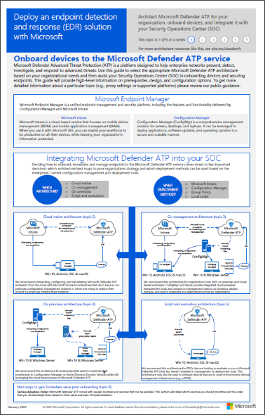

# 링에서 끝점용 Microsoft Defender 배포Deploy Microsoft Defender for Endpoint in rings

[!INCLUDE [Microsoft 365 Defender rebranding](../../includes/microsoft-defender.md)]

**적용 대상:****Applies to:**
- [엔드포인트용 Microsoft DefenderMicrosoft Defender for Endpoint](https://go.microsoft.com/fwlink/p/?linkid=2154037)
- [Microsoft 365 DefenderMicrosoft 365 Defender](https://go.microsoft.com/fwlink/?linkid=2118804)

>Endpoint용 Defender를 경험하고 싶나요?Want to experience Defender for Endpoint? [무료 평가판에 등록합니다.Sign up for a free trial.](https://www.microsoft.com/microsoft-365/windows/microsoft-defender-atp?ocid=docs-wdatp-assignaccess-abovefoldlink)

링 기반 배포 방법을 사용하여 끝점에 대한 Microsoft Defender 배포를 완료할 수 있습니다.Deploying Microsoft Defender for Endpoint can be done using a ring-based deployment approach. 

배포 링은 다음과 같은 시나리오에서 적용할 수 있습니다.The deployment rings can be applied in the following scenarios:
- [새 배포New deployments](#new-deployments)
- [기존 배포Existing deployments](#existing-deployments)

## 새 배포New deployments

링 기반 접근 방식은 온보드할 끝점 집합을 식별하고 서비스를 더 큰 장치 집합에 배포하기 전에 특정 조건이 충족되는지 확인하는 방법입니다.A ring-based approach is a method of identifying a set of endpoints to onboard and verifying that certain criteria is met before proceeding to deploy the service to a larger set of devices. 각 링에 대한 종료 조건을 정의하고 다음 링으로 이동하기 전에 해당 링이 충족되도록 할 수 있습니다.You can define the exit criteria for each ring and ensure that they are satisfied before moving on to the next ring.

링 기반 배포를 채택하면 서비스를 배포하는 동안 발생할 수 있는 잠재적인 문제를 줄일 수 있습니다.Adopting a ring-based deployment helps reduce potential issues that could arise while rolling out the service. 특정 수의 장치를 먼저 파일럿하여 잠재적인 문제를 식별하고 발생할 수 있는 잠재적인 위험을 완화할 수 있습니다.By piloting a certain number of devices first, you can identify potential issues and mitigate potential risks that might arise. 

표 1에서는 사용할 수 있는 배포 링의 예를 제공합니다.Table 1 provides an example of the deployment rings you might use. 

**표 1****Table 1**

|**배포 링****Deployment ring**|**설명****Description**|
|:-----|:-----|
평가Evaluate | 링 1: 파일럿 테스트용 시스템 50개 식별Ring 1: Identify 50 systems for pilot testing 
파일럿Pilot | 링 2: 프로덕션 환경에서 다음 50-100개 끝점 식별Ring 2: Identify the next 50-100  endpoints in production environment    
전체 배포Full deployment | 링 3: 더 큰 증분으로 나머지 환경에 서비스 롤아웃Ring 3: Roll out service to the rest of environment in larger increments

### 종료 조건Exit criteria
이러한 링에 대한 종료 조건의 예는 다음과 같습니다.An example set of exit criteria for these rings can include:
- 장치 인벤토리 목록에 장치가 표시됩니다.Devices show up in the device inventory list
- 알림이 대시보드에 표시Alerts appear in dashboard
- [검색 테스트 실행Run a detection test](run-detection-test.md)
- [디바이스에 대한 시뮬레이션된 공격 실행Run a simulated attack on a device](attack-simulations.md)

### 평가Evaluate
환경에 있는 소수의 테스트 컴퓨터를 식별하여 서비스에 온보드합니다.Identify a small number of test machines in your environment to onboard to the service. 이상적으로 이러한 컴퓨터는 끝점 50개 미만입니다.Ideally, these machines would be fewer than 50 endpoints. 

### 파일럿Pilot
끝점용 Microsoft Defender는 서비스에 온보딩할 수 있는 다양한 끝점을 지원합니다.Microsoft Defender for Endpoint supports a variety of endpoints that you can onboard to the service. 이 링에서 온보드할 여러 장치를 식별하고 정의한 종료 기준에 따라 다음 배포 링으로 진행하기로 결정합니다.In this ring, identify several devices to onboard and based on the exit criteria you define, decide to proceed to the next deployment ring.

다음 표에는 지원되는 끝점과 장치를 서비스에 온보드하는 데 사용할 수 있는 해당 도구가 표시됩니다.The following table shows the supported endpoints and the corresponding tool you can use to onboard devices to the service. 

| 끝점Endpoint     | 배포 도구Deployment tool                       |
|--------------|------------------------------------------|
| **Windows****Windows**  |  [로컬 스크립트(최대 10대의 장치)Local script (up to 10 devices)](configure-endpoints-script.md)   참고: 프로덕션 환경에 10개 이상의 장치를 배포하려는 경우 그룹 정책 방법이나 아래에 나열된 다른 지원되는 도구를 대신 사용합니다.NOTE: If you want to deploy more than 10 devices in a production environment, use the Group Policy method instead or the other supported tools listed below.   [그룹 정책Group Policy](configure-endpoints-gp.md)    [Microsoft Endpoint Manager/ 모바일 장치 관리자Microsoft Endpoint Manager/ Mobile Device Manager](configure-endpoints-mdm.md)     [Microsoft Endpoint Configuration ManagerMicrosoft Endpoint Configuration Manager](configure-endpoints-sccm.md)   [VDI 스크립트VDI scripts](configure-endpoints-vdi.md)   |
| **macOS****macOS**    | [로컬 스크립트Local script](mac-install-manually.md)   [Microsoft Endpoint Manager Microsoft Endpoint Manager](mac-install-with-intune.md)   [JAMF ProJAMF Pro](mac-install-with-jamf.md)   [모바일 장치 관리Mobile Device Management](mac-install-with-other-mdm.md) |
| **Linux Server****Linux Server** | [로컬 스크립트Local script](linux-install-manually.md)   [PuppetPuppet](linux-install-with-puppet.md)   [AnsibleAnsible](linux-install-with-ansible.md)|
| **iOS****iOS**      | [앱 기반App-based](ios-install.md)                                |
| **Android****Android**  | [Microsoft Endpoint Manager Microsoft Endpoint Manager](android-intune.md)               | 

### 전체 배포Full deployment
이 단계에서 배포 계획 자료를 [사용하여](deployment-strategy.md) 배포를 계획할 수 있습니다.At this stage, you can use the [Plan deployment](deployment-strategy.md) material to help you plan your deployment. 

다음 자료를 사용하여 조직에 가장 적합한 끝점 아키텍처용 Microsoft Defender를 선택합니다.Use the following material to select the appropriate Microsoft Defender for Endpoint architecture that best suites your organization.

|**항목****Item**|**설명****Description**|
|:-----|:-----|
|  [PDF](https://github.com/MicrosoftDocs/microsoft-365-docs/raw/public/microsoft-365/security/defender-endpoint/downloads/mdatp-deployment-strategy.pdf)  \| [Visio](https://github.com/MicrosoftDocs/microsoft-365-docs/raw/public/microsoft-365/security/defender-endpoint/downloads/mdatp-deployment-strategy.vsdx)[PDF](https://github.com/MicrosoftDocs/microsoft-365-docs/raw/public/microsoft-365/security/defender-endpoint/downloads/mdatp-deployment-strategy.pdf)  \| [Visio](https://github.com/MicrosoftDocs/microsoft-365-docs/raw/public/microsoft-365/security/defender-endpoint/downloads/mdatp-deployment-strategy.vsdx) | 건축 자료는 다음 아키텍처의 배포를 계획하는 데 도움이 됩니다.The architectural material helps you plan your deployment for the following architectures: <ul><li> 클라우드 네이티브Cloud-native </li><li> 공동 관리Co-management </li><li> 온-프레미스On-premise</li><li>평가 및 로컬 온보딩Evaluation and local onboarding</li>

## 기존 배포Existing deployments

### Windows 끝점Windows endpoints
Windows 및/Windows 서버의 경우 **SUVP(보안** 업데이트 유효성 검사 프로그램)를 사용하여 미리 테스트할 여러 컴퓨터를 선택합니다(화요일 패치 전).For Windows and/or Windows Servers, you select several machines to test ahead of time (before patch Tuesday) by using the **Security Update Validation program (SUVP)**.

자세한 내용은 다음을 참조하세요.For more information, see:
- [보안 업데이트 유효성 검사 프로그램What is the Security Update Validation Program](https://techcommunity.microsoft.com/t5/windows-it-pro-blog/what-is-the-security-update-validation-program/ba-p/275767)
- [소프트웨어 업데이트 유효성 검사 프로그램 및 Microsoft 맬웨어 보호 센터 설치 - TwC 대화형 타임라인 4부Software Update Validation Program and Microsoft Malware Protection Center Establishment - TwC Interactive Timeline Part 4](https://www.microsoft.com/security/blog/2012/03/28/software-update-validation-program-and-microsoft-malware-protection-center-establishment-twc-interactive-timeline-part-4/)

### 비 Windows 끝점Non-Windows endpoints
macOS 및 Linux에서는 몇 가지 시스템을 사용하며 베타 채널에서 실행할 수 있습니다.With macOS and Linux, you could take a couple of systems and run in the Beta channel.

>[!NOTE]
>빌드를 현재 채널로 만들기 전에 호환성, 성능 및 안정성 문제를 찾을 수 있도록 하나 이상의 보안 관리자와 개발자 한 명 이상입니다.Ideally at least one security admin and one developer so that you are able to find compatibility, performance and reliability issues before the build makes it into the Current channel.

채널 선택에 따라 장치에 제공되는 업데이트의 유형과 빈도가 결정됩니다.The choice of the channel determines the type and frequency of updates that are offered to your device. Beta의 장치는 업데이트 및 새 기능을 수신하는 첫 번째 장치로, 나중에 미리 보기 및 마지막으로 현재가 표시됩니다.Devices in Beta are the first ones to receive updates and new features, followed later by Preview and lastly by Current.

새 기능을 미리 보고 초기 피드백을 제공하기 위해서는 엔터프라이즈에서 베타 또는 미리 보기를 사용하도록 일부 장치를 구성하는 것이 좋습니다.In order to preview new features and provide early feedback, it is recommended that you configure some devices in your enterprise to use either Beta or Preview.

>[!WARNING]
>초기 설치 후 채널을 전환하려면 제품을 다시 설치해야 합니다.Switching the channel after the initial installation requires the product to be reinstalled. 제품 채널을 전환하려면 기존 패키지를 제거하고 새 채널을 사용하도록 장치를 다시 구성하고 이 문서의 단계에 따라 새 위치에서 패키지를 설치합니다.To switch the product channel: uninstall the existing package, re-configure your device to use the new channel, and follow the steps in this document to install the package from the new location.
