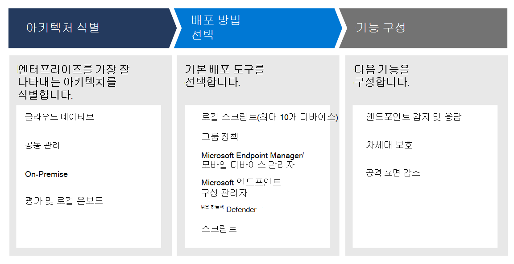

# 엔드포인트용 Microsoft Defender 배포 계획

[!INCLUDE [Microsoft 365 Defender rebranding](../../includes/microsoft-defender.md)]

**적용 대상:**
- [엔드포인트용 Microsoft Defender](https://go.microsoft.com/fwlink/p/?linkid=2154037)
- [Microsoft 365 Defender](https://go.microsoft.com/fwlink/?linkid=2118804)

> Endpoint용 Defender를 경험하고 싶나요? [무료 평가판을 신청하세요.](https://signup.microsoft.com/create-account/signup?products=7f379fee-c4f9-4278-b0a1-e4c8c2fcdf7e&ru=https://aka.ms/MDEp2OpenTrial?ocid=docs-wdatp-secopsdashboard-abovefoldlink)

제품군 내에서 보안 기능을 최대화하고 사이버 위협으로부터 엔터프라이즈를 보다 잘 보호할 수 있도록 끝점 배포에 대한 Microsoft Defender 배포를 계획합니다.

이 솔루션은 환경 아키텍처를 식별하는 방법, 요구에 가장 적합한 배포 도구 유형 선택 및 기능 구성 방법에 대한 지침을 제공합니다.

## 1단계: 아키텍처 식별

모든 엔터프라이즈 환경이 고유하다는 것을 알고 있으므로 서비스 배포 방법을 선택할 때 유연성을 제공하는 몇 가지 옵션이 제공됩니다.

환경에 따라 일부 도구는 특정 아키텍처에 더 적합합니다.

다음 자료를 사용하여 조직에 가장 적합한 끝점 아키텍처에 적합한 Defender를 선택합니다.

| 항목 | 설명 |
|:-----|:-----|
|  [PDF](https://download.microsoft.com/download/5/6/0/5609001f-b8ae-412f-89eb-643976f6b79c/mde-deployment-strategy.pdf)  \| [Visio](https://download.microsoft.com/download/5/6/0/5609001f-b8ae-412f-89eb-643976f6b79c/mde-deployment-strategy.vsdx) | 건축 자료는 다음 아키텍처의 배포를 계획하는 데 도움이 됩니다. <ul><li> 클라우드 네이티브 </li><li> 공동 관리 </li><li> 온-프레미스</li><li>평가 및 로컬 온보딩</li>

## 2단계: 배포 방법 선택

Endpoint용 Defender는 서비스에 온보딩할 수 있는 다양한 끝점을 지원합니다.

다음 표에는 배포를 적절하게 계획할 수 있도록 지원되는 끝점 및 해당 배포 도구가 나열됩니다.

|끝점|배포 도구|
|---|---|
|**Windows**|[로컬 스크립트(최대 10대의 장치)](configure-endpoints-script.md)    [그룹 정책](configure-endpoints-gp.md)    [Microsoft Endpoint Manager/ 모바일 장치 관리자](configure-endpoints-mdm.md)     [Microsoft Endpoint Configuration Manager](configure-endpoints-sccm.md)   [VDI 스크립트](configure-endpoints-vdi.md)   [Azure Defender와 통합](configure-server-endpoints.md#integration-with-azure-defender)|
|**macOS**|[로컬 스크립트](mac-install-manually.md)   [Microsoft Endpoint Manager ](mac-install-with-intune.md)   [JAMF Pro](mac-install-with-jamf.md)   [모바일 장치 관리](mac-install-with-other-mdm.md)|
|**Linux Server**|[로컬 스크립트](linux-install-manually.md)   [Puppet](linux-install-with-puppet.md)   [Ansible](linux-install-with-ansible.md)|
|**iOS**|[앱 기반](ios-install.md)|
|**Android**|[Microsoft Endpoint Manager ](android-intune.md)|

## 3단계: 기능 구성

끝점을 온보딩한 후 제품군에서 사용할 수 있는 강력한 보안 보호를 최대화할 수 있도록 끝점용 Defender의 보안 기능을 구성합니다. 기능은 다음과 같습니다.

- 엔드포인트 감지 및 응답
- 차세대 보호
- 공격 표면 감소

## 관련 항목

- [배포 단계](deployment-phases.md)
