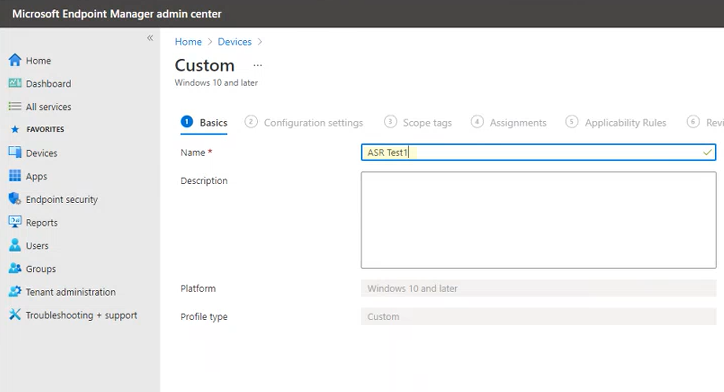

# <a name="enable-attack-surface-reduction-rules"></a><span data-ttu-id="10ece-104">공격 표면 감소 규칙 사용</span><span class="sxs-lookup"><span data-stu-id="10ece-104">Enable attack surface reduction rules</span></span>

<span data-ttu-id="10ece-105">**적용 대상:**</span><span class="sxs-lookup"><span data-stu-id="10ece-105">**Applies to:**</span></span>

- [<span data-ttu-id="10ece-106">엔드포인트용 Microsoft Defender</span><span class="sxs-lookup"><span data-stu-id="10ece-106">Microsoft Defender for Endpoint</span></span>](https://go.microsoft.com/fwlink/p/?linkid=2154037)
- [<span data-ttu-id="10ece-107">Microsoft 365 Defender</span><span class="sxs-lookup"><span data-stu-id="10ece-107">Microsoft 365 Defender</span></span>](https://go.microsoft.com/fwlink/?linkid=2118804)

> [!TIP]
> <span data-ttu-id="10ece-108">Endpoint용 Defender를 경험하고 싶나요?</span><span class="sxs-lookup"><span data-stu-id="10ece-108">Want to experience Defender for Endpoint?</span></span> <span data-ttu-id="10ece-109">[무료 평가판에 등록합니다.](https://www.microsoft.com/microsoft-365/windows/microsoft-defender-atp?ocid=docs-wdatp-assignaccess-abovefoldlink)</span><span class="sxs-lookup"><span data-stu-id="10ece-109">[Sign up for a free trial](https://www.microsoft.com/microsoft-365/windows/microsoft-defender-atp?ocid=docs-wdatp-assignaccess-abovefoldlink).</span></span>

<span data-ttu-id="10ece-110">ASR [규칙(공격](attack-surface-reduction.md) 표면 축소 규칙)은 맬웨어가 장치 및 네트워크를 손상하기 위해 자주 남용되는 작업을 방지하는 데 도움이 됩니다.</span><span class="sxs-lookup"><span data-stu-id="10ece-110">[Attack surface reduction rules](attack-surface-reduction.md) (ASR rules) help prevent actions that malware often abuses to compromise devices and networks.</span></span>

<span data-ttu-id="10ece-111">**요구 사항** 다음 버전 및 버전의 디바이스를 실행하는 장치에 대해 공격 표면 감소 규칙을 설정할 수 Windows.</span><span class="sxs-lookup"><span data-stu-id="10ece-111">**Requirements** You can set attack surface reduction rules for devices that are running any of the following editions and versions of Windows:</span></span>

- <span data-ttu-id="10ece-112">Windows 10 Pro 버전 [1709](/windows/whats-new/whats-new-windows-10-version-1709) 이상</span><span class="sxs-lookup"><span data-stu-id="10ece-112">Windows 10 Pro, [version 1709](/windows/whats-new/whats-new-windows-10-version-1709) or later</span></span>
- <span data-ttu-id="10ece-113">Windows 10 Enterprise 버전 [1709](/windows/whats-new/whats-new-windows-10-version-1709) 이상</span><span class="sxs-lookup"><span data-stu-id="10ece-113">Windows 10 Enterprise, [version 1709](/windows/whats-new/whats-new-windows-10-version-1709) or later</span></span>
- <span data-ttu-id="10ece-114">Windows 서버, [버전 1803(반기 채널)](/windows-server/get-started/whats-new-in-windows-server-1803) 이상</span><span class="sxs-lookup"><span data-stu-id="10ece-114">Windows Server, [version 1803 (Semi-Annual Channel)](/windows-server/get-started/whats-new-in-windows-server-1803) or later</span></span>
- [<span data-ttu-id="10ece-115">Windows Server 2019</span><span class="sxs-lookup"><span data-stu-id="10ece-115">Windows Server 2019</span></span>](/windows-server/get-started-19/whats-new-19)

<span data-ttu-id="10ece-116">공격 표면 감소 규칙에는 Windows E5 라이선스가 필요하지 않습니다. [E5를](/windows/deployment/deploy-enterprise-licenses)Windows 고급 관리 기능을 사용할 수 있습니다.</span><span class="sxs-lookup"><span data-stu-id="10ece-116">Although attack surface reduction rules don't require a [Windows E5 license](/windows/deployment/deploy-enterprise-licenses), if you have Windows E5, you get advanced management capabilities.</span></span> <span data-ttu-id="10ece-117">이러한 기능은 Windows E5에서만 사용할 수 있는 기능으로는 [Endpoint용 Defender에서](/microsoft-365/security/defender-endpoint/microsoft-defender-endpoint?view=o365-worldwide&preserve-view=true)사용할 수 있는 모니터링, 분석 및 워크플로와 Microsoft 365 보안 센터의 보고 [및 구성 기능이 포함됩니다.](/microsoft-365/security/defender/overview-security-center?view=o365-worldwide&preserve-view=true)</span><span class="sxs-lookup"><span data-stu-id="10ece-117">These capabilities available only in Windows E5 include monitoring, analytics, and workflows available in [Defender for Endpoint](/microsoft-365/security/defender-endpoint/microsoft-defender-endpoint?view=o365-worldwide&preserve-view=true), as well as reporting and configuration capabilities in the [Microsoft 365 security center](/microsoft-365/security/defender/overview-security-center?view=o365-worldwide&preserve-view=true).</span></span> <span data-ttu-id="10ece-118">이러한 고급 기능은 E3 라이선스 또는 Windows Professional 사용할 Windows 없습니다. 그러나 해당 라이선스가 있는 경우 이벤트 뷰어 및 로그를 사용하여 Microsoft Defender 바이러스 백신 축소 규칙 이벤트를 검토할 수 있습니다.</span><span class="sxs-lookup"><span data-stu-id="10ece-118">These advanced capabilities aren't available with a Windows Professional or Windows E3 license; however, if you do have those licenses, you can use Event Viewer and Microsoft Defender Antivirus logs to review your attack surface reduction rule events.</span></span>

<span data-ttu-id="10ece-119">각 ASR 규칙에는 다음 네 가지 설정 중 하나가 포함되어 있습니다.</span><span class="sxs-lookup"><span data-stu-id="10ece-119">Each ASR rule contains one of four settings:</span></span>

- <span data-ttu-id="10ece-120">**구성되지 않은 경우:** ASR 규칙을 사용하지 않도록 설정</span><span class="sxs-lookup"><span data-stu-id="10ece-120">**Not configured**: Disable the ASR rule</span></span>
- <span data-ttu-id="10ece-121">**차단:** ASR 규칙 사용</span><span class="sxs-lookup"><span data-stu-id="10ece-121">**Block**: Enable the ASR rule</span></span>
- <span data-ttu-id="10ece-122">**감사:** ASR 규칙이 사용하도록 설정된 경우 조직에 미치는 영향 평가</span><span class="sxs-lookup"><span data-stu-id="10ece-122">**Audit**: Evaluate how the ASR rule would impact your organization if enabled</span></span>
- <span data-ttu-id="10ece-123">**경고:** ASR 규칙을 사용하도록 설정하지만 최종 사용자가 차단을 무시하도록 허용</span><span class="sxs-lookup"><span data-stu-id="10ece-123">**Warn**: Enable the ASR rule but allow the end user to bypass the block</span></span>

> [!IMPORTANT]
> <span data-ttu-id="10ece-124">현재 MEM(2013)에서 ASR 규칙을 구성할 때 세 가지 ASR 규칙에 대해 경고 Microsoft Endpoint Manager 지원되지 않습니다.</span><span class="sxs-lookup"><span data-stu-id="10ece-124">Currently, warn mode is not supported for three ASR rules when you configure ASR rules in Microsoft Endpoint Manager (MEM).</span></span> <span data-ttu-id="10ece-125">자세한 내용은 경고 모드가 지원되지 [않는 경우를 참조합니다.](attack-surface-reduction.md#cases-where-warn-mode-is-not-supported)</span><span class="sxs-lookup"><span data-stu-id="10ece-125">To learn more, see [Cases where warn mode is not supported](attack-surface-reduction.md#cases-where-warn-mode-is-not-supported).</span></span>

<span data-ttu-id="10ece-126">Windows E5 라이선스(또는 유사한 라이선스 SKU)와 함께 ASR 규칙을 사용하여 [끝점용 Microsoft Defender(Endpoint용 Defender)에서](microsoft-defender-endpoint.md) 사용할 수 있는 고급 모니터링 및 보고 기능을 활용하는 것이 좋습니다.</span><span class="sxs-lookup"><span data-stu-id="10ece-126">It's highly recommended to use ASR rules with a Windows E5 license (or similar licensing SKU) to take advantage of the advanced monitoring and reporting capabilities available in [Microsoft Defender for Endpoint](microsoft-defender-endpoint.md) (Defender for Endpoint).</span></span> <span data-ttu-id="10ece-127">그러나 고급 모니터링 및 보고 기능을 포함하지 않는 Windows Professional 또는 Windows E3와 같은 다른 라이선스가 있는 경우 ASR 규칙이 트리거될 때 각 끝점에서 생성된 이벤트(예: 이벤트 전달) 위에 자체 모니터링 및 보고 도구를 개발할 수 있습니다.</span><span class="sxs-lookup"><span data-stu-id="10ece-127">However, if you have another license, such as Windows Professional or Windows E3 that don't include advanced monitoring and reporting capabilities, you can develop your own monitoring and reporting tools on top of the events that are generated at each endpoint when ASR rules are triggered (e.g., Event Forwarding).</span></span>

> [!TIP]
> <span data-ttu-id="10ece-128">라이선스 라이선스에 대한 Windows 자세한 내용은 [](https://www.microsoft.com/licensing/product-licensing/windows10?activetab=windows10-pivot:primaryr5) Windows 10 라이선스를 참조하고 에 대한 볼륨 라이선스 [가이드를 Windows 10.](https://download.microsoft.com/download/2/D/1/2D14FE17-66C2-4D4C-AF73-E122930B60F6/Windows-10-Volume-Licensing-Guide.pdf)</span><span class="sxs-lookup"><span data-stu-id="10ece-128">To learn more about Windows licensing, see [Windows 10 Licensing](https://www.microsoft.com/licensing/product-licensing/windows10?activetab=windows10-pivot:primaryr5) and get the [Volume Licensing guide for Windows 10](https://download.microsoft.com/download/2/D/1/2D14FE17-66C2-4D4C-AF73-E122930B60F6/Windows-10-Volume-Licensing-Guide.pdf).</span></span>

<span data-ttu-id="10ece-129">다음 방법을 사용하여 공격 표면 감소 규칙을 사용하도록 설정할 수 있습니다.</span><span class="sxs-lookup"><span data-stu-id="10ece-129">You can enable attack surface reduction rules by using any of these methods:</span></span>

- [<span data-ttu-id="10ece-130">Microsoft Intune</span><span class="sxs-lookup"><span data-stu-id="10ece-130">Microsoft Intune</span></span>](#intune)
- [<span data-ttu-id="10ece-131">MDM(모바일 장치 관리)</span><span class="sxs-lookup"><span data-stu-id="10ece-131">Mobile Device Management (MDM)</span></span>](#mdm)
- [<span data-ttu-id="10ece-132">Microsoft Endpoint Configuration Manager</span><span class="sxs-lookup"><span data-stu-id="10ece-132">Microsoft Endpoint Configuration Manager</span></span>](#microsoft-endpoint-configuration-manager)
- [<span data-ttu-id="10ece-133">그룹 정책</span><span class="sxs-lookup"><span data-stu-id="10ece-133">Group Policy</span></span>](#group-policy)
- [<span data-ttu-id="10ece-134">PowerShell</span><span class="sxs-lookup"><span data-stu-id="10ece-134">PowerShell</span></span>](#powershell)

<span data-ttu-id="10ece-135">Enterprise Intune 또는 Microsoft Endpoint Manager 수준의 관리가 권장됩니다.</span><span class="sxs-lookup"><span data-stu-id="10ece-135">Enterprise-level management such as Intune or Microsoft Endpoint Manager is recommended.</span></span> <span data-ttu-id="10ece-136">Enterprise 수준 관리는 시작 시 충돌하는 그룹 정책 또는 PowerShell 설정을 덮어 덮어 덮어 야 합니다.</span><span class="sxs-lookup"><span data-stu-id="10ece-136">Enterprise-level management will overwrite any conflicting Group Policy or PowerShell settings on startup.</span></span>

## <a name="exclude-files-and-folders-from-asr-rules"></a><span data-ttu-id="10ece-137">ASR 규칙에서 파일 및 폴더 제외</span><span class="sxs-lookup"><span data-stu-id="10ece-137">Exclude files and folders from ASR rules</span></span>

<span data-ttu-id="10ece-138">대부분의 공격 표면 감소 규칙에 의해 평가되지 않는 파일 및 폴더를 제외할 수 있습니다.</span><span class="sxs-lookup"><span data-stu-id="10ece-138">You can exclude files and folders from being evaluated by most attack surface reduction rules.</span></span> <span data-ttu-id="10ece-139">즉, ASR 규칙이 파일 또는 폴더에 악의적인 동작이 포함되어 있는지 확인한 경우에도 파일이 실행되는 것을 차단하지 않습니다.</span><span class="sxs-lookup"><span data-stu-id="10ece-139">This means that even if an ASR rule determines the file or folder contains malicious behavior, it will not block the file from running.</span></span> <span data-ttu-id="10ece-140">이렇게 하면 안전하지 않은 파일이 실행되고 장치를 감염시킬 수 있습니다.</span><span class="sxs-lookup"><span data-stu-id="10ece-140">This could potentially allow unsafe files to run and infect your devices.</span></span>

<span data-ttu-id="10ece-141">끝점 파일 및 인증서 표시기를 위해 지정된 Defender를 허용하여 인증서 및 파일 해시에 따라 ASR 규칙을 트리거하지 못하게 제외할 수도 있습니다.</span><span class="sxs-lookup"><span data-stu-id="10ece-141">You can also exclude ASR rules from triggering based on certificate and file hashes by allowing specified Defender for Endpoint file and certificate indicators.</span></span> <span data-ttu-id="10ece-142">[(표시기 관리를](manage-indicators.md)참조합니다.)</span><span class="sxs-lookup"><span data-stu-id="10ece-142">(See [Manage indicators](manage-indicators.md).)</span></span>

> [!IMPORTANT]
> <span data-ttu-id="10ece-143">파일 또는 폴더를 제외하면 ASR 규칙에서 제공하는 보호를 심각하게 줄일 수 있습니다.</span><span class="sxs-lookup"><span data-stu-id="10ece-143">Excluding files or folders can severely reduce the protection provided by ASR rules.</span></span> <span data-ttu-id="10ece-144">제외된 파일은 실행될 수 있으며 보고서나 이벤트는 기록되지 않습니다.</span><span class="sxs-lookup"><span data-stu-id="10ece-144">Excluded files will be allowed to run, and no report or event will be recorded.</span></span>
> <span data-ttu-id="10ece-145">ASR 규칙이 검색되지 않는 것으로 생각되는 파일을 검색하는 경우 먼저 감사 모드를 사용하여 규칙을 [테스트해야 합니다.](evaluate-attack-surface-reduction.md)</span><span class="sxs-lookup"><span data-stu-id="10ece-145">If ASR rules are detecting files that you believe shouldn't be detected, you should [use audit mode first to test the rule](evaluate-attack-surface-reduction.md).</span></span>

<span data-ttu-id="10ece-146">개별 파일 또는 폴더(폴더 경로 또는 정식 리소스 이름을 사용하여)를 지정할 수 있지만 제외가 적용되는 규칙을 지정할 수 없습니다.</span><span class="sxs-lookup"><span data-stu-id="10ece-146">You can specify individual files or folders (using folder paths or fully qualified resource names), but you can't specify which rules the exclusions apply to.</span></span> <span data-ttu-id="10ece-147">제외는 제외된 응용 프로그램 또는 서비스가 시작될 때만 적용됩니다.</span><span class="sxs-lookup"><span data-stu-id="10ece-147">An exclusion is applied only when the excluded application or service starts.</span></span> <span data-ttu-id="10ece-148">예를 들어 이미 실행 중인 업데이트 서비스에 대해 제외를 추가하는 경우 업데이트 서비스는 서비스가 중지되고 다시 시작될 때까지 이벤트를 계속 트리거합니다.</span><span class="sxs-lookup"><span data-stu-id="10ece-148">For example, if you add an exclusion for an update service that is already running, the update service will continue to trigger events until the service is stopped and restarted.</span></span>

<span data-ttu-id="10ece-149">ASR 규칙은 환경 변수 및 와일드카드를 지원합니다.</span><span class="sxs-lookup"><span data-stu-id="10ece-149">ASR rules support environment variables and wildcards.</span></span> <span data-ttu-id="10ece-150">와일드카드 사용에 대한 자세한 내용은 파일 이름 및 폴더 경로 또는 확장명 제외 목록에 와일드카드 사용을 [참조하세요.](configure-extension-file-exclusions-microsoft-defender-antivirus.md#use-wildcards-in-the-file-name-and-folder-path-or-extension-exclusion-lists)</span><span class="sxs-lookup"><span data-stu-id="10ece-150">For information about using wildcards, see [Use wildcards in the file name and folder path or extension exclusion lists](configure-extension-file-exclusions-microsoft-defender-antivirus.md#use-wildcards-in-the-file-name-and-folder-path-or-extension-exclusion-lists).</span></span>

<span data-ttu-id="10ece-151">ASR 규칙을 사용하도록 설정하는 다음 절차에는 파일 및 폴더를 제외하는 방법에 대한 지침이 포함되어 있습니다.</span><span class="sxs-lookup"><span data-stu-id="10ece-151">The following procedures for enabling ASR rules include instructions for how to exclude files and folders.</span></span>

## <a name="intune"></a><span data-ttu-id="10ece-152">Intune</span><span class="sxs-lookup"><span data-stu-id="10ece-152">Intune</span></span>

1. <span data-ttu-id="10ece-153">장치 **구성**  >  **프로필을 선택합니다.**</span><span class="sxs-lookup"><span data-stu-id="10ece-153">Select **Device configuration** > **Profiles**.</span></span> <span data-ttu-id="10ece-154">기존 끝점 보호 프로필을 선택하거나 새 끝점 보호 프로필을 만들 수 있습니다.</span><span class="sxs-lookup"><span data-stu-id="10ece-154">Choose an existing endpoint protection profile or create a new one.</span></span> <span data-ttu-id="10ece-155">새 프로필을 만들하려면 프로필 만들기를 **선택하고** 이 프로필에 대한 정보를 입력합니다.</span><span class="sxs-lookup"><span data-stu-id="10ece-155">To create a new one, select **Create profile** and enter information for this profile.</span></span> <span data-ttu-id="10ece-156">프로필 **유형에서** **끝점 보호를 선택합니다.**</span><span class="sxs-lookup"><span data-stu-id="10ece-156">For **Profile type**, select **Endpoint protection**.</span></span> <span data-ttu-id="10ece-157">기존 프로필을 선택한 경우 속성을  선택한 다음 을 **설정.**</span><span class="sxs-lookup"><span data-stu-id="10ece-157">If you've chosen an existing profile, select **Properties** and then select **Settings**.</span></span>

2. <span data-ttu-id="10ece-158">끝점 보호 창에서 **Exploit** **Guard** Windows Defender 선택하고 공격 표면 **감소를 선택합니다.**</span><span class="sxs-lookup"><span data-stu-id="10ece-158">In the **Endpoint protection** pane, select **Windows Defender Exploit Guard**, then select **Attack Surface Reduction**.</span></span> <span data-ttu-id="10ece-159">각 ASR 규칙에 대해 원하는 설정을 선택합니다.</span><span class="sxs-lookup"><span data-stu-id="10ece-159">Select the desired setting for each ASR rule.</span></span>

3. <span data-ttu-id="10ece-160">공격 **표면 감소 예외에서** 개별 파일 및 폴더를 입력합니다.</span><span class="sxs-lookup"><span data-stu-id="10ece-160">Under **Attack Surface Reduction exceptions**, enter individual files and folders.</span></span> <span data-ttu-id="10ece-161">가져오기 **를** 선택하여 ASR 규칙에서 제외할 파일 및 폴더가 포함된 CSV 파일을 가져올 수도 있습니다.</span><span class="sxs-lookup"><span data-stu-id="10ece-161">You can also select **Import** to import a CSV file that contains files and folders to exclude from ASR rules.</span></span> <span data-ttu-id="10ece-162">CSV 파일의 각 줄 서식은 다음과 같이 지정해야 합니다.</span><span class="sxs-lookup"><span data-stu-id="10ece-162">Each line in the CSV file should be formatted as follows:</span></span>

   <span data-ttu-id="10ece-163">`C:\folder`, `%ProgramFiles%\folder\file`, `C:\path`</span><span class="sxs-lookup"><span data-stu-id="10ece-163">`C:\folder`, `%ProgramFiles%\folder\file`, `C:\path`</span></span>

4. <span data-ttu-id="10ece-164">세 **개의 구성** 창에서 확인을 선택합니다.</span><span class="sxs-lookup"><span data-stu-id="10ece-164">Select **OK** on the three configuration panes.</span></span> <span data-ttu-id="10ece-165">그런 다음 **새** 끝점 보호 파일을 만드는  경우 만들기를 선택하고 기존 끝점 보호 파일을 편집하는 경우 저장을 선택합니다.</span><span class="sxs-lookup"><span data-stu-id="10ece-165">Then select **Create** if you're creating a new endpoint protection file or **Save** if you're editing an existing one.</span></span>

## <a name="mem"></a><span data-ttu-id="10ece-166">MEM</span><span class="sxs-lookup"><span data-stu-id="10ece-166">MEM</span></span>

<span data-ttu-id="10ece-167">MEM(Microsoft Endpoint Manager) OMA-URI를 사용하여 사용자 지정 ASR 규칙을 구성할 수 있습니다.</span><span class="sxs-lookup"><span data-stu-id="10ece-167">You can use Microsoft Endpoint Manager (MEM) OMA-URI to configure custom ASR rules.</span></span> <span data-ttu-id="10ece-168">다음 절차에서는 이 예제에 악용된 취약한 드라이버의 [남용](attack-surface-reduction.md#block-abuse-of-exploited-vulnerable-signed-drivers) 차단 규칙을 사용합니다.</span><span class="sxs-lookup"><span data-stu-id="10ece-168">The following procedure uses the rule [Block abuse of exploited vulnerable signed drivers](attack-surface-reduction.md#block-abuse-of-exploited-vulnerable-signed-drivers) for the example.</span></span>

1. <span data-ttu-id="10ece-169">MEM(Microsoft Endpoint Manager) 관리 센터를 열 수 있습니다.</span><span class="sxs-lookup"><span data-stu-id="10ece-169">Open the Microsoft Endpoint Manager (MEM) admin center.</span></span> <span data-ttu-id="10ece-170">홈 **메뉴에서** **장치,** 구성 **프로필을** 선택한 다음 프로필 **만들기를 클릭합니다.**</span><span class="sxs-lookup"><span data-stu-id="10ece-170">In the **Home** menu, click  **Devices**, select **Configuration profile**, and then click **Create profile**.</span></span>

   > [!div class="mx-imgBorder"]
   > <span data-ttu-id="10ece-171"></span><span class="sxs-lookup"><span data-stu-id="10ece-171"></span></span>

2. <span data-ttu-id="10ece-172">프로필 **만들기의** 다음 두 드롭다운 목록에서 다음을 선택합니다.</span><span class="sxs-lookup"><span data-stu-id="10ece-172">In **Create a profile**, in the following two drop-down lists, select the following:</span></span>

   - <span data-ttu-id="10ece-173">**플랫폼에서** 추가 Windows 10 **이상을 선택합니다.**</span><span class="sxs-lookup"><span data-stu-id="10ece-173">In **Platform**, select **Windows 10 and later**</span></span>
   - <span data-ttu-id="10ece-174">프로필 **유형에서** **템플릿을 선택합니다.**</span><span class="sxs-lookup"><span data-stu-id="10ece-174">In **Profile type**, select **Templates**</span></span>

   <span data-ttu-id="10ece-175">사용자 **지정 을** 선택한 다음 만들기를 **클릭합니다.**</span><span class="sxs-lookup"><span data-stu-id="10ece-175">Select **Custom**, and then click **Create**.</span></span>

   > [!div class="mx-imgBorder"]
   > <span data-ttu-id="10ece-176"></span><span class="sxs-lookup"><span data-stu-id="10ece-176"></span></span>

3. <span data-ttu-id="10ece-177">사용자 지정 서식 파일 도구가 **1단계 기본 으로 열립니다.**</span><span class="sxs-lookup"><span data-stu-id="10ece-177">The Custom template tool opens to step **1 Basics**.</span></span> <span data-ttu-id="10ece-178">**1 기본 사항 의** **이름에** 서식 파일 이름을  입력하고 설명에 설명을 입력할 수 있습니다(선택 사항).</span><span class="sxs-lookup"><span data-stu-id="10ece-178">In **1 Basics**, in **Name**, type a name for your template, and in **Description** you can type a description (optional).</span></span>

   > [!div class="mx-imgBorder"]
   > <span data-ttu-id="10ece-179"></span><span class="sxs-lookup"><span data-stu-id="10ece-179"></span></span>

4. <span data-ttu-id="10ece-180">**다음** 을 클릭합니다.</span><span class="sxs-lookup"><span data-stu-id="10ece-180">Click **Next**.</span></span> <span data-ttu-id="10ece-181">**2단계 구성 설정이** 열립니다.</span><span class="sxs-lookup"><span data-stu-id="10ece-181">Step **2 Configuration settings** opens.</span></span> <span data-ttu-id="10ece-182">OMA-URI 설정 추가를 **클릭합니다.**</span><span class="sxs-lookup"><span data-stu-id="10ece-182">For OMA-URI Settings, click **Add**.</span></span> <span data-ttu-id="10ece-183">이제 추가 및 **내보내기의 두 가지** 옵션이 **표시됩니다.**</span><span class="sxs-lookup"><span data-stu-id="10ece-183">Two options now appear: **Add** and **Export**.</span></span>

   > [!div class="mx-imgBorder"]
   > <span data-ttu-id="10ece-184"></span><span class="sxs-lookup"><span data-stu-id="10ece-184"></span></span>

5. <span data-ttu-id="10ece-185">추가를 **다시** 클릭합니다.</span><span class="sxs-lookup"><span data-stu-id="10ece-185">Click **Add** again.</span></span> <span data-ttu-id="10ece-186">행 **추가 OMA-URI** 설정 열립니다.</span><span class="sxs-lookup"><span data-stu-id="10ece-186">The **Add Row OMA-URI Settings** opens.</span></span> <span data-ttu-id="10ece-187">행 **추가에서** 다음을 합니다.</span><span class="sxs-lookup"><span data-stu-id="10ece-187">In **Add Row**, do the following:</span></span>

   - <span data-ttu-id="10ece-188">**이름에** 규칙의 이름을 입력합니다.</span><span class="sxs-lookup"><span data-stu-id="10ece-188">In **Name**, type a name for the rule.</span></span>
   - <span data-ttu-id="10ece-189">**설명에** 간단한 설명을 입력합니다.</span><span class="sxs-lookup"><span data-stu-id="10ece-189">In **Description**, type a brief description.</span></span>
   - <span data-ttu-id="10ece-190">**OMA-URI에서** 추가하는 규칙에 대한 특정 OMA-URI 링크를 입력하거나 붙여넣습니다.</span><span class="sxs-lookup"><span data-stu-id="10ece-190">In **OMA-URI**, type or paste the specific OMA-URI link for the rule that you are adding.</span></span>
   - <span data-ttu-id="10ece-191">데이터 **형식에서** 문자열 을 **선택합니다.**</span><span class="sxs-lookup"><span data-stu-id="10ece-191">In **Data type**, select **String**.</span></span>
   - <span data-ttu-id="10ece-192">**값에서** GUID 값, 부호 및 상태 값을 공백이 없는 상태로 입력하거나 \= 붙여넣습니다(_GUID=StateValue)._</span><span class="sxs-lookup"><span data-stu-id="10ece-192">In **Value**, type or paste the GUID value, the \= sign and the State value with no spaces (_GUID=StateValue_).</span></span> <span data-ttu-id="10ece-193">Where: {0 : Disable (Disable the ASR rule)}, {1 : Block (Enable the ASR rule)}, {2 : Audit (Evaluate how the ASR rule would impact your organization if enabled)}, {6 : Warn (Enable the ASR rule but allow the end-user to bypass the block)}</span><span class="sxs-lookup"><span data-stu-id="10ece-193">Where: {0 : Disable (Disable the ASR rule)}, {1 : Block (Enable the ASR rule)}, {2 : Audit (Evaluate how the ASR rule would impact your organization if enabled)}, {6 : Warn (Enable the ASR rule but allow the end-user to bypass the block)}</span></span>

   > [!div class="mx-imgBorder"]
   > <span data-ttu-id="10ece-194"></span><span class="sxs-lookup"><span data-stu-id="10ece-194"></span></span>

6. <span data-ttu-id="10ece-195">**저장** 을 클릭합니다.</span><span class="sxs-lookup"><span data-stu-id="10ece-195">Click **Save**.</span></span> <span data-ttu-id="10ece-196">**행 추가** 닫기</span><span class="sxs-lookup"><span data-stu-id="10ece-196">**Add Row** closes.</span></span> <span data-ttu-id="10ece-197">사용자 **지정에서** 다음 을 **클릭합니다.**</span><span class="sxs-lookup"><span data-stu-id="10ece-197">In **Custom**, click **Next**.</span></span> <span data-ttu-id="10ece-198">**3단계 범위 태그에서** 범위 태그는 선택 사항입니다.</span><span class="sxs-lookup"><span data-stu-id="10ece-198">In step **3 Scope tags**, scope tags are optional.</span></span> <span data-ttu-id="10ece-199">다음 중 하나를 수행합니다.</span><span class="sxs-lookup"><span data-stu-id="10ece-199">Do one of the following:</span></span>

   - <span data-ttu-id="10ece-200">범위 **태그 선택을 클릭하고** 범위 태그(선택 사항)를 선택한 후 다음 을 **클릭합니다.**</span><span class="sxs-lookup"><span data-stu-id="10ece-200">Click **Select Scope tags**, select the scope tag (optional) and then click **Next**.</span></span>
   - <span data-ttu-id="10ece-201">또는 **다음을 클릭합니다.**</span><span class="sxs-lookup"><span data-stu-id="10ece-201">Or click **Next**</span></span>

7. <span data-ttu-id="10ece-202">**4단계 할당 의** **포함** 그룹 - 이 규칙을 적용할 그룹에 대해 다음 옵션에서 선택합니다.</span><span class="sxs-lookup"><span data-stu-id="10ece-202">In step **4 Assignments**, in **Included Groups** - for the groups that you want this rule to apply - select from the following options:</span></span>

   - <span data-ttu-id="10ece-203">**그룹 추가**</span><span class="sxs-lookup"><span data-stu-id="10ece-203">**Add groups**</span></span>
   - <span data-ttu-id="10ece-204">**모든 사용자 추가**</span><span class="sxs-lookup"><span data-stu-id="10ece-204">**Add all users**</span></span>
   - <span data-ttu-id="10ece-205">**모든 장치 추가**</span><span class="sxs-lookup"><span data-stu-id="10ece-205">**Add all devices**</span></span>

   > [!div class="mx-imgBorder"]
   > <span data-ttu-id="10ece-206"></span><span class="sxs-lookup"><span data-stu-id="10ece-206"></span></span>

8. <span data-ttu-id="10ece-207">제외된 **그룹에서** 이 규칙에서 제외할 그룹을 선택하고 다음 을 **클릭합니다.**</span><span class="sxs-lookup"><span data-stu-id="10ece-207">In **Excluded groups**, select any groups that you want to exclude from this rule, and then click **Next**.</span></span>

9. <span data-ttu-id="10ece-208">**5단계에서** 다음 설정에 대한 적용성 규칙을 적용합니다.</span><span class="sxs-lookup"><span data-stu-id="10ece-208">In step **5 Applicability Rules** for the following settings, do the following:</span></span>

   - <span data-ttu-id="10ece-209">**규칙에서**, 다음의 경우 프로필 할당을 **선택하거나,** 프로필 할당 안 **의 경우**</span><span class="sxs-lookup"><span data-stu-id="10ece-209">In **Rule**, select either **Assign profile if**, or **Don’t assign profile if**</span></span>
   - <span data-ttu-id="10ece-210">**속성에서** 이 규칙을 적용할 속성을 선택합니다.</span><span class="sxs-lookup"><span data-stu-id="10ece-210">In **Property**, select the property to which you want this rule to apply</span></span>
   - <span data-ttu-id="10ece-211">**값에** 해당하는 값 또는 값 범위를 입력합니다.</span><span class="sxs-lookup"><span data-stu-id="10ece-211">In **Value**, enter the applicable value or value range</span></span>

   > [!div class="mx-imgBorder"]
   > <span data-ttu-id="10ece-212"></span><span class="sxs-lookup"><span data-stu-id="10ece-212"></span></span>

10. <span data-ttu-id="10ece-213">**다음** 을 클릭합니다.</span><span class="sxs-lookup"><span data-stu-id="10ece-213">Click **Next**.</span></span> <span data-ttu-id="10ece-214">**6단계 검토 + 만들기에서** 선택한 후 입력한 설정 및 정보를 검토하고 만들기를 **클릭합니다.**</span><span class="sxs-lookup"><span data-stu-id="10ece-214">In step **6 Review + create**, review the settings and information you have selected and entered, and then click **Create**.</span></span>

    > [!div class="mx-imgBorder"]
    > <span data-ttu-id="10ece-215"></span><span class="sxs-lookup"><span data-stu-id="10ece-215"></span></span>

    > [!NOTE]
    > <span data-ttu-id="10ece-216">규칙은 활성화된 후 몇 분 내에 활성화됩니다.</span><span class="sxs-lookup"><span data-stu-id="10ece-216">Rules are active and live within minutes.</span></span>

>[!NOTE]
> <span data-ttu-id="10ece-217">충돌 처리:</span><span class="sxs-lookup"><span data-stu-id="10ece-217">Conflict handling:</span></span>
> 
> <span data-ttu-id="10ece-218">디바이스에 두 가지 서로 다른 ASR 정책을 할당하는 경우 충돌이 처리되는 방법은 서로 다른 상태의 규칙이 할당되어 있으며, 충돌 관리가 없는 것이고 그 결과로 오류가 발생합니다.</span><span class="sxs-lookup"><span data-stu-id="10ece-218">If you assign a device two different ASR policies, the way conflict is handled is rules that are assigned different states, there is no conflict management in place, and the result is an error.</span></span>
> 
> <span data-ttu-id="10ece-219">충돌하지 않는 규칙은 오류를 발생하지 않습니다. 규칙이 올바르게 적용됩니다.</span><span class="sxs-lookup"><span data-stu-id="10ece-219">Non-conflicting rules will not result in an error, and the rule will be applied correctly.</span></span> <span data-ttu-id="10ece-220">결과적으로 첫 번째 규칙이 적용되고 이후에 충돌하지 않는 규칙이 정책에 병합됩니다.</span><span class="sxs-lookup"><span data-stu-id="10ece-220">The result is that the first rule is applied, and subsequent non-conflicting rules are merged into the policy.</span></span>

## <a name="mdm"></a><span data-ttu-id="10ece-221">MDM</span><span class="sxs-lookup"><span data-stu-id="10ece-221">MDM</span></span>

<span data-ttu-id="10ece-222">[./Vendor/MSFT/Policy/Config/Defender/AttackSurfaceReductionRules](/windows/client-management/mdm/policy-csp-defender#defender-attacksurfacereductionrules) CSP(구성 서비스 공급자)를 사용하여 각 규칙에 대해 모드를 개별적으로 사용하도록 설정하고 설정할 수 있습니다.</span><span class="sxs-lookup"><span data-stu-id="10ece-222">Use the [./Vendor/MSFT/Policy/Config/Defender/AttackSurfaceReductionRules](/windows/client-management/mdm/policy-csp-defender#defender-attacksurfacereductionrules) configuration service provider (CSP) to individually enable and set the mode for each rule.</span></span>

<span data-ttu-id="10ece-223">다음은 ASR 규칙에 GUID 값을 사용하는 참조용 [샘플입니다.](attack-surface-reduction.md#attack-surface-reduction-rules)</span><span class="sxs-lookup"><span data-stu-id="10ece-223">The following is a sample for reference, using [GUID values for ASR rules](attack-surface-reduction.md#attack-surface-reduction-rules).</span></span>

`OMA-URI path: ./Vendor/MSFT/Policy/Config/Defender/AttackSurfaceReductionRules`

`Value: 75668C1F-73B5-4CF0-BB93-3ECF5CB7CC84=2|3B576869-A4EC-4529-8536-B80A7769E899=1|D4F940AB-401B-4EfC-AADC-AD5F3C50688A=2|D3E037E1-3EB8-44C8-A917-57927947596D=1|5BEB7EFE-FD9A-4556-801D-275E5FFC04CC=0|BE9BA2D9-53EA-4CDC-84E5-9B1EEEE46550=1`

<span data-ttu-id="10ece-224">감사 모드에서 사용(차단), 사용 안 하도록 설정, 경고 또는 사용 하도록 설정할 값은:</span><span class="sxs-lookup"><span data-stu-id="10ece-224">The values to enable (Block), disable, warn, or enable in audit mode are:</span></span>

- <span data-ttu-id="10ece-225">0: 사용 안 하게(ASR 규칙 사용 안 하게)</span><span class="sxs-lookup"><span data-stu-id="10ece-225">0 : Disable (Disable the ASR rule)</span></span>
- <span data-ttu-id="10ece-226">1: 차단(ASR 규칙 사용)</span><span class="sxs-lookup"><span data-stu-id="10ece-226">1 : Block (Enable the ASR rule)</span></span>
- <span data-ttu-id="10ece-227">2: 감사(ASR 규칙이 사용하도록 설정된 경우 조직에 어떤 영향을 미치는지 평가)</span><span class="sxs-lookup"><span data-stu-id="10ece-227">2 : Audit (Evaluate how the ASR rule would impact your organization if enabled)</span></span>
- <span data-ttu-id="10ece-228">6: 경고(ASR 규칙을 사용하도록 설정하지만 최종 사용자가 차단을 무시하도록 허용).</span><span class="sxs-lookup"><span data-stu-id="10ece-228">6 : Warn  (Enable the ASR rule but allow the end-user to bypass the block).</span></span> <span data-ttu-id="10ece-229">이제 경고 모드를 대부분의 ASR 규칙에 사용할 수 있습니다.</span><span class="sxs-lookup"><span data-stu-id="10ece-229">Warn mode is now available for most of the ASR rules.</span></span>

<span data-ttu-id="10ece-230">[./Vendor/MSFT/Policy/Config/Defender/AttackSurfaceReductionOnlyExclusions](/windows/client-management/mdm/policy-csp-defender#defender-attacksurfacereductiononlyexclusions) CSP(구성 서비스 공급자)를 사용하여 제외를 추가합니다.</span><span class="sxs-lookup"><span data-stu-id="10ece-230">Use the [./Vendor/MSFT/Policy/Config/Defender/AttackSurfaceReductionOnlyExclusions](/windows/client-management/mdm/policy-csp-defender#defender-attacksurfacereductiononlyexclusions) configuration service provider (CSP) to add exclusions.</span></span>

<span data-ttu-id="10ece-231">예제:</span><span class="sxs-lookup"><span data-stu-id="10ece-231">Example:</span></span>

`OMA-URI path: ./Vendor/MSFT/Policy/Config/Defender/AttackSurfaceReductionOnlyExclusions`

`Value: c:\path|e:\path|c:\Exclusions.exe`

> [!NOTE]
> <span data-ttu-id="10ece-232">공백 없이 OMA-URI 값을 입력해야 합니다.</span><span class="sxs-lookup"><span data-stu-id="10ece-232">Be sure to enter OMA-URI values without spaces.</span></span>

## <a name="microsoft-endpoint-configuration-manager"></a><span data-ttu-id="10ece-233">Microsoft Endpoint Configuration Manager</span><span class="sxs-lookup"><span data-stu-id="10ece-233">Microsoft Endpoint Configuration Manager</span></span>

1. <span data-ttu-id="10ece-234">이 Microsoft Endpoint Configuration Manager Exploit **Guard에서** 자산 및 규정 준수 Endpoint Protection  >    >  **Windows Defender 로 이동합니다.**</span><span class="sxs-lookup"><span data-stu-id="10ece-234">In Microsoft Endpoint Configuration Manager, go to **Assets and Compliance** > **Endpoint Protection** > **Windows Defender Exploit Guard**.</span></span>

2. <span data-ttu-id="10ece-235">홈 **Exploit**  >  **Guard 정책 만들기 를 선택합니다.**</span><span class="sxs-lookup"><span data-stu-id="10ece-235">Select **Home** > **Create Exploit Guard Policy**.</span></span>

3. <span data-ttu-id="10ece-236">이름과 설명을 입력하고 공격 **표면 감소를 선택하고** 다음 을 **선택합니다.**</span><span class="sxs-lookup"><span data-stu-id="10ece-236">Enter a name and a description, select **Attack Surface Reduction**, and select **Next**.</span></span>

4. <span data-ttu-id="10ece-237">작업을 차단하거나 감사할 규칙을 선택하고 다음 을 **선택합니다.**</span><span class="sxs-lookup"><span data-stu-id="10ece-237">Choose which rules will block or audit actions and select **Next**.</span></span>

5. <span data-ttu-id="10ece-238">설정을 검토하고 **다음을** 선택하여 정책을 만들 수 있습니다.</span><span class="sxs-lookup"><span data-stu-id="10ece-238">Review the settings and select **Next** to create the policy.</span></span>

6. <span data-ttu-id="10ece-239">정책을 만든 후 를 **닫습니다.**</span><span class="sxs-lookup"><span data-stu-id="10ece-239">After the policy is created, **Close**.</span></span>

## <a name="group-policy"></a><span data-ttu-id="10ece-240">그룹 정책</span><span class="sxs-lookup"><span data-stu-id="10ece-240">Group Policy</span></span>

> [!WARNING]
> <span data-ttu-id="10ece-241">Intune, Configuration Manager 또는 기타 엔터프라이즈 수준 관리 플랫폼을 사용하여 컴퓨터와 장치를 관리하는 경우 관리 소프트웨어가 시작 시 충돌하는 그룹 정책 설정을 덮어 덮어 덮어 사용합니다.</span><span class="sxs-lookup"><span data-stu-id="10ece-241">If you manage your computers and devices with Intune, Configuration Manager, or other enterprise-level management platform, the management software will overwrite any conflicting Group Policy settings on startup.</span></span>

1. <span data-ttu-id="10ece-242">그룹 정책 관리 컴퓨터에서 [그룹 정책 관리 콘솔](https://technet.microsoft.com/library/cc731212.aspx)을 열고 구성하려는 그룹 정책 개체를 마우스 오른쪽 단추로 클릭한 다음 **편집** 을 선택합니다.</span><span class="sxs-lookup"><span data-stu-id="10ece-242">On your Group Policy management computer, open the [Group Policy Management Console](https://technet.microsoft.com/library/cc731212.aspx), right-click the Group Policy Object you want to configure and select **Edit**.</span></span>

2. <span data-ttu-id="10ece-243">**그룹 정책 관리 편집기** 에서 **컴퓨터 구성** 으로 이동하여 **관리 템플릿** 을 선택합니다.</span><span class="sxs-lookup"><span data-stu-id="10ece-243">In the **Group Policy Management Editor**, go to **Computer configuration** and select **Administrative templates**.</span></span>

3. <span data-ttu-id="10ece-244">공격 표면 **감소를 Windows 구성**  >  **Microsoft Defender 바이러스 백신**  >  **Microsoft Defender Exploit Guard**  >  **트리를 확장합니다.**</span><span class="sxs-lookup"><span data-stu-id="10ece-244">Expand the tree to **Windows components** > **Microsoft Defender Antivirus** > **Microsoft Defender Exploit Guard** > **Attack surface reduction**.</span></span>

4. <span data-ttu-id="10ece-245">공격 **표면 축소 규칙 구성을 선택하고** 사용 을 **선택합니다.**</span><span class="sxs-lookup"><span data-stu-id="10ece-245">Select **Configure Attack surface reduction rules** and select **Enabled**.</span></span> <span data-ttu-id="10ece-246">그런 다음 옵션 섹션에서 각 규칙에 대한 개별 상태를 설정할 수 있습니다.</span><span class="sxs-lookup"><span data-stu-id="10ece-246">You can then set the individual state for each rule in the options section.</span></span>

   <span data-ttu-id="10ece-247">  **표시...를** 선택하고 값 이름 열에 규칙 ID를 입력하고 다음과 같이 값 열에 선택한 상태를 입력합니다.</span><span class="sxs-lookup"><span data-stu-id="10ece-247">Select **Show...** and enter the rule ID in the **Value name** column and your chosen state in the **Value** column as follows:</span></span>

   - <span data-ttu-id="10ece-248">0: 사용 안 하게(ASR 규칙 사용 안 하게)</span><span class="sxs-lookup"><span data-stu-id="10ece-248">0 : Disable (Disable the ASR rule)</span></span>
   - <span data-ttu-id="10ece-249">1: 차단(ASR 규칙 사용)</span><span class="sxs-lookup"><span data-stu-id="10ece-249">1 : Block (Enable the ASR rule)</span></span>
   - <span data-ttu-id="10ece-250">2: 감사(ASR 규칙이 사용하도록 설정된 경우 조직에 어떤 영향을 미치는지 평가)</span><span class="sxs-lookup"><span data-stu-id="10ece-250">2 : Audit (Evaluate how the ASR rule would impact your organization if enabled)</span></span>
   - <span data-ttu-id="10ece-251">6: 경고(ASR 규칙을 사용하도록 설정하지만 최종 사용자가 차단을 무시하도록 허용)</span><span class="sxs-lookup"><span data-stu-id="10ece-251">6 : Warn  (Enable the ASR rule but allow the end-user to bypass the block)</span></span>

   :::image type="content" source="images/asr-rules-gp.png" alt-text="그룹 정책의 ASR 규칙":::

5. <span data-ttu-id="10ece-253">ASR 규칙에서 파일 및 폴더를  제외하려면 공격 표면 축소 규칙에서 파일 및 경로 제외 설정을 선택하고 옵션을 사용으로 **설정합니다.**</span><span class="sxs-lookup"><span data-stu-id="10ece-253">To exclude files and folders from ASR rules, select the **Exclude files and paths from Attack surface reduction rules** setting and set the option to **Enabled**.</span></span> <span data-ttu-id="10ece-254">표시를 **선택하고** 값 이름 열에 각 파일 또는 **폴더를 입력합니다.**</span><span class="sxs-lookup"><span data-stu-id="10ece-254">Select **Show** and enter each file or folder in the **Value name** column.</span></span> <span data-ttu-id="10ece-255">각 항목의 값 **열에** **0을** 입력합니다.</span><span class="sxs-lookup"><span data-stu-id="10ece-255">Enter **0** in the **Value** column for each item.</span></span>

   > [!WARNING]
   > <span data-ttu-id="10ece-256">값 이름 열이나 값 열에 대해  지원되지 않는 따옴표를 사용하지 **않습니다.**</span><span class="sxs-lookup"><span data-stu-id="10ece-256">Do not use quotes as they are not supported for either the **Value name** column or the **Value** column.</span></span>

## <a name="powershell"></a><span data-ttu-id="10ece-257">PowerShell</span><span class="sxs-lookup"><span data-stu-id="10ece-257">PowerShell</span></span>

> [!WARNING]
> <span data-ttu-id="10ece-258">Intune, Configuration Manager 또는 다른 엔터프라이즈 수준의 관리 플랫폼을 사용하여 컴퓨터 및 장치를 관리하는 경우 관리 소프트웨어가 시작 시 충돌하는 PowerShell 설정을 덮어 덮어 덮어 습니다.</span><span class="sxs-lookup"><span data-stu-id="10ece-258">If you manage your computers and devices with Intune, Configuration Manager, or another enterprise-level management platform, the management software will overwrite any conflicting PowerShell settings on startup.</span></span> <span data-ttu-id="10ece-259">사용자가 PowerShell을 사용하여 값을 정의할 수 있도록 허용하기 위해 관리 플랫폼에서 규칙에 대해 "사용자 정의" 옵션을 사용합니다.</span><span class="sxs-lookup"><span data-stu-id="10ece-259">To allow users to define the value using PowerShell, use the "User Defined" option for the rule in the management platform.</span></span>

1. <span data-ttu-id="10ece-260">시작 **메뉴에 powershell을** 입력하고 마우스 오른쪽 단추로 Windows PowerShell **관리자** 권한으로 **실행을 선택합니다.**</span><span class="sxs-lookup"><span data-stu-id="10ece-260">Type **powershell** in the Start menu, right-click **Windows PowerShell** and select **Run as administrator**.</span></span>

2. <span data-ttu-id="10ece-261">다음 cmdlet을 입력합니다.</span><span class="sxs-lookup"><span data-stu-id="10ece-261">Type the following cmdlet:</span></span>

    ```PowerShell
    Set-MpPreference -AttackSurfaceReductionRules_Ids <rule ID> -AttackSurfaceReductionRules_Actions Enabled
    ```

    <span data-ttu-id="10ece-262">감사 모드에서 ASR 규칙을 사용하도록 설정하려면 다음 cmdlet을 사용 합니다.</span><span class="sxs-lookup"><span data-stu-id="10ece-262">To enable ASR rules in audit mode, use the following cmdlet:</span></span>

    ```PowerShell
    Add-MpPreference -AttackSurfaceReductionRules_Ids <rule ID> -AttackSurfaceReductionRules_Actions AuditMode
    ```

    <span data-ttu-id="10ece-263">경고 모드에서 ASR 규칙을 사용하도록 설정하려면 다음 cmdlet을 사용 합니다.</span><span class="sxs-lookup"><span data-stu-id="10ece-263">To enable ASR rules in warn mode, use the following cmdlet:</span></span>

    ```PowerShell
    Add-MpPreference -AttackSurfaceReductionRules_Ids <rule ID> -AttackSurfaceReductionRules_Actions Warn
    ```

    <span data-ttu-id="10ece-264">악용된 취약한 드라이버의 남용을 ASR로 차단하려면 다음 cmdlet을 사용 합니다.</span><span class="sxs-lookup"><span data-stu-id="10ece-264">To enable ASR Block abuse of exploited vulnerable signed drivers, use the following cmdlet:</span></span>

   ```PowerShell
   Add-MpPreference -AttackSurfaceReductionRules_Ids 56a863a9-875e-4185-98a7-b882c64b5ce5 -AttackSurfaceReductionRules_Actions Enabled
   ```

    <span data-ttu-id="10ece-265">ASR 규칙을 끄기 위해 다음 cmdlet을 사용 합니다.</span><span class="sxs-lookup"><span data-stu-id="10ece-265">To turn off ASR rules, use the following cmdlet:</span></span>

    ```PowerShell
    Add-MpPreference -AttackSurfaceReductionRules_Ids <rule ID> -AttackSurfaceReductionRules_Actions Disabled
    ```

    > [!IMPORTANT]
    > <span data-ttu-id="10ece-266">각 규칙에 대해 개별적으로 상태를 지정해야 하지만 규칙과 상태를 콤보로 구분된 목록에서 결합할 수 있습니다.</span><span class="sxs-lookup"><span data-stu-id="10ece-266">You must specify the state individually for each rule, but you can combine rules and states in a comma-separated list.</span></span>
    >
    > <span data-ttu-id="10ece-267">다음 예제에서는 처음 두 규칙을 사용하도록 설정하고, 세 번째 규칙은 사용하지 않도록 설정하고, 네 번째 규칙은 감사 모드에서 사용하도록 설정됩니다.</span><span class="sxs-lookup"><span data-stu-id="10ece-267">In the following example, the first two rules will be enabled, the third rule will be disabled, and the fourth rule will be enabled in audit mode:</span></span>
    >
    > ```PowerShell
    > Set-MpPreference -AttackSurfaceReductionRules_Ids <rule ID 1>,<rule ID 2>,<rule ID 3>,<rule ID 4> -AttackSurfaceReductionRules_Actions Enabled, Enabled, Disabled, AuditMode
    > ```

    <span data-ttu-id="10ece-268">PowerShell 동사로 기존 목록에 새 규칙을 `Add-MpPreference` 추가할 수도 있습니다.</span><span class="sxs-lookup"><span data-stu-id="10ece-268">You can also use the `Add-MpPreference` PowerShell verb to add new rules to the existing list.</span></span>

    > [!WARNING]
    > <span data-ttu-id="10ece-269">`Set-MpPreference` 는 항상 기존 규칙 집합을 덮어 덮어 들이게 됩니다.</span><span class="sxs-lookup"><span data-stu-id="10ece-269">`Set-MpPreference` will always overwrite the existing set of rules.</span></span> <span data-ttu-id="10ece-270">기존 집합에 추가하려는 경우 대신 `Add-MpPreference` 사용합니다.</span><span class="sxs-lookup"><span data-stu-id="10ece-270">If you want to add to the existing set, use `Add-MpPreference` instead.</span></span>
    > <span data-ttu-id="10ece-271">를 사용하여 규칙 및 규칙의 현재 상태 목록을 얻을 수 `Get-MpPreference` 있습니다.</span><span class="sxs-lookup"><span data-stu-id="10ece-271">You can obtain a list of rules and their current state by using `Get-MpPreference`.</span></span>

3. <span data-ttu-id="10ece-272">ASR 규칙에서 파일 및 폴더를 제외하려면 다음 cmdlet을 사용 합니다.</span><span class="sxs-lookup"><span data-stu-id="10ece-272">To exclude files and folders from ASR rules, use the following cmdlet:</span></span>

    ```PowerShell
    Add-MpPreference -AttackSurfaceReductionOnlyExclusions "<fully qualified path or resource>"
    ```

    <span data-ttu-id="10ece-273">계속 사용하여 목록에 파일 및 `Add-MpPreference -AttackSurfaceReductionOnlyExclusions` 폴더를 더 추가합니다.</span><span class="sxs-lookup"><span data-stu-id="10ece-273">Continue to use `Add-MpPreference -AttackSurfaceReductionOnlyExclusions` to add more files and folders to the list.</span></span>

    > [!IMPORTANT]
    > <span data-ttu-id="10ece-274">목록에 `Add-MpPreference` 앱을 추가하거나 추가하는 데 사용할 수 있습니다.</span><span class="sxs-lookup"><span data-stu-id="10ece-274">Use `Add-MpPreference` to append or add apps to the list.</span></span> <span data-ttu-id="10ece-275">`Set-MpPreference`cmdlet을 사용하여 기존 목록을 덮어 습니다.</span><span class="sxs-lookup"><span data-stu-id="10ece-275">Using the `Set-MpPreference` cmdlet will overwrite the existing list.</span></span>

## <a name="related-articles"></a><span data-ttu-id="10ece-276">관련 문서</span><span class="sxs-lookup"><span data-stu-id="10ece-276">Related articles</span></span>

- [<span data-ttu-id="10ece-277">공격 표면 감소 규칙을 사용하여 공격 표면 감소</span><span class="sxs-lookup"><span data-stu-id="10ece-277">Reduce attack surfaces with attack surface reduction rules</span></span>](attack-surface-reduction.md)

- [<span data-ttu-id="10ece-278">공격 표면 감소 평가</span><span class="sxs-lookup"><span data-stu-id="10ece-278">Evaluate attack surface reduction</span></span>](evaluate-attack-surface-reduction.md)

- [<span data-ttu-id="10ece-279">공격 표면 감소 FAQ</span><span class="sxs-lookup"><span data-stu-id="10ece-279">Attack surface reduction FAQ</span></span>](attack-surface-reduction.md)
