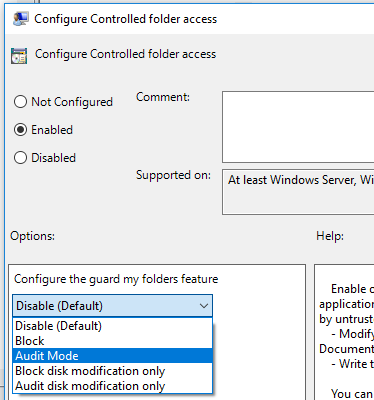

# <a name="enable-controlled-folder-access"></a>제어된 폴더 액세스 사용

[!INCLUDE [Microsoft 365 Defender rebranding](../../includes/microsoft-defender.md)]

**적용 대상:**
- [엔드포인트용 Microsoft Defender](https://go.microsoft.com/fwlink/p/?linkid=2154037)
- [Microsoft 365 Defender](https://go.microsoft.com/fwlink/?linkid=2118804)

> Endpoint용 Defender를 경험하고 싶나요? [무료 평가판을 신청하세요.](https://signup.microsoft.com/create-account/signup?products=7f379fee-c4f9-4278-b0a1-e4c8c2fcdf7e&ru=https://aka.ms/MDEp2OpenTrial?ocid=docs-wdatp-assignaccess-abovefoldlink)

[제어된 폴더 액세스는](controlled-folders.md) 랜섬웨어와 같은 악성 앱 및 위협으로부터 중요한 데이터를 보호하는 데 도움이 됩니다. 제어된 폴더 액세스는 Windows 10 Server 2019에 Windows 포함되어 있습니다.  제어된 폴더 액세스는 Windows [Server 2012R2 및 2016에 대한 최신 통합 솔루션의 일부로도 포함되어 있습니다.](/microsoft-365/security/defender-endpoint/configure-server-endpoints#new-functionality-in-the-modern-unified-solution-for-windows-server-2012-r2-and-2016-preview)

다음 방법 중 한 가지를 사용하여 제어된 폴더 액세스를 사용하도록 설정할 수 있습니다.

- [Windows 보안 앱 *](#windows-security-app)
- [Microsoft Endpoint Manager ](#endpoint-manager)
- [MDM(모바일 장치 관리)](#mobile-device-management-mdm)
- [Microsoft Endpoint Configuration Manager](#microsoft-endpoint-configuration-manager)
- [그룹 정책](#group-policy)
- [PowerShell](#powershell)

[감사 모드를](evaluate-controlled-folder-access.md) 사용하면 장치의 일반적인 사용에 영향을 주지 않고 기능이 어떻게 작동하고 이벤트를 검토하는지 테스트할 수 있습니다.

로컬 관리자 목록의 선택을 해제하는 그룹 정책 설정은 제어된 폴더 액세스 설정을 다시 지정합니다. 또한 제어된 폴더 액세스를 통해 로컬 관리자가 설정한 보호된 폴더 및 허용된 앱을 어버합니다. 이러한 정책에는 다음이 포함됩니다.

- Microsoft Defender 바이러스 백신 목록에 **대한 로컬 관리자 병합 동작 구성**
- System Center Endpoint Protection 사용자가 제외 및 오버라이드를 추가할 **수 있도록 허용**

로컬 목록의 선택을 취소하는 데 대한 자세한 내용은 [사용자가 Microsoft Defender AV](/windows/security/threat-protection/microsoft-defender-antivirus/configure-local-policy-overrides-microsoft-defender-antivirus)정책 설정을 로컬로 수정하지 못하도록 허용을 참조하세요.

## <a name="windows-security-app"></a>Windows 보안 앱

1. 작업 Windows 보안 방패 아이콘을 선택하여 앱 앱을 니다. Defender의 시작 메뉴를 **검색할 수도 있습니다.**

2. 바이러스 & **위협** 방지 타일(또는 왼쪽 메뉴 표시줄의 방패 아이콘)을 선택한 다음 랜섬웨어 보호 **를 선택합니다.**

3. 제어된 폴더 **액세스에 대한 스위치를** **켜기 로 설정**

> [!NOTE]
> *이 방법은 Windows Server 2012R2 또는 2016에서는 사용할 수 없습니다.
> 
> 제어된 폴더 액세스가 그룹 정책, PowerShell 또는 MDM CSP로 구성된 경우 디바이스를 다시 시작한 후 Windows 보안 앱에서 상태가 변경됩니다.
> 해당 도구를 사용하여  기능이 감사 모드로 설정되어 있는 경우 Windows 보안 앱이 상태를 끄기로 **표시됩니다.**
> 사용자 프로필 데이터를 보호하는 경우 사용자 프로필이 설치 드라이브의 기본 Windows 좋습니다.

## <a name="endpoint-manager"></a>Endpoint Manager

1. 끝점 보안 [Endpoint Manager](https://endpoint.microsoft.com) **로그인하고 을 를 습니다.**

2. 공격 표면 **감소 정책으로** \> **이동 합니다.**

3. 플랫폼을 **선택하고** Windows 10 **이상을** 선택하고 프로필 공격 표면 감소 규칙 만들기 **를** \> **선택합니다.**

4. 정책 이름을 지정하고 설명을 추가합니다. **다음** 을 선택합니다.

5. 아래로 스크롤하여 폴더 보호  사용 드롭다운을 선택하고 사용 을 **선택합니다.**

6. **보호해야** 하는 추가 폴더 목록을 선택하고 보호해야 하는 폴더를 추가합니다.

7. 보호된 **폴더에 액세스할** 수 있는 앱 목록을 선택하고 보호된 폴더에 액세스할 수 있는 앱을 추가합니다.

8. 공격 **표면 축소** 규칙에서 파일 및 경로 제외를 선택하고 공격 표면 축소 규칙에서 제외해야 하는 파일 및 경로를 추가합니다.

9. 프로필 할당 **을 선택하고** 모든 사용자 및 모든 & **할당하고** 저장을 **선택합니다.**

10. 다음을 **선택하여** 열려 있는 각 블레이드를 저장한 다음 **만들기를 선택합니다.**

    > [!NOTE]
    > 와일드카드는 응용 프로그램에 지원되지만 폴더에는 지원되지 않습니다. 하위폴더는 보호되지 않습니다. 허용된 앱은 다시 시작할 때까지 이벤트를 계속 트리거합니다.

## <a name="mobile-device-management-mdm"></a>MDM(모바일 장치 관리)

[./Vendor/MSFT/Policy/Config/ControlledFolderAccessProtectedFolders](/windows/client-management/mdm/policy-csp-defender) CSP(구성 서비스 공급자)를 사용하여 앱이 보호된 폴더를 변경할 수 있도록 합니다.

## <a name="microsoft-endpoint-configuration-manager"></a>Microsoft Endpoint Configuration Manager

1. 이 Microsoft Endpoint Configuration Manager Exploit **Guard에서** 자산 및 규정 준수 Endpoint Protection \>  \> **Windows Defender 로 이동합니다.**

2. 홈 **Exploit** \> **Guard 정책 만들기 를 선택합니다.**

3. 이름과 설명을 입력하고 제어된 **폴더 액세스** 를 선택하고 다음 을 **선택합니다.**

4. 변경 차단 또는 감사, 다른 앱 허용 또는 다른 폴더 추가 여부를 선택하고 다음 을 **선택합니다.**

   > [!NOTE]
   > 와일드카드는 응용 프로그램에 지원되지만 폴더에는 지원되지 않습니다. 하위폴더는 보호되지 않습니다. 허용된 앱은 다시 시작할 때까지 이벤트를 계속 트리거합니다.

5. 설정을 검토하고 **다음을** 선택하여 정책을 만들 수 있습니다.

6. 정책을 만든 후 를 **닫습니다.**

## <a name="group-policy"></a>그룹 정책

1. 그룹 정책 관리 장치에서 그룹 정책 관리 콘솔을 [열고](https://technet.microsoft.com/library/cc731212.aspx)구성할 그룹 정책 개체를 마우스 오른쪽 단추로 클릭하고 편집을 **선택합니다.**

2. **그룹 정책 관리 편집기** 에서 **컴퓨터 구성** 으로 이동하여 **관리 템플릿** 을 선택합니다.

3. 제어된 **폴더 액세스 Windows Exploit Guard > Microsoft Defender 바이러스 백신 > Windows Defender 구성 > 확장합니다.**

4. 제어된 폴더 액세스 구성 설정을 **두** 번 클릭하고 옵션을 사용으로 **설정합니다.** 옵션 섹션에서 다음 옵션 중 하나를 지정해야 합니다.
   - **사용** - 악성 및 의심스러운 앱은 보호된 폴더의 파일을 변경할 수 없습니다. 알림은 이벤트 로그의 Windows 제공됩니다.
   - **사용 안 하게(기본값)** - 제어된 폴더 액세스 기능이 작동하지 않습니다. 모든 앱은 보호된 폴더의 파일을 변경할 수 있습니다.
   - **감사 모드** - 악의적 또는 의심스러운 앱이 보호된 폴더의 파일을 변경하려고 하면 변경이 허용됩니다. 그러나 조직에 미치는 영향을 평가할 수 있는 Windows 로그에 기록됩니다.
   - **디스크 수정만 차단** - 디스크 섹터에 쓰는 것으로 확인되지 않은 앱에서 디스크 섹터에 쓰는 시도는 이벤트 로그에 Windows 기록됩니다. 이러한 로그는 Microsoft  응용 프로그램 및 서비스 로그 Microsoft Windows \> Windows Defender ID \> \> \> \> 1123에서 찾을 수 있습니다.
   - **디스크** 수정만 감사 - 보호된 디스크 섹터에 쓰기 시도만 Windows 이벤트 로그에  기록됩니다(응용 프로그램 및 서비스 로그 Microsoft Windows Windows Defender \>  \>  \>  \> **작동** \> **ID 1124).** 보호된 폴더의 파일 수정 또는 삭제 시도는 기록되지 않습니다.

      

> [!IMPORTANT]
> 제어된 폴더 액세스를 완전히 사용하도록 설정하려면 그룹  정책 옵션을  사용으로 설정하고 옵션 드롭다운 메뉴에서 차단을 선택해야 합니다.

## <a name="powershell"></a>PowerShell

1. 목록에서 **powershell을** 시작 메뉴 마우스 오른쪽 단추로 Windows PowerShell **관리자** 권한으로 **실행을 선택합니다.**

2. 다음 cmdlet을 입력합니다.

    ```PowerShell
    Set-MpPreference -EnableControlledFolderAccess Enabled
    ```

대신 를 지정하여 감사 모드에서 이 기능을 사용하도록 설정할 `AuditMode` 수 `Enabled` 있습니다.

기능을 `Disabled` 끄는 데 사용할 수 있습니다.

## <a name="see-also"></a>참고 항목

- [제어된 폴더 액세스를 사용하여 중요한 폴더 보호](controlled-folders.md)
- [제어된 폴더 액세스 사용자 지정](customize-controlled-folders.md)
- [엔드포인트용 Microsoft Defender 평가](evaluate-mde.md)
