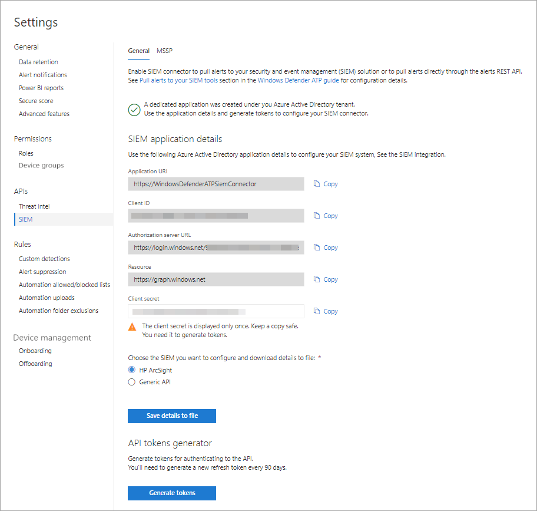

# 끝점용 Microsoft Defender에서 SIEM 통합 사용

[!INCLUDE [Microsoft 365 Defender rebranding](../../includes/microsoft-defender.md)]

**적용 대상:**
- [엔드포인트용 Microsoft Defender](https://go.microsoft.com/fwlink/?linkid=2154037)

> 엔드포인트용 Microsoft Defender를 경험하고 싶으신가요? [무료 평가판을 신청하세요.](https://signup.microsoft.com/create-account/signup?products=7f379fee-c4f9-4278-b0a1-e4c8c2fcdf7e&ru=https://aka.ms/MDEp2OpenTrial?ocid=docs-wdatp-enablesiem-abovefoldlink)

SIEM(보안 정보 및 이벤트 관리) 통합을 사용하도록 설정하여 보안 정보 및 이벤트 관리에서 검색을 Microsoft 365 Defender. SIEM 솔루션을 사용하여 검색을 끌어오거나 검색 REST API에 직접 연결합니다.

> [!NOTE]
>
> - [끝점용 Microsoft Defender 경고는](alerts.md) 하나 이상의 검색으로 구성됩니다.
> - [끝점 검색을 위한 Microsoft Defender는](api-portal-mapping.md) 장치 및 관련 경고 세부 정보에서 발생한 의심스러운 이벤트로 구성됩니다.
> - 끝점 경고용 Microsoft Defender 경고 API는 경고 소비를 위한 최신 API로, 각 경고에 대한 자세한 관련 증거 목록을 포함 합니다. 자세한 내용은 [Alert 메서드](alerts.md) 및 속성 및 목록 [경고를 참조하세요.](get-alerts.md)

## 필수 구성 요소

- 설정을 활성화하는 사용자에게 AAD(응용 프로그램)에서 앱을 만들 수 Azure Active Directory 있어야 합니다. 이 역할은 다음과 같은 역할을 합니다.

  - 보안 관리자 및 전역 관리자
  - 클라우드 애플리케이션 관리자
  - 응용 프로그램 관리자
  - 서비스 보안 주체의 소유자

- 초기 활성화 중에 자격 증명을 입력할 수 있는 팝업 화면이 표시됩니다. 이 사이트에 대해 팝업을 허용해야 합니다.

## SIEM 통합 사용

1. 탐색 창에서 **끝점 API 설정** \>  \>  \> **SIEM을 선택합니다.**

   :::image type="content" source="../../media/enable-siemnew.png" alt-text="menu1의 SIEM 통합 설정.":::

   > [!TIP]
   > SIEM 커넥터 응용 프로그램을 사용하도록 설정할 때 오류가 발생하는 경우 브라우저의 팝업 차단 설정을 확인합니다. 이 기능을 사용하도록 설정하면 새 창이 열리게 차단될 수 있습니다.

2. **SIEM 통합 사용 을 선택합니다.** 이렇게 하면 미리 채워진 값이 포함된 **SIEM** 커넥터 액세스 세부 정보 섹션이 활성화되어 응용 프로그램이 Azure Active Directory(Azure AD) 테넌트에 만들어집니다.

    > [!WARNING]
    > 클라이언트 비밀은 한 번만 표시됩니다. 복사본을 안전한 장소에 보관해야 합니다.

    

3. 조직에서 사용하는 SIEM 유형을 선택하십시오.

   > [!NOTE]
   > HP ArcSight를 선택하는 경우 다음 두 구성 파일을 저장해야 합니다.
   >
   > - WDATP-connector.jsonparser.properties
   > - WDATP-connector.properties

   프로그래밍 액세스를 통해 검색 REST API에 직접 연결하려면 일반 **API 를 선택하십시오.**

4. 개별 값을 복사하거나 **파일에 세부** 정보 저장을 선택하여 모든 값이 포함된 파일을 다운로드합니다.

5. 토큰 **생성을 선택하여** 액세스 및 새로 고침 토큰을 얻습니다.

   > [!NOTE]
   > 90일마다 새 Refresh 토큰을 생성해야 합니다.

6. 끝점용 [Microsoft Defender에](/microsoft-365/security/defender-endpoint/exposed-apis-create-app-webapp) 대한 Azure AD 앱 등록을 만들기 위한 지침을 따르고 경고를 읽을 수 있는 올바른 권한을 할당합니다.

이제 SIEM 솔루션을 구성하거나 프로그래밍 방법을 통해 검색 REST API에 연결할 수 있습니다. SIEM 솔루션이 해당 솔루션에서 검색을 받을 수 있도록 SIEM 솔루션을 구성할 때 토큰을 Microsoft 365 Defender.

## 끝점용 Microsoft Defender와 IBM QRadar 통합

끝점용 Microsoft Defender에서 검색을 수집하도록 IBM QRadar를 구성할 수 있습니다. 자세한 내용은 [IBM 기술 센터를 참조하세요.](https://www.ibm.com/docs/en/qsip/7.3.2?topic=quick-start-guide)

## 참고 항목

- [끝점 감지를 위해 Microsoft Defender를 끌어오도록 HP ArcSight 구성](configure-arcsight.md)
- [끝점 검색 필드용 Microsoft Defender](api-portal-mapping.md)
- [REST API를 사용하여 끝점 검색을 위한 Microsoft Defender 끌어오기](pull-alerts-using-rest-api.md)
- [SIEM 도구 통합 문제 해결](troubleshoot-siem.md)
