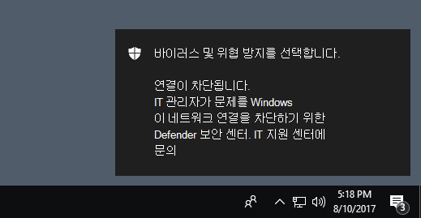

# <a name="evaluate-network-protection"></a>네트워크 보호 평가

[!INCLUDE [Microsoft 365 Defender rebranding](../../includes/microsoft-defender.md)]

**적용 대상:**
- [엔드포인트용 Microsoft Defender](https://go.microsoft.com/fwlink/?linkid=2154037)
- - [Microsoft 365 Defender](https://go.microsoft.com/fwlink/?linkid=2118804)

[네트워크 보호는](network-protection.md) 직원이 응용 프로그램을 사용하여 인터넷에서 피싱 사기, 악용 및 기타 악성 콘텐츠를 호스팅할 수 있는 위험한 도메인에 액세스하는 것을 방지하는 데 도움이 됩니다.

이 문서는 기능을 사용하도록 설정하고 테스트 사이트로 안내하여 네트워크 보호를 평가하는 데 도움이 됩니다. 이 평가 문서의 사이트는 악의적이지 않습니다. 악의적인 것으로 하여 특별히 만들어진 웹 사이트입니다. 사이트는 사용자가 악성 사이트 또는 도메인을 방문한 경우 실행되는 동작을 복제합니다.

> [!TIP]
> Microsoft Defender Testground 웹 사이트를 방문하여 다른 보호 [demo.wd.microsoft.com](https://demo.wd.microsoft.com?ocid=cx-wddocs-testground) 방법을 확인할 수도 있습니다.

## <a name="enable-network-protection-in-audit-mode"></a>감사 모드에서 네트워크 보호 사용

감사 모드에서 네트워크 보호를 사용하도록 설정하여 차단된 IP 주소 및 도메인을 확인합니다. 이 앱이 업무 앱에 영향을 주지 않는지 확인하거나 차단이 발생하는 자주에 대해 알 수 있습니다.

1. 목록에서 **powershell을** 시작 메뉴 마우스 오른쪽 **단추로** 클릭하고 Windows PowerShell 관리자 권한으로 **실행을 선택합니다.**
2. 다음 cmdlet을 입력합니다.

    ```PowerShell
    Set-MpPreference -EnableNetworkProtection AuditMode
    ```

### <a name="visit-a-fake-malicious-domain"></a>(가짜) 악성 도메인 방문

1. 선택한 Internet Explorer, Google Chrome 또는 기타 브라우저를 열 수 있습니다.

2. [https://smartscreentestratings2.net](https://smartscreentestratings2.net)(으)로 이동합니다.

네트워크 연결이 허용되고 테스트 메시지가 표시됩니다.



> [!NOTE]
> 사이트가 네트워크 보호에 의해 차단된 경우에도 네트워크 연결이 성공할 수 있습니다. 자세한 내용은 네트워크 보호 및 [TCP 3차원 핸드세이크 를 참조합니다.](network-protection.md#network-protection-and-the-tcp-three-way-handshake)

## <a name="review-network-protection-events-in-windows-event-viewer"></a>이벤트 뷰어에서 Windows 이벤트 검토

차단된 앱을 검토하려면 Microsoft-Windows-Windows-Defender/Operational 로그에서 이벤트 뷰어를 열고 이벤트 ID 1125를 필터링합니다. 다음 표에는 모든 네트워크 보호 이벤트가 나열됩니다.

| 이벤트 ID | 제공/원본 | 설명 |
|---|---|---|
| 5007 | Windows Defender(작동) | 설정이 변경될 때의 이벤트 |
| 1125 | Windows Defender(작동) | 네트워크 연결이 감사된 경우 이벤트 |
| 1126 | Windows Defender(작동) | 네트워크 연결이 차단된 경우 이벤트 |

## <a name="see-also"></a>참고 항목

- [네트워크 보호](network-protection.md)

- [네트워크 보호 및 TCP 3차원 핸드세이크](network-protection.md#network-protection-and-the-tcp-three-way-handshake)

- [네트워크 보호 사용](enable-network-protection.md)

- [네트워크 보호 문제 해결](troubleshoot-np.md)
