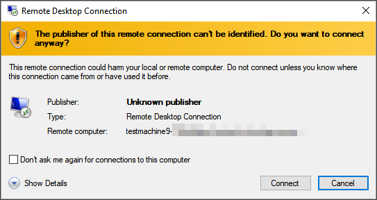
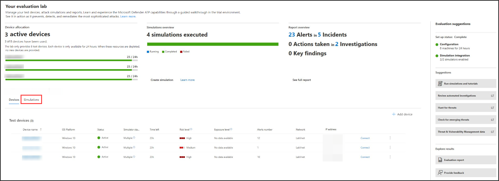
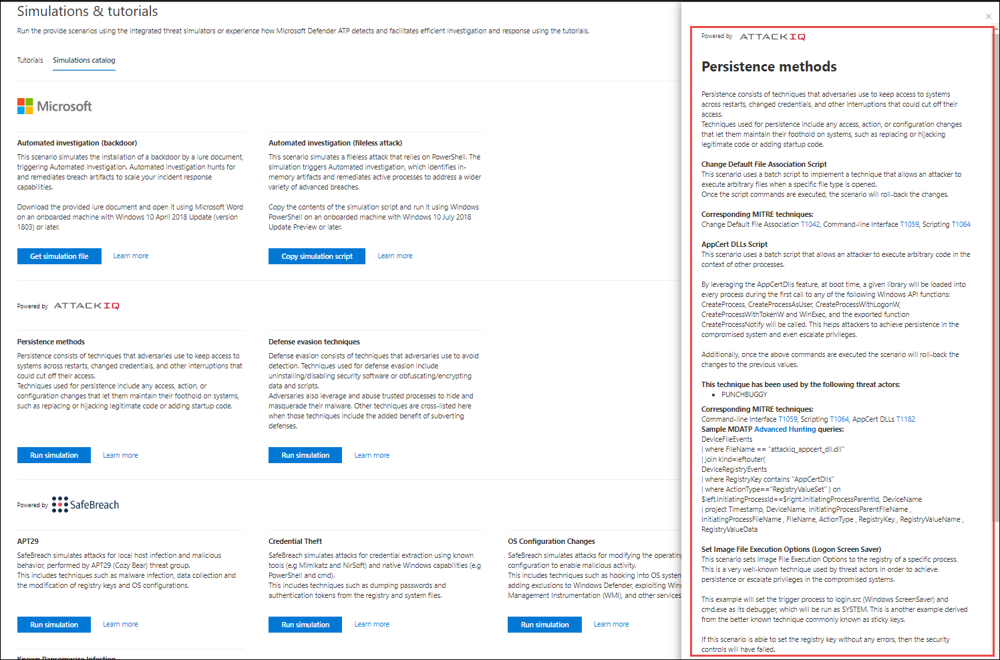
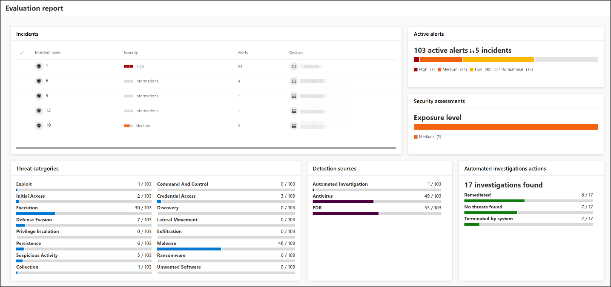
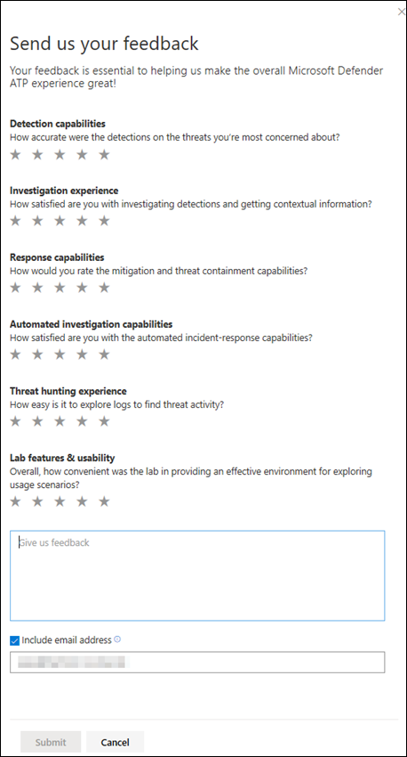

# 끝점용 Microsoft Defender 평가 랩

[!INCLUDE [Microsoft 365 Defender rebranding](../../includes/microsoft-defender.md)]

**적용 대상:**
- [엔드포인트용 Microsoft Defender](https://go.microsoft.com/fwlink/?linkid=2154037)
- [Microsoft 365 Defender](https://go.microsoft.com/fwlink/?linkid=2118804)

> 엔드포인트용 Microsoft Defender를 경험하고 싶으신가요? [무료 평가판을 신청하세요.](https://signup.microsoft.com/create-account/signup?products=7f379fee-c4f9-4278-b0a1-e4c8c2fcdf7e&ru=https://aka.ms/MDEp2OpenTrial?ocid=docs-wdatp-enablesiem-abovefoldlink)

포괄적인 보안 제품 평가를 수행하려면 포괄적인 공격 시뮬레이션을 실제로 수행하기 전에 번거로우는 환경 및 장치 구성을 요구하는 복잡한 프로세스가 될 수 있습니다. 복잡성을 더하는 것은 평가 중에 시뮬레이션 활동, 경고 및 결과가 반영되는 위치를 추적해야 하는 과제입니다.

끝점용 Microsoft Defender 평가 랩은 플랫폼의 기능을 평가하고 시뮬레이션을 실행하고, 실행 중인 예방, 탐지 및 수정 기능을 보는 데 집중할 수 있도록 장치 및 환경 구성의 복잡한 문제를 없애기 위해 설계되었습니다.

> [!VIDEO https://www.microsoft.com/videoplayer/embed/RE4qLUM]

간소화된 설정 환경을 사용하면 자체 테스트 시나리오 및 미리 만들어진 시뮬레이션을 실행하여 끝점용 Defender의 수행 방법을 볼 수 있습니다.

자동화된 조사, 고급 헌팅 및 위협 분석과 같은 플랫폼의 강력한 기능에 대한 모든 권한을 가지게 되므로 Endpoint용 Defender가 제공하는 포괄적인 보호 스택을 테스트할 수 있습니다.

Windows 10, Windows 11, Windows Server 2019 또는 Windows Server 2022 장치에서 최신 OS 버전 및 올바른 보안 구성 요소를 설치하고 Office 2019 Standard를 설치할 수 있습니다.

위협 시뮬레이터를 설치할 수 있습니다. Endpoint용 Defender는 업계를 선도하는 위협 시뮬레이션 플랫폼과 파트너가 되어 포털을 떠나지 않고도 끝점용 Defender 기능을 테스트할 수 있습니다.

원하는 시뮬레이터를 설치하고, 평가 랩 내에서 시나리오를 실행하고, 플랫폼의 기능을 즉시 확인하여 추가 비용도 무료로 모두 편리하게 사용할 수 있습니다. 또한 시뮬레이션 카탈로그에서 액세스하고 실행할 수 있는 다양한 시뮬레이션에 편리하게 액세스할 수 있습니다.

## 시작하기 전에

평가 랩에 액세스하려면  라이선스 요구 사항을 충족하거나 끝점용 Microsoft Defender에 대한 평가판 액세스 권한이 필요합니다.

다음에 대한 **보안 설정** 관리 권한이 있어야 합니다.

- 랩 만들기
- 장치 만들기
- 암호 다시 설정
- 시뮬레이션 만들기

RBAC(역할 기반 액세스 제어)를 사용하도록 설정하고 하나 이상의 컴퓨터 그룹을 만든 경우 사용자는 모든 컴퓨터 그룹에 액세스할 수 있어야 합니다.

자세한 내용은 역할 만들기 [및 관리를 참조하세요.](user-roles.md)

엔드포인트용 Microsoft Defender를 경험하고 싶으신가요? [무료 평가판을 신청하세요.](https://signup.microsoft.com/create-account/signup?products=7f379fee-c4f9-4278-b0a1-e4c8c2fcdf7e&ru=https://aka.ms/MDEp2OpenTrial?ocid=docs-wdatp-main-abovefoldlink)

## 랩 시작

메뉴에서 랩에 액세스할 수 있습니다. 탐색 메뉴에서 평가판 및 자습서> **평가 랩 을 선택합니다.**

> [!NOTE]
>
> - 선택한 환경 구조의 유형에 따라 정품 인증일로부터 지정된 시간 동안 디바이스를 사용할 수 있습니다.
> - 각 환경은 제한된 테스트 장치 집합으로 프로비전됩니다. 프로비전된 장치를 사용한 후 삭제한 경우 더 많은 디바이스를 요청할 수 있습니다.
> - 한 달에 한 번씩 랩 리소스를 요청할 수 있습니다.

이미 랩이 있나요? 새 위협 시뮬레이터를 사용하도록 설정하고 활성 장치를 설정해야 합니다.

## 평가 랩 설정

1. 탐색 창에서 평가판 & **자습서** \> **평가** 랩을 선택한 다음 설치 **랩 을 선택합니다.**

    :::image type="content" source="../../media/evaluationtutormenu.png" alt-text="평가 랩 시작 페이지의 이미지입니다.":::

2. 평가 요구에 따라 더 긴 기간 동안 더 적은 장치 또는 더 짧은 기간 동안 더 많은 장치를 사용하여 환경을 설정하기로 선택할 수 있습니다. 기본 설정 랩 구성을 선택한 후 다음 을 **선택합니다.**

    

3. (선택 사항) 랩에 위협 시뮬레이터를 설치하도록 선택할 수 있습니다.

    

   > [!IMPORTANT]
   > 먼저 약관 및 정보 공유 설명에 동의하고 동의해야 합니다.

4. 사용할 위협 시뮬레이션 에이전트를 선택하고 세부 정보를 입력합니다. 나중에 위협 시뮬레이터를 설치하도록 선택할 수 있습니다. 랩 설치 중에 위협 시뮬레이션 에이전트를 설치하도록 선택한 경우 추가한 장치에 위협 시뮬레이션 에이전트를 편리하게 설치하는 이점을 즐길 수 있습니다.

    

5. 요약을 검토하고 설치 **랩을 선택합니다.**

랩 설정 프로세스가 완료되면 디바이스를 추가하고 시뮬레이션을 실행할 수 있습니다.

## 장치 추가

환경에 장치를 추가하면 끝점용 Defender가 연결 세부 정보가 있는 잘 구성된 장치를 설치합니다. Server Windows 10 11, Windows Server 2019 또는 Windows Server 2022 Windows 추가할 수 있습니다.

장치는 최신 버전의 OS 및 Office 2019 Standard 및 Java, PysIntenals 등의 기타 앱으로 구성됩니다.

랩 설정 중에 위협 시뮬레이터를 추가하기로 선택한 경우 모든 장치에 추가하는 장치에 위협 시뮬레이터 에이전트가 설치됩니다.

권장되는 Windows 보안 구성 요소가 켜져 감사 모드로 켜져 있는 경우 장치에서 자동으로 테넌트에 온보드됩니다.

테스트 장치에 미리 구성된 보안 구성 요소는 다음과 같습니다.

- [공격 표면 감소](attack-surface-reduction.md)
- [처음에 차단](configure-block-at-first-sight-microsoft-defender-antivirus.md)
- [제어된 폴더 액세스](controlled-folders.md)
- [악용 방지](enable-exploit-protection.md)
- [네트워크 보호](network-protection.md)
- [잠재적으로 원치 않는 응용 프로그램 검색](detect-block-potentially-unwanted-apps-microsoft-defender-antivirus.md)
- [클라우드 제공 보호](cloud-protection-microsoft-defender-antivirus.md)
- [Microsoft Defender SmartScreen](/windows/security/threat-protection/microsoft-defender-smartscreen/microsoft-defender-smartscreen-overview)

> [!NOTE]
> Microsoft Defender 바이러스 백신 설정됩니다(감사 모드 아미기). 사용자가 Microsoft Defender 바이러스 백신 실행을 차단하는 경우 디바이스에서 실시간 보호를 해제할 수 Windows 보안. 자세한 내용은 [Always-On 보호 구성을 참조하세요.](configure-real-time-protection-microsoft-defender-antivirus.md)

자동화된 조사 설정은 테넌트 설정에 따라 달라집니다. 기본적으로 반자동으로 구성됩니다. 자세한 내용은 자동화된 조사 [개요를 참조하세요.](automated-investigations.md)

> [!NOTE]
> 테스트 장치에 대한 연결은 RDP를 사용하여 수행됩니다. 방화벽 설정에서 RDP 연결을 허용하는지 확인합니다.

1. 대시보드에서 장치 **추가 를 선택합니다.**

2. 추가할 디바이스 유형을 선택하십시오. Windows 10 11, Windows Server 2019 또는 Windows Server 2022를 Windows 수 있습니다.

    :::image type="content" source="../../media/add-machine-optionsnew.png" alt-text="디바이스 옵션을 사용하여 랩 설정.":::

   > [!NOTE]
   > 장치 만들기 프로세스에 문제가 있는 경우 알림을 보게 되고 새 요청을 제출해야 합니다. 장치 만들기가 실패하면 전체 허용 할당량에 대해 계산되지 않습니다.

3. 연결 세부 정보가 표시됩니다. **디바이스의** 암호를 저장하려면 복사를 선택합니다.

   > [!NOTE]
   > 암호는 한 번만 표시됩니다. 나중에 사용하기 위해 저장해야 합니다.

    :::image type="content" source="../../media/add-machine-eval-lab-new.png" alt-text="연결 세부 정보로 추가된 장치의 이미지입니다.":::

4. 디바이스 설정이 시작됩니다. 약 30분 정도 걸릴 수 있습니다.

5. 장치 탭을 선택하여 테스트 장치의 상태, 위험 및 노출 수준, 시뮬레이터 설치 상태를 볼 **수** 있습니다.

    

   > [!TIP]
   > 시뮬레이터 **상태** 열에서 정보 아이콘 위에 마우스를 여 에이전트의 설치 상태를 알 수 있습니다.

## 추가 장치 요청

모든 기존 장치를 사용 및 삭제하는 경우 더 많은 디바이스를 요청할 수 있습니다. 한 달에 한 번씩 랩 리소스를 요청할 수 있습니다.

1. 평가 랩 대시보드에서 추가 장치 **요청을 선택합니다.**

   

2. 구성을 선택 합니다.
3. 요청을 제출합니다.

요청이 성공적으로 제출된 경우 녹색 확인 배너와 마지막 제출 날짜가 표시됩니다.

요청의 상태는 몇 시간  후 승인되는 사용자 작업 탭에서 확인할 수 있습니다.

승인되면 요청된 장치가 랩 설정에 추가되어 더 많은 디바이스를 만들 수 있습니다.

> [!TIP]
> 랩을 좀 더 잘 진행하기 위해 시뮬레이션 라이브러리를 체크 아웃하는 것을 잊지 마세요.

## 공격 시나리오 시뮬레이트

테스트 장치를 사용하여 연결하여 자체 공격 시뮬레이션을 실행합니다.

다음을 사용하여 공격 시나리오를 시뮬레이트할 수 있습니다.

- ["직접" 공격 시나리오](https://security.microsoft.com/tutorials/all)
- 위협 시뮬레이터

고급 [헌팅을](advanced-hunting-overview.md) 사용하여 데이터 및 [위협](threat-analytics.md) 분석을 쿼리하여 새로운 위협에 대한 보고서를 볼 수 있습니다.

### 직접 공격 시나리오

미리 만든 시뮬레이션을 찾고 있는 경우 ["직접 실행"](https://security.microsoft.com/tutorials/all)공격 시나리오를 사용할 수 있습니다. 이러한 스크립트는 안전하고 문서화되어 있으며 사용하기 쉽습니다. 이러한 시나리오는 끝점 기능에 대한 Defender를 반영하고 조사 환경을 진행합니다.

미리 만든 시뮬레이션을 찾고 있는 경우 ["직접 실행"](https://security.microsoft.com/tutorials/all)공격 시나리오를 사용할 수 있습니다. 이러한 스크립트는 안전하고 문서화되어 있으며 사용하기 쉽습니다. 이러한 시나리오는 끝점 기능에 대한 Defender를 반영하고 조사 환경을 진행합니다.

> [!NOTE]
> 테스트 장치에 대한 연결은 RDP를 사용하여 수행됩니다. 방화벽 설정에서 RDP 연결을 허용하는지 확인합니다.

1. 커넥트 를 선택하여 장치에 연결하고 를 선택하여 **공격 시뮬레이션을 커넥트.**

    

2. RDP 파일을 저장하고 를 선택하여 **커넥트.**

    

    > [!NOTE]
    > 초기 설정 중에 암호 복사본을 저장하지 않은 경우 메뉴에서 암호 다시 설정을 선택하여 암호를 **다시** 설정할 수 있습니다.
    >
    > 
    >
    > 디바이스의 상태가 "암호 재설정 실행"으로 변경되면 몇 분 후에 새 암호가 표시됩니다.

3. 디바이스를 만들 때 표시된 암호를 입력합니다.

   

4. 장치에서 Do-it-yourself 공격 시뮬레이션을 실행합니다.

### 위협 시뮬레이터 시나리오

랩 설정 중에 지원되는 위협 시뮬레이터를 설치하도록 선택한 경우 평가 랩 디바이스에서 기본 제공 시뮬레이션을 실행할 수 있습니다.

타사 플랫폼을 사용하여 위협 시뮬레이션을 실행하는 것은 테스트 환경의 범위 내에서 끝점 기능에 대한 Microsoft Defender를 평가하는 좋은 방법입니다.

> [!NOTE]
>
> 시뮬레이션을 실행하기 전에 다음 요구 사항을 충족하는지 확인합니다.
>
> - 디바이스를 평가 랩에 추가해야 합니다.
> - 위협 시뮬레이터를 평가 랩에 설치해야 합니다.

1. 포털에서 시뮬레이션 **만들기를 선택합니다.**

2. 위협 시뮬레이터를 선택합니다.

    

3. 시뮬레이션을 선택하거나 시뮬레이션 갤러리를 살펴보고 사용 가능한 시뮬레이션을 탐색합니다.

    시뮬레이션 갤러리는 다음에서 얻을 수 있습니다.
    - 시뮬레이션 개요 타일의 주 평가 **대시보드 또는**
    - 탐색 창 평가 및 자습서  시뮬레이션을 탐색하여 \> **자습서를 &** 시뮬레이션 **카탈로그를 선택합니다.**

4. 시뮬레이션을 실행할 디바이스를 선택합니다.

5. 시뮬레이션 **만들기를 선택합니다.**

6. 시뮬레이션 탭을 선택하여 시뮬레이션 **진행률을 니다.** 시뮬레이션 상태, 활성 경고 및 기타 세부 정보를 볼 수 있습니다.

    

시뮬레이션을 실행한 후 랩 진행률 표시줄을 살펴보고 자동화된 조사 및 수정을 트리거한 **Endpoint용 Microsoft Defender를** 살펴보는 것이 좋습니다. 기능에서 수집 및 분석한 증거를 확인해 보아야 합니다.

풍부한 쿼리 언어 및 원시 원격 분석을 사용하여 고급 헌팅을 통해 공격 증거를 헌팅하고 위협 분석에 문서화되어 있는 전 세계 위협을 확인해보십시오.

## 시뮬레이션 갤러리

끝점용 Microsoft Defender는 다양한 위협 시뮬레이션 플랫폼과 파트너가 되어 포털 내에서 바로 플랫폼의 기능을 테스트할 수 있는 편리한 액세스 권한을 제공합니다.

메뉴에서 시뮬레이션 및 자습서  시뮬레이션 카탈로그로 진행하여 사용 가능한 모든 \>  시뮬레이션을 시청합니다.

지원되는 타사 위협 시뮬레이션 에이전트 목록이 나열되어 있으며, 자세한 설명과 함께 특정 유형의 시뮬레이션이 카탈로그에 제공됩니다.

카탈로그에서 사용 가능한 시뮬레이션을 편리하게 실행할 수 있습니다.

각 시뮬레이션에는 공격 시나리오에 대한 자세한 설명과 사용되는 MITRE 공격 기술 및 실행한 샘플 고급 헌팅 쿼리와 같은 참조가 함께 표시됩니다.

**예제:**

## 평가 보고서

랩 보고서에는 디바이스에서 수행된 시뮬레이션의 결과가 요약됩니다.

다음을 빠르게 볼 수 있습니다.

- 트리거된 인시던트
- 생성된 경고
- 노출 수준에 대한 평가
- 관찰된 위협 범주
- 탐지 소스
- 자동화된 조사

## 피드백 제공

사용자 의견은 고급 공격으로부터 환경을 보호하는 데 도움이 됩니다. 제품 기능 및 평가 결과에서 경험과 노출을 공유합니다.

피드백 제공 을 선택하여 의견을 **알려주세요.**

