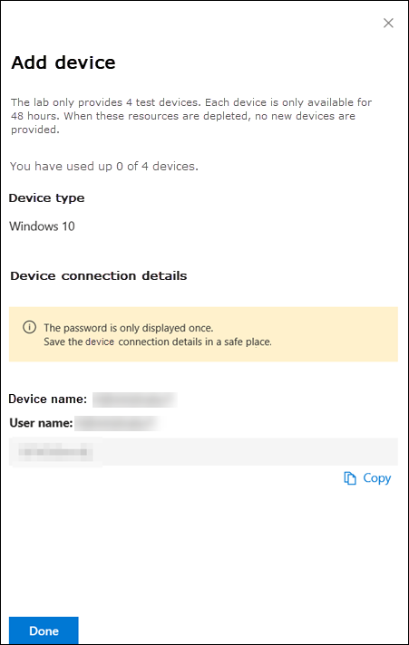
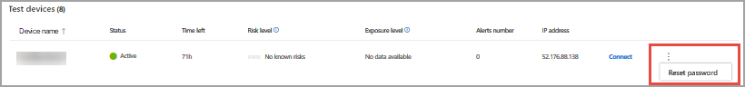

# 끝점용 Microsoft Defender 평가 랩Microsoft Defender for Endpoint evaluation lab

[!INCLUDE [Microsoft 365 Defender rebranding](../../includes/microsoft-defender.md)]

**적용 대상:****Applies to:**
- [엔드포인트용 Microsoft DefenderMicrosoft Defender for Endpoint](https://go.microsoft.com/fwlink/?linkid=2154037)
- [Microsoft 365 DefenderMicrosoft 365 Defender](https://go.microsoft.com/fwlink/?linkid=2118804)

>끝점용 Microsoft Defender를 경험하고 싶나요?Want to experience Microsoft Defender for Endpoint? [무료 평가판에 등록합니다.Sign up for a free trial.](https://www.microsoft.com/microsoft-365/windows/microsoft-defender-atp?ocid=docs-wdatp-enablesiem-abovefoldlink)

포괄적인 보안 제품 평가를 수행하려면 포괄적인 공격 시뮬레이션을 실제로 수행하기 전에 번거로우는 환경 및 장치 구성을 요구하는 복잡한 프로세스가 될 수 있습니다.Conducting a comprehensive security product evaluation can be a complex process requiring cumbersome environment and device configuration before an end-to-end attack simulation can actually be done. 복잡성을 더하는 것은 평가 중에 시뮬레이션 활동, 경고 및 결과가 반영되는 위치를 추적해야 하는 과제입니다.Adding to the complexity is the challenge of tracking where the simulation activities, alerts, and results are reflected during the evaluation.

끝점용 Microsoft Defender 평가 랩은 플랫폼의 기능을 평가하고 시뮬레이션을 실행하고, 실행 중인 예방, 탐지 및 수정 기능을 보는 데 집중할 수 있도록 장치 및 환경 구성의 복잡한 문제를 없애기 위해 설계되었습니다.The Microsoft Defender for Endpoint evaluation lab is designed to eliminate the complexities of device and environment configuration so that you can  focus on evaluating the capabilities of the platform, running simulations, and seeing the prevention, detection, and remediation features in action.

> [!VIDEO https://www.microsoft.com/en-us/videoplayer/embed/RE4qLUM]

간소화된 설정 환경을 사용하면 자체 테스트 시나리오 및 미리 만들어진 시뮬레이션을 실행하여 끝점용 Defender의 수행 방법을 볼 수 있습니다.With the simplified set-up experience, you can focus on running your own test scenarios and the pre-made simulations to see how Defender for Endpoint performs. 

자동화된 조사, 고급 헌팅 및 위협 분석과 같은 플랫폼의 강력한 기능에 대한 모든 권한을 가지게 되므로 Endpoint용 Defender가 제공하는 포괄적인 보호 스택을 테스트할 수 있습니다.You'll have full access to the powerful capabilities of the platform such as automated investigations, advanced hunting, and threat analytics, allowing you to test the comprehensive protection stack that Defender for Endpoint offers. 

Office 2019 Standard뿐만 아니라 최신 OS 버전 및 올바른 보안 구성 요소를 설치하도록 미리 구성된 Windows 10 또는 Windows Server 2019 장치를 추가할 수 있습니다.You can add Windows 10 or Windows Server 2019 devices that come pre-configured to have the latest OS versions and the right security components in place as well as Office 2019 Standard installed.

위협 시뮬레이터를 설치할 수 있습니다.You can also install threat simulators. Endpoint용 Defender는 업계를 선도하는 위협 시뮬레이션 플랫폼과 파트너가 되어 포털을 떠나지 않고도 끝점용 Defender 기능을 테스트할 수 있습니다.Defender for Endpoint has partnered with industry leading threat simulation platforms to help you test out the Defender for Endpoint capabilities without having to leave the portal.

 원하는 시뮬레이터를 설치하고, 평가 랩 내에서 시나리오를 실행하고, 플랫폼의 기능을 즉시 확인하여 추가 비용도 무료로 모두 편리하게 사용할 수 있습니다.Install your preferred simulator, run scenarios within the evaluation lab, and instantly see how the platform performs - all conveniently available at no extra cost to you. 또한 시뮬레이션 카탈로그에서 액세스하고 실행할 수 있는 다양한 시뮬레이션에 편리하게 액세스할 수 있습니다.You'll also have convenient access to wide array of simulations which you can access and run from the simulations catalog.
    

## 시작하기 전에Before you begin
평가 랩에 액세스하려면  라이선스 요구 사항을 충족하거나 끝점용 Microsoft Defender에 대한 평가판 액세스 권한이 필요합니다.You'll need to fulfill the [licensing requirements](minimum-requirements.md#licensing-requirements) or have trial access to Microsoft Defender for Endpoint to access the evaluation lab.

다음에 대한 **보안 설정** 관리 권한이 있어야 합니다.You must have **Manage security settings** permissions to:
- 랩 만들기Create the lab
- 장치 만들기Create devices
- 암호 다시 설정Reset password
- 시뮬레이션 만들기Create simulations 
 
RBAC(역할 기반 액세스 제어)를 사용하도록 설정하고 하나 이상의 컴퓨터 그룹을 만든 경우 사용자는 모든 컴퓨터 그룹에 액세스할 수 있어야 합니다.If you enabled role-based access control (RBAC) and created at least a one machine group, users must have access to All machine groups.

자세한 내용은 역할 만들기 [및 관리를 참조하세요.](user-roles.md)For more information, see [Create and manage roles](user-roles.md).

끝점용 Microsoft Defender를 경험하고 싶나요?Want to experience Microsoft Defender for Endpoint? [무료 평가판에 등록합니다.Sign up for a free trial.](https://www.microsoft.com/microsoft-365/windows/microsoft-defender-atp?ocid=docs-wdatp-main-abovefoldlink)

## 랩 시작Get started with the lab
메뉴에서 랩에 액세스할 수 있습니다.You can access the lab from the menu. 탐색 메뉴에서 평가판 및 자습서> **평가 랩 을 선택합니다.**In the navigation menu, select **Evaluation and tutorials > Evaluation lab**.

>[!NOTE]
>- 각 환경은 제한된 테스트 장치 집합으로 프로비전됩니다.Each environment is provisioned with a limited set of test devices.
>- 선택한 환경 구조의 유형에 따라 정품 인증일로부터 지정된 시간 동안 디바이스를 사용할 수 있습니다.Depending the type of environment structure you select, devices will be available for the specified number of hours from the day of activation.
>- 프로비전된 장치를 사용한 경우 새 장치가 제공되지 않습니다.When you've used up the provisioned devices, no new devices are provided. 삭제된 장치는 사용 가능한 테스트 장치 수를 새로 고치지 않습니다.A deleted device does not refresh the available test device count.
>- 제한된 리소스가 제공된 경우 장치를 신중하게 사용하는 것이 가장 쉽습니다.Given the limited resources, it’s advisable to use the devices carefully.

이미 랩이 있나요?Already have a lab? 새 위협 시뮬레이터를 사용하도록 설정하고 활성 장치를 설정해야 합니다.Make sure to enable the new threat simulators and have active devices.

## 평가 랩 설정Setup the evaluation lab

1. 탐색 창에서 평가 및 자습서 **평가** 랩  >  을 선택한 다음 설치 **랩 을 선택합니다.**In the navigation pane, select **Evaluation and tutorials** > **Evaluation lab**, then select **Setup lab**.

    

2. 평가 요구에 따라 더 긴 기간 동안 더 적은 장치 또는 더 짧은 기간 동안 더 많은 장치를 사용하여 환경을 설정하기로 선택할 수 있습니다.Depending on your evaluation needs, you can choose to setup an environment with fewer devices for a longer period or more devices for a shorter period. 기본 설정 랩 구성을 선택한 후 다음 을 **선택합니다.**Select your preferred lab configuration then select **Next**.

     

3. (선택 사항) 랩에 위협 시뮬레이터를 설치하도록 선택할 수 있습니다.(Optional) You can choose to install threat simulators in the lab. 

    

    >[!IMPORTANT]
    >먼저 약관 및 정보 공유 설명에 동의하고 동의해야 합니다.You'll first need to accept and provide consent to the terms and information sharing statements. 

4. 사용할 위협 시뮬레이션 에이전트를 선택하고 세부 정보를 입력합니다.Select the threat simulation agent you'd like to use and enter your details. 나중에 위협 시뮬레이터를 설치하도록 선택할 수 있습니다.You can also choose to install threat simulators at a later time. 랩 설치 중에 위협 시뮬레이션 에이전트를 설치하도록 선택한 경우 추가한 장치에 위협 시뮬레이션 에이전트를 편리하게 설치하는 이점을 즐길 수 있습니다.If you choose to install threat simulation agents during the lab setup, you'll enjoy the benefit of having them conveniently installed on the devices you add.  
    
    

5.  요약을 검토하고 설치 **랩을 선택합니다.**Review the summary and select **Setup lab**.  

랩 설정 프로세스가 완료되면 디바이스를 추가하고 시뮬레이션을 실행할 수 있습니다.After the lab setup process is complete, you can add devices and run simulations. 

## 장치 추가Add devices
환경에 장치를 추가하면 끝점용 Defender가 연결 세부 정보가 있는 잘 구성된 장치를 설치합니다.When you add a device to your environment, Defender for Endpoint sets up a well-configured device with connection details. Windows 10 또는 Windows Server 2019 장치를 추가할 수 있습니다.You can add Windows 10 or Windows Server 2019 devices.

장치는 최신 버전의 OS 및 Office 2019 Standard 및 Java, Python 및 SysIntenals와 같은 기타 앱으로 구성됩니다.The device will be configured with the most up-to-date version of the OS and Office 2019 Standard as well as other apps such as Java, Python, and SysIntenals. 

   >[!TIP]
   > 랩에 더 많은 디바이스가 필요하세요?Need more devices in your lab? 지원 티켓을 제출하여 요청이 끝점용 Defender 팀에서 검토하게 합니다.Submit a support ticket to have your request reviewed by the Defender for Endpoint team. 

랩 설정 중에 위협 시뮬레이터를 추가하기로 선택한 경우 모든 장치에 추가하는 장치에 위협 시뮬레이터 에이전트가 설치됩니다.If you chose to add a threat simulator during the lab setup, all devices will have the threat simulator agent installed in the devices that you add.

장치가 권장되는 Windows 보안 구성 요소를 켜고 감사 모드로 켜져 있는 테넌트에 자동으로 온보드됩니다. 즉, 사용자 쪽에서 아무 노력도 하지 않습니다.The device will automatically be onboarded to your tenant with the recommended Windows security components turned on and in audit mode - with no effort on your side. 

테스트 장치에 미리 구성된 보안 구성 요소는 다음과 같습니다.The following security components are pre-configured in the test devices:

- [공격 표면 감소Attack surface reduction](https://docs.microsoft.com/windows/security/threat-protection/windows-defender-exploit-guard/attack-surface-reduction-exploit-guard)
- [차단 시 차단Block at first sight](https://docs.microsoft.com/windows/security/threat-protection/microsoft-defender-antivirus/configure-block-at-first-sight-microsoft-defender-antivirus)
- [제어된 폴더 액세스Controlled folder access](https://docs.microsoft.com/windows/security/threat-protection/windows-defender-exploit-guard/controlled-folders-exploit-guard)
- [Exploit ProtectionExploit protection](https://docs.microsoft.com/windows/security/threat-protection/windows-defender-exploit-guard/enable-exploit-protection)
- [네트워크 보호Network protection](https://docs.microsoft.com/windows/security/threat-protection/windows-defender-exploit-guard/network-protection-exploit-guard)
- [잠재적으로 원치 않는 응용 프로그램 검색Potentially unwanted application detection](https://docs.microsoft.com/windows/security/threat-protection/microsoft-defender-antivirus/detect-block-potentially-unwanted-apps-microsoft-defender-antivirus)
- [클라우드 제공 보호Cloud-delivered protection](https://docs.microsoft.com/windows/security/threat-protection/microsoft-defender-antivirus/utilize-microsoft-cloud-protection-microsoft-defender-antivirus)
- [Microsoft Defender SmartScreenMicrosoft Defender SmartScreen](https://docs.microsoft.com/windows/security/threat-protection/windows-defender-smartscreen/windows-defender-smartscreen-overview)

>[!NOTE]
> Microsoft Defender 바이러스 백신이 설정됩니다(감사 모드 아미타임).Microsoft Defender Antivirus will be on (not in audit mode). Microsoft Defender 바이러스 백신이 시뮬레이션을 실행하지 못하게 차단하는 경우 Windows 보안을 통해 디바이스에서 실시간 보호를 해제할 수 있습니다.If Microsoft Defender Antivirus blocks you from running your simulation, you can turn off real-time protection on the device through Windows Security. 자세한 내용은 [Always-On 보호 구성을 참조하세요.](https://docs.microsoft.com/windows/security/threat-protection/microsoft-defender-antivirus/configure-real-time-protection-microsoft-defender-antivirus)For more information, see [Configure always-on protection](https://docs.microsoft.com/windows/security/threat-protection/microsoft-defender-antivirus/configure-real-time-protection-microsoft-defender-antivirus).

자동화된 조사 설정은 테넌트 설정에 따라 달라집니다.Automated investigation settings will be dependent on tenant settings. 기본적으로 반자동으로 구성됩니다.It will be configured to be semi-automated by default. 자세한 내용은 자동화된 조사 [개요를 참조하세요.](automated-investigations.md)For more information, see [Overview of Automated investigations](automated-investigations.md).

>[!NOTE]
>테스트 장치에 대한 연결은 RDP를 사용하여 수행됩니다.The connection to the test devices is done using RDP. 방화벽 설정에서 RDP 연결을 허용하는지 확인합니다.Make sure that your firewall settings allow RDP connections.

1. 대시보드에서 장치 **추가 를 선택합니다.**From the dashboard, select **Add device**. 

2. 추가할 디바이스 유형을 선택하십시오.Choose the type of device to add. Windows 10 또는 Windows Server 2019를 추가할 수 있습니다.You can choose to add Windows 10 or Windows Server 2019.

    

    >[!NOTE]
    >장치 만들기 프로세스에 문제가 있는 경우 알림을 보게 되고 새 요청을 제출해야 합니다.If something goes wrong with the device creation process, you'll be notified and you'll need to submit a new request. 장치 만들기가 실패하면 전체 허용 할당량에 대해 계산되지 않습니다.If the device creation fails, it will not be counted against the overall allowed quota. 

3. 연결 세부 정보가 표시됩니다.The connection details are displayed. **디바이스의** 암호를 저장하려면 복사를 선택합니다.Select **Copy** to save the password for the device.

    >[!NOTE]
    >암호는 한 번만 표시됩니다.The password is only displayed once. 나중에 사용하기 위해 저장해야 합니다.Be sure to save it for later use.

    

4. 디바이스 설정이 시작됩니다.Device set up begins. 약 30분 정도 걸릴 수 있습니다.This can take up to approximately 30 minutes. 

5. 장치 탭을 선택하여 테스트 장치의 상태, 위험 및 노출 수준, 시뮬레이터 설치 상태를 볼 **수** 있습니다.See the status of test devices, the risk and exposure levels, and the status of simulator installations by selecting the **Devices** tab. 

    
    

    >[!TIP]
    >시뮬레이터 **상태** 열에서 정보 아이콘 위에 마우스를 여 에이전트의 설치 상태를 알 수 있습니다.In the **Simulator status** column, you can hover over the information icon to know the installation status of an agent.

## 공격 시나리오 시뮬레이트Simulate attack scenarios
테스트 장치를 사용하여 연결하여 자체 공격 시뮬레이션을 실행합니다.Use the test devices to run your own attack simulations by connecting to them. 

다음을 사용하여 공격 시나리오를 시뮬레이트할 수 있습니다.You can simulate attack scenarios using:
- ["직접" 공격 시나리오](https://securitycenter.windows.com/tutorials)The ["Do It Yourself" attack scenarios](https://securitycenter.windows.com/tutorials)
- 위협 시뮬레이터Threat simulators

고급 [헌팅을](advanced-hunting-query-language.md) 사용하여 데이터 및 [위협](threat-analytics.md) 분석을 쿼리하여 새로운 위협에 대한 보고서를 볼 수 있습니다.You can also use [Advanced hunting](advanced-hunting-query-language.md) to query data and [Threat analytics](threat-analytics.md) to view reports about emerging threats.

### 직접 공격 시나리오Do-it-yourself attack scenarios
미리 만든 시뮬레이션을 찾고 있는 경우 ["직접 실행"](https://securitycenter.windows.com/tutorials)공격 시나리오를 사용할 수 있습니다.If you are looking for a pre-made simulation, you can use our ["Do It Yourself" attack scenarios](https://securitycenter.windows.com/tutorials). 이러한 스크립트는 안전하고 문서화되어 있으며 사용하기 쉽습니다.These scripts are safe, documented, and easy to use. 이러한 시나리오는 끝점 기능에 대한 Defender를 반영하고 조사 환경을 진행합니다.These scenarios will reflect Defender for Endpoint capabilities and walk you through investigation experience.

>[!NOTE]
>테스트 장치에 대한 연결은 RDP를 사용하여 수행됩니다.The connection to the test devices is done using RDP. 방화벽 설정에서 RDP 연결을 허용하는지 확인합니다.Make sure that your firewall settings allow RDP connections.

1. 장치에 연결하고 연결을 선택하여 공격 시뮬레이션을 **실행합니다.**Connect to your device and run an attack simulation by selecting **Connect**. 

    

2. RDP 파일을 저장하고 연결을 선택하여 **실행합니다.**Save the RDP file and launch it by selecting **Connect**.

    

    >[!NOTE]
    >초기 설정 중에 암호 복사본을 저장하지 않은 경우 메뉴에서 암호 다시  설정을 선택하여 암호를 다시 설정할 수 있습니다. 암호 재설정 If you don't have a copy of the password saved during the initial setup, you can reset the password by selecting **Reset password** from the menu:  
    > 디바이스의 상태가 "암호 재설정 실행"으로 변경되면 몇 분 후에 새 암호가 표시됩니다.The device will change it’s state to “Executing password reset", then you’ll be presented with your new password in a few minutes.

3. 디바이스를 만들 때 표시된 암호를 입력합니다.Enter the password that was displayed during the device creation step. 

   

4. 장치에서 Do-it-yourself 공격 시뮬레이션을 실행합니다.Run Do-it-yourself attack simulations on the device. 

### 위협 시뮬레이터 시나리오Threat simulator scenarios
랩 설정 중에 지원되는 위협 시뮬레이터를 설치하도록 선택한 경우 평가 랩 디바이스에서 기본 제공 시뮬레이션을 실행할 수 있습니다.If you chose to install any of the supported threat simulators during the lab setup, you can run the built-in simulations on the evaluation lab devices. 

타사 플랫폼을 사용하여 위협 시뮬레이션을 실행하는 것은 테스트 환경의 범위 내에서 끝점 기능에 대한 Microsoft Defender를 평가하는 좋은 방법입니다.Running threat simulations using third-party platforms is a good way to evaluate Microsoft Defender for Endpoint capabilities within the confines of a lab environment.

>[!NOTE]
>시뮬레이션을 실행하기 전에 다음 요구 사항을 충족하는지 확인합니다.Before you can run simulations, ensure the following requirements are met:
>- 디바이스를 평가 랩에 추가해야 합니다.Devices must be added to the evaluation lab
>- 위협 시뮬레이터를 평가 랩에 설치해야 합니다.Threat simulators must be installed in the evaluation lab

1. 포털에서 시뮬레이션 **만들기를 선택합니다.**From the portal select **Create simulation**.

2. 위협 시뮬레이터를 선택합니다.Select a threat simulator.

    

3. 시뮬레이션을 선택하거나 시뮬레이션 갤러리를 살펴보고 사용 가능한 시뮬레이션을 탐색합니다.Choose a simulation or look through the simulation gallery to browse through the available simulations. 

    시뮬레이션 갤러리는 다음에서 얻을 수 있습니다.You can get to the simulation gallery from:
    - 시뮬레이션 개요 타일의 주 평가 **대시보드 또는**The main evaluation dashboard in the **Simulations overview** tile or
    - 탐색 창 평가 및 자습서 시뮬레이션을 탐색하여  >  **자습서를 &** 시뮬레이션 **카탈로그를 선택합니다.**By navigating from the navigation pane **Evaluation and tutorials** > **Simulation & tutorials**, then select **Simulations catalog**.

4. 시뮬레이션을 실행할 디바이스를 선택합니다.Select the devices where you'd like to run the simulation on.

5. 시뮬레이션 **만들기를 선택합니다.**Select **Create simulation**.

6. 시뮬레이션 탭을 선택하여 시뮬레이션 **진행률을 니다.** 시뮬레이션 상태, 활성 경고 및 기타 세부 정보를 볼 수 있습니다.View the progress of a simulation by selecting the **Simulations** tab. View the simulation state, active alerts, and other details. 

    
    
시뮬레이션을 실행한 후 랩 진행률 표시줄을 살펴보고 자동화된 조사 및 수정을 트리거한 **Endpoint용 Microsoft Defender를** 살펴보는 것이 좋습니다.After running your simulations, we encourage you to walk through the lab progress bar and explore **Microsoft Defender for Endpoint triggered an automated investigation and remediation**. 기능에서 수집 및 분석한 증거를 확인해 보아야 합니다.Check out the evidence collected and analyzed by the feature.

풍부한 쿼리 언어 및 원시 원격 분석을 사용하여 고급 헌팅을 통해 공격 증거를 헌팅하고 위협 분석에 문서화되어 있는 전 세계 위협을 확인해보십시오.Hunt for attack evidence through advanced hunting by using the rich query language and raw telemetry and check out some world-wide threats documented in Threat analytics.

## 시뮬레이션 갤러리Simulation gallery
끝점용 Microsoft Defender는 다양한 위협 시뮬레이션 플랫폼과 파트너가 되어 포털 내에서 바로 플랫폼의 기능을 테스트할 수 있는 편리한 액세스 권한을 제공합니다.Microsoft Defender for Endpoint has partnered with various threat simulation platforms to give you convenient access to test the capabilities of the platform right from the within the portal. 

메뉴에서 시뮬레이션 및 자습서 시뮬레이션 카탈로그로 진행하여 사용 가능한 모든  >   시뮬레이션을 시청합니다.View all the available simulations by going to  **Simulations and tutorials** > **Simulations catalog**  from the menu. 

지원되는 타사 위협 시뮬레이션 에이전트 목록이 나열되어 있으며, 자세한 설명과 함께 특정 유형의 시뮬레이션이 카탈로그에 제공됩니다.A list of supported third-party threat simulation agents are listed, and specific types of simulations along with detailed descriptions are provided on the catalog. 

카탈로그에서 사용 가능한 시뮬레이션을 편리하게 실행할 수 있습니다.You can conveniently run any available simulation right from the catalog.  

각 시뮬레이션에는 공격 시나리오에 대한 자세한 설명과 사용되는 MITRE 공격 기술 및 실행한 샘플 고급 헌팅 쿼리와 같은 참조가 함께 표시됩니다.Each simulation comes with an in-depth description of the attack scenario and references such as the MITRE attack techniques used and sample Advanced hunting queries you run.

**예:** 
 **Examples:**

## 평가 보고서Evaluation report
랩 보고서에는 디바이스에서 수행된 시뮬레이션의 결과가 요약됩니다.The lab reports summarize the results of the simulations conducted on the devices.

다음을 빠르게 볼 수 있습니다.At a glance, you'll quickly be able to see:
- 트리거된 인시던트Incidents that were triggered
- 생성된 경고Generated alerts
- 노출 수준에 대한 평가Assessments on exposure level 
- 관찰된 위협 범주Threat categories observed
- 검색 원본Detection sources
- 자동화된 조사Automated investigations

## 피드백 제공Provide feedback
사용자 의견은 고급 공격으로부터 환경을 보호하는 데 도움이 됩니다.Your feedback helps us get better in protecting your environment from advanced attacks. 제품 기능 및 평가 결과에서 경험과 노출을 공유합니다.Share your experience and impressions from product capabilities and evaluation results.

피드백 제공 을 선택하여 의견을 **알려주세요.**Let us know what you think, by selecting **Provide feedback**.

