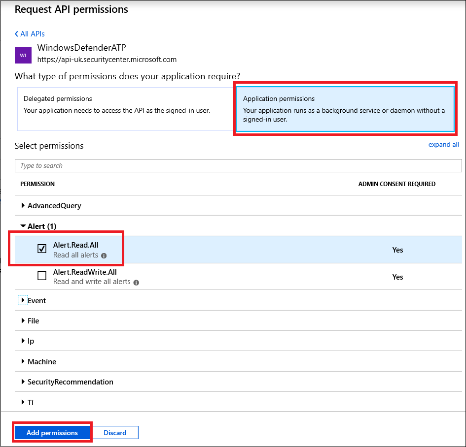
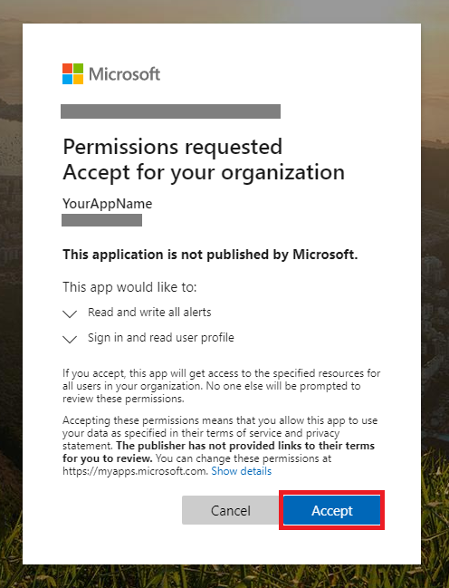

# <a name="partner-access-through-microsoft-defender-for-endpoint-apis"></a>끝점 API용 Microsoft Defender를 통한 파트너 액세스

[!INCLUDE [Microsoft 365 Defender rebranding](../../includes/microsoft-defender.md)]


**적용 사항:** [끝점용 Microsoft Defender](https://go.microsoft.com/fwlink/?linkid=2154037)

> 엔드포인트용 Microsoft Defender를 경험하고 싶으신가요? [무료 평가판을 신청하세요.](https://signup.microsoft.com/create-account/signup?products=7f379fee-c4f9-4278-b0a1-e4c8c2fcdf7e&ru=https://aka.ms/MDEp2OpenTrial?ocid=docs-wdatp-exposedapis-abovefoldlink)

[!include[Microsoft Defender for Endpoint API URIs for US Government](../../includes/microsoft-defender-api-usgov.md)]

[!include[Improve request performance](../../includes/improve-request-performance.md)]

이 페이지에서는 고객을 대신하여 Azure Active Directory Microsoft Defender for Endpoint에 프로그래밍 방식의 액세스 권한을 부여하는 Azure AD(Azure AD) 응용 프로그램을 만드는 방법을 설명합니다.

끝점용 Microsoft Defender는 프로그래밍 API 집합을 통해 많은 데이터와 작업을 노출합니다. 이러한 API는 Microsoft Defender for Endpoint 기능을 기반으로 작업 흐름을 자동화하고 혁신하는 데 도움이 됩니다. API 액세스에는 OAuth2.0 인증이 필요합니다. 자세한 내용은 [OAuth 2.0 Authorization Code Flow.](/azure/active-directory/develop/active-directory-v2-protocols-oauth-code)

일반적으로 API를 사용하려면 다음 단계를 수행해야 합니다.

- 다중 **테넌트** Azure AD 응용 프로그램을 생성합니다.
- 필요한 끝점 리소스에 대한 Defender에 액세스하기 위해 응용 프로그램에 대한 고객 관리자가 승인(동의)을 얻습니다.
- 이 응용 프로그램을 사용하여 액세스 토큰을 얻습니다.
- 토큰을 사용하여 끝점 API용 Microsoft Defender에 액세스합니다.

다음 단계에서는 Azure AD 응용 프로그램을 만들고, 끝점용 Microsoft Defender에 대한 액세스 토큰을 다운로드하고, 토큰의 유효성을 검사하는 방법을 안내합니다.

## <a name="create-the-multi-tenant-app"></a>다중 테넌트 앱 만들기

1. 전역 관리자 역할이 있는 사용자로 [Azure](https://portal.azure.com) **테넌트에 로그인합니다.**

2. 앱 등록 **Azure Active Directory** \> **새** \> **등록으로 이동합니다.**

   

3. 등록 양식에서 다음을 합니다.

   - 응용 프로그램의 이름을 선택하십시오.

   - 지원되는 계정 유형 - 조직 디렉터리의 계정.

   - 리디렉션 URI - 유형: 웹, URI: https://portal.azure.com

   

4. 응용 프로그램이 끝점용 Microsoft Defender에 액세스하여 통합을 완료하는 데 필요한 최소한의 권한 집합으로 응용 프로그램을 할당하도록 허용합니다.

   - 응용 프로그램 페이지에서 **조직에서** 사용하는 API 권한 추가 API를 선택하고 \>  \>  **windowsDefenderATP를 > WindowsDefenderATP를** **선택합니다.**

   - **참고:** *WindowsDefenderATP가* 원래 목록에 나타나지 않습니다. 텍스트 상자에 이름을 입력하여 표시를 시작하십시오.

     

### <a name="request-api-permissions"></a>API 권한 요청

필요한 사용 권한을 확인하려면  호출할 API의 사용 권한 섹션을 검토합니다. 예:

- 고급 [쿼리를 실행하려면](run-advanced-query-api.md)'고급 쿼리 실행' 사용 권한을 선택합니다.
- 장치를 [격리하려면](isolate-machine.md)'컴퓨터 격리' 권한을 선택합니다.

다음 예제에서는 '모든 경고 **읽기'** 권한을 사용하게 됩니다.

1. 응용 **프로그램 권한** \> **경고.Read.All** > 권한 **추가를 선택합니다.**

   

2. 동의 **부여를 선택합니다.**

   - **참고:** 권한을 추가할 때마다 **새** 사용 권한을 적용하기 위한 동의 부여에서 선택해야 합니다.

   

3. 응용 프로그램에 비밀을 추가합니다.

   - 인증서를 **&,** 비밀에 설명을 추가하고 추가를 **선택합니다.**

    **중요:** 추가를 클릭한 후 생성된 **비밀 값을 복사합니다.** 나가면 검색할 수 없습니다!

    

4. 응용 프로그램 ID를 적어 써 야 합니다.

   - 응용 프로그램 페이지에서 개요로 이동하여 **다음** 정보를 복사합니다.

   

5. 고객의 테넌트에 응용 프로그램을 추가합니다.

   응용 프로그램을 사용하려는 각 고객 테넌트에서 응용 프로그램을 승인해야 합니다. 이는 응용 프로그램이 고객을 대신하여 Microsoft Defender for Endpoint 응용 프로그램과 상호 작용하기 때문에입니다.

   고객의 **테넌트에서 전역** 관리자가 있는 사용자는 동의 링크를 선택하고 응용 프로그램을 승인해야 합니다.

   동의 링크는 다음 형식입니다.

   ```http
   https://login.microsoftonline.com/common/oauth2/authorize?prompt=consent&client_id=00000000-0000-0000-0000-000000000000&response_type=code&sso_reload=true
   ```

   여기서 00000000-0000-0000-0000-000000000000은 응용 프로그램 ID로 대체해야 합니다.

   동의 링크를 클릭한 후 고객 테넌트의 전역 관리자에게 로그인하고 응용 프로그램에 동의합니다.

   

   또한 고객에게 테넌트 ID를 요청하고 토큰을 구할 때 나중에 사용할 수 있도록 저장해야 합니다.

6. **완료!** 응용 프로그램을 성공적으로 등록했습니다. 토큰 획득 및 유효성 검사에 대한 자세한 내용은 아래 예제를 참조하세요.

## <a name="get-an-access-token-example"></a>액세스 토큰 예제 얻기

**참고:** 고객을 대신하여 액세스 토큰을 얻습니다. 다음 토큰 취득 시 고객의 테넌트 ID를 사용 합니다.

토큰에 대한 AAD 자세한 내용은 AAD [참조하세요.](/azure/active-directory/develop/active-directory-v2-protocols-oauth-client-creds)

### <a name="using-powershell"></a>PowerShell 사용

```powershell
# That code gets the App Context Token and save it to a file named "Latest-token.txt" under the current directory
# Paste below your Tenant ID, App ID and App Secret (App key).

$tenantId = '' ### Paste your tenant ID here
$appId = '' ### Paste your Application ID here
$appSecret = '' ### Paste your Application key here

$resourceAppIdUri = 'https://api.securitycenter.microsoft.com'
$oAuthUri = "https://login.microsoftonline.com/$TenantId/oauth2/token"
$authBody = [Ordered] @{
    resource = "$resourceAppIdUri"
    client_id = "$appId"
    client_secret = "$appSecret"
    grant_type = 'client_credentials'
}
$authResponse = Invoke-RestMethod -Method Post -Uri $oAuthUri -Body $authBody -ErrorAction Stop
$token = $authResponse.access_token
Out-File -FilePath "./Latest-token.txt" -InputObject $token
return $token
```

### <a name="using-c"></a>C 사용 #

> 아래 코드는 Nuget Microsoft.IdentityModel.Clients.ActiveDirectory로 테스트되었습니다.

- 새 콘솔 응용 프로그램 만들기
- [Microsoft.NuGet.Clients.ActiveDirectory](https://www.nuget.org/packages/Microsoft.IdentityModel.Clients.ActiveDirectory/) 설치
- 다음을 사용하여 추가

    ```console
    using Microsoft.IdentityModel.Clients.ActiveDirectory;
    ```

- 응용 프로그램에서 아래 코드를 복사/붙여넣습니다(, , 및 3개의 변수를 업데이트해야 `tenantId` `appId` `appSecret` 합니다.

    ```console
    string tenantId = "00000000-0000-0000-0000-000000000000"; // Paste your own tenant ID here
    string appId = "11111111-1111-1111-1111-111111111111"; // Paste your own app ID here
    string appSecret = "22222222-2222-2222-2222-222222222222"; // Paste your own app secret here for a test, and then store it in a safe place!

    const string authority = "https://login.microsoftonline.com";
    const string wdatpResourceId = "https://api.securitycenter.microsoft.com";

    AuthenticationContext auth = new AuthenticationContext($"{authority}/{tenantId}/");
    ClientCredential clientCredential = new ClientCredential(appId, appSecret);
    AuthenticationResult authenticationResult = auth.AcquireTokenAsync(wdatpResourceId, clientCredential).GetAwaiter().GetResult();
    string token = authenticationResult.AccessToken;
    ```

### <a name="using-python"></a>Python 사용

[Python을 사용하여 토큰을 얻을지 참조](run-advanced-query-sample-python.md#get-token)

### <a name="using-curl"></a>컬 사용

> [!NOTE]
> 다음 절차에서는 컬 for Windows 컴퓨터에 이미 설치되어 있습니다.

- 명령 창 열기
- Azure CLIENT_ID ID로 설정
- Azure CLIENT_SECRET 비밀로 설정
- TENANT_ID 응용 프로그램을 사용하여 끝점용 Microsoft Defender 응용 프로그램에 액세스하려는 고객의 Azure 테넌트 ID로 설정
- 다음 명령을 실행합니다.

```curl
curl -i -X POST -H "Content-Type:application/x-www-form-urlencoded" -d "grant_type=client_credentials" -d "client_id=%CLIENT_ID%" -d "scope=https://securitycenter.onmicrosoft.com/windowsatpservice/.default" -d "client_secret=%CLIENT_SECRET%" "https://login.microsoftonline.com/%TENANT_ID%/oauth2/v2.0/token" -k
```

다음 양식에 대한 답변을 얻게 됩니다.

```console
{"token_type":"Bearer","expires_in":3599,"ext_expires_in":0,"access_token":"eyJ0eXAiOiJKV1QiLCJhbGciOiJSUzI1NiIsIn <truncated> aWReH7P0s0tjTBX8wGWqJUdDA"}
```

## <a name="validate-the-token"></a>토큰 유효성 검사

올바른 토큰이 있는지를 검사합니다.

- 이전 단계에서 토큰을 디코딩하기 위해 [JWT에](https://jwt.ms) 복사/붙여넣기
- 원하는 사용 권한으로 '역할' 클레임 확인
- 아래 스크린샷에서는 끝점용 Microsoft Defender에 대한 여러 권한이 있는 응용 프로그램에서 획득한 디코딩된 토큰을 볼 수 있습니다.
- "tid" 클레임은 토큰이 속한 테넌트 ID입니다.


## <a name="use-the-token-to-access-microsoft-defender-for-endpoint-api"></a>토큰을 사용하여 끝점 API용 Microsoft Defender에 액세스

- 사용할 API를 선택하세요. 자세한 내용은 [지원되는 끝점 API용 Microsoft Defender를 참조하세요.](exposed-apis-list.md)
- "Bearer {token}"으로 보내는 Http 요청에서 권한 부여 헤더 설정(Bearer는 권한 부여 체계)
- 토큰의 만료 시간은 1시간입니다(동일한 토큰을 사용하여 두 개 이상의 요청을 보낼 수 있습니다).

- 다음을 사용하여 경고 목록을 들이기 위한 요청을 **보내는 C#**

    ```csharp
    var httpClient = new HttpClient();

    var request = new HttpRequestMessage(HttpMethod.Get, "https://api.securitycenter.microsoft.com/api/alerts");

    request.Headers.Authorization = new AuthenticationHeaderValue("Bearer", token);

    var response = httpClient.SendAsync(request).GetAwaiter().GetResult();

    // Do something useful with the response
    ```

## <a name="see-also"></a>참고 항목

- [지원되는 엔드포인트용 Microsoft Defender API](exposed-apis-list.md) 
- [사용자를 대신하여 끝점용 Microsoft Defender 액세스](exposed-apis-create-app-nativeapp.md)
