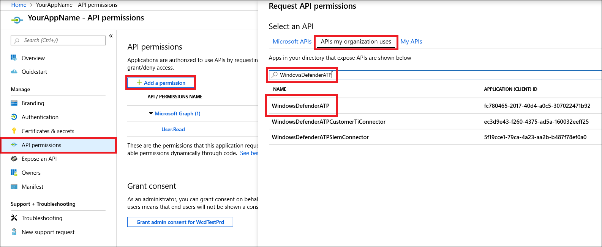

# <a name="partner-access-through-microsoft-defender-for-endpoint-apis"></a><span data-ttu-id="992e0-104">끝점 API용 Microsoft Defender를 통한 파트너 액세스</span><span class="sxs-lookup"><span data-stu-id="992e0-104">Partner access through Microsoft Defender for Endpoint APIs</span></span>

[!INCLUDE [Microsoft 365 Defender rebranding](../../includes/microsoft-defender.md)]


<span data-ttu-id="992e0-105">**적용 사항:** [끝점용 Microsoft Defender](https://go.microsoft.com/fwlink/?linkid=2154037)</span><span class="sxs-lookup"><span data-stu-id="992e0-105">**Applies to:** [Microsoft Defender for Endpoint](https://go.microsoft.com/fwlink/?linkid=2154037)</span></span>

> <span data-ttu-id="992e0-106">끝점용 Microsoft Defender를 경험하고 싶나요?</span><span class="sxs-lookup"><span data-stu-id="992e0-106">Want to experience Microsoft Defender for Endpoint?</span></span> [<span data-ttu-id="992e0-107">무료 평가판에 등록합니다.</span><span class="sxs-lookup"><span data-stu-id="992e0-107">Sign up for a free trial.</span></span>](https://www.microsoft.com/microsoft-365/windows/microsoft-defender-atp?ocid=docs-wdatp-exposedapis-abovefoldlink)

[!include[Microsoft Defender for Endpoint API URIs for US Government](../../includes/microsoft-defender-api-usgov.md)]

[!include[Improve request performance](../../includes/improve-request-performance.md)]

<span data-ttu-id="992e0-108">이 페이지에서는 고객을 대신하여 끝점용 Microsoft Defender에 프로그래밍 방식 액세스하기 위해 Azure AD(Azure Active Directory) 응용 프로그램을 만드는 방법을 설명합니다.</span><span class="sxs-lookup"><span data-stu-id="992e0-108">This page describes how to create an Azure Active Directory (Azure AD) application to get programmatic access to Microsoft Defender for Endpoint on behalf of your customers.</span></span>


<span data-ttu-id="992e0-109">끝점용 Microsoft Defender는 프로그래밍 API 집합을 통해 많은 데이터와 작업을 노출합니다.</span><span class="sxs-lookup"><span data-stu-id="992e0-109">Microsoft Defender for Endpoint exposes much of its data and actions through a set of programmatic APIs.</span></span> <span data-ttu-id="992e0-110">이러한 API는 Microsoft Defender for Endpoint 기능을 기반으로 작업 흐름을 자동화하고 혁신하는 데 도움이 됩니다.</span><span class="sxs-lookup"><span data-stu-id="992e0-110">Those APIs will help you automate work flows and innovate based on Microsoft Defender for Endpoint capabilities.</span></span> <span data-ttu-id="992e0-111">API 액세스에는 OAuth2.0 인증이 필요합니다.</span><span class="sxs-lookup"><span data-stu-id="992e0-111">The API access requires OAuth2.0 authentication.</span></span> <span data-ttu-id="992e0-112">자세한 내용은 [OAuth 2.0 권한 부여 코드 흐름을 참조하세요.](https://docs.microsoft.com/azure/active-directory/develop/active-directory-v2-protocols-oauth-code)</span><span class="sxs-lookup"><span data-stu-id="992e0-112">For more information, see [OAuth 2.0 Authorization Code Flow](https://docs.microsoft.com/azure/active-directory/develop/active-directory-v2-protocols-oauth-code).</span></span>

<span data-ttu-id="992e0-113">일반적으로 API를 사용하려면 다음 단계를 수행해야 합니다.</span><span class="sxs-lookup"><span data-stu-id="992e0-113">In general, you’ll need to take the following steps to use the APIs:</span></span>
- <span data-ttu-id="992e0-114">다중 **테넌트** Azure AD 응용 프로그램을 생성합니다.</span><span class="sxs-lookup"><span data-stu-id="992e0-114">Create a **multi-tenant** Azure AD application.</span></span>
- <span data-ttu-id="992e0-115">필요한 끝점 리소스에 대한 Defender에 액세스하기 위해 응용 프로그램에 대한 고객 관리자가 승인(동의)을 얻습니다.</span><span class="sxs-lookup"><span data-stu-id="992e0-115">Get authorized(consent) by your customer administrator for your application to access Defender for Endpoint resources it needs.</span></span>
- <span data-ttu-id="992e0-116">이 응용 프로그램을 사용하여 액세스 토큰을 얻습니다.</span><span class="sxs-lookup"><span data-stu-id="992e0-116">Get an access token using this application.</span></span>
- <span data-ttu-id="992e0-117">토큰을 사용하여 끝점 API용 Microsoft Defender에 액세스합니다.</span><span class="sxs-lookup"><span data-stu-id="992e0-117">Use the token to access Microsoft Defender for Endpoint API.</span></span>

<span data-ttu-id="992e0-118">다음 단계에서는 Azure AD 응용 프로그램을 만들고, 끝점용 Microsoft Defender에 대한 액세스 토큰을 다운로드하고, 토큰의 유효성을 검사하는 방법을 안내합니다.</span><span class="sxs-lookup"><span data-stu-id="992e0-118">The following steps will guide you how to create an Azure AD application, get an access token to Microsoft Defender for Endpoint and validate the token.</span></span>

## <a name="create-the-multi-tenant-app"></a><span data-ttu-id="992e0-119">다중 테넌트 앱 만들기</span><span class="sxs-lookup"><span data-stu-id="992e0-119">Create the multi-tenant app</span></span>

1. <span data-ttu-id="992e0-120">전역 관리자 역할이 있는 사용자로 [Azure](https://portal.azure.com) **테넌트에 로그인합니다.**</span><span class="sxs-lookup"><span data-stu-id="992e0-120">Sign in to your [Azure tenant](https://portal.azure.com) with user that has **Global Administrator** role.</span></span>

2. <span data-ttu-id="992e0-121">Azure **Active Directory**  >  **앱 등록 새**  >  **등록으로 이동합니다.**</span><span class="sxs-lookup"><span data-stu-id="992e0-121">Navigate to **Azure Active Directory** > **App registrations** > **New registration**.</span></span> 

   

3. <span data-ttu-id="992e0-123">등록 양식에서 다음을 합니다.</span><span class="sxs-lookup"><span data-stu-id="992e0-123">In the registration form:</span></span>

    - <span data-ttu-id="992e0-124">응용 프로그램의 이름을 선택하십시오.</span><span class="sxs-lookup"><span data-stu-id="992e0-124">Choose a name for your application.</span></span>

    - <span data-ttu-id="992e0-125">지원되는 계정 유형 - 조직 디렉터리의 계정.</span><span class="sxs-lookup"><span data-stu-id="992e0-125">Supported account types - accounts in any organizational directory.</span></span>

    - <span data-ttu-id="992e0-126">리디렉션 URI - 유형: 웹, URI: https://portal.azure.com</span><span class="sxs-lookup"><span data-stu-id="992e0-126">Redirect URI - type: Web, URI: https://portal.azure.com</span></span>

    


4. <span data-ttu-id="992e0-128">응용 프로그램이 끝점용 Microsoft Defender에 액세스하여 통합을 완료하는 데 필요한 최소한의 권한 집합으로 응용 프로그램을 할당하도록 허용합니다.</span><span class="sxs-lookup"><span data-stu-id="992e0-128">Allow your Application to access Microsoft Defender for Endpoint and assign it with the minimal set of permissions required to complete the integration.</span></span>

   - <span data-ttu-id="992e0-129">응용 프로그램 페이지에서 **조직에서** 사용하는 API 권한 추가 API를 선택하고  >    >   **windowsDefenderATP를 > WindowsDefenderATP를** **선택합니다.**</span><span class="sxs-lookup"><span data-stu-id="992e0-129">On your application page, select **API Permissions** > **Add permission** > **APIs my organization uses** > type **WindowsDefenderATP** and select on **WindowsDefenderATP**.</span></span>

   - <span data-ttu-id="992e0-130">**참고:** *WindowsDefenderATP가* 원래 목록에 나타나지 않습니다.</span><span class="sxs-lookup"><span data-stu-id="992e0-130">**Note**: *WindowsDefenderATP* does not appear in the original list.</span></span> <span data-ttu-id="992e0-131">텍스트 상자에 이름을 입력하여 표시를 시작하십시오.</span><span class="sxs-lookup"><span data-stu-id="992e0-131">Start writing its name in the text box to see it appear.</span></span>

   
   
   ### <a name="request-api-permissions"></a><span data-ttu-id="992e0-133">API 권한 요청</span><span class="sxs-lookup"><span data-stu-id="992e0-133">Request API permissions</span></span>

   <span data-ttu-id="992e0-134">필요한 사용 권한을 확인하려면  호출할 API의 사용 권한 섹션을 검토합니다.</span><span class="sxs-lookup"><span data-stu-id="992e0-134">To determine which permission you need, review the **Permissions** section in the API you are interested to call.</span></span> <span data-ttu-id="992e0-135">예를 들면,</span><span class="sxs-lookup"><span data-stu-id="992e0-135">For instance:</span></span>

   - <span data-ttu-id="992e0-136">고급 [쿼리를 실행하려면](run-advanced-query-api.md)'고급 쿼리 실행' 사용 권한을 선택합니다.</span><span class="sxs-lookup"><span data-stu-id="992e0-136">To [run advanced queries](run-advanced-query-api.md), select 'Run advanced queries' permission</span></span>
   
   - <span data-ttu-id="992e0-137">장치를 [격리하려면](isolate-machine.md)'컴퓨터 격리' 권한을 선택합니다.</span><span class="sxs-lookup"><span data-stu-id="992e0-137">To [isolate a device](isolate-machine.md), select 'Isolate machine' permission</span></span>

   <span data-ttu-id="992e0-138">다음 예제에서는 '모든 경고 **읽기'** 권한을 사용하게 됩니다.</span><span class="sxs-lookup"><span data-stu-id="992e0-138">In the following example we will use **'Read all alerts'** permission:</span></span>

   <span data-ttu-id="992e0-139">응용 **프로그램 권한**  >  **경고.Read.All** > 권한 **추가를 선택합니다.**</span><span class="sxs-lookup"><span data-stu-id="992e0-139">Choose **Application permissions** > **Alert.Read.All** > select on **Add permissions**</span></span>

   


5. <span data-ttu-id="992e0-141">동의 **부여를 선택합니다.**</span><span class="sxs-lookup"><span data-stu-id="992e0-141">Select **Grant consent**</span></span>

    - <span data-ttu-id="992e0-142">**참고:** 권한을 추가할 때마다 **새** 사용 권한을 적용하기 위한 동의 부여에서 선택해야 합니다.</span><span class="sxs-lookup"><span data-stu-id="992e0-142">**Note**: Every time you add permission you must select on **Grant consent** for the new permission to take effect.</span></span>

    

6. <span data-ttu-id="992e0-144">응용 프로그램에 비밀을 추가합니다.</span><span class="sxs-lookup"><span data-stu-id="992e0-144">Add a secret to the application.</span></span>

    - <span data-ttu-id="992e0-145">인증서를 **&,** 비밀에 설명을 추가하고 추가를 **선택합니다.**</span><span class="sxs-lookup"><span data-stu-id="992e0-145">Select **Certificates & secrets**, add description to the secret and select **Add**.</span></span>

    <span data-ttu-id="992e0-146">**중요:** 추가를 클릭한 후 생성된 **비밀 값을 복사합니다.**</span><span class="sxs-lookup"><span data-stu-id="992e0-146">**Important**: After click Add, **copy the generated secret value**.</span></span> <span data-ttu-id="992e0-147">나가면 검색할 수 없습니다!</span><span class="sxs-lookup"><span data-stu-id="992e0-147">You won't be able to retrieve after you leave!</span></span>

    

7. <span data-ttu-id="992e0-149">응용 프로그램 ID를 적어 써 야 합니다.</span><span class="sxs-lookup"><span data-stu-id="992e0-149">Write down your application ID:</span></span>

   - <span data-ttu-id="992e0-150">응용 프로그램 페이지에서 개요로 이동하여 **다음** 정보를 복사합니다.</span><span class="sxs-lookup"><span data-stu-id="992e0-150">On your application page, go to **Overview** and copy the following information:</span></span>

   

8. <span data-ttu-id="992e0-152">고객의 테넌트에 응용 프로그램을 추가합니다.</span><span class="sxs-lookup"><span data-stu-id="992e0-152">Add the application to your customer's tenant.</span></span>

    <span data-ttu-id="992e0-153">응용 프로그램을 사용하려는 각 고객 테넌트에서 응용 프로그램을 승인해야 합니다.</span><span class="sxs-lookup"><span data-stu-id="992e0-153">You need your application to be approved in each customer tenant where you intend to use it.</span></span> <span data-ttu-id="992e0-154">이는 응용 프로그램이 고객을 대신하여 Microsoft Defender for Endpoint 응용 프로그램과 상호 작용하기 때문에입니다.</span><span class="sxs-lookup"><span data-stu-id="992e0-154">This is because your application interacts with Microsoft Defender for Endpoint application on behalf of your customer.</span></span>

    <span data-ttu-id="992e0-155">고객의 **테넌트에서 전역** 관리자가 있는 사용자는 동의 링크를 선택하고 응용 프로그램을 승인해야 합니다.</span><span class="sxs-lookup"><span data-stu-id="992e0-155">A user with **Global Administrator** from your customer's tenant need to select the consent link and approve your application.</span></span>

    <span data-ttu-id="992e0-156">동의 링크는 다음 형식입니다.</span><span class="sxs-lookup"><span data-stu-id="992e0-156">Consent link is of the form:</span></span>

    ```
    https://login.microsoftonline.com/common/oauth2/authorize?prompt=consent&client_id=00000000-0000-0000-0000-000000000000&response_type=code&sso_reload=true
    ```

    <span data-ttu-id="992e0-157">여기서 00000000-0000-0000-0000-000000000000은 응용 프로그램 ID로 대체해야 합니다.</span><span class="sxs-lookup"><span data-stu-id="992e0-157">Where 00000000-0000-0000-0000-000000000000 should be replaced with your Application ID</span></span>

    <span data-ttu-id="992e0-158">동의 링크를 클릭한 후 고객 테넌트의 전역 관리자에게 로그인하고 응용 프로그램에 동의합니다.</span><span class="sxs-lookup"><span data-stu-id="992e0-158">After clicking on the consent link, sign in with the Global Administrator of the customer's tenant and consent the application.</span></span>

    

    <span data-ttu-id="992e0-160">또한 고객에게 테넌트 ID를 요청하고 토큰을 구할 때 나중에 사용할 수 있도록 저장해야 합니다.</span><span class="sxs-lookup"><span data-stu-id="992e0-160">In addition, you will need to ask your customer for their tenant ID and save it for future use when acquiring the token.</span></span>

- <span data-ttu-id="992e0-161">**완료!**</span><span class="sxs-lookup"><span data-stu-id="992e0-161">**Done!**</span></span> <span data-ttu-id="992e0-162">응용 프로그램을 성공적으로 등록했습니다.</span><span class="sxs-lookup"><span data-stu-id="992e0-162">You have successfully registered an application!</span></span> 
- <span data-ttu-id="992e0-163">토큰 획득 및 유효성 검사에 대한 자세한 내용은 아래 예제를 참조하세요.</span><span class="sxs-lookup"><span data-stu-id="992e0-163">See examples below for token acquisition and validation.</span></span>

## <a name="get-an-access-token-example"></a><span data-ttu-id="992e0-164">액세스 토큰 예제를 얻게 됩니다.</span><span class="sxs-lookup"><span data-stu-id="992e0-164">Get an access token example:</span></span>

<span data-ttu-id="992e0-165">**참고:** 고객을 대신하여 액세스 토큰을 얻습니다. 다음 토큰 취득 시 고객의 테넌트 ID를 사용 합니다.</span><span class="sxs-lookup"><span data-stu-id="992e0-165">**Note:** To get access token on behalf of your customer, use the customer's tenant ID on the following token acquisitions.</span></span>

<br><span data-ttu-id="992e0-166">AAD 토큰에 대한 자세한 내용은 [AAD 자습서를 참조하세요.](https://docs.microsoft.com/azure/active-directory/develop/active-directory-v2-protocols-oauth-client-creds)</span><span class="sxs-lookup"><span data-stu-id="992e0-166">For more information on AAD token, see [AAD tutorial](https://docs.microsoft.com/azure/active-directory/develop/active-directory-v2-protocols-oauth-client-creds)</span></span>

### <a name="using-powershell"></a><span data-ttu-id="992e0-167">PowerShell 사용</span><span class="sxs-lookup"><span data-stu-id="992e0-167">Using PowerShell</span></span>

```
# That code gets the App Context Token and save it to a file named "Latest-token.txt" under the current directory
# Paste below your Tenant ID, App ID and App Secret (App key).

$tenantId = '' ### Paste your tenant ID here
$appId = '' ### Paste your Application ID here
$appSecret = '' ### Paste your Application key here

$resourceAppIdUri = 'https://api.securitycenter.microsoft.com'
$oAuthUri = "https://login.microsoftonline.com/$TenantId/oauth2/token"
$authBody = [Ordered] @{
    resource = "$resourceAppIdUri"
    client_id = "$appId"
    client_secret = "$appSecret"
    grant_type = 'client_credentials'
}
$authResponse = Invoke-RestMethod -Method Post -Uri $oAuthUri -Body $authBody -ErrorAction Stop
$token = $authResponse.access_token
Out-File -FilePath "./Latest-token.txt" -InputObject $token
return $token
```

### <a name="using-c"></a><span data-ttu-id="992e0-168">다음 C#.</span><span class="sxs-lookup"><span data-stu-id="992e0-168">Using C#:</span></span>

><span data-ttu-id="992e0-169">아래 코드는 Nuget Microsoft.IdentityModel.Clients.ActiveDirectory로 테스트되었습니다.</span><span class="sxs-lookup"><span data-stu-id="992e0-169">The below code was tested with Nuget Microsoft.IdentityModel.Clients.ActiveDirectory</span></span>

- <span data-ttu-id="992e0-170">새 콘솔 응용 프로그램 만들기</span><span class="sxs-lookup"><span data-stu-id="992e0-170">Create a new Console Application</span></span>
- <span data-ttu-id="992e0-171">NuGet [Microsoft.IdentityModel.Clients.ActiveDirectory 설치](https://www.nuget.org/packages/Microsoft.IdentityModel.Clients.ActiveDirectory/)</span><span class="sxs-lookup"><span data-stu-id="992e0-171">Install NuGet [Microsoft.IdentityModel.Clients.ActiveDirectory](https://www.nuget.org/packages/Microsoft.IdentityModel.Clients.ActiveDirectory/)</span></span>
- <span data-ttu-id="992e0-172">다음을 사용하여 추가</span><span class="sxs-lookup"><span data-stu-id="992e0-172">Add the below using</span></span>

    ```
    using Microsoft.IdentityModel.Clients.ActiveDirectory;
    ```

- <span data-ttu-id="992e0-173">응용 프로그램에 아래 코드를 복사/붙여넣습니다(세 개의 변수를 업데이트하는 것을 잊지 마세요. ```tenantId, appId, appSecret``` )</span><span class="sxs-lookup"><span data-stu-id="992e0-173">Copy/Paste the below code in your application (do not forget to update the three variables: ```tenantId, appId, appSecret```)</span></span>

    ```
    string tenantId = "00000000-0000-0000-0000-000000000000"; // Paste your own tenant ID here
    string appId = "11111111-1111-1111-1111-111111111111"; // Paste your own app ID here
    string appSecret = "22222222-2222-2222-2222-222222222222"; // Paste your own app secret here for a test, and then store it in a safe place! 

    const string authority = "https://login.microsoftonline.com";
    const string wdatpResourceId = "https://api.securitycenter.microsoft.com";

    AuthenticationContext auth = new AuthenticationContext($"{authority}/{tenantId}/");
    ClientCredential clientCredential = new ClientCredential(appId, appSecret);
    AuthenticationResult authenticationResult = auth.AcquireTokenAsync(wdatpResourceId, clientCredential).GetAwaiter().GetResult();
    string token = authenticationResult.AccessToken;
    ```


### <a name="using-python"></a><span data-ttu-id="992e0-174">Python 사용</span><span class="sxs-lookup"><span data-stu-id="992e0-174">Using Python</span></span>

<span data-ttu-id="992e0-175">[Python을 사용하여 토큰을 얻을지 참조](run-advanced-query-sample-python.md#get-token)</span><span class="sxs-lookup"><span data-stu-id="992e0-175">Refer to [Get token using Python](run-advanced-query-sample-python.md#get-token)</span></span>

### <a name="using-curl"></a><span data-ttu-id="992e0-176">컬 사용</span><span class="sxs-lookup"><span data-stu-id="992e0-176">Using Curl</span></span>

> [!NOTE]
> <span data-ttu-id="992e0-177">아래 절차에서는 Windows용 Curl이 컴퓨터에 이미 설치되어 있는 것으로 가정합니다.</span><span class="sxs-lookup"><span data-stu-id="992e0-177">The below procedure supposed Curl for Windows is already installed on your computer</span></span>

- <span data-ttu-id="992e0-178">명령 창 열기</span><span class="sxs-lookup"><span data-stu-id="992e0-178">Open a command window</span></span>
- <span data-ttu-id="992e0-179">Azure CLIENT_ID ID로 설정</span><span class="sxs-lookup"><span data-stu-id="992e0-179">Set CLIENT_ID to your Azure application ID</span></span>
- <span data-ttu-id="992e0-180">Azure CLIENT_SECRET 비밀로 설정</span><span class="sxs-lookup"><span data-stu-id="992e0-180">Set CLIENT_SECRET to your Azure application secret</span></span>
- <span data-ttu-id="992e0-181">TENANT_ID 응용 프로그램을 사용하여 끝점용 Microsoft Defender 응용 프로그램에 액세스하려는 고객의 Azure 테넌트 ID로 설정</span><span class="sxs-lookup"><span data-stu-id="992e0-181">Set TENANT_ID to the Azure tenant ID of the customer that wants to use your application to access Microsoft Defender for Endpoint application</span></span>
- <span data-ttu-id="992e0-182">다음 명령을 실행합니다.</span><span class="sxs-lookup"><span data-stu-id="992e0-182">Run the below command:</span></span>

```
curl -i -X POST -H "Content-Type:application/x-www-form-urlencoded" -d "grant_type=client_credentials" -d "client_id=%CLIENT_ID%" -d "scope=https://securitycenter.onmicrosoft.com/windowsatpservice/.default" -d "client_secret=%CLIENT_SECRET%" "https://login.microsoftonline.com/%TENANT_ID%/oauth2/v2.0/token" -k
```

<span data-ttu-id="992e0-183">다음 양식에 대한 답변을 얻게 됩니다.</span><span class="sxs-lookup"><span data-stu-id="992e0-183">You will get an answer of the form:</span></span>

```
{"token_type":"Bearer","expires_in":3599,"ext_expires_in":0,"access_token":"eyJ0eXAiOiJKV1QiLCJhbGciOiJSUzI1NiIsIn <truncated> aWReH7P0s0tjTBX8wGWqJUdDA"}
```

## <a name="validate-the-token"></a><span data-ttu-id="992e0-184">토큰 유효성 검사</span><span class="sxs-lookup"><span data-stu-id="992e0-184">Validate the token</span></span>

<span data-ttu-id="992e0-185">올바른 토큰이 있는지를 검사합니다.</span><span class="sxs-lookup"><span data-stu-id="992e0-185">Sanity check to make sure you got a correct token:</span></span>
- <span data-ttu-id="992e0-186">이전 단계에서 토큰을 디코딩하기 위해 [JWT에](https://jwt.ms) 복사/붙여넣기</span><span class="sxs-lookup"><span data-stu-id="992e0-186">Copy/paste into [JWT](https://jwt.ms) the token you get in the previous step in order to decode it</span></span>
- <span data-ttu-id="992e0-187">원하는 사용 권한으로 '역할' 클레임 확인</span><span class="sxs-lookup"><span data-stu-id="992e0-187">Validate you get a 'roles' claim with the desired permissions</span></span>
- <span data-ttu-id="992e0-188">아래 스크린샷에서는 끝점용 Microsoft Defender에 대한 여러 권한이 있는 응용 프로그램에서 획득한 디코딩된 토큰을 볼 수 있습니다.</span><span class="sxs-lookup"><span data-stu-id="992e0-188">In the screenshot below, you can see a decoded token acquired from an Application with multiple permissions to  Microsoft Defender for Endpoint:</span></span>
- <span data-ttu-id="992e0-189">"tid" 클레임은 토큰이 속한 테넌트 ID입니다.</span><span class="sxs-lookup"><span data-stu-id="992e0-189">The "tid" claim is the tenant ID the token belongs to.</span></span>


## <a name="use-the-token-to-access-microsoft-defender-for-endpoint-api"></a><span data-ttu-id="992e0-191">토큰을 사용하여 끝점 API용 Microsoft Defender에 액세스</span><span class="sxs-lookup"><span data-stu-id="992e0-191">Use the token to access Microsoft Defender for Endpoint API</span></span>

- <span data-ttu-id="992e0-192">사용할 API를 선택하세요. 자세한 내용은 [지원되는 끝점 API용 Microsoft Defender를 참조하세요.](exposed-apis-list.md)</span><span class="sxs-lookup"><span data-stu-id="992e0-192">Choose the API you want to use, for more information, see [Supported Microsoft Defender for Endpoint APIs](exposed-apis-list.md)</span></span>
- <span data-ttu-id="992e0-193">"Bearer {token}"으로 보내는 Http 요청에서 권한 부여 헤더 설정(Bearer는 권한 부여 체계)</span><span class="sxs-lookup"><span data-stu-id="992e0-193">Set the Authorization header in the Http request you send to "Bearer {token}" (Bearer is the Authorization scheme)</span></span>
- <span data-ttu-id="992e0-194">토큰의 만료 시간은 1시간입니다(동일한 토큰을 사용하여 두 개 이상의 요청을 보낼 수 있습니다).</span><span class="sxs-lookup"><span data-stu-id="992e0-194">The Expiration time of the token is 1 hour (you can send more than one request with the same token)</span></span>

- <span data-ttu-id="992e0-195">다음을 사용하여 경고 목록을 들이기 위한 요청을 **보내는 C#**</span><span class="sxs-lookup"><span data-stu-id="992e0-195">Example of sending a request to get a list of alerts **using C#**</span></span> 
    ```
    var httpClient = new HttpClient();

    var request = new HttpRequestMessage(HttpMethod.Get, "https://api.securitycenter.microsoft.com/api/alerts");

    request.Headers.Authorization = new AuthenticationHeaderValue("Bearer", token);

    var response = httpClient.SendAsync(request).GetAwaiter().GetResult();

    // Do something useful with the response
    ```

## <a name="see-also"></a><span data-ttu-id="992e0-196">참고 항목</span><span class="sxs-lookup"><span data-stu-id="992e0-196">See also</span></span>
- [<span data-ttu-id="992e0-197">끝점 API에 지원되는 Microsoft Defender</span><span class="sxs-lookup"><span data-stu-id="992e0-197">Supported Microsoft Defender for Endpoint APIs</span></span>](exposed-apis-list.md)
- [<span data-ttu-id="992e0-198">사용자를 대신하여 끝점용 Microsoft Defender 액세스</span><span class="sxs-lookup"><span data-stu-id="992e0-198">Access Microsoft Defender for Endpoint on behalf of a user</span></span>](exposed-apis-create-app-nativeapp.md)
