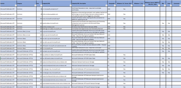

# 엔드포인트용 Microsoft Defender(미국 정부 고객용)

**적용 대상:**
- [엔드포인트용 Microsoft Defender](https://go.microsoft.com/fwlink/p/?linkid=2154037)

Azure 미국 정부 환경에 내장된 미국 정부 고객을 위한 엔드포인트용 Microsoft Defender는 Azure Commercial의 엔드포인트에 대한 Defender와 동일한 기본 기술을 사용합니다.

이 오퍼링은 GCC, GCC 및 DoD 고객이 사용할 수 있으며 상용 버전과 동일한 예방, 탐지, 조사 및 수정을 기반으로 합니다. 그러나 이 오퍼링에 대한 기능 의 가용성에는 몇 가지 차이점이 있습니다.

> [!NOTE]
> 상용에서 끝점에 대한 Defender를 사용하는 GCC 고객인 경우 공개 문서 페이지를 참조하십시오.

## 라이선스 요구사항
미국 정부 고객을 위한 엔드포인트에 대한 Microsoft Defender는 다음 Microsoft 볼륨 라이선스 제안 중 하나를 필요로 합니다.

### 데스크톱 라이선싱
GCC | GCC 높음 | DoD
:---|:---|:---
Windows 10 Enterprise E5 GCC | Windows 10 Enterprise GCC 하이용 E5 | Windows 10 Enterprise DOD용 E5
| | GCC 높음 Microsoft 365 E5 | Microsoft 365 D용 G5
| | Microsoft 365 GCC 높음용 G5 보안 | Microsoft 365 DOD용 G5 보안
엔드포인트에 대한 마이크로 소프트 수비수 - GCC | GCC 높은 엔드 포인트에 대 한 마이크로소프트 수비수 | DOD에 대 한 엔드 포인트에 대 한 마이크로소프트 수비수

### 서버 라이선싱
GCC | GCC 높음 | DoD
:---|:---|:---
엔드포인트 서버 GCC 대한 마이크로 소프트 디펜더 | GCC 높은 엔드 포인트 서버에 대 한 마이크로소프트 수비수 | DOD에 대 한 엔드 포인트 서버에 대 한 마이크로소프트 수비수
서버용 Azure Defender | 서버용 Azure Defender - 정부 | 서버용 Azure Defender - 정부

 

## 포털 URL
다음은 미국 정부 고객을 위한 엔드포인트 포털 URL용 Microsoft Defender입니다.

고객 유형 | 포털 URL
:---|:---
GCC | https://gcc.securitycenter.microsoft.us
GCC 높음 | https://securitycenter.microsoft.us
DoD | https://securitycenter.microsoft.us

 

## 엔드포인트 버전

### 독립 실행형 OS 버전
다음 OS 버전은 다음과 같습니다.

OS 버전 | GCC | GCC 높음 | DoD
:---|:---|:---|:---
Windows 10 버전 [20H2(KB4586853)](https://support.microsoft.com/help/4586853) |  |  | 
Windows 10, 버전 2004 [(KB4586853)](https://support.microsoft.com/help/4586853) |  |  | 
Windows 10, 버전 1909 [(KB4586819)](https://support.microsoft.com/help/4586819) |  |  | 
Windows 10, 버전 1903 [(KB4586819)](https://support.microsoft.com/help/4586819) |  |  | 
Windows 10, 버전 1809 [(KB4586839)](https://support.microsoft.com/help/4586839) |  |  | 
Windows 10, 버전 1803 [(KB4598245)](https://support.microsoft.com/help/4598245) |  |  | 
Windows 10, 버전 1709 |  참고: 지원되지 않음 |  [KB4499147](https://support.microsoft.com/help/4499147) 참고: [비하,](/lifecycle/announcements/revised-end-of-service-windows-10-1709)업그레이드해 주세요 |  참고: 지원되지 않음
Windows 10, 버전 1703 이전 |  참고: 지원되지 않음 |  참고: 지원되지 않음 |  참고: 지원되지 않음
Windows 서버 [2019(KB4586839](https://support.microsoft.com/help/4586839)포함) |  |  | 
Windows Server 2016 |  |  | 
Windows Server 2012 R2 |  |  | 
Windows Server 2008 R2 SP1 |  |  | 
Windows 8.1 Enterprise |  |  | 
Windows 8 Pro |  |  | 
Windows 7 SP1 Enterprise |  |  | 
Windows 7 SP1 Pro |  |  | 
Linux |  |  | 
macOS |  |  | 
Android |  엔지니어링 백로그에 |  엔지니어링 백로그에 |  엔지니어링 백로그에
iOS |  엔지니어링 백로그에 |  엔지니어링 백로그에 |  엔지니어링 백로그에

> [!NOTE]
> 패치가 지정된 경우 엔드포인트에 대한 Defender를 올바른 환경으로 구성하려면 장치 온보딩 전에 배포해야 합니다.

> [!NOTE]
> [Microsoft Monitoring Agent](configure-server-endpoints.md#option-1-onboard-by-installing-and-configuring-microsoft-monitoring-agent-mma)사용하여 Windows 10 또는 Windows Server 2019보다 오래된 Windows 장치를 온보드하려고 합니까? [설정 마법사를](/azure/log-analytics/log-analytics-windows-agents#install-agent-using-setup-wizard)사용하거나 [명령줄이나](/azure/log-analytics/log-analytics-windows-agents#install-agent-using-command-line) [스크립트를](/azure/log-analytics/log-analytics-windows-agents#install-agent-using-dsc-in-azure-automation) 사용하는 경우 "Azure Us 정부"에서 OPINSIGHTS_WORKSPACE_AZURE_CLOUD_TYPE "Azure US 정부"를 선택해야 합니다.

### 서버에 대한 Azure Defender를 사용할 때 OS 버전
서버에 대한 Azure Defender를 사용할 때 다음 OS [버전이 지원됩니다.](/azure/security-center/security-center-wdatp)

OS 버전 | GCC | GCC 높음 | DoD
:---|:---|:---|:---
Windows Server 2019 |  개발 중 |  개발 중 |  개발 중
Windows Server 2016 |  |  | 
Windows Server 2012 R2 |  |  | 
Windows Server 2008 R2 SP1 |  |  | 

 

## 필요한 연결 설정
프록시 또는 방화벽이 기본적으로 모든 트래픽을 차단하고 특정 도메인만 통과하도록 허용하는 경우 다운로드 가능한 시트에 나열된 도메인을 허용된 도메인 목록에 추가합니다.

다음 다운로드 가능한 스프레드시트에는 서비스가 나열되고 네트워크가 연결할 수 있어야 하는 관련 URL이 나열됩니다. 이러한 URL에 대한 액세스를 거부하는 방화벽 또는 네트워크 필터링 규칙이 없는지 확인하거나 이를 위해 특별히 *허용* 규칙을 만듭니다.

도메인 목록의 스프레드시트 | 설명
:-----|:-----
  | 서비스 위치, 지리적 위치 및 OS에 대한 특정 DNS 레코드의 스프레드시트입니다.   [여기에서 스프레드시트를 다운로드하십시오.](https://download.microsoft.com/download/8/a/5/8a51eee5-cd02-431c-9d78-a58b7f77c070/mde-urls.xlsx) 

자세한 내용은 [장치 프록시 및 인터넷 연결 설정 구성을](configure-proxy-internet.md)참조하십시오.

> [!NOTE]
> 스프레드시트에는 상업용 URL도 포함되어 있으므로 "미국 정부" 탭을 확인해야 합니다.
> 
> 필터링할 때 "US Gov"로 표시된 레코드와 지리 열 아래에 특정 클라우드를 찾습니다.

### 서비스 백엔드 IP 범위

네트워크 장치에서 DNS 기반 규칙을 지원하지 않는 경우 대신 IP 범위를 사용합니다.

미국 정부 고객을 위한 엔드포인트 방어구는 다음 지역에 배포된 Azure 미국 정부 환경에 구축됩니다.

- AzureCloud.usgovtexas
- AzureCloud.usgovvirginia

[Azure IP 범위 및 서비스 태그인 미국 정부 클라우드에서](https://www.microsoft.com/download/details.aspx?id=57063)Azure IP 범위를 찾을 수 있습니다.

> [!NOTE]
> 클라우드 기반 솔루션으로 IP 주소 범위가 변경될 수 있습니다. DNS 기반 규칙으로 이동하는 것이 좋습니다.

 

## API
[API 설명서에](apis-intro.md)나열된 공용 URI 대신 다음 URI를 사용해야 합니다.

엔드포인트 유형 | GCC | GCC 높은 & DoD
:---|:---|:---
로그인 | `https://login.microsoftonline.com` | `https://login.microsoftonline.us`
엔드포인트 API용 수비수 | `https://api-gcc.securitycenter.microsoft.us` | `https://api-gov.securitycenter.microsoft.us`
씨엠 (동음이의) | `https://wdatp-alertexporter-us.gcc.securitycenter.windows.us` | `https://wdatp-alertexporter-us.securitycenter.windows.us`

 

## 상용 기능 패리티
미국 정부 고객을위한 엔드 포인트에 대한 수비수는 상업 제품과 완전한 패리티가 없습니다. 우리의 목표는 모든 상업적 기능과 기능을 미국 정부 고객에게 제공하는 것이지만, 아직 강조할 수 없는 몇 가지 기능이 있습니다.

다음은 알려진 간격입니다.

기능 이름 | GCC | GCC 높음 | DoD
:---|:---|:---|:---
관리 및 API: 스트리밍 API |  |  | 
웹 컨텐츠 필터링 |  개발 중 |  개발 중 |  개발 중
통합: Azure 센티넬 |  |  경고    원시 데이터 & 인시던트: 개발 중 |  경고    원시 데이터 & 인시던트: 개발 중
통합: Microsoft Cloud App Security |  개발 중 |  개발 중 |  개발 중
통합: Microsoft 규정 준수 관리자 |  개발 중 |  개발 중 |  개발 중
통합: 정체성에 대 한 마이크로소프트 수비수 |  개발 중 |  개발 중 |  개발 중
통합: 마이크로소프트 엔드포인트 DLP |  개발 중 |  개발 중 |  개발 중
통합: Microsoft Intune |  |  | 
통합: 마이크로소프트 Power Automate & Azure Logic Apps |  |  개발 중 |  개발 중
Microsoft 위협 전문가 |  엔지니어링 백로그에 |  엔지니어링 백로그에 |  엔지니어링 백로그에
