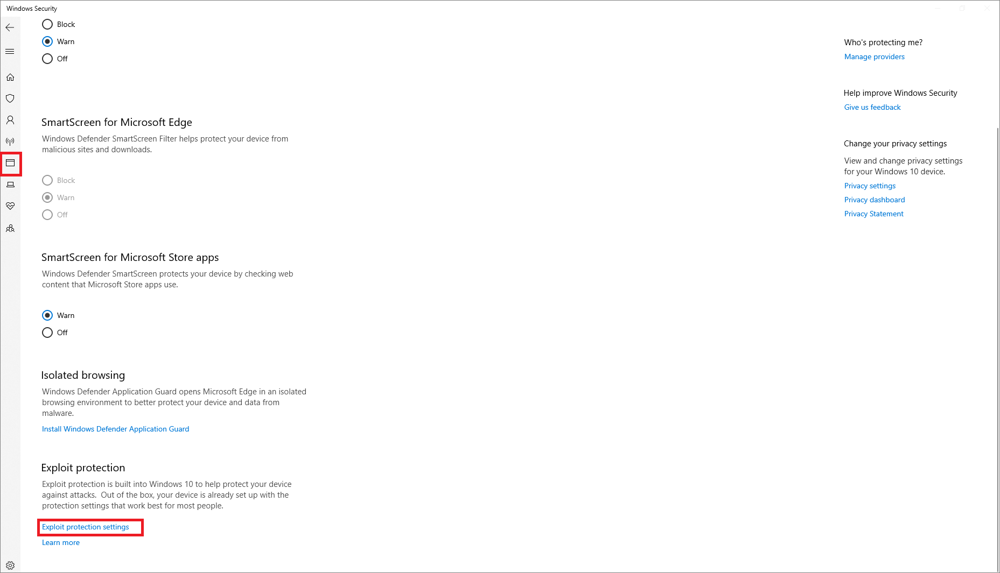
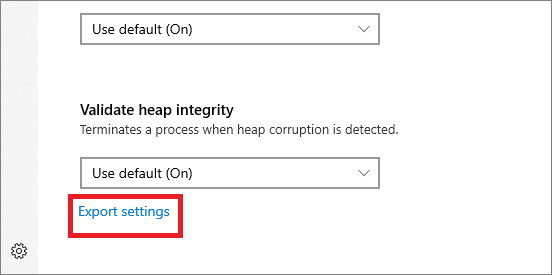

# <a name="import-export-and-deploy-exploit-protection-configurations"></a>악용 보호 구성 가져오기, 내보내기 및 배포하기

[!INCLUDE [Microsoft 365 Defender rebranding](../../includes/microsoft-defender.md)]


**적용 대상:**
- [엔드포인트용 Microsoft Defender](https://go.microsoft.com/fwlink/p/?linkid=2154037)
- [Microsoft 365 Defender](https://go.microsoft.com/fwlink/?linkid=2118804)

> Endpoint용 Defender를 경험하고 싶나요? [무료 평가판을 신청하세요.](https://signup.microsoft.com/create-account/signup?products=7f379fee-c4f9-4278-b0a1-e4c8c2fcdf7e&ru=https://aka.ms/MDEp2OpenTrial?ocid=docs-wdatp-exposedapis-abovefoldlink)

Exploit Protection은 악용을 사용하여 확산 및 감염시킬 수 있는 맬웨어로부터 장치를 보호하는 데 도움이 됩니다. 운영 체제 수준 또는 개별 앱 수준에서 적용할 수 있는 다양한 완화로 구성됩니다.

Windows 보안 또는 PowerShell을 사용하여 완화 집합(구성)을 만들 수 있습니다. 그런 다음 이 구성을 XML 파일로 내보내고 네트워크의 여러 장치와 공유할 수 있습니다. 그런 다음 모두 동일한 완화 설정 집합이 있습니다.

평가 [패키지에는](https://demo.wd.microsoft.com/Page/EP) XML 구조의 모양을 보는 데 사용할 수 있는 예제 구성 *파일(이름* ProcessMitigation.xml(Selfhost v4)이 포함되어 있습니다. 샘플 파일에는 향상된 완화 환경 구성에서 변환된 설정도 포함되어 [Toolkit](https://support.microsoft.com/help/2458544/the-enhanced-mitigation-experience-toolkit) 없습니다. 텍스트 편집기(예: 메모장)에서 파일을 열거나 exploit Protection으로 직접 가져오고 앱 앱의 설정을 Windows 보안 있습니다.

## <a name="create-and-export-a-configuration-file"></a>구성 파일 만들기 및 내보내기

구성 파일을 내보내기 전에 올바른 설정이 맞는지 확인해야 합니다. 먼저, 단일 전용 디바이스에서 exploit Protection을 구성합니다. 완화 [구성에 대한](customize-exploit-protection.md) 자세한 내용은 Exploit Protection 사용자 지정을 참조하세요.

Exploit Protection을 원하는 상태로 구성한 경우(시스템 수준 및 앱 수준 완화 모두 포함) Windows 보안 또는 PowerShell을 사용하여 파일을 내보낼 수 있습니다.

### <a name="use-the-windows-security-app-to-export-a-configuration-file"></a>앱 Windows 보안 사용하여 구성 파일 내보내기

1. 작업 Windows 보안 방패 아이콘을 선택하여 앱 앱을 니다. 또는 **Defender의 시작 메뉴를 검색합니다.**

2. App & 브라우저 컨트롤 **타일(또는** 왼쪽 메뉴 표시줄의 앱 아이콘)을 선택한 다음 **Exploit Protection 설정을 선택합니다.**

    

3. **Exploit Protection** 섹션 아래쪽에서 설정 **내보내기 를 선택합니다.** 구성을 저장할 XML 파일의 위치와 이름을 선택하십시오.

    > [!IMPORTANT]
    > 기본 구성을 사용하려면 "기본값 사용(설정)" 대신 "기본적으로 설정" 설정을 사용하여 XML 파일에서 설정을 올바르게 내보낼 수 있습니다.

    

    > [!NOTE]
    > 설정을 내보낼 때 앱 수준 및 시스템 수준 완화에 대한 모든 설정이 저장됩니다. 즉, 시스템 설정 및 프로그램 설정 섹션  모두에서  파일을 내보낼 필요가 없습니다(두 섹션 모두 내보낼 설정).

### <a name="use-powershell-to-export-a-configuration-file"></a>PowerShell을 사용하여 구성 파일 내보내기

1. 목록에서 **powershell을** 시작 메뉴 마우스 오른쪽 단추로 Windows PowerShell **관리자** 권한으로 **실행을 선택합니다.**
2. 다음 cmdlet을 입력합니다.

    ```PowerShell
    Get-ProcessMitigation -RegistryConfigFilePath filename.xml
    ```

    선택한 `filename` 이름이나 위치로 변경합니다.

    예제 명령:

    ```powershell
    Get-ProcessMitigation -RegistryConfigFilePath C:\ExploitConfigfile.xml
    ```

> [!IMPORTANT]
> 그룹 정책을 사용하여 구성을 배포할 때 구성을 사용하는 모든 장치는 구성 파일에 액세스할 수 있어야 합니다. 파일을 공유 위치에 저장해야 합니다.

## <a name="import-a-configuration-file"></a>구성 파일 가져오기

이전에 만든 exploit Protection 구성 파일을 가져올 수 있습니다. PowerShell을 사용하여 구성 파일을 가져올 수만 있습니다.

가져온 후 설정이 즉시 적용되고 앱 앱의 Windows 보안 있습니다.

### <a name="use-powershell-to-import-a-configuration-file"></a>PowerShell을 사용하여 구성 파일 가져오기

1. 목록에서 **powershell을** 시작 메뉴 마우스 오른쪽 단추로 Windows PowerShell **관리자** 권한으로 **실행을 선택합니다.**
2. 다음 cmdlet을 입력합니다.

    ```PowerShell
    Set-ProcessMitigation -PolicyFilePath filename.xml
    ```

    Exploit Protection XML 파일의 위치와 `filename` 이름으로 변경합니다.

    예제 명령:

    ```powershell
    Set-ProcessMitigation -PolicyFilePath C:\ExploitConfigfile.xml
    ```

> [!IMPORTANT]
> Exploit Protection용으로 특별히 만들어진 구성 파일을 가져와야 합니다.

## <a name="manage-or-deploy-a-configuration"></a>구성 관리 또는 배포

그룹 정책을 사용하여 네트워크의 여러 장치에 만든 구성을 배포할 수 있습니다.

> [!IMPORTANT]
> 그룹 정책을 사용하여 구성을 배포할 때 구성을 사용하는 모든 장치는 구성 XML 파일에 액세스할 수 있어야 합니다. 파일을 공유 위치에 저장해야 합니다.

### <a name="use-group-policy-to-distribute-the-configuration"></a>그룹 정책을 사용하여 구성 배포

1. 그룹 정책 관리 장치에서 그룹 정책 관리 콘솔을 [열고](/previous-versions/windows/desktop/gpmc/group-policy-management-console-portal)구성할 그룹 정책 개체를 마우스 오른쪽 단추로 클릭하고 **편집합니다.**

2. **그룹 정책 관리 편집기** 에서 **컴퓨터 구성** 으로 이동하여 **관리 템플릿** 을 선택합니다.

3. Exploit Guard **Exploit Protection을 Windows 구성** \> **Windows Defender** \> **확장합니다.**

    

4. Exploit Protection **설정의 공통** 집합 사용을 두 번 클릭하고 옵션을 사용으로 **설정합니다.**

5. 옵션:  섹션에서 다음 예와 같이 사용할 Exploit Protection 구성 파일의 위치와 파일 이름을 입력합니다.

    - `C:\MitigationSettings\Config.XML`
    - `\\Server\Share\Config.xml`
    - `https://localhost:8080/Config.xml`
    - `C:\ExploitConfigfile.xml`

6. 확인을 **선택하고** 평소처럼 업데이트된 [GPO 배포를 선택합니다.](/windows/win32/srvnodes/group-policy)

## <a name="see-also"></a>참고 항목

- [악용으로부터 장치 보호](exploit-protection.md)
- [Exploit Protection 평가](evaluate-exploit-protection.md)
- [악용 방지 사용](enable-exploit-protection.md)
- [악용 방지 완화 구성 및 감사](customize-exploit-protection.md)
