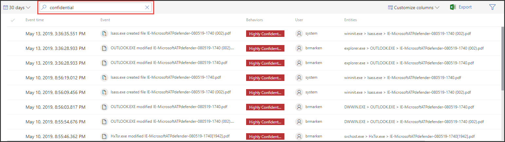

# 민감도 레이블을 사용하여 인시던트 대응의 우선 순위 지정

[!INCLUDE [Microsoft 365 Defender rebranding](../../includes/microsoft-defender.md)]

**적용 대상:**
- [엔드포인트용 Microsoft Defender](https://go.microsoft.com/fwlink/p/?linkid=2154037)
- [Microsoft 365 Defender](https://go.microsoft.com/fwlink/?linkid=2118804)

> Endpoint용 Defender를 경험하고 싶나요? [무료 평가판을 신청하세요.](https://signup.microsoft.com/create-account/signup?products=7f379fee-c4f9-4278-b0a1-e4c8c2fcdf7e&ru=https://aka.ms/MDEp2OpenTrial?ocid=docs-wdatp-exposedapis-abovefoldlink)

일반적인 고급 영구 위협 수명 주기에는 데이터 유출이 수반됩니다. 보안 인시던트에서 중요한 파일이 위험할 수 있는 조사의 우선 순위를 지정하여 회사 데이터 및 정보가 보호되는 것이 중요합니다.

Endpoint용 Defender는 민감도 레이블을 사용하여 보안 인시던트의 우선 순위를 훨씬 더 간단하게 만드는 데 도움이 됩니다. 민감도 레이블은 기밀 정보와 같은 중요한 정보가 있는 장치를 수반할 수 있는 인시던트를 빠르게 식별합니다.

## 중요한 데이터가 관련된 인시던트 조사

데이터 민감도 레이블을 사용하여 인시던트 조사의 우선 순위를 지정하는 방법을 학습합니다.

> [!NOTE]
> 레이블이 검색된 Windows 10, 버전 1809 이상입니다.

1. Microsoft 365 Defender 포털에서 **인시던트** 및 & \> **를 선택합니다.**

2. 오른쪽으로 스크롤하여 데이터 **민감도 열을** 봐야 합니다. 이 열은 인시던트와 관련된 장치에서 관찰된 민감도 레이블을 반영하여 중요한 파일이 인시던트의 영향을 을 수 있는지 여부를 나타 습니다.

    

    데이터 민감도에 따라 **필터링할 수도 있습니다.**

    

3. 인시던트 페이지를 열고 추가 조사를 합니다.

    

4. 장치 **탭을** 선택하여 민감도 레이블이 있는 파일을 저장하는 장치를 식별합니다.

    

5. 중요한 데이터를 저장하고 타임라인을 통해 검색하는 장치를 선택하여 영향을 줄 수 있는 파일을 식별한 다음 적절한 조치를 취하여 데이터가 보호되도록 합니다.

   데이터 민감도 레이블을 검색하여 디바이스 타임라인에 표시되는 이벤트를 좁힐 수 있습니다. 이렇게 하면 해당 레이블 이름이 있는 파일과 관련된 이벤트만 표시됩니다.

    

> [!TIP]
> 이러한 데이터 포인트는 고급 헌팅에서 'DeviceFileEvents'를 통해 노출되므로 고급 쿼리 및 예약 검색에서 민감도 레이블 및 파일 보호 상태를 고려할 수 있습니다.
