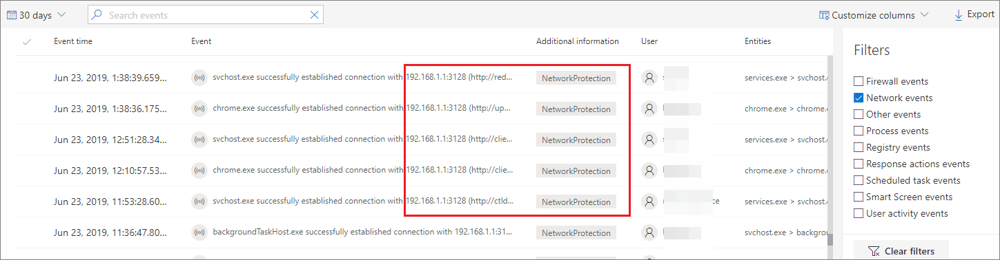
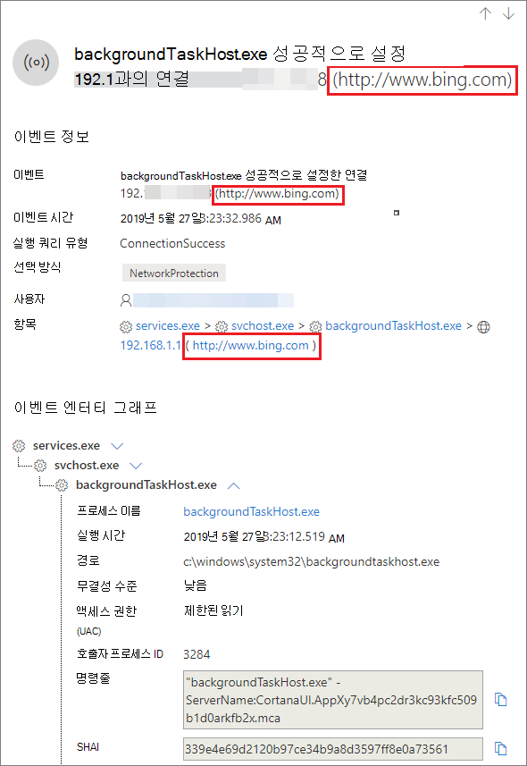

# <a name="investigate-connection-events-that-occur-behind-forward-proxies"></a>전달 프록시 뒤에 발생하는 연결 이벤트 조사

[!INCLUDE [Microsoft 365 Defender rebranding](../../includes/microsoft-defender.md)]

**적용 대상:**
- [엔드포인트용 Microsoft Defender](https://go.microsoft.com/fwlink/p/?linkid=2154037)
- [Microsoft 365 Defender](https://go.microsoft.com/fwlink/?linkid=2118804)

> Endpoint용 Defender를 경험하고 싶나요? [무료 평가판을 신청하세요.](https://signup.microsoft.com/create-account/signup?products=7f379fee-c4f9-4278-b0a1-e4c8c2fcdf7e&ru=https://aka.ms/MDEp2OpenTrial?ocid=docs-wdatp-investigatemachines-abovefoldlink)

Endpoint용 Defender는 다양한 수준의 네트워크 스택에서 네트워크 연결 모니터링을 지원합니다. 어려운 경우는 네트워크에서 인터넷에 대한 게이트웨이로 전방 프록시를 사용하는 경우입니다.

프록시는 대상 끝점인 것 같은 역할을 합니다. 이러한 경우 단순 네트워크 연결 모니터는 올바른 프록시와의 연결을 감사하지만 조사 값이 더 낮습니다.

Endpoint용 Defender는 네트워크 보호를 통해 고급 HTTP 수준 모니터링을 지원합니다. 이 설정이 켜져 있는 경우 실제 대상 도메인 이름을 노출하는 새로운 유형의 이벤트가 표시됩니다.

## <a name="use-network-protection-to-monitor-network-connection-behind-a-firewall"></a>네트워크 보호를 사용하여 방화벽 뒤의 네트워크 연결 모니터링

네트워크 보호에서 시작된 추가 네트워크 이벤트로 인해 정방향 프록시 뒤의 네트워크 연결을 모니터링할 수 있습니다. 장치 타임라인에서 표시하려면 네트워크 보호를 켜세요(감사 모드의 최소).

네트워크 보호는 다음 모드를 사용하여 제어할 수 있습니다.

- **차단:** 사용자 또는 앱이 위험한 도메인에 연결하지 않습니다. You will be able to see this activity in Microsoft Defender 보안 센터.
- **감사:** 사용자 또는 앱이 위험한 도메인에 연결하지 못하게 차단되지 않습니다. 그러나 이 활동은 여전히 Microsoft Defender 보안 센터.


네트워크 보호를 끄면 사용자 또는 앱이 위험한 도메인에 연결하지 못하게 차단되지 않습니다. 이 경우 네트워크 활동이 Microsoft Defender 보안 센터.

구성하지 않은 경우 기본적으로 네트워크 차단이 꺼집니다.

자세한 내용은 네트워크 보호 사용 [을 참조하세요.](enable-network-protection.md)

## <a name="investigation-impact"></a>조사 영향

네트워크 보호가 켜져 있는 경우 장치의 타임라인에 실제 대상 주소가 표시되어 있는 동안 IP 주소가 계속 프록시를 나타내는지 확인합니다.



이제 네트워크 보호 계층에 의해 트리거된 추가 이벤트를 사용하여 프록시 뒤에도 실제 도메인 이름을 표면화할 수 있습니다.

이벤트의 정보:



## <a name="hunt-for-connection-events-using-advanced-hunting"></a>고급 헌팅을 사용하여 연결 이벤트 헌팅

모든 새 연결 이벤트를 사용하여 고급 헌팅을 통해 헌팅할 수 있습니다. 이러한 이벤트는 연결 이벤트이기 때문에 작업 유형 아래 DeviceNetworkEvents 테이블에서 찾을 `ConnecionSuccess` 수 있습니다.

이 간단한 쿼리를 사용하면 모든 관련 이벤트가 표시됩니다.

```console
DeviceNetworkEvents
| where ActionType == "ConnectionSuccess"
| take 10
```


프록시 자체에 대한 연결과 관련된 이벤트를 필터링할 수 있습니다.

다음 쿼리를 사용하여 프록시에 대한 연결을 필터링합니다.

```console
DeviceNetworkEvents
| where ActionType == "ConnectionSuccess" and RemoteIP != "ProxyIP"
| take 10
```

## <a name="related-topics"></a>관련 항목

- [GP를 통해 네트워크 보호 적용 - 정책 CSP](/windows/client-management/mdm/policy-csp-defender#defender-enablenetworkprotection)
