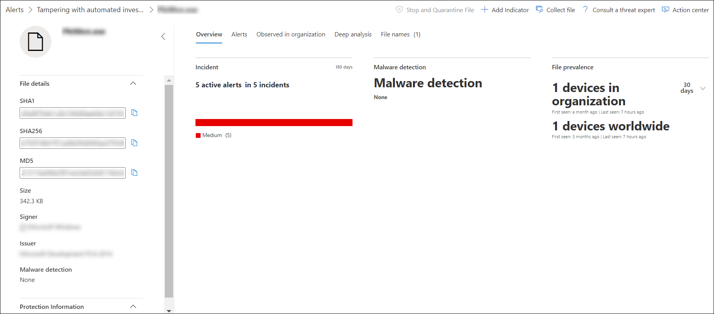
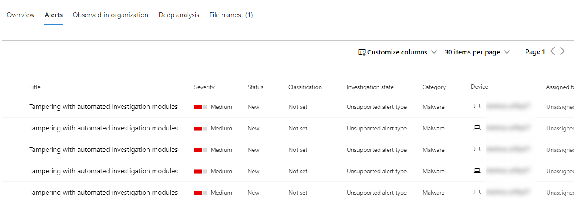
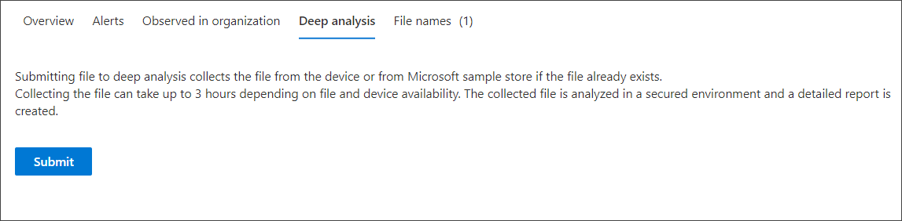

# 끝점 경고에 대한 Microsoft Defender와 관련된 파일 조사

[!INCLUDE [Microsoft 365 Defender rebranding](../../includes/microsoft-defender.md)]

**적용 대상:**
- [엔드포인트용 Microsoft Defender](https://go.microsoft.com/fwlink/p/?linkid=2154037)
- [Microsoft 365 Defender](https://go.microsoft.com/fwlink/?linkid=2118804)

> Endpoint용 Defender를 경험하고 싶나요? [무료 평가판을 신청하세요.](https://signup.microsoft.com/create-account/signup?products=7f379fee-c4f9-4278-b0a1-e4c8c2fcdf7e&ru=https://aka.ms/MDEp2OpenTrial?ocid=docs-wdatp-investigatefiles-abovefoldlink)

특정 경고, 동작 또는 이벤트와 관련된 파일의 세부 정보를 조사하여 파일에 악의적인 활동이 있는지 확인하고 공격 동기를 식별하고 잠재적인 위반 범위를 이해하는 데 도움이 됩니다.

특정 파일의 자세한 프로필 페이지에 액세스하는 방법에는 여러 가지가 있습니다. 예를 들어 검색 기능을 사용하여 경고 프로세스 **트리,** 인시던트 **그래프,** 아티팩트 타임라인의 링크를 클릭하거나 장치 타임라인 에 나열된 이벤트를 선택할 **수 있습니다.** 

자세한 프로필 페이지에서 새 파일 페이지를 전환하여 새 페이지 레이아웃과 이전 페이지 레이아웃 간에 전환할 **수 있습니다.** 이 문서의 나머지에서는 새로운 페이지 레이아웃에 대해 설명합니다.

파일 보기의 다음 섹션에서 정보를 얻을 수 있습니다.

- 파일 세부 정보, 맬웨어 검색, 파일 보전
- 심층 분석
- 경고
- 조직에서 관찰
- 심층 분석
- 파일 이름

이 페이지에서 파일에 대한 작업을 취할 수 있습니다.

## 파일 작업

프로필 페이지 위쪽의 파일 정보 카드 위에 있습니다. 여기에 수행할 수 있는 작업은 다음과 같습니다.

- 중지 및 격리
- 표시기 추가/편집
- 파일 다운로드
- 위협 전문가에게 문의
- 알림 센터 

이러한 작업에 대한 자세한 내용은 파일에 대한 응답 [작업 수행을 참조하세요.](respond-file-alerts.md)

## 파일 세부 정보, 맬웨어 검색 및 파일 보전

파일 세부 정보, 인시던트, 맬웨어 검색 및 파일 보전 카드에는 파일에 대한 다양한 특성이 표시됩니다.

파일의 MD5, 바이러스 총 검색 비율, Microsoft Defender AV 검색(사용 가능한 경우) 및 파일의 보전과 같은 세부 정보가 표시됩니다.

파일 보전 카드는 파일이 조직 및 전 세계 디바이스에서 어디에서 표시 봤는가를 보여줍니다.

> [!NOTE]
> 다른 사용자는 파일 보충 카드의 조직 섹션에 있는 디바이스에서 *서로* 다른 값을 볼 수 있습니다. 이는 카드에 사용자가 있는 RBAC 범위에 따라 정보가 표시하기 때문에입니다. 즉, 사용자에게 특정 장치 집합에 대한 표시 권한이 부여된 경우 해당 디바이스에 대한 파일 조직 보전만 볼 수 있습니다.

## 경고

경고 **탭은** 파일과 연결된 경고 목록을 제공합니다. 이 목록에는 장치 그룹(있는 경우)을 제외하고 경고 큐와 동일한 정보가 다수 표시됩니다. 열 머리그 위에 있는 도구 모음에서 열 사용자 지정을 선택하여 표시되는 정보의 종류를 선택할 수 있습니다. 

## 조직에서 관찰

조직에서 **관찰 탭을** 사용하면 날짜 범위를 지정하여 파일로 관찰된 장치를 볼 수 있습니다.

> [!NOTE]
> 이 탭에는 최대 100대의 디바이스가 표시됩니다. 파일이 _있는_ 모든 장치를 표시하려면 탭의 열 헤더 위에  있는 작업 메뉴에서 내보내기를 선택하여 탭을 CSV 파일로 내보낼 수 있습니다.

슬라이더 또는 범위 선택기에서 파일 관련 이벤트를 확인할 기간을 빠르게 지정합니다. 시간 창을 하루만큼 작게 지정할 수 있습니다. 이렇게 하면 해당 IP 주소와 통신한 파일만 볼 수 있으며 불필요한 스크롤 및 검색을 크게 줄일 수 있습니다.

## 심층 분석

심층 **분석** 탭을 사용하면 파일을 심층 분석을 위해 제출하여 파일 동작에 대한 세부 정보 및 조직 내에서 파일에 어떤 영향을 미치고 있는지 쉽게 확인 할 수 있습니다. 파일을 제출한 후 결과를 사용할 수 있는 경우 심층 분석 보고서가 이 탭에 표시됩니다. 심층 분석에서 아무것도 찾지 못하면 보고서는 비어 있으며 결과 공간은 비어 있습니다.

## 파일 이름

파일 **이름 탭에는** 조직 내에서 파일이 사용이 관찰된 모든 이름이 나열됩니다.

## 관련 항목

- [끝점 큐에 대한 Microsoft Defender 보기 및 구성](alerts-queue.md)
- [끝점 경고에 대한 Microsoft Defender 관리](manage-alerts.md)
- [끝점 경고에 대한 Microsoft Defender 조사](investigate-alerts.md)
- [Microsoft Defender for Endpoint Devices 목록에서 장치 조사](investigate-machines.md)
- [끝점 경고에 대한 Microsoft Defender와 연결된 IP 주소 조사](investigate-ip.md)
- [끝점 경고에 대한 Microsoft Defender와 연결된 도메인 조사](investigate-domain.md)
- [끝점용 Microsoft Defender에서 사용자 계정 조사](investigate-user.md)
- [파일에 대해 대응 조치 실행](respond-file-alerts.md)
