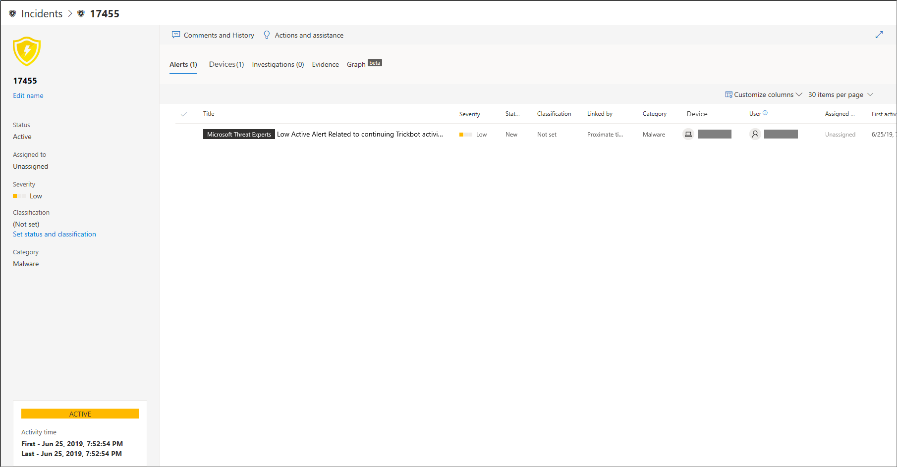
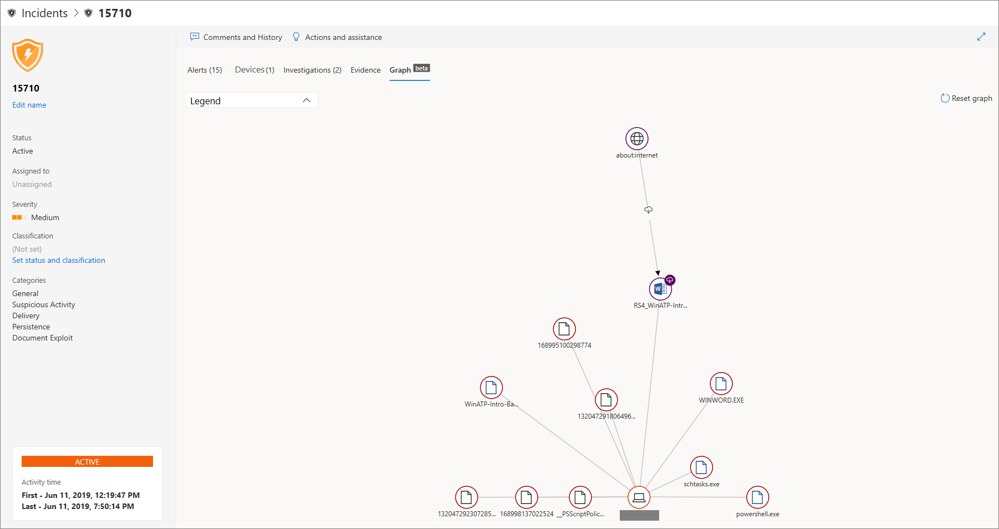

# 엔드포인트용 Microsoft Defender에서 인시던트 조사

[!INCLUDE [Microsoft 365 Defender rebranding](../../includes/microsoft-defender.md)]

**적용 대상:**
- [엔드포인트용 Microsoft Defender](https://go.microsoft.com/fwlink/p/?linkid=2154037)
- [Microsoft 365 Defender](https://go.microsoft.com/fwlink/?linkid=2118804)

네트워크에 영향을 주는 인시던트 조사, 그 의미를 파악하고 증거를 수집하여 해결합니다.

인시던트는 조사할 때 다음을 볼 수 있습니다.

- 사건 세부 정보
- 인시던트 설명 및 작업
- 탭(경고, 장치, 조사, 증거, 그래프)

> [!VIDEO https://www.microsoft.com/videoplayer/embed/RE4qLUV]

## 인시던트 세부 정보 분석

인시던트 를 클릭하여 인시던트 **창을 봐야 합니다.** **인시던트 페이지** 열기 를 선택하여 인시던트 세부 정보 및 관련 정보(경고, 장치, 조사, 증거, 그래프)를 볼 수 있습니다.

### 경고

경고를 조사하고 경고가 인시던트에서 함께 연결된 방법을 볼 수 있습니다. 경고는 다음과 같은 이유로 인시던트로 그룹화됩니다.

- 자동화된 조사 - 자동화된 조사가 원래 경고를 조사하는 동안 연결된 경고를 트리거했습니다.
- 파일 특성 - 경고와 관련된 파일에는 유사한 특성이 있습니다.
- 수동 연결 - 사용자가 수동으로 경고를 연결했습니다.
- Proximate time - 경고가 특정 기간 내에 동일한 디바이스에서 트리거된 경우
- 동일한 파일 - 경고와 연결된 파일이 정확히 동일합니다.
- 동일한 URL - 경고를 트리거한 URL은 정확히 동일합니다.

경고를 관리하고 다른 정보와 함께 경고 메타데이터를 볼 수도 있습니다. 자세한 내용은 [경고 조사를 참조하세요.](investigate-alerts.md)

### 디바이스

또한 특정 인시던트의 일부 또는 관련 장치를 조사할 수 있습니다. 자세한 내용은 [장치 조사를 참조하세요.](investigate-machines.md)

### 조사

조사를 **선택하여** 인시던트 경고에 대한 응답으로 시스템에서 시작된 모든 자동 조사를 볼 수 있습니다.

## 증거 진행

Microsoft Defender for Endpoint는 경고에서 지원되는 모든 인시던트의 지원 이벤트 및 의심스러운 엔터티를 자동으로 조사하여 중요한 파일, 프로세스, 서비스 등에 대한 자동 대응 및 정보를 제공합니다.

분석된 각 엔터티는 감염, 수정 또는 의심스러운 것으로 표시됩니다.

## 관련 사이버 보안 위협 시각화

끝점용 Microsoft Defender는 위협 정보를 인시던트로 집계하여 다양한 데이터 요소에서 들어오는 패턴 및 상관 관계도 볼 수 있습니다. 인시던트 그래프를 통해 이러한 상관 관계는 볼 수 있습니다.

### 인시던트 그래프

이 **Graph** 사이버 보안 공격의 스토리를 알 수 있습니다. 예를 들어 어떤 장치가 손상되거나 활동이 관찰된 진입점인 것을 보여 주었습니다. 등.

인시던트 그래프에서 원을 클릭하여 악성 파일, 관련 파일 검색, 전 세계 인스턴스 수, 조직에서 해당 인스턴스가 관찰된 경우 인스턴스 수를 볼 수 있습니다.

## 관련 항목

- [인시던트 큐](/microsoft-365/security/defender-endpoint/view-incidents-queue)
- [엔드포인트용 Microsoft Defender에서 인시던트 조사](/microsoft-365/security/defender-endpoint/investigate-incidents)
- [끝점 인시던트에 대한 Microsoft Defender 관리](/microsoft-365/security/defender-endpoint/manage-incidents)
