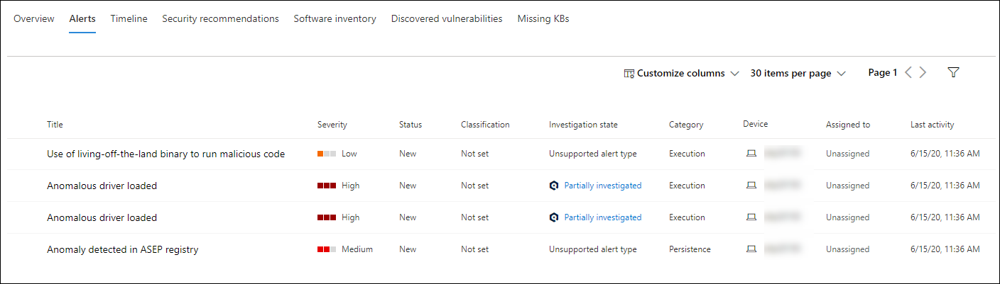
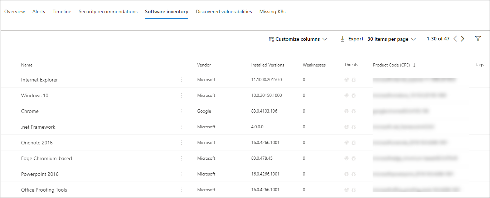
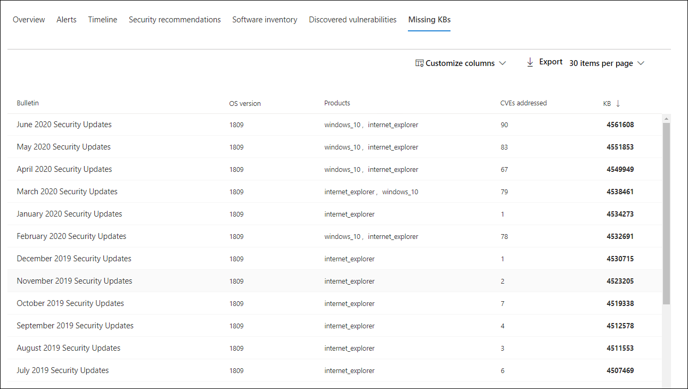
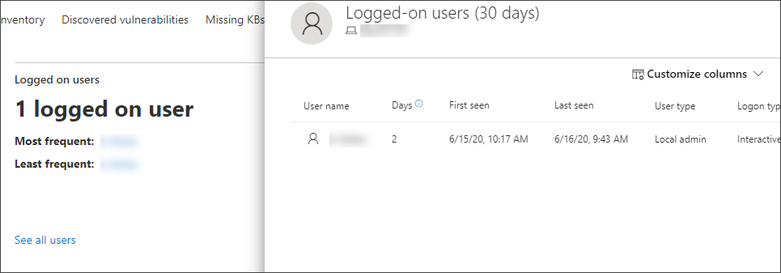
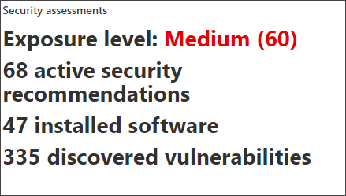

# Microsoft Defender for Endpoint Devices 목록에서 장치 조사

[!INCLUDE [Microsoft 365 Defender rebranding](../../includes/microsoft-defender.md)]

**적용 대상:**
- [엔드포인트용 Microsoft Defender](https://go.microsoft.com/fwlink/p/?linkid=2154037)
- [Microsoft 365 Defender](https://go.microsoft.com/fwlink/?linkid=2118804)

> Endpoint용 Defender를 경험하고 싶나요? [무료 평가판을 신청하세요.](https://signup.microsoft.com/create-account/signup?products=7f379fee-c4f9-4278-b0a1-e4c8c2fcdf7e&ru=https://aka.ms/MDEp2OpenTrial?ocid=docs-wdatp-investigatemachines-abovefoldlink)

특정 장치에서 발생한 경고의 세부 정보를 조사하여 경고 또는 잠재적인 위반 범위와 관련이 있을 수 있는 다른 동작 또는 이벤트를 식별합니다.

> [!NOTE]
> 조사 또는 응답 프로세스의 일부로 장치에서 조사 패키지를 수집할 수 있습니다. 방법: 장치에서 [조사 패키지를 수집합니다.](/microsoft-365/security/defender-endpoint/respond-machine-alerts#collect-investigation-package-from-devices)

포털에서 영향을 받는 장치를 볼 때마다 해당 장치를 클릭하여 해당 장치에 대한 자세한 보고서를 열 수 있습니다. 영향을 받는 장치는 다음 영역에서 식별됩니다.

- [장치 목록](investigate-machines.md)
- [경고 큐](alerts-queue.md)
- [보안 운영 대시보드](security-operations-dashboard.md)
- 개별 경고
- 개별 파일 세부 정보 보기
- 모든 IP 주소 또는 도메인 세부 정보 보기

특정 장치를 조사할 때 다음이 표시됩니다.

- 장치 세부 정보
- 응답 작업
- 탭(개요, 경고, 타임라인, 보안 권장 사항, 소프트웨어 인벤토리, 발견된 취약성, KB 누락)
- 카드(활성 경고, 로그온한 사용자, 보안 평가)

> [!NOTE]
> 제품 제약으로 인해 장치 프로필은 '마지막 본 시간' 기간(장치 페이지에 표시)을 결정할 때 모든 사이버 증거를 고려하지 않습니다.
> 예를 들어 장치 페이지의 '마지막 표시 시간' 값은 컴퓨터의 타임라인에서 최근 경고 또는 데이터를 사용할 수 있는 경우에도 이전 시간 프레임을 표시될 수 있습니다.

## 장치 세부 정보

장치 세부 정보 섹션에서는 디바이스의 도메인, OS 및 상태와 같은 정보를 제공합니다. 디바이스에서 사용 가능한 조사 패키지가 있는 경우 패키지를 다운로드할 수 있는 링크가 표시됩니다.

## 응답 작업

응답 작업은 특정 장치 페이지의 위쪽을 따라 실행하고 다음을 포함합니다.

- 태그 관리
- 디바이스 격리
- 앱 실행 제한
- 바이러스 백신 검사 실행
- 조사 패키지 수집
- 실시간 응답 세션 시작
- 자동화된 조사 시작
- 위협 전문가에게 문의
- 알림 센터 

작업 센터, 특정 장치 페이지 또는 특정 파일 페이지에서 응답 작업을 수행할 수 있습니다.

디바이스에서 조치를 취하는 방법에 대한 자세한 내용은 디바이스에서 응답 [작업 수행을 참조하세요.](respond-machine-alerts.md)

자세한 내용은 사용자 엔터티 [조사를 참조하세요.](investigate-user.md)

## 탭

탭은 장치와 관련된 관련 보안 및 위협 방지 정보를 제공합니다. 각 탭에서 열 머리줄 위의 막대에서 열  사용자 지정을 선택하여 표시되는 열을 사용자 지정할 수 있습니다.

### 개요

개요 **탭에는**  활성 경고, 로그온한 사용자 및 보안 평가에 대한 카드가 표시됩니다.

### 경고

경고 **탭은** 장치와 연결된 경고 목록을 제공합니다. 이 목록은 필터링된 경고 큐 버전으로, 경고, 심각도(높음, 중간, 낮음, 정보), 큐의 상태(신규, 진행 중, 해결), 분류(설정되지 않은, 거짓 경고, 참 경고), 조사 상태, 경고를 처리 중인 경고 범주 및 마지막 활동에 대한 간단한 설명을 보여줍니다. 경고를 필터링할 수도 있습니다.

경고 왼쪽에 있는 원 아이콘을 선택하면 플라이아웃이 나타납니다. 이 패널에서 경고를 관리하고 인시던트 번호 및 관련 장치와 같은 자세한 정보를 볼 수 있습니다. 경고는 한 번만 선택할 수 있습니다.

인시던트 그래프 및 프로세스 트리를 포함하여 경고의 전체 페이지 보기를 확인하려면 경고의 제목을 선택합니다.

### 시간 표시 막대

시간 **표시 막대** 탭에서는 장치에서 관찰된 이벤트 및 관련 경고를 시간 표시 막대 보기로 제공합니다. 이렇게하면 장치와 관련한 이벤트, 파일 및 IP 주소의 상관 관계를 설정하는 데 도움이 될 수 있습니다.

타임라인을 사용하면 특정 기간 내에 발생한 이벤트로 선택적으로 드릴다운할 수 있습니다. 선택한 기간 동안 디바이스에서 발생한 이벤트의 임시 순서를 볼 수 있습니다. 보기를 추가로 제어하기 위해 이벤트 그룹을 필터링하거나 열을 사용자 지정할 수 있습니다.

> [!NOTE]
> 방화벽 이벤트를 표시하려면 감사 정책을 사용하도록 설정해야 합니다. 필터링 플랫폼 연결 [감사를 참조하세요.](/windows/security/threat-protection/auditing/audit-filtering-platform-connection)
>
> 방화벽은 다음 이벤트를 다 덮습니다.
>
> - [5025](/windows/security/threat-protection/auditing/event-5025) - 방화벽 서비스가 중지됨
> - [5031](/windows/security/threat-protection/auditing/event-5031) - 응용 프로그램이 네트워크에서 들어오는 연결을 허용하지 않습니다.
> - [5157](/windows/security/threat-protection/auditing/event-5157) - 차단된 연결

일부 기능은 다음과 같습니다.

- 특정 이벤트 검색
  - 검색 표시줄을 사용하여 특정 타임라인 이벤트를 검색합니다.
- 특정 날짜의 이벤트 필터링
  - 지난 일, 주, 30일 또는 사용자 지정 범위의 이벤트를 표시하려면 표 왼쪽 상단에서 달력 아이콘을 선택합니다. 기본적으로 지난 30일 동안의 이벤트를 표시하기 위해 장치 타임라인이 설정됩니다.
  - 시간 표시 막대를 사용하여 섹션을 강조 표시하여 특정 시간으로 이동합니다. 시간 표시 막대의 화살표는 자동화된 조사를 고정합니다.
- 자세한 장치 타임라인 이벤트 내보내기
  - 현재 날짜 또는 지정된 날짜 범위에 대한 장치 타임라인을 최대 7일까지 내보낼 수 있습니다.

특정 이벤트에 대한 자세한 내용은 추가 정보 **섹션에 제공됩니다.** 이러한 세부 정보는 이벤트 유형에 따라 다릅니다. 예를 들면 다음과 같습니다.

- Application Guard에 포함된 - 웹 브라우저 이벤트가 격리된 컨테이너에 의해 제한됨
- 활성 위협 감지 - 위협이 실행되는 동안 위협 감지가 발생했습니다.
- 재구성 실패 - 감지된 위협을 수정하려고 시도했지만 실패했습니다.
- 수정 성공 - 감지된 위협이 중지되고 해결됨
- 사용자가 무시한 경고 - Windows Defender SmartScreen 경고가 무시 및 무시됩니다.
- 의심스러운 스크립트가 검색되었습니다. 실행 중인 악성 스크립트가 발견되었습니다.
- 경고 범주 - 이벤트가 경고 생성을 주도한 경우 경고 범주(예: "측면 이동")가 제공됩니다.

#### 이벤트 세부 정보

이벤트를 선택하여 해당 이벤트에 대한 관련 세부 정보를 볼 수 있습니다. 일반 이벤트 정보를 표시하는 패널이 표시됩니다. 해당되는 데이터와 데이터를 사용할 수 있는 경우 관련 엔터티 및 해당 관계가 표시된 그래프도 표시됩니다.

이벤트 및 관련 이벤트를 추가로 검사하려면 관련  이벤트에 대한 헌트 를 선택하여 고급 헌팅 **쿼리를 빠르게 실행할 수 있습니다.** 쿼리는 선택한 이벤트와 같은 끝점에서 동시에 발생한 다른 이벤트 목록을 반환합니다.

### 보안 권장 사항

**보안 권장** 사항은 Endpoint의 위협 및 [취약성 & Microsoft Defender에서](tvm-dashboard-insights.md) 생성됩니다. 권장 사항을 선택하면 권장 사항 설명 및 권장 사항의 제정되지 않은 잠재적 위험과 같은 관련 세부 정보를 볼 수 있는 패널이 표시됩니다. 자세한 [내용은 보안](tvm-security-recommendation.md) 권장 사항을 참조합니다.

### 소프트웨어 인벤토리

소프트웨어 **인벤토리** 탭을 사용하면 장치에서 약점이나 위협과 함께 소프트웨어를 볼 수 있습니다. 소프트웨어 이름을 선택하면 보안 권장 사항, 발견된 취약성, 설치된 장치 및 버전 배포를 볼 수 있는 소프트웨어 세부 정보 페이지로 이동합니다. 자세한 [내용은 소프트웨어](tvm-software-inventory.md) 인벤토리를 참조합니다.

### 발견된 취약성

검색된 **취약성** 탭에는 장치에서 검색된 취약성의 이름, 심각도 및 위협 인사이트가 표시됩니다. 특정 취약점을 선택하면 설명과 세부 정보가 표시됩니다.

### KB 누락
누락된 **KB 탭에는** 장치에 대한 누락된 보안 업데이트가 나열됩니다.

## 카드

### 활성 경고

**Azure Advanced Threat Protection** 카드는 ID에 대한 Microsoft Defender 기능을 활성화한 경우 활성 경고가 있는 경우 장치 및 해당 위험 수준과 관련된 경고에 대한 간략한 개요를 표시합니다. 자세한 내용은 "경고" 드릴다운에서 사용할 수 있습니다.

> [!NOTE]
> 이 기능을 사용하려면 ID용 Microsoft Defender 및 Endpoint용 Defender에서 통합을 사용하도록 설정해야 합니다. Endpoint용 Defender에서 고급 기능에서 이 기능을 사용하도록 설정할 수 있습니다. 고급 기능을 사용하도록 설정하는 방법에 대한 자세한 내용은 고급 기능 [켜기 를 참조하세요.](advanced-features.md)

### 로그온한 사용자

**로그온한** 사용자 카드에는 지난 30일 동안 로그온한 사용자 수와 가장 자주 또는 가장 자주 로그온한 사용자 수가 표시되어 있습니다. "모든 사용자 보기" 링크를 선택하면 세부 정보 창이 열리며, 세부 정보 창에는 사용자 유형, 로그온 유형, 사용자가 처음 및 마지막으로 본 때와 같은 정보가 표시됩니다. 자세한 내용은 사용자 엔터티 [조사를 참조하세요.](investigate-user.md)

> [!NOTE]
> '가장 자주' 사용자 값은 대화형으로 로그온한 사용자의 증거에만 계산됩니다.
> 그러나 "모든 사용자" 사이드 창은 모든 종류의 사용자 로그 인을 계산하여 해당 사용자가 대화형이 아 않을 수 있는 경우 측면 창에서 더 자주 사용자에게 표시될 것으로 예상됩니다.

### 보안 평가

보안 **평가** 카드는 전체 노출 수준, 보안 권장 사항, 설치된 소프트웨어 및 발견된 취약점을 보여 주며, 장치의 노출 수준은 보류 중인 보안 권장 사항의 누적 영향에 따라 결정됩니다.

## 관련 항목

- [엔드포인트용 Microsoft Defender 경고 큐 보기 및 구성](alerts-queue.md)
- [끝점 경고에 대한 Microsoft Defender 관리](manage-alerts.md)
- [끝점 경고에 대한 Microsoft Defender 조사](investigate-alerts.md)
- [끝점 경고에 대한 Defender와 관련된 파일 조사](investigate-files.md)
- [끝점 경고에 대한 Defender와 연결된 IP 주소 조사](investigate-ip.md)
- [끝점 경고에 대한 Defender와 연결된 도메인 조사](investigate-domain.md)
- [Defender에서 끝점에 대한 사용자 계정 조사](investigate-user.md)
- [보안 권장](tvm-security-recommendation.md)
- [소프트웨어 인벤토리](tvm-software-inventory.md)
