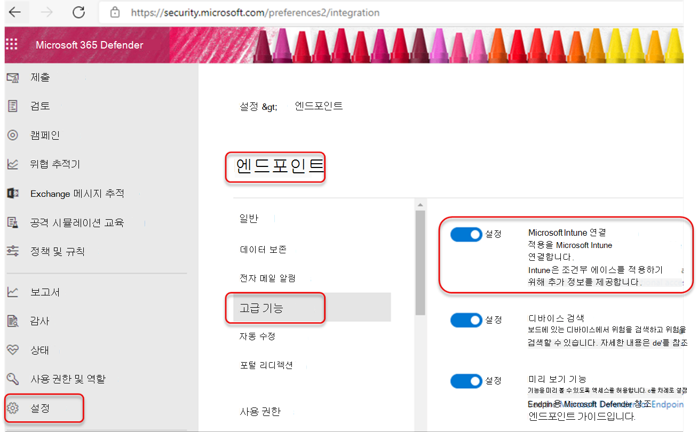
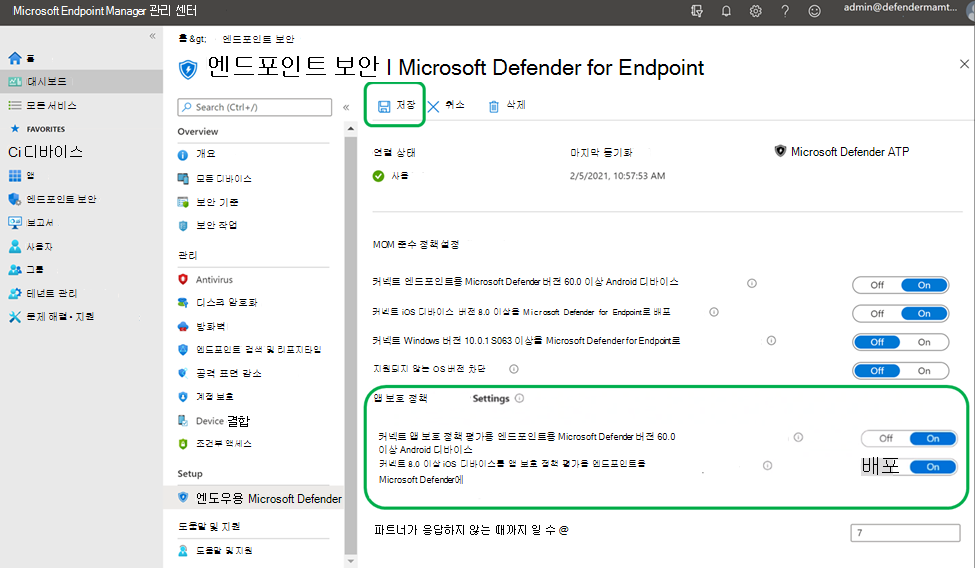
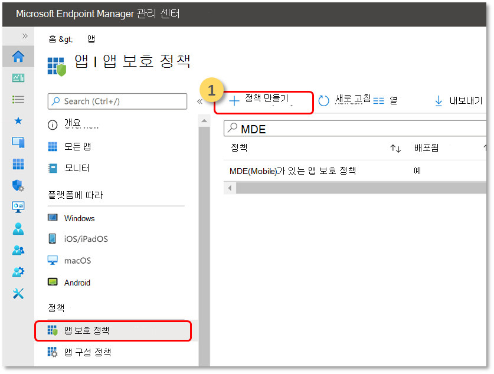
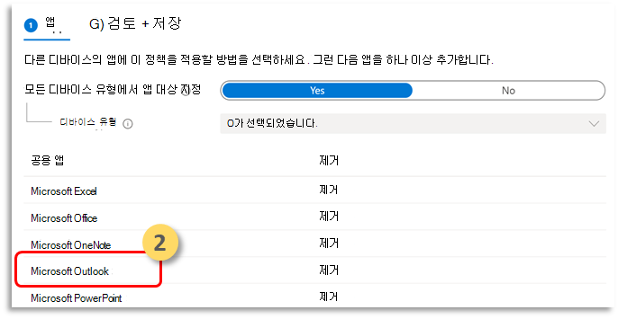
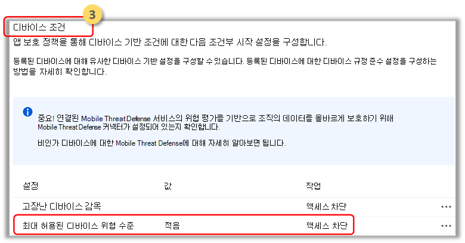

# 미인인 iOS 장치에 끝점용 Microsoft Defender 배포

[!INCLUDE [Microsoft 365 Defender rebranding](../../includes/microsoft-defender.md)]

**적용 대상:**
- [엔드포인트용 Microsoft Defender](https://go.microsoft.com/fwlink/p/?linkid=2154037)
- [Microsoft 365 Defender](https://go.microsoft.com/fwlink/?linkid=2118804)

> Endpoint용 Defender를 경험하고 싶나요? [무료 평가판을 신청하세요.](https://signup.microsoft.com/create-account/signup?products=7f379fee-c4f9-4278-b0a1-e4c8c2fcdf7e&ru=https://aka.ms/MDEp2OpenTrial?ocid=docs-wdatp-exposedapis-abovefoldlink)

> [!NOTE]
> iOS의 끝점용 Defender는 VPN을 사용하여 웹 보호 기능을 제공합니다. 이는 일반 VPN이 아니며 장치 외부에서 트래픽을 취하지 않는 로컬/자체 루프 VPN입니다.

## MAM(앱 보호 정책)에서 끝점 위험 신호에 대한 Microsoft Defender 구성

MDM(모바일 장치 관리) 시나리오에서 엔터프라이즈 사용자를 이미 보호하는 Android의 끝점용 Microsoft Defender는 이제 Intune MDM(모바일 장치 관리)을 사용하여 등록되지 않은 장치에 대한 MAM(모바일 앱 관리)으로 지원을 확장합니다. 또한 MAM(모바일 응용 프로그램 관리)에 Intune을 사용하면서 다른 엔터프라이즈 모바일 관리 솔루션을 사용하는 고객에게도 이 지원을 확장합니다. 이 기능을 사용하면 응용 프로그램 내에서 조직의 데이터를 관리하고 보호할 수 있습니다.

Android 위협 정보의 끝점용 Microsoft Defender는 Intune 앱 보호 정책에 의해 활용되어 이러한 앱을 보호합니다. APP(앱 보호 정책)은 조직의 데이터를 안전하게 유지하거나 관리되는 앱에 포함되도록 하는 규칙입니다. 관리되는 응용 프로그램에는 앱 보호 정책이 적용되고 Intune에서 관리할 수 있습니다.  

Android용 끝점용 Microsoft Defender는 MAM의 두 구성을 모두 지원
- **Intune MDM + MAM:** IT 관리자는 Intune MDM(모바일 장치 관리)에 등록된 장치에서만 앱 보호 정책을 사용하여 앱을 관리할 수 있습니다.
- 장치 등록이 없는 **MAM**: 장치 등록이 없는 MAM 또는 MAM-WE를 사용하면 IT 관리자가 Intune MDM에 등록되지 않은 디바이스에서 앱 보호 정책을 사용하여 앱을 관리할 수 있습니다.  즉, 타사 EMM 공급자에 등록된 장치에서 Intune에서 앱을 관리할 수 있습니다. 위의 두 구성에서 모두 사용하여 앱을 관리하려면 고객이 앱 관리 센터에서 Intune을 [Microsoft Endpoint Manager 합니다.](https://go.microsoft.com/fwlink/?linkid=2109431)

이 기능을 사용하려면 관리자가 끝점용 Microsoft Defender와 Intune 간의 연결을 구성하고 앱 보호 정책을 만들고 대상 장치 및 응용 프로그램에 정책을 적용해야 합니다. 
 
또한 최종 사용자는 장치에 끝점용 Microsoft Defender를 설치하고 온보딩 흐름을 활성화하는 단계를 따라야 합니다.

### 필수 구성 요소

1. **커넥터가 활성화되어 있는지 확인합니다.**   통합 보안 [콘솔에서](https://security.microsoft.com)설정 끝점 고급 기능으로 이동하여 Microsoft Intune  >    >   **사용하도록** 설정되어 있습니다.

  
  
2. **Intune 포털에서** 커넥터가 사용하도록 설정되어 있는지 확인합니다.   [Microsoft 끝점 관리자 관리 센터에서](https://go.microsoft.com/fwlink/?linkid=2109431) **끝점** 보안  >  **끝점용 Microsoft Defender로** 이동하여 연결 상태가 사용하도록 설정되어 있는지 확인합니다.

  

### 앱 보호 정책 만들기
 
앱 보호 정책을 만들어 끝점 위험 신호에 대한 Microsoft Defender를 기반으로 관리되는 앱의 액세스를 차단하거나 데이터 지우기
끝점용 Microsoft Defender는 MAM(앱 보호 정책)에 사용할 위협 신호를 보내도록 구성할 수 있습니다. 이 기능을 사용하면 끝점용 Microsoft Defender를 사용하여 관리되는 앱을 보호할 수 있습니다.

1. 정책 만들기  
APP(앱 보호 정책)은 조직의 데이터를 안전하게 유지하거나 관리되는 앱에 포함되도록 하는 규칙입니다. 정책은 사용자가 "회사" 데이터에 액세스하거나 이동하려고 할 때 적용되는 규칙 또는 사용자가 앱 내부에 있을 때 금지되거나 모니터링되는 작업 집합일 수 있습니다. 

2. 앱 추가  
    a. 이 정책을 다른 디바이스의 앱에 적용하는 방법을 선택하세요. 그런 다음 앱을 하나 이상 추가합니다.  
    이 옵션을 사용하여 해당 정책이 관리되지 않는 장치에 적용되는지 여부를 지정할 수 있습니다. 또한 관리 상태의 디바이스에서 정책을 앱으로 대상으로 지정할 수도 있습니다.
모바일 앱 관리에는 장치 관리가 필요하지 않습니다. 따라서 관리되는 디바이스와 관리되지 않는 디바이스 모두에서 회사 데이터를 보호할 수 있습니다. 관리는 사용자 ID를 중심으로 하여 장치 관리에 대한 요구 사항을 제거합니다. 회사에서는 MDM과 함께 또는 사용하지 않고 앱 보호 정책을 동시에 사용할 수 있습니다. 예를 들어 회사에서 발급한 휴대폰과 개인용 태블릿을 모두 사용하는 직원을 고려합니다. 회사 전화는 MDM에 등록되어 있으며 앱 보호 정책에 의해 보호되는 반면 개인 장치는 앱 보호 정책에 의해서만 보호됩니다.

    b. 앱 선택 
    관리되는 앱은 앱 보호 정책이 적용된 앱으로, Intune에서 관리할 수 있습니다. [Intune SDK와](/mem/intune/developer/app-sdk) 통합되거나 [Intune](/mem/intune/developer/apps-prepare-mobile-application-management) 앱에 의해 래핑된 모든 App Wrapping Tool Intune 앱 보호 정책을 사용하여 관리할 수 있습니다. 이러한 도구를 사용하여  Microsoft Intune 공개적으로 사용할 수 있는 보호된 앱의 공식 목록을 참조하세요.

    *예: Outlook 앱으로 사용*

    

 3. 보호 정책에 대한 로그인 보안 요구 사항을 설정하세요.  
장치 **조건에서 > 허용되는** 최대 장치 위협 수준 설정을 **선택하고** 값을 입력합니다. 그런 다음 **작업: "액세스 차단"을 선택합니다.** Android의 끝점용 Microsoft Defender는 이 장치 위협 수준을 공유합니다.

    

4. 정책을 적용해야 하는 사용자 그룹을 할당합니다. 
  포함된 **그룹을 선택합니다.** 그런 다음 관련 그룹을 추가합니다. 

MAM 또는 앱 보호 정책에 대한 자세한 내용은 iOS 앱 보호 정책 설정을 [참조하세요.](/mem/intune/apps/app-protection-policy-settings-ios)

## MAM 또는 미가용 디바이스에 대한 끝점용 Microsoft Defender 배포

iOS의 끝점용 Microsoft Defender는 앱 보호 정책 시나리오를 사용할 수 있도록 지원하며 Apple 앱 스토어에서 사용할 수 있습니다.

앱 보호 정책이 끝점용 Microsoft Defender의 장치 위험 신호를 포함하도록 앱에 대해 구성된 경우 사용자는 이러한 앱을 사용할 때 끝점용 Microsoft Defender를 설치하도록 리디렉션됩니다. 또는 사용자는 Apple 앱 스토어에서 직접 최신 버전의 앱을 설치할 수도 있습니다.
