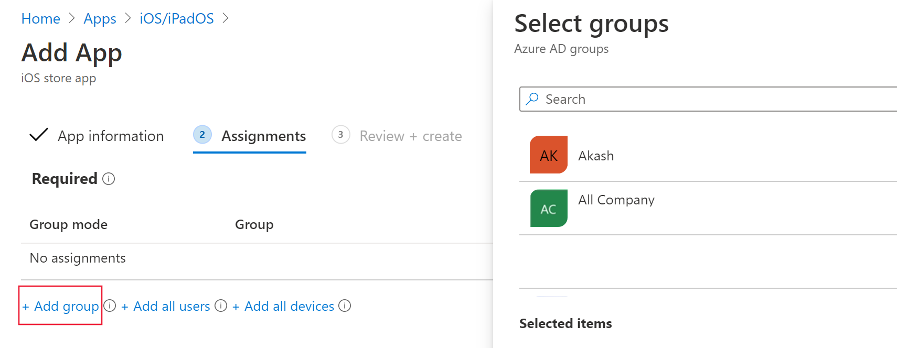
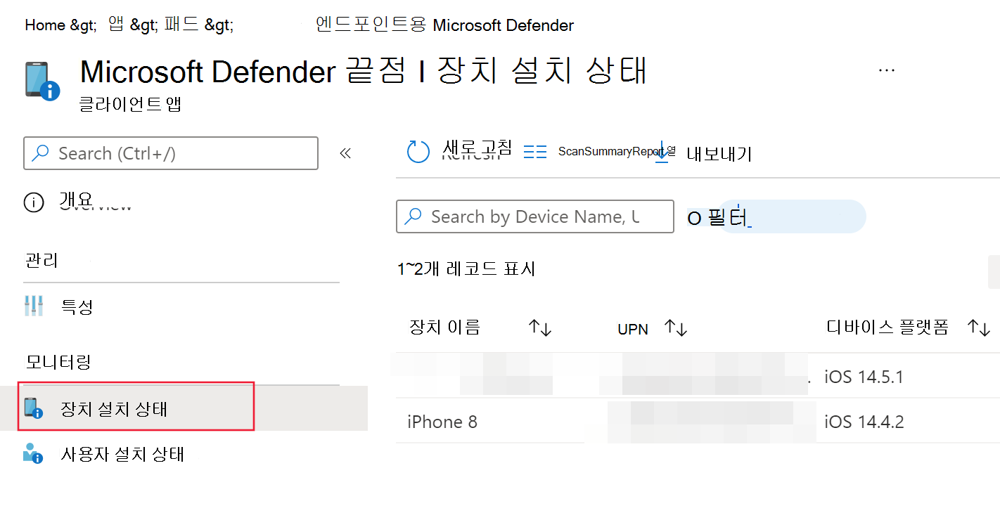
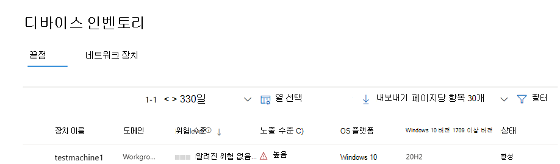
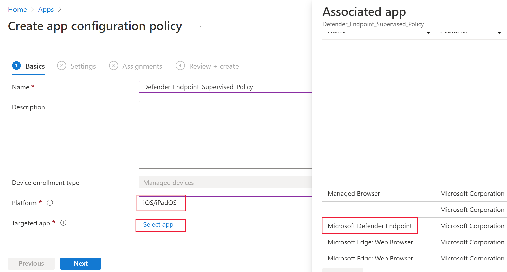
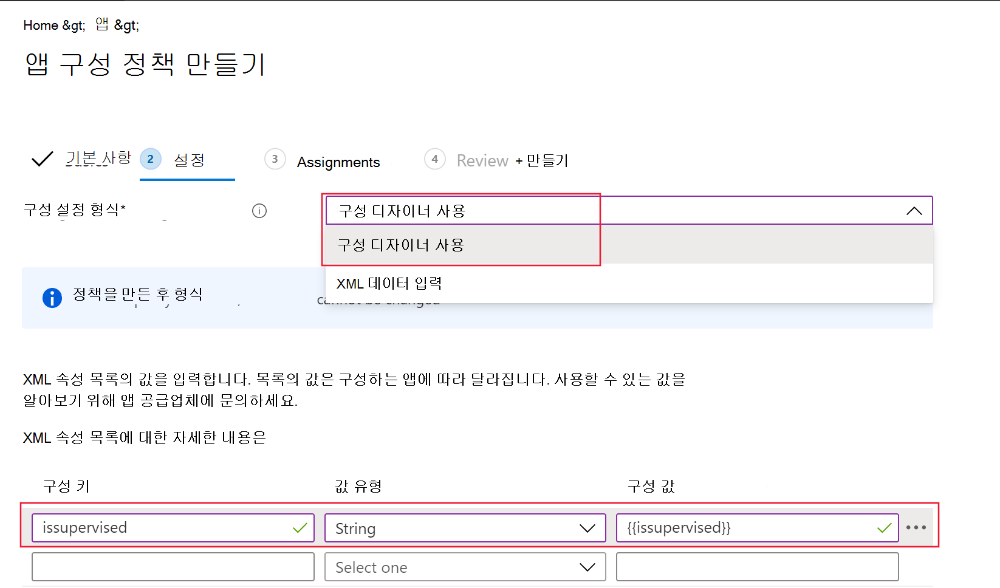

# iOS에서 끝점용 Microsoft Defender 배포

[!INCLUDE [Microsoft 365 Defender rebranding](../../includes/microsoft-defender.md)]

**적용 대상:**
- [엔드포인트용 Microsoft Defender](https://go.microsoft.com/fwlink/p/?linkid=2154037)
- [Microsoft 365 Defender](https://go.microsoft.com/fwlink/?linkid=2118804)

> Endpoint용 Defender를 경험하고 싶나요? [무료 평가판을 신청하세요.](https://signup.microsoft.com/create-account/signup?products=7f379fee-c4f9-4278-b0a1-e4c8c2fcdf7e&ru=https://aka.ms/MDEp2OpenTrial?ocid=docs-wdatp-investigateip-abovefoldlink)

이 항목에서는 등록된 디바이스에서 iOS에 Endpoint용 Defender를 Intune 회사 포털 대해 설명합니다. Intune 장치 등록에 대한 자세한 내용은 [Intune에서 iOS/iPadOS 장치 등록을 참조하세요.](/mem/intune/enrollment/ios-enroll)

## 시작하기 전에 다음의 조건을 만족해야 합니다.

- Microsoft Endpoint Manager 관리 센터에 액세스할 [수 있도록 합니다.](https://go.microsoft.com/fwlink/?linkid=2109431)

- 사용자에 대해 iOS 등록이 완료되도록 합니다. iOS에서 끝점용 Defender를 사용하려면 사용자가 끝점용 Defender 라이선스를 할당해야 합니다. 라이선스를 [할당하는](/azure/active-directory/users-groups-roles/licensing-groups-assign) 방법에 대한 지침은 사용자에게 라이선스 할당을 참조하세요.

> [!NOTE]
> iOS의 끝점용 Microsoft Defender는 [Apple App Store에서 사용할 수 있습니다.](https://aka.ms/mdatpiosappstore)

## 배포 단계

iOS에서 끝점용 Defender를 배포하는 Intune 회사 포털.

### iOS 스토어 앱 추가

1. [Microsoft Endpoint Manager 관리 센터에서](https://go.microsoft.com/fwlink/?linkid=2109431)앱   ->  **iOS/iPadOS** iOS 스토어 앱  ->    ->  **추가로 이동하고** 선택을 **클릭합니다.**

    > [!div class="mx-imgBorder"]
    > 

1. 앱 추가 페이지에서 앱  스토어 검색을 클릭하고 검색 표시줄에 **Microsoft Defender 끝점을** 입력합니다. 검색 결과 섹션에서 *Microsoft Defender 끝점을 클릭하고* 선택을 **클릭합니다.**

1. **최소 운영 체제로 iOS 11.0을** 선택합니다. 앱에 대한 나머지 정보를 검토하고 다음을 **클릭합니다.**

1. 배정 *섹션에서* 필수 섹션으로 **이동하여** 그룹 **추가 를 선택합니다.** 그런 다음 iOS 앱에서 끝점용 Defender를 대상으로 할 사용자 그룹을 선택할 수 있습니다. 선택을 **클릭한** 후 다음 을 **클릭합니다.**

    > [!NOTE]
    > 선택한 사용자 그룹은 Intune에 등록된 사용자로 구성됩니다.

    > [!div class="mx-imgBorder"]
    > 

1. 검토 *+ 만들기 섹션에서* 입력한 모든 정보가 올바른지 확인하고 만들기를 **선택합니다.** 잠시 후 Endpoint용 Defender 앱이 만들어지며 알림이 페이지의 오른쪽 위에 표시됩니다.

1. 표시되는 앱 정보 페이지의 모니터 섹션에서 장치  설치 상태를 선택하여 장치 설치가 성공적으로 완료되어 있는지 확인합니다. 

    > [!div class="mx-imgBorder"]
    > 

## VPN 프로필의 자동 온보더링(간소화된 온보더링)

관리자는 VPN 프로필의 자동 설정을 구성할 수 있습니다. 이렇게 하면 사용자가 온보딩하는 동안 이를 수행하지 않고도 Endpoint VPN용 Defender 프로필이 자동으로 설정됩니다. VPN은 웹 보호 기능을 제공하기 위해 사용됩니다. 이는 일반 VPN이 아니며 장치 외부에서 트래픽을 취하지 않는 로컬/자체 루프 VPN입니다.

1. [Microsoft 끝점 관리자 관리 센터에서](https://go.microsoft.com/fwlink/?linkid=2109431)장치 **구성** 프로필 프로필  ->    ->  **만들기로 이동하세요.**
1. **플랫폼을 iOS/iPadOS로** 선택하고 **VPN으로 프로필 유형을** **선택하세요.**  **만들기** 를 클릭합니다.
1. 프로필 이름을 입력하고 다음 을 **클릭합니다.**
1. 연결 **유형에** 대한 사용자 지정 **VPN을** 선택하고 기본 VPN 섹션에서 다음을 입력합니다.
    - 연결 이름 = 끝점용 Microsoft Defender
    - VPN 서버 주소 = 127.0.0.1
    - 인증 방법 = "사용자 이름 및 암호"
    - 분할 터널링 = 사용 안 하게
    - VPN 식별자 = com.microsoft.scmx
    - 키-값 쌍에서 **키 AutoOnboard를** 입력하고 값을 **True로 설정합니다.**
    - 자동 VPN 유형 = 수동 VPN
    - On  **Demand Rules에 대해** 추가를 클릭하고 다음을 하고 싶은 **경우를** 선택합니다. VPN 설정 , = 모든 도메인으로 **제한합니다.**

    

1. 다음을 클릭하고 대상 사용자에게 프로필을 할당합니다.
1. 검토 *+ 만들기 섹션에서* 입력한 모든 정보가 올바른지 확인하고 만들기를 **선택합니다.**

## 온보더링 완료 및 상태 확인

1. iOS의 끝점용 Defender가 장치에 설치되면 앱 아이콘이 표시됩니다.

    

2. 끝점용 Defender 앱 아이콘(MSDefender)을 탭하고 화면의 지침에 따라 온보딩 단계를 완료합니다. 세부 정보에는 iOS의 끝점에 대한 Defender에서 요구하는 iOS 사용 권한의 최종 사용자 수락이 포함됩니다.

3. 온보드에 성공하면 디바이스가 장치 포털의 장치 목록에 Microsoft 365 Defender 됩니다.

    > [!div class="mx-imgBorder"]
    > 

## 감독 모드에 대한 끝점에 대한 Microsoft Defender 구성

iOS 앱의 끝점용 Microsoft Defender는 이러한 유형의 장치에서 플랫폼에서 제공하는 증가된 관리 기능을 감안할 때 감독되는 iOS/iPadOS 디바이스에서 특수한 기능을 제공합니다. 이러한 기능을 활용하려면 끝점용 Defender 앱에서 장치가 감독 모드에 있는지 알아야 합니다.

### Intune을 통해 감독 모드 구성

Intune을 사용하면 앱 구성 정책을 통해 iOS용 Defender 앱을 구성할 수 있습니다.

   > [!NOTE]
   > 감독되는 장치에 대한 이 앱 구성 정책은 관리되는 장치에만 적용될 수 있으며 모범 사례로 관리되는 모든 iOS 장치를 대상으로 해야 합니다.

1. Microsoft Endpoint Manager 관리 센터에 [로그인하고](https://go.microsoft.com/fwlink/?linkid=2109431) 앱 앱  구성 정책 추가 \> **로** \> **이동하세요.** 관리되는 **장치를 클릭합니다.**

    > [!div class="mx-imgBorder"]
    > 

1. 앱 *구성 정책 만들기 페이지에서* 다음 정보를 제공합니다.
    - 정책 이름
    - 플랫폼: iOS/iPadOS 선택
    - 대상 앱: 목록에서 **Microsoft Defender 끝점** 선택

    > [!div class="mx-imgBorder"]
    > 

1. 다음 화면에서 구성 **디자이너를** 형식으로 사용을 선택합니다. 다음 속성을 지정합니다.
    - 구성 키: issupervised
    - 값 형식: String
    - 구성 값: {{issupervised}}

    > [!div class="mx-imgBorder"]
    > 

1. 다음을 클릭하여 **범위** 태그 페이지를 열 수 있습니다.  범위 태그는 선택 사항입니다. **다음** 을 클릭하여 계속합니다.

1. 과제 **페이지에서** 이 프로필을 받을 그룹을 선택합니다. 이 시나리오에서는 모든 장치를 대상으로 **지정하는 것이 가장 좋은 시나리오입니다.** 프로필 할당에 대한 자세한 내용은 사용자 및 장치 프로필 [할당을 참조하세요.](/mem/intune/configuration/device-profile-assign)

   사용자 그룹에 배포할 때 정책이 적용되기 전에 사용자가 장치에 로그인해야 합니다.

   **다음** 을 클릭합니다.

1. 검토 **+ 만들기 페이지에서** 완료되면 만들기 를 **선택합니다.** 새 프로필이 구성 프로필 목록에 표시됩니다.

## 다음 단계

- [MAM(Endpoint 위험 신호)에 대한 Defender를 포함하도록 앱 보호 정책 구성](ios-install-unmanaged.md)
- [iOS 기능에서 끝점에 대한 Defender 구성](ios-configure-features.md)
