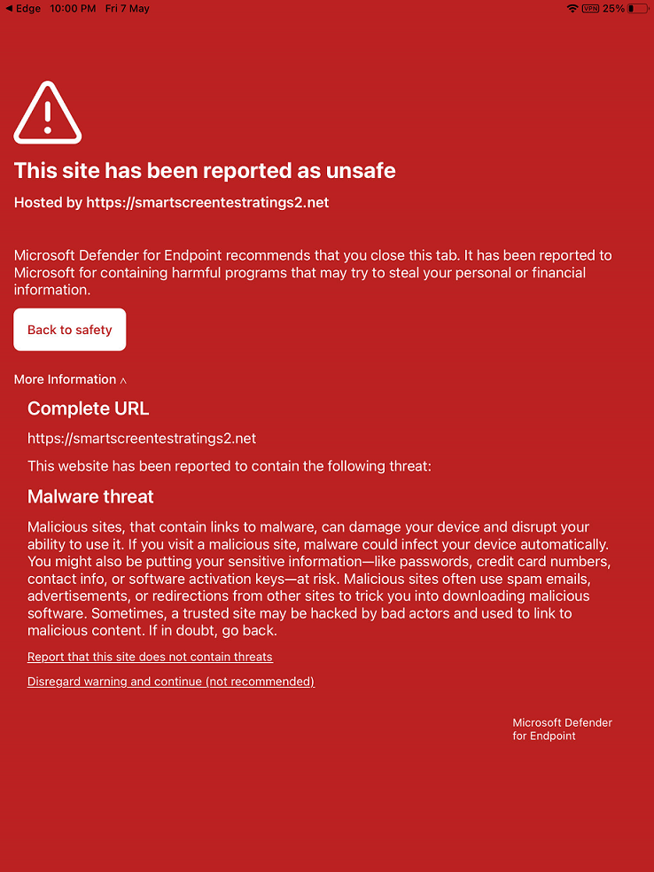

# iOS의 엔드포인트용 Microsoft Defender에서 문제 해결 및 FAQ에 대한 답변 찾기

[!INCLUDE [Microsoft 365 Defender rebranding](../../includes/microsoft-defender.md)]

**적용 대상:**
- [엔드포인트용 Microsoft Defender](https://go.microsoft.com/fwlink/p/?linkid=2154037)
- [Microsoft 365 Defender](https://go.microsoft.com/fwlink/?linkid=2118804)

> Endpoint용 Defender를 경험하고 싶나요? [무료 평가판을 신청하세요.](https://signup.microsoft.com/create-account/signup?products=7f379fee-c4f9-4278-b0a1-e4c8c2fcdf7e&ru=https://aka.ms/MDEp2OpenTrial?ocid=docs-wdatp-exposedapis-abovefoldlink)

이 항목에서는 iOS에서 끝점용 Microsoft Defender를 사용할 때 발생할 수 있는 문제를 해결하는 데 도움이 되는 문제 해결 정보를 제공합니다.

> [!NOTE]
> iOS의 끝점용 Defender는 VPN을 사용하여 웹 보호 기능을 제공합니다. 이는 일반 VPN이 아니며 장치 외부에서 트래픽을 취하지 않는 로컬/자체 루프 VPN입니다.

## VPN이 켜져 있을 때 앱이 작동하지 않습니다.
활성 VPN이 감지되면 일부 앱이 작동하지 않습니다. 이러한 앱을 사용하는 동안 VPN을 사용하지 않도록 설정할 수 있습니다. 

기본적으로 iOS의 Endpoint용 Defender에는 웹 보호 기능이 포함 및 사용됩니다. [웹 보호는](web-protection-overview.md) 웹 위협으로부터 장치를 보호하고 피싱 공격으로부터 사용자를 보호하는 데 도움이 됩니다. iOS의 끝점용 Defender는 VPN을 사용하여 이 보호를 제공합니다. 이는 로컬 VPN으로, 기존 VPN과 달리 네트워크 트래픽은 장치 외부로 전송되지 않습니다.

기본적으로 사용하도록 설정되어 있는 동안 VPN을 사용하지 않도록 설정해야 하는 경우도 있습니다. 예를 들어 VPN을 구성할 때 작동하지 않는 일부 앱을 실행하려는 경우를 예로 들 수 있습니다. 이러한 경우 끝점용 Defender 앱에서 직접 VPN을 사용하지 않도록 설정하거나 다음 단계를 사용할 수 있습니다.

1. iOS 장치에서 설정 열고 **일반을 클릭하거나** **탭한** 다음 **VPN 을 클릭합니다.**
1. 끝점용 Microsoft Defender의 "i" 단추를 클릭하거나 탭합니다.
1. VPN을 사용하지 **커넥트 On Demand를** 해제합니다.

    > [!div class="mx-imgBorder"]
    > 

> [!NOTE]
> VPN을 사용하지 않도록 설정하면 웹 보호를 사용할 수 없습니다. 웹 보호를 다시 사용하도록 설정하려면 장치에서 끝점용 Microsoft Defender 앱을 열고 웹 보호를 사용하도록 설정하세요.

## 여러 VPN 프로필과 공존

Apple iOS는 동시에  활성화하기 위해 여러 장치 전체의 VPN을 지원하지 않습니다. 디바이스에 여러 VPN 프로필이 존재할 수 있는 반면 한 번의 VPN만 활성화할 수 있습니다. 장치에서 다른 VPN을 사용해야 하는 경우 다른 VPN을 사용하는 동안 끝점 VPN에 대해 Defender를 사용하지 않도록 설정할 수 있습니다.

## 배터리 사용

웹 기반 위협으로부터 모든 시간을 보호하기 위해 끝점용 Microsoft Defender는 백그라운드에서 실행해야 합니다. 이로 인해 장치의 전체 배터리 사용이 사소하게 증가할 수 있습니다. 상당한 배터리 소모가 표시될 경우  피드백을 보내주세요. 조사할 것입니다.

또한 설정 앱에서 iOS는 특정 기간 동안 사용자에게 표시되는 앱의 배터리 사용만 보여 줍니다. 화면에 표시된 앱의 배터리 사용량은 해당 기간 동안만 사용하며 CPU 및 네트워크 사용량을 비롯한 다양한 요인에 따라 iOS에서 계산됩니다. 끝점용 Microsoft Defender는 백그라운드에서 로컬/루프백 VPN을 사용하여 악성 웹 사이트 또는 연결에 대한 웹 트래픽을 확인합니다. 모든 앱에서 네트워크 패킷이 이 검사를 통과하여 끝점용 Microsoft Defender의 배터리 사용이 부정확하게 계산됩니다. Endpoint용 Microsoft Defender의 실제 배터리 사용은 장치의 배터리 설정 페이지에 표시된 것보다 적습니다.

사용된 VPN은 로컬 VPN으로, 기존 VPN과 달리 네트워크 트래픽은 장치 외부로 전송되지 않습니다.

## 데이터 사용 현황

끝점용 Microsoft Defender는 로컬/루프백 VPN을 사용하여 악성 웹 사이트 또는 연결에 대한 웹 트래픽을 확인합니다. 이러한 이유로 끝점 데이터 사용에 대한 Microsoft Defender가 부정확하게 고려될 수 있습니다. 또한 디바이스가 셀룰러 네트워크에만 있는 경우 서비스 공급자가 보고하는 데이터 사용량은 실제 사용에 매우 근접한 반면 설정 앱에서 Apple은 소비된 실제 데이터의 약 1.5~2배를 보여 줍니다.

다른 VPN 서비스와도 비슷한 관찰을 하여 Apple에 보고했습니다.

또한 더 나은 보호를 제공하기 위해 백 엔드 서비스를 통해 끝점에 대한 Microsoft Defender를 최신으로 설정하는 것이 중요합니다.

## 안전하지 않은 사이트 보고

피싱 웹 사이트는 개인 또는 재무 정보를 얻기 위해 신뢰할 수 있는 웹 사이트를 가장합니다. 네트워크 [보호에](https://www.microsoft.com/wdsi/support/report-unsafe-site) 대한 피드백 제공 페이지를 방문하여 피싱 사이트일 수 있는 웹 사이트를 보고합니다.

## 악성 사이트가 검색되었습니다.

끝점용 Microsoft Defender는 피싱 또는 기타 웹 기반 공격으로부터 보호합니다. 악의적인 사이트가 감지되면 연결이 차단되고 경고가 조직의 보안 센터 포털로 전송됩니다. 경고에는 연결의 도메인 이름, 원격 IP 주소 및 장치 세부 정보가 포함됩니다.

또한 iOS 장치에 알림이 표시됩니다. 알림을 탭하면 사용자가 세부 정보를 검토할 수 있는 다음 화면이 열립니다.

> [!div class="mx-imgBorder"]
> 

## 온보딩 후 끝점용 Defender 콘솔에 디바이스가 볼 수 없습니다.

온보딩한 후 장치가 Endpoint용 Defender 보안 콘솔의 장치 인벤토리에 표시하는 데 몇 시간이 소요됩니다. 또한 장치가 인터넷에 연결되는 Azure Active Directory 올바르게 등록되어 있는지 확인합니다. 성공적인 온보드를 위해 디바이스는 Microsoft Authenticator 또는 Intune 회사 포털 등록해야 합니다. 사용자는 Azure AD에 등록된 동일한 계정을 사용하여 로그인해야 합니다.

> [!NOTE]
> 경우에 따라 장치 이름이 Intune(Intune) 콘솔에서 Microsoft Endpoint Manager 일치하지 않는 경우도 있습니다. Endpoint 콘솔용 Defender의 장치 이름은 <username_iPhone/iPad 모델>. Azure AD 장치 ID를 사용하여 끝점용 Defender 콘솔에서 디바이스를 식별할 수 있습니다.

## 데이터 및 개인 정보

수집된 데이터 및 개인 정보 보호에 대한 자세한 내용은 개인 정보 보호 [정보 - iOS의 끝점용 Microsoft Defender를 참조하세요.](ios-privacy.md)

## 콘텐츠 필터 프로필이 설치된 감독되는 디바이스의 문제

Endpoint용 Defender 콘텐츠 필터가 설치된 감독되는 장치에 문제가 있습니다. 이러한 장치에서 인터넷 연결 속도가 느려지거나 대기 시간이 관찰되면 장치에서 콘텐츠 필터 프로필을 제거하거나 삭제합니다. We are working to resolve this issue and will update this place once we have a resolution. 

## 앱 스토어에서 앱을 업데이트하는 동안의 문제

앱 스토어를 통해 앱이 업데이트될 때 문제가 관찰되는 경우(자동 업데이트 또는 수동 업데이트) 장치를 다시 시작해야 할 수 있습니다. 그래도 문제가 해결되지 않으면 Defender VPN을 사용하지 않도록 설정하고 앱 업데이트를 수행할 수 있습니다. 이 문제를 보고하기 위해 앱에서 바로 피드백을 제공할 수 있습니다.

## 앱에서 내 피드백 보내기

사용자가 위 섹션에서 아직 해결되지 않은 문제가 표시되거나 나열된 단계를 사용하여 해결할 수 없는 경우 사용자는 진단 데이터와 함께 앱에서 내 피드백을 제공할 수 있습니다. 그런 다음 팀에서 로그를 조사하여 올바른 솔루션을 제공합니다. 사용자는 다음 단계를 사용하여 피드백을 보낼 수 있습니다.

  - iOS/iPadOS 장치에서 MSDefender 앱을 니다.
  - 왼쪽 위 모서리에 있는 메뉴(프로필 아이콘)를 탭합니다.
  - 피드백 **보내기 를 탭합니다.**
  - 제공된 옵션에서 선택합니다. 문제를 보고하려면 **를** 선택합니다.
  - 마주하고 있는 문제의 세부 정보를 제공하고 진단 데이터 **보내기 를 선택하십시오.** 팀에서 해결 방법이나 후속 단계를 위해 연락할 수 있도록 전자 메일 주소를 포함하는 것이 좋습니다.
  - **제출을** 탭하여 피드백을 보내주세요.

