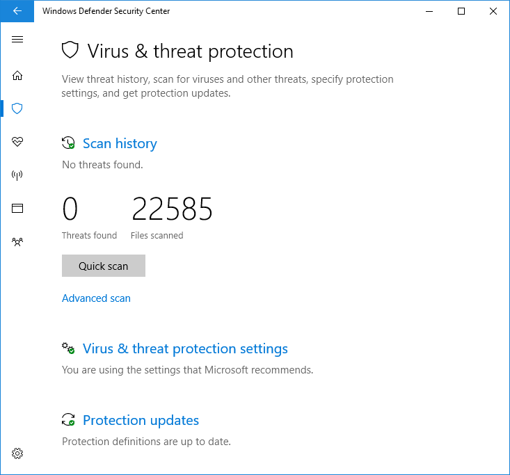

# Microsoft Defender 바이러스 백신에서 제한된 주기적 검사 사용

[!INCLUDE [Microsoft 365 Defender rebranding](../../includes/microsoft-defender.md)]

**적용 대상:**

- [엔드포인트용 Microsoft Defender](/microsoft-365/security/defender-endpoint/)

제한된 주기적 검사는 특정 유형의 위협 감지 및 수정으로, 다른 바이러스 백신 제품을 Windows 10 있습니다.

특정 상황에서만 사용하도록 설정될 수 있습니다. 제한된 주기적 검사 및 다른 바이러스 백신 제품에서 Microsoft Defender 바이러스 백신 방법에 대한 자세한 내용은 Microsoft Defender 바이러스 백신 [참조하세요.](microsoft-defender-antivirus-compatibility.md)

**엔터프라이즈 환경에서는 이 기능을 사용하지 않는 것이 좋습니다. 이는 주로 소비자를 위한 기능입니다.** 이 기능은 맬웨어를 검색하기 위해 Microsoft Defender 바이러스 백신 기능의 제한된 하위 집합만 사용하며, 대부분의 맬웨어 및 사용자 원치 않는 소프트웨어를 검색할 수 없습니다. 또한 관리 및 보고 기능이 제한됩니다. Microsoft는 엔터프라이즈에서 기본 바이러스 백신 솔루션을 선택하고 단독으로 사용하는 것이 좋습니다.

## 제한된 주기적 검색을 사용하도록 설정하는 방법

기본적으로 Microsoft Defender 바이러스 백신 바이러스 백신 제품이 설치되지 않은 경우 또는 다른 Windows 10 만료되었거나 제대로 작동하지 않는 경우 Windows 10 장치에서 자체적으로 사용하도록 설정됩니다.

이 Microsoft Defender 바이러스 백신 사용하도록 설정하면 해당 장치에서 구성하는 일반 옵션이 표시됩니다.

다른 바이러스 백신 제품이 설치 및 작동하면 Microsoft Defender 바이러스 백신 사용하지 않도록 설정됩니다. Windows 보안 앱은 **바이러스** & 위협 방지 섹션을 변경하여 AV 제품에 대한 상태를 표시하고 제품의 구성 옵션에 대한 링크를 제공합니다.

타사 AV 제품 아래에 새 링크가 Microsoft Defender 바이러스 백신 **표시됩니다.** 이 링크를 클릭하면 제한된 주기적 검색을 가능하게 하는 토글이 표시됩니다. 제한된 주기적 옵션은 주기적 검색을 사용하도록 설정하거나 사용하지 않도록 설정하는 토글입니다. 

으로 전환을 **슬라이딩하면** 타사 AV 제품 아래에 표준 Microsoft Defender AV 옵션이 표시됩니다. 제한된 주기적 검사 옵션이 페이지 아래쪽에 표시됩니다.

## 관련 문서

- [동작, 추론 및 실시간 보호 구성](configure-protection-features-microsoft-defender-antivirus.md)
- [Windows 10의 Microsoft Defender 바이러스 백신](microsoft-defender-antivirus-in-windows-10.md)