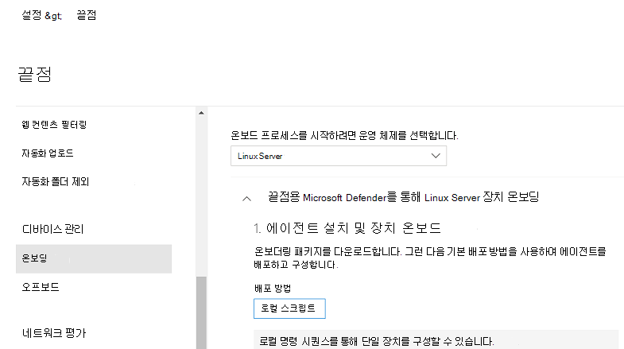

# <a name="deploy-microsoft-defender-for-endpoint-on-linux-manually"></a>Linux에서 수동으로 끝점용 Microsoft Defender 배포

[!INCLUDE [Microsoft 365 Defender rebranding](../../includes/microsoft-defender.md)]


**적용 대상:**
- [엔드포인트용 Microsoft Defender](https://go.microsoft.com/fwlink/p/?linkid=2154037)
- [Microsoft 365 Defender](https://go.microsoft.com/fwlink/?linkid=2118804)

> Endpoint용 Defender를 경험하고 싶나요? [무료 평가판을 신청하세요.](https://signup.microsoft.com/create-account/signup?products=7f379fee-c4f9-4278-b0a1-e4c8c2fcdf7e&ru=https://aka.ms/MDEp2OpenTrial?ocid=docs-wdatp-investigateip-abovefoldlink)

이 문서에서는 Linux에서 수동으로 끝점용 Microsoft Defender를 배포하는 방법을 설명합니다. 배포를 성공적으로 수행하려면 다음 작업을 모두 완료해야 합니다.

- [Linux에서 수동으로 끝점용 Microsoft Defender 배포](#deploy-microsoft-defender-for-endpoint-on-linux-manually)
  - [선행 조건 및 시스템 요구 사항](#prerequisites-and-system-requirements)
  - [Linux 소프트웨어 리포지토리 구성](#configure-the-linux-software-repository)
    - [RHEL 및 변형(CentOS 및 Oracle Linux)](#rhel-and-variants-centos-and-oracle-linux)
    - [SLES 및 변형](#sles-and-variants)
    - [Ubuntu 및 데비안 시스템](#ubuntu-and-debian-systems)
  - [응용 프로그램 설치](#application-installation)
  - [온보더링 패키지 다운로드](#download-the-onboarding-package)
  - [클라이언트 구성](#client-configuration)
  - [설치 관리자 스크립트](#installer-script)
  - [로그 설치 문제](#log-installation-issues)
  - [운영 체제 업그레이드](#operating-system-upgrades)
  - [제거](#uninstallation)

## <a name="prerequisites-and-system-requirements"></a>선행 조건 및 시스템 요구 사항

시작하기 전에 현재 소프트웨어 버전에 대한 선행 조건 및 시스템 요구 사항에 대한 설명은 [Linux의 끝점용 Microsoft Defender를](microsoft-defender-endpoint-linux.md) 참조하세요.

## <a name="configure-the-linux-software-repository"></a>Linux 소프트웨어 리포지토리 구성

Linux의 끝점용 Defender는 다음 채널(아래 *[채널]으로* 표시됨) 중 하나에서 배포할 수 있습니다. *insiders-fast,* *insiders-slow* 또는 *prod*. 이러한 각 채널은 Linux 소프트웨어 리포지토리에 해당합니다. 이러한 리포지토리 중 하나를 사용하기 위해 디바이스를 구성하는 지침은 다음과 같습니다.

채널 선택에 따라 장치에 제공되는 업데이트의 유형과 빈도가 결정됩니다. *insiders-fast의* 장치는 업데이트 및 새 기능을 수신하는 첫 번째  장치로, 그 다음에는 이후의 내부자 속도가 느려지며 마지막으로 *prod가 됩니다.*

새 기능을 미리 보고 초기 피드백을 제공하도록 엔터프라이즈의 일부 장치는 *insiders-fast* 또는 *insiders-slow를* 사용하도록 구성하는 것이 좋습니다.

> [!WARNING]
> 초기 설치 후 채널을 전환하려면 제품을 다시 설치해야 합니다. 제품 채널을 전환하려면 기존 패키지를 제거하고 새 채널을 사용하도록 장치를 다시 구성하고 이 문서의 단계에 따라 새 위치에서 패키지를 설치합니다.

### <a name="rhel-and-variants-centos-and-oracle-linux"></a>RHEL 및 변형(CentOS 및 Oracle Linux)

- 아직 `yum-utils` 설치되지 않은 경우 다음을 설치합니다.

    ```bash
    sudo yum install yum-utils
    ```

- 배포 및 버전을 확인하고 에서 가장 가까운 항목(주, 부)을 `https://packages.microsoft.com/config/rhel/` 식별합니다.

    다음 표를 사용하여 패키지를 찾기 위한 안내를 제공합니다.

    <br>

    ****

    |Distro & 버전|패키지|
    |---|---|
    |RHEL 8.0-8.5의 경우|<https://packages.microsoft.com/config/rhel/8/prod/>|
    |RHEL 7.2-7.9의 경우|<https://packages.microsoft.com/config/rhel/7/prod/>|
    |

    다음 명령에서 *[version]* 및 *[channel]을* 식별한 정보로 바 대체합니다.

    > [!NOTE]
    > Oracle Linux의 경우 *[distro]를* "rhel"으로 바하십시오.

    ```bash
    sudo yum-config-manager --add-repo=https://packages.microsoft.com/config/rhel/[version]/[channel].repo
    ```

    예를 들어 CentOS 7을 실행하고 있으며 프로비전 채널에서 Linux에 Endpoint용 Defender를 배포하려는 *경우:*

    ```bash
    sudo yum-config-manager --add-repo=https://packages.microsoft.com/config/rhel/7/prod.repo
    ```

    또는 선택한 디바이스에서 새로운 기능을 탐색하려는 경우 Linux의 끝점용 Microsoft Defender를 내부자 빠른 채널에 *배포할 수* 있습니다.

    ```bash
    sudo yum-config-manager --add-repo=https://packages.microsoft.com/config/rhel/7/insiders-fast.repo
    ```

- Microsoft GPG 공개 키를 설치합니다.

    ```bash
    sudo rpm --import http://packages.microsoft.com/keys/microsoft.asc
    ```

- 현재 사용하도록 설정된 yum 리포지토리에 대한 모든 메타데이터를 다운로드하여 사용할 수 있도록 합니다.

    ```bash
    yum makecache
    ```

### <a name="sles-and-variants"></a>SLES 및 변형

- 배포 및 버전을 확인하고 에서 가장 가까운 항목(주, 부) 식별 `https://packages.microsoft.com/config/sles/`

    다음 명령에서 *[distro]* 및 *[version]을* 식별한 정보로 바 대체합니다.

    ```bash
    sudo zypper addrepo -c -f -n microsoft-[channel] https://packages.microsoft.com/config/[distro]/[version]/[channel].repo
    ```

    예를 들어 SLES 12를 실행 중일 때 프로비전 채널에서 Linux에 끝점용 Microsoft Defender를 배포할 *경우* 다음을 실행합니다.

    ```bash
    sudo zypper addrepo -c -f -n microsoft-prod https://packages.microsoft.com/config/sles/12/prod.repo
    ```

- Microsoft GPG 공개 키를 설치합니다.

    ```bash
    sudo rpm --import http://packages.microsoft.com/keys/microsoft.asc
    ```

### <a name="ubuntu-and-debian-systems"></a>Ubuntu 및 데비안 시스템

- 아직 `curl` 설치되지 않은 경우 다음을 설치합니다.

    ```bash
    sudo apt-get install curl
    ```

- 아직 `libplist-utils` 설치되지 않은 경우 다음을 설치합니다.

    ```bash
    sudo apt-get install libplist-utils
    ```

- 배포 및 버전을 확인하고 에서 가장 가까운 항목(주, 부)을 `https://packages.microsoft.com/config/[distro]/` 식별합니다.

    아래 명령에서 *[distro]* 및 *[version]을* 식별한 정보로 바 대체합니다.

    ```bash
    curl -o microsoft.list https://packages.microsoft.com/config/[distro]/[version]/[channel].list
    ```

    예를 들어 Ubuntu 18.04를 실행 중일 때 프로비전 채널에서 Linux에 끝점용 Microsoft Defender를 배포할 *경우* 다음을 실행합니다.

    ```bash
    curl -o microsoft.list https://packages.microsoft.com/config/ubuntu/18.04/prod.list
    ```

- 리포지토리 구성을 설치합니다.

    ```bash
    sudo mv ./microsoft.list /etc/apt/sources.list.d/microsoft-[channel].list
    ```

    예를 들어, 프로비전 *채널을 선택한 경우:*

    ```bash
    sudo mv ./microsoft.list /etc/apt/sources.list.d/microsoft-prod.list
    ```

- 아직 `gpg` 설치되지 않은 경우 패키지를 설치합니다.

    ```bash
    sudo apt-get install gpg
    ```

  사용할 `gpg` 수 없는 경우 를 설치합니다. `gnupg`

- Microsoft GPG 공개 키를 설치합니다.

    ```bash
    curl https://packages.microsoft.com/keys/microsoft.asc | sudo apt-key add -
    ```

- https 드라이버가 아직 없는 경우 설치합니다.

    ```bash
    sudo apt-get install apt-transport-https
    ```

- 리포지토리 메타데이터를 업데이트합니다.

    ```bash
    sudo apt-get update
    ```

## <a name="application-installation"></a>응용 프로그램 설치

- RHEL 및 변형(CentOS 및 Oracle Linux):

    ```bash
    sudo yum install mdatp
    ```

    디바이스에 Microsoft 리포지토리가 여러 개 구성되어 있는 경우 패키지를 설치할 리포지토리를 구체화할 수 있습니다. 다음 예에서는 이 장치에 리포지토리 채널도 구성되어 있는 경우 채널에서 패키지를 설치하는 `production` `insiders-fast` 방법을 보여 주며, 장치에서 여러 Microsoft 제품을 사용하는 경우 이러한 상황이 발생될 수 있습니다. 서버의 배포 및 버전에 따라 리포지토리 별칭은 다음 예제의 별칭과 다를 수 있습니다.

    ```bash
    # list all repositories
    yum repolist
    ```

    ```Output
    ...
    packages-microsoft-com-prod               packages-microsoft-com-prod        316
    packages-microsoft-com-prod-insiders-fast packages-microsoft-com-prod-ins      2
    ...
    ```

    ```bash
    # install the package from the production repository
    sudo yum --enablerepo=packages-microsoft-com-prod install mdatp
    ```

- SLES 및 변형:

    ```bash
    sudo zypper install mdatp
    ```

    디바이스에 Microsoft 리포지토리가 여러 개 구성되어 있는 경우 패키지를 설치할 리포지토리를 구체화할 수 있습니다. 다음 예에서는 이 장치에 리포지토리 채널도 구성되어 있는 경우 채널에서 패키지를 설치하는 `production` `insiders-fast` 방법을 보여 주며, 장치에서 여러 Microsoft 제품을 사용하는 경우 이러한 상황이 발생될 수 있습니다.

    ```bash
    zypper repos
    ```

    ```Output
    ...
    #  | Alias | Name | ...
    XX | packages-microsoft-com-insiders-fast | microsoft-insiders-fast | ...
    XX | packages-microsoft-com-prod | microsoft-prod | ...
    ...

    ```

    ```bash
    sudo zypper install packages-microsoft-com-prod:mdatp
    ```

- 우분투 및 데비안 시스템:

    ```bash
    sudo apt-get install mdatp
    ```

    디바이스에 Microsoft 리포지토리가 여러 개 구성되어 있는 경우 패키지를 설치할 리포지토리를 구체화할 수 있습니다. 다음 예에서는 이 장치에 리포지토리 채널도 구성되어 있는 경우 채널에서 패키지를 설치하는 `production` `insiders-fast` 방법을 보여 주며, 장치에서 여러 Microsoft 제품을 사용하는 경우 이러한 상황이 발생될 수 있습니다.

    ```bash
    cat /etc/apt/sources.list.d/*
    ```

    ```Output
    deb [arch=arm64,armhf,amd64] https://packages.microsoft.com/config/ubuntu/18.04/prod insiders-fast main
    deb [arch=amd64] https://packages.microsoft.com/config/ubuntu/18.04/prod bionic main
    ```

    ```bash
    sudo apt -t bionic install mdatp
    ```

## <a name="download-the-onboarding-package"></a>온보더링 패키지 다운로드

다음 포털에서 온보 Microsoft 365 Defender 다운로드합니다.

1. Microsoft 365 Defender 포털에서 온보 설정 > 장치 관리 > **끝점 > 로 이동하세요.**
2. 첫 번째 드롭다운 메뉴에서 **운영 체제로 Linux Server를** 선택합니다. 두 번째 드롭다운 메뉴에서 배포 **방법으로 로컬 스크립트를** 선택합니다.
3. **온보더링 패키지 다운로드를 선택합니다.** 파일을 다른 파일로 WindowsDefenderATPOnboardingPackage.zip.

    

4. 명령 프롬프트에서 파일이 있는지 확인
    보관함의 내용을 추출합니다.

    ```bash
    ls -l
    ```

    ```Output
    total 8
    -rw-r--r-- 1 test  staff  5752 Feb 18 11:22 WindowsDefenderATPOnboardingPackage.zip
    ```

    ```bash
    unzip WindowsDefenderATPOnboardingPackage.zip
    ```

    ```Output
    Archive:  WindowsDefenderATPOnboardingPackage.zip
    inflating: MicrosoftDefenderATPOnboardingLinuxServer.py
    ```

## <a name="client-configuration"></a>클라이언트 구성

1. 대상 MicrosoftDefenderATPOnboardingLinuxServer.py 복사합니다.

    처음에는 클라이언트 장치가 조직과 연결되지 않습니다. *orgId* 특성은 비어 있습니다.

    ```bash
    mdatp health --field org_id
    ```

2. 실행 MicrosoftDefenderATPOnboardingLinuxServer.py.

    > [!NOTE]
    > 이 명령을 실행하려면 장치에 `python` 설치해야 합니다. RHEL 8.x 또는 Ubuntu 20.04 이상을 실행하는 경우 Python 대신 Python 3을 사용해야 합니다.

    ```bash
    python MicrosoftDefenderATPOnboardingLinuxServer.py
    ```

3. 이제 장치가 조직과 연결되어 있는지 확인하고 유효한 조직 식별자를 보고합니다.

    ```bash
    mdatp health --field org_id
    ```

4. 설치를 완료한 후 몇 분 후에 다음 명령을 실행하여 상태를 확인할 수 있습니다. 반환 값은 제품이 예상대로 작동하고 있는 `1` 경우를 나타 내는 값입니다.

    ```bash
    mdatp health --field healthy
    ```

    > [!IMPORTANT]
    > 제품이 처음 시작되면 최신 맬웨어 방지 정의를 다운로드합니다. 인터넷 연결에 따라 이 시간이 몇 분 정도 걸릴 수 있습니다. 이 시간 동안 위의 명령은 의 값을 `false` 반환합니다. 다음 명령을 사용하여 정의 업데이트의 상태를 확인할 수 있습니다.
    >
    > ```bash
    > mdatp health --field definitions_status
    > ```
    >
    > 초기 설치를 완료한 후 프록시를 구성해야 할 수도 있습니다. 정적 프록시 검색에 대한 [Linux의 끝점에 대한 Defender 구성: 설치 후 구성을 참조합니다.](linux-static-proxy-configuration.md#post-installation-configuration)

5. 검색 테스트를 실행하여 장치가 제대로 온보드 및 서비스에 보고되었는지 확인합니다. 새로 온보드된 디바이스에서 다음 단계를 수행합니다.

    - 실시간 보호가 사용하도록 설정되어 있는지 확인합니다(다음 명령을 실행한 `1` 결과로 표시됨).

        ```bash
        mdatp health --field real_time_protection_enabled
        ```

    - 터미널 창을 니다. 다음 명령을 복사하여 실행합니다.

        ``` bash
        curl -o /tmp/eicar.com.txt https://www.eicar.org/download/eicar.com.txt
        ```

    - 파일은 Linux의 끝점에 대한 Defender에 의해 고지된 것입니다. 다음 명령을 사용하여 검색된 모든 위협을 나열합니다.

        ```bash
        mdatp threat list
        ```

## <a name="experience-linux-endpoint-detection-and-response-edr-capabilities-with-simulated-attacks"></a>시뮬레이트된 공격으로 Linux 끝점 감지 및 대응(EDR) 기능 경험

Linux용 EDR 테스트하기 위해 아래 단계에 따라 Linux 서버에서 검색을 시뮬레이트하고 사례를 조사합니다.

1. 온보드 Linux 서버가 서버에 나타나는지 Microsoft 365 Defender. 컴퓨터의 첫 번째 온보더링인 경우 표시될 때까지 최대 20분이 걸릴 수 있습니다.

2. 스크립트 파일을 [](https://aka.ms/LinuxDIY) 다운로드하여 온보딩된 Linux 서버에 추출하고 다음 명령을 실행합니다.`./mde_linux_edr_diy.sh`

3. 몇 분 후에 검색이 Microsoft 365 Defender.

4. 경고 세부 정보, 컴퓨터 타임라인을 살펴보고 일반적인 조사 단계를 수행합니다.

## <a name="installer-script"></a>설치 관리자 스크립트

또는 공용 설치 관리자 리포지토리에 제공된 자동화된 설치 관리자 [bash](https://github.com/microsoft/mdatp-xplat/blob/master/linux/installation/mde_installer.sh) [스크립트를 GitHub 있습니다.](https://github.com/microsoft/mdatp-xplat/)
스크립트는 배포 및 버전을 식별하고, 최신 패키지를 끌어와 설치하도록 장치를 설정합니다.
제공된 스크립트를 사용하여 온보딩할 수도 있습니다.

```bash
❯ ./mde_installer.sh --help
usage: basename ./mde_installer.sh [OPTIONS]
Options:
-c|--channel      specify the channel from which you want to install. Default: insiders-fast
-i|--install      install the product
-r|--remove       remove the product
-u|--upgrade      upgrade the existing product
-o|--onboard      onboard/offboard the product with <onboarding_script>
-p|--passive-mode set EPP to passive mode
-t|--tag          set a tag by declaring <name> and <value>. ex: -t GROUP Coders
-m|--min_req      enforce minimum requirements
-w|--clean        remove repo from package manager for a specific channel
-v|--version      print out script version
-h|--help         display help
```

여기에서 자세히 [읽어 하세요.](https://github.com/microsoft/mdatp-xplat/tree/master/linux/installation)

## <a name="log-installation-issues"></a>로그 설치 문제

오류가 [발생할 때](linux-resources.md#log-installation-issues) 설치 관리자에서 자동으로 생성된 로그를 찾는 방법에 대한 자세한 내용은 설치 문제 로그를 참조하세요.

## <a name="operating-system-upgrades"></a>운영 체제 업그레이드

운영 체제를 새 주 버전으로 업그레이드할 때 먼저 Linux에서 Endpoint용 Defender를 제거하고 업그레이드를 설치한 다음, 디바이스에서 Linux용 Endpoint용 Defender를 다시 구성해야 합니다.

## <a name="how-to-migrate-from-insiders-fast-to-production-channel"></a>프로덕션 채널에서 Insiders-Fast 마이그레이션하는 방법

1. Linux에서 끝점용 Defender의 "Insiders-Fast 채널" 버전을 제거합니다.

    ```bash
    sudo yum remove mdatp
    ```

1. Linux 2016 리포지터에서 끝점에 대한 Defender Insiders-Fast 비활성화

    ```bash
    sudo yum repolist
    ```

    > [!NOTE]
    > 출력에 "packages-microsoft-com-fast-prod"가 표시해야 합니다.

    ```bash
    sudo yum-config-manager --disable packages-microsoft-com-fast-prod
    ```

1. "프로덕션 채널"을 사용하여 Linux에서 끝점용 Microsoft Defender를 다시 배포합니다.

## <a name="uninstallation"></a>제거

클라이언트 [장치에서](linux-resources.md#uninstall) Linux에서 Endpoint용 Defender를 제거하는 방법에 대한 자세한 내용은 제거를 참조합니다.

## <a name="see-also"></a>참고 항목

- [에이전트 상태 문제 조사](health-status.md)
