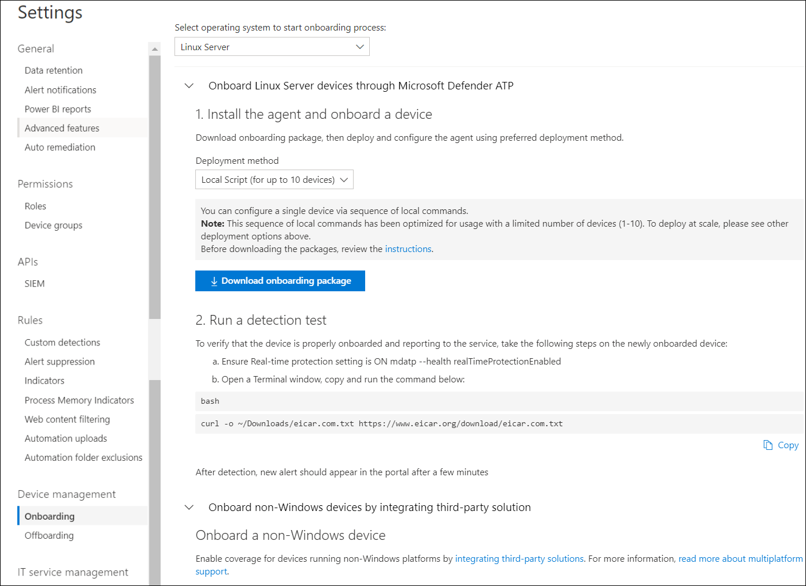

# <a name="deploy-microsoft-defender-for-endpoint-on-linux-manually"></a><span data-ttu-id="2811f-104">Linux에서 수동으로 끝점용 Microsoft Defender 배포</span><span class="sxs-lookup"><span data-stu-id="2811f-104">Deploy Microsoft Defender for Endpoint on Linux manually</span></span>

[!INCLUDE [Microsoft 365 Defender rebranding](../../includes/microsoft-defender.md)]


<span data-ttu-id="2811f-105">**적용 대상:**</span><span class="sxs-lookup"><span data-stu-id="2811f-105">**Applies to:**</span></span>
- [<span data-ttu-id="2811f-106">엔드포인트용 Microsoft Defender</span><span class="sxs-lookup"><span data-stu-id="2811f-106">Microsoft Defender for Endpoint</span></span>](https://go.microsoft.com/fwlink/p/?linkid=2154037)
- [<span data-ttu-id="2811f-107">Microsoft 365 Defender</span><span class="sxs-lookup"><span data-stu-id="2811f-107">Microsoft 365 Defender</span></span>](https://go.microsoft.com/fwlink/?linkid=2118804)

> <span data-ttu-id="2811f-108">Endpoint용 Defender를 경험하고 싶나요?</span><span class="sxs-lookup"><span data-stu-id="2811f-108">Want to experience Defender for Endpoint?</span></span> [<span data-ttu-id="2811f-109">무료 평가판에 등록합니다.</span><span class="sxs-lookup"><span data-stu-id="2811f-109">Sign up for a free trial.</span></span>](https://www.microsoft.com/microsoft-365/windows/microsoft-defender-atp?ocid=docs-wdatp-investigateip-abovefoldlink)

<span data-ttu-id="2811f-110">이 문서에서는 Linux에서 수동으로 끝점용 Microsoft Defender를 배포하는 방법을 설명합니다.</span><span class="sxs-lookup"><span data-stu-id="2811f-110">This article describes how to deploy Microsoft Defender for Endpoint on Linux manually.</span></span> <span data-ttu-id="2811f-111">배포를 성공적으로 수행하려면 다음 작업을 모두 완료해야 합니다.</span><span class="sxs-lookup"><span data-stu-id="2811f-111">A successful deployment requires the completion of all of the following tasks:</span></span>

- [<span data-ttu-id="2811f-112">Linux에서 수동으로 끝점용 Microsoft Defender 배포</span><span class="sxs-lookup"><span data-stu-id="2811f-112">Deploy Microsoft Defender for Endpoint on Linux manually</span></span>](#deploy-microsoft-defender-for-endpoint-on-linux-manually)
  - [<span data-ttu-id="2811f-113">선행 조건 및 시스템 요구 사항</span><span class="sxs-lookup"><span data-stu-id="2811f-113">Prerequisites and system requirements</span></span>](#prerequisites-and-system-requirements)
  - [<span data-ttu-id="2811f-114">Linux 소프트웨어 리포지토리 구성</span><span class="sxs-lookup"><span data-stu-id="2811f-114">Configure the Linux software repository</span></span>](#configure-the-linux-software-repository)
    - [<span data-ttu-id="2811f-115">RHEL 및 변형(CentOS 및 Oracle Linux)</span><span class="sxs-lookup"><span data-stu-id="2811f-115">RHEL and variants (CentOS and Oracle Linux)</span></span>](#rhel-and-variants-centos-and-oracle-linux)
    - [<span data-ttu-id="2811f-116">SLES 및 변형</span><span class="sxs-lookup"><span data-stu-id="2811f-116">SLES and variants</span></span>](#sles-and-variants)
    - [<span data-ttu-id="2811f-117">Ubuntu 및 데비안 시스템</span><span class="sxs-lookup"><span data-stu-id="2811f-117">Ubuntu and Debian systems</span></span>](#ubuntu-and-debian-systems)
  - [<span data-ttu-id="2811f-118">응용 프로그램 설치</span><span class="sxs-lookup"><span data-stu-id="2811f-118">Application installation</span></span>](#application-installation)
  - [<span data-ttu-id="2811f-119">온보더링 패키지 다운로드</span><span class="sxs-lookup"><span data-stu-id="2811f-119">Download the onboarding package</span></span>](#download-the-onboarding-package)
  - [<span data-ttu-id="2811f-120">클라이언트 구성</span><span class="sxs-lookup"><span data-stu-id="2811f-120">Client configuration</span></span>](#client-configuration)
  - [<span data-ttu-id="2811f-121">설치 관리자 스크립트</span><span class="sxs-lookup"><span data-stu-id="2811f-121">Installer script</span></span>](#installer-script)
  - [<span data-ttu-id="2811f-122">로그 설치 문제</span><span class="sxs-lookup"><span data-stu-id="2811f-122">Log installation issues</span></span>](#log-installation-issues)
  - [<span data-ttu-id="2811f-123">운영 체제 업그레이드</span><span class="sxs-lookup"><span data-stu-id="2811f-123">Operating system upgrades</span></span>](#operating-system-upgrades)
  - [<span data-ttu-id="2811f-124">제거</span><span class="sxs-lookup"><span data-stu-id="2811f-124">Uninstallation</span></span>](#uninstallation)

## <a name="prerequisites-and-system-requirements"></a><span data-ttu-id="2811f-125">선행 조건 및 시스템 요구 사항</span><span class="sxs-lookup"><span data-stu-id="2811f-125">Prerequisites and system requirements</span></span>

<span data-ttu-id="2811f-126">시작하기 전에 현재 소프트웨어 버전에 대한 선행 조건 및 시스템 요구 사항에 대한 설명은 [Linux의 끝점용 Microsoft Defender를](microsoft-defender-endpoint-linux.md) 참조하세요.</span><span class="sxs-lookup"><span data-stu-id="2811f-126">Before you get started, see [Microsoft Defender for Endpoint on Linux](microsoft-defender-endpoint-linux.md) for a description of prerequisites and system requirements for the current software version.</span></span>

## <a name="configure-the-linux-software-repository"></a><span data-ttu-id="2811f-127">Linux 소프트웨어 리포지토리 구성</span><span class="sxs-lookup"><span data-stu-id="2811f-127">Configure the Linux software repository</span></span>

<span data-ttu-id="2811f-128">Linux의 끝점용 Defender는 다음 채널(아래 *[채널]으로* 표시됨) 중 하나에서 배포할 수 있습니다. *insiders-fast,* *insiders-slow* 또는 *prod*. 이러한 각 채널은 Linux 소프트웨어 리포지토리에 해당합니다.</span><span class="sxs-lookup"><span data-stu-id="2811f-128">Defender for Endpoint on Linux can be deployed from one of the following channels (denoted below as *[channel]*): *insiders-fast*, *insiders-slow*, or *prod*. Each of these channels corresponds to a Linux software repository.</span></span> <span data-ttu-id="2811f-129">이러한 리포지토리 중 하나를 사용하기 위해 디바이스를 구성하는 지침은 다음과 같습니다.</span><span class="sxs-lookup"><span data-stu-id="2811f-129">Instructions for configuring your device to use one of these repositories are provided below.</span></span>

<span data-ttu-id="2811f-130">채널 선택에 따라 장치에 제공되는 업데이트의 유형과 빈도가 결정됩니다.</span><span class="sxs-lookup"><span data-stu-id="2811f-130">The choice of the channel determines the type and frequency of updates that are offered to your device.</span></span> <span data-ttu-id="2811f-131">*insiders-fast의* 장치는 업데이트 및 새 기능을 수신하는 첫 번째  장치로, 그 다음에는 이후의 내부자 속도가 느려지며 마지막으로 *prod가 됩니다.*</span><span class="sxs-lookup"><span data-stu-id="2811f-131">Devices in *insiders-fast* are the first ones to receive updates and new features, followed later by *insiders-slow* and lastly by *prod*.</span></span>

<span data-ttu-id="2811f-132">새 기능을 미리 보고 초기 피드백을 제공하도록 엔터프라이즈의 일부 장치는 *insiders-fast* 또는 *insiders-slow를* 사용하도록 구성하는 것이 좋습니다.</span><span class="sxs-lookup"><span data-stu-id="2811f-132">In order to preview new features and provide early feedback, it is recommended that you configure some devices in your enterprise to use either *insiders-fast* or *insiders-slow*.</span></span>

> [!WARNING]
> <span data-ttu-id="2811f-133">초기 설치 후 채널을 전환하려면 제품을 다시 설치해야 합니다.</span><span class="sxs-lookup"><span data-stu-id="2811f-133">Switching the channel after the initial installation requires the product to be reinstalled.</span></span> <span data-ttu-id="2811f-134">제품 채널을 전환하려면 기존 패키지를 제거하고 새 채널을 사용하도록 장치를 다시 구성하고 이 문서의 단계에 따라 새 위치에서 패키지를 설치합니다.</span><span class="sxs-lookup"><span data-stu-id="2811f-134">To switch the product channel: uninstall the existing package, re-configure your device to use the new channel, and follow the steps in this document to install the package from the new location.</span></span>

### <a name="rhel-and-variants-centos-and-oracle-linux"></a><span data-ttu-id="2811f-135">RHEL 및 변형(CentOS 및 Oracle Linux)</span><span class="sxs-lookup"><span data-stu-id="2811f-135">RHEL and variants (CentOS and Oracle Linux)</span></span>

- <span data-ttu-id="2811f-136">아직 `yum-utils` 설치되지 않은 경우 다음을 설치합니다.</span><span class="sxs-lookup"><span data-stu-id="2811f-136">Install `yum-utils` if it isn't installed yet:</span></span>

    ```bash
    sudo yum install yum-utils
    ```

- <span data-ttu-id="2811f-137">배포 및 버전을 확인하고 에서 가장 가까운 항목(주, 부)을 `https://packages.microsoft.com/config/` 식별합니다.</span><span class="sxs-lookup"><span data-stu-id="2811f-137">Note your distribution and version, and identify the closest entry (by major, then minor) for it under `https://packages.microsoft.com/config/`.</span></span> <span data-ttu-id="2811f-138">예를 들어 RHEL 7.9는 8보다 7.4에 가깝습니다.</span><span class="sxs-lookup"><span data-stu-id="2811f-138">For instance, RHEL 7.9 is closer to 7.4 than to 8.</span></span>

    <span data-ttu-id="2811f-139">아래 명령에서 *[distro]* 및 *[version]을* 식별한 정보로 바 대체합니다.</span><span class="sxs-lookup"><span data-stu-id="2811f-139">In the below commands, replace *[distro]* and *[version]* with the information you've identified:</span></span>

    > [!NOTE]
    > <span data-ttu-id="2811f-140">Oracle Linux의 경우 *[distro]를* "rhel"으로 바하십시오.</span><span class="sxs-lookup"><span data-stu-id="2811f-140">In case of Oracle Linux, replace *[distro]* with “rhel”.</span></span>

    ```bash
    sudo yum-config-manager --add-repo=https://packages.microsoft.com/config/[distro]/[version]/[channel].repo
    ```

    <span data-ttu-id="2811f-141">예를 들어 CentOS 7을 실행하고 있으며 프로비전 채널에서 Linux에 Endpoint용 Defender를 배포하려는 *경우:*</span><span class="sxs-lookup"><span data-stu-id="2811f-141">For example, if you are running CentOS 7 and want to deploy Defender for Endpoint on Linux from the *prod* channel:</span></span>

    ```bash
    sudo yum-config-manager --add-repo=https://packages.microsoft.com/config/centos/7/prod.repo
    ```

    <span data-ttu-id="2811f-142">또는 선택한 디바이스에서 새로운 기능을 탐색하려는 경우 Linux용 MDE를 내부자 빠른 채널에 *배포할 수* 있습니다.</span><span class="sxs-lookup"><span data-stu-id="2811f-142">Or if you wish to explore new features on selected devices, you might want to deploy MDE for Linux to *insiders-fast* channel:</span></span>

    ```bash
    sudo yum-config-manager --add-repo=https://packages.microsoft.com/config/centos/7/insiders-fast.repo
    ```

- <span data-ttu-id="2811f-143">Microsoft GPG 공개 키를 설치합니다.</span><span class="sxs-lookup"><span data-stu-id="2811f-143">Install the Microsoft GPG public key:</span></span>

    ```bash
    sudo rpm --import http://packages.microsoft.com/keys/microsoft.asc
    ```

- <span data-ttu-id="2811f-144">현재 사용하도록 설정된 yum 리포지토리에 대한 모든 메타데이터를 다운로드하여 사용할 수 있도록 합니다.</span><span class="sxs-lookup"><span data-stu-id="2811f-144">Download and make usable all the metadata for the currently enabled yum repositories:</span></span>

    ```bash
    yum makecache
    ```

### <a name="sles-and-variants"></a><span data-ttu-id="2811f-145">SLES 및 변형</span><span class="sxs-lookup"><span data-stu-id="2811f-145">SLES and variants</span></span>

- <span data-ttu-id="2811f-146">배포 및 버전을 확인하고 에서 가장 가까운 항목(주, 부) 식별 `https://packages.microsoft.com/config/`</span><span class="sxs-lookup"><span data-stu-id="2811f-146">Note your distribution and version, and identify the closest entry(by major, then minor) for it under `https://packages.microsoft.com/config/`.</span></span>

    <span data-ttu-id="2811f-147">다음 명령에서 *[distro]* 및 *[version]을* 식별한 정보로 바 대체합니다.</span><span class="sxs-lookup"><span data-stu-id="2811f-147">In the following commands, replace *[distro]* and *[version]* with the information you've identified:</span></span>

    ```bash
    sudo zypper addrepo -c -f -n microsoft-[channel] https://packages.microsoft.com/config/[distro]/[version]/[channel].repo
    ```

    <span data-ttu-id="2811f-148">예를 들어 SLES 12를 실행 중일 때 프로비전 채널에서 Linux용 MDE를 배포할 *경우* 다음을 실행합니다.</span><span class="sxs-lookup"><span data-stu-id="2811f-148">For example, if you are running SLES 12 and wish to deploy MDE for Linux from the *prod* channel:</span></span>

    ```bash
    sudo zypper addrepo -c -f -n microsoft-prod https://packages.microsoft.com/config/sles/12/prod.repo
    ```

- <span data-ttu-id="2811f-149">Microsoft GPG 공개 키를 설치합니다.</span><span class="sxs-lookup"><span data-stu-id="2811f-149">Install the Microsoft GPG public key:</span></span>

    ```bash
    sudo rpm --import http://packages.microsoft.com/keys/microsoft.asc
    ```

### <a name="ubuntu-and-debian-systems"></a><span data-ttu-id="2811f-150">Ubuntu 및 데비안 시스템</span><span class="sxs-lookup"><span data-stu-id="2811f-150">Ubuntu and Debian systems</span></span>

- <span data-ttu-id="2811f-151">아직 `curl` 설치되지 않은 경우 다음을 설치합니다.</span><span class="sxs-lookup"><span data-stu-id="2811f-151">Install `curl` if it isn't installed yet:</span></span>

    ```bash
    sudo apt-get install curl
    ```

- <span data-ttu-id="2811f-152">아직 `libplist-utils` 설치되지 않은 경우 다음을 설치합니다.</span><span class="sxs-lookup"><span data-stu-id="2811f-152">Install `libplist-utils` if it isn't installed yet:</span></span>

    ```bash
    sudo apt-get install libplist-utils
    ```

- <span data-ttu-id="2811f-153">배포 및 버전을 확인하고 에서 가장 가까운 항목(주, 부)을 `https://packages.microsoft.com/config` 식별합니다.</span><span class="sxs-lookup"><span data-stu-id="2811f-153">Note your distribution and version, and identify the closest entry (by major, then minor) for it under `https://packages.microsoft.com/config`.</span></span>

    <span data-ttu-id="2811f-154">아래 명령에서 *[distro]* 및 *[version]을* 식별한 정보로 바 대체합니다.</span><span class="sxs-lookup"><span data-stu-id="2811f-154">In the below command, replace *[distro]* and *[version]* with the information you've identified:</span></span>

    ```bash
    curl -o microsoft.list https://packages.microsoft.com/config/[distro]/[version]/[channel].list
    ```

    <span data-ttu-id="2811f-155">예를 들어 Ubuntu 18.04를 실행 중일 때 프로비전 채널에서 Linux용 MDE를 배포할 *경우* 다음을 실행합니다.</span><span class="sxs-lookup"><span data-stu-id="2811f-155">For example, if you are running Ubuntu 18.04 and wish to deploy MDE for Linux from the *prod* channel:</span></span>

    ```bash
    curl -o microsoft.list https://packages.microsoft.com/config/ubuntu/18.04/prod.list
    ```

- <span data-ttu-id="2811f-156">리포지토리 구성을 설치합니다.</span><span class="sxs-lookup"><span data-stu-id="2811f-156">Install the repository configuration:</span></span>

    ```bash
    sudo mv ./microsoft.list /etc/apt/sources.list.d/microsoft-[channel].list
    ```
    <span data-ttu-id="2811f-157">예를 들어, 프로비전 *채널을 선택한 경우:*</span><span class="sxs-lookup"><span data-stu-id="2811f-157">For example, if you chose *prod* channel:</span></span>

    ```bash
    sudo mv ./microsoft.list /etc/apt/sources.list.d/microsoft-prod.list
    ```

- <span data-ttu-id="2811f-158">아직 `gpg` 설치되지 않은 경우 패키지를 설치합니다.</span><span class="sxs-lookup"><span data-stu-id="2811f-158">Install the `gpg` package if not already installed:</span></span>

    ```bash
    sudo apt-get install gpg
    ```

  <span data-ttu-id="2811f-159">사용할 `gpg` 수 없는 경우 를 설치합니다. `gnupg`</span><span class="sxs-lookup"><span data-stu-id="2811f-159">If `gpg` is not available, then install `gnupg`.</span></span>

- <span data-ttu-id="2811f-160">Microsoft GPG 공개 키를 설치합니다.</span><span class="sxs-lookup"><span data-stu-id="2811f-160">Install the Microsoft GPG public key:</span></span>

    ```bash
    curl https://packages.microsoft.com/keys/microsoft.asc | sudo apt-key add -
    ```

- <span data-ttu-id="2811f-161">https 드라이버가 아직 없는 경우 설치합니다.</span><span class="sxs-lookup"><span data-stu-id="2811f-161">Install the https driver if it's not already present:</span></span>

    ```bash
    sudo apt-get install apt-transport-https
    ```

- <span data-ttu-id="2811f-162">리포지토리 메타데이터를 업데이트합니다.</span><span class="sxs-lookup"><span data-stu-id="2811f-162">Update the repository metadata:</span></span>

    ```bash
    sudo apt-get update
    ```

## <a name="application-installation"></a><span data-ttu-id="2811f-163">응용 프로그램 설치</span><span class="sxs-lookup"><span data-stu-id="2811f-163">Application installation</span></span>

- <span data-ttu-id="2811f-164">RHEL 및 변형(CentOS 및 Oracle Linux):</span><span class="sxs-lookup"><span data-stu-id="2811f-164">RHEL and variants (CentOS and Oracle Linux):</span></span>

    ```bash
    sudo yum install mdatp
    ```

    <span data-ttu-id="2811f-165">디바이스에 Microsoft 리포지토리가 여러 개 구성되어 있는 경우 패키지를 설치할 리포지토리를 구체화할 수 있습니다.</span><span class="sxs-lookup"><span data-stu-id="2811f-165">If you have multiple Microsoft repositories configured on your device, you can be specific about which repository to install the package from.</span></span> <span data-ttu-id="2811f-166">다음 예에서는 이 장치에 리포지토리 채널도 구성되어 있는 경우 채널에서 패키지를 설치하는 `production` `insiders-fast` 방법을 보여 주며,</span><span class="sxs-lookup"><span data-stu-id="2811f-166">The following example shows how to install the package from the `production` channel if you also have the `insiders-fast` repository channel configured on this device.</span></span> <span data-ttu-id="2811f-167">장치에서 여러 Microsoft 제품을 사용하는 경우 이러한 상황이 발생될 수 있습니다.</span><span class="sxs-lookup"><span data-stu-id="2811f-167">This situation can happen if you are using multiple Microsoft products on your device.</span></span> <span data-ttu-id="2811f-168">서버의 배포 및 버전에 따라 리포지토리 별칭은 다음 예제의 별칭과 다를 수 있습니다.</span><span class="sxs-lookup"><span data-stu-id="2811f-168">Depending on the distribution and the version of your server, the repository alias might be different than the one in the following example.</span></span>

    ```bash
    # list all repositories
    yum repolist
    ```
    ```Output
    ...
    packages-microsoft-com-prod               packages-microsoft-com-prod        316
    packages-microsoft-com-prod-insiders-fast packages-microsoft-com-prod-ins      2
    ...
    ```
    ```bash
    # install the package from the production repository
    sudo yum --enablerepo=packages-microsoft-com-prod install mdatp
    ```

- <span data-ttu-id="2811f-169">SLES 및 변형:</span><span class="sxs-lookup"><span data-stu-id="2811f-169">SLES and variants:</span></span>

    ```bash
    sudo zypper install mdatp
    ```

    <span data-ttu-id="2811f-170">디바이스에 Microsoft 리포지토리가 여러 개 구성되어 있는 경우 패키지를 설치할 리포지토리를 구체화할 수 있습니다.</span><span class="sxs-lookup"><span data-stu-id="2811f-170">If you have multiple Microsoft repositories configured on your device, you can be specific about which repository to install the package from.</span></span> <span data-ttu-id="2811f-171">다음 예에서는 이 장치에 리포지토리 채널도 구성되어 있는 경우 채널에서 패키지를 설치하는 `production` `insiders-fast` 방법을 보여 주며,</span><span class="sxs-lookup"><span data-stu-id="2811f-171">The following example shows how to install the package from the `production` channel if you also have the `insiders-fast` repository channel configured on this device.</span></span> <span data-ttu-id="2811f-172">장치에서 여러 Microsoft 제품을 사용하는 경우 이러한 상황이 발생될 수 있습니다.</span><span class="sxs-lookup"><span data-stu-id="2811f-172">This situation can happen if you are using multiple Microsoft products on your device.</span></span>

    ```bash
    zypper repos
    ```

    ```Output
    ...
    #  | Alias | Name | ...
    XX | packages-microsoft-com-insiders-fast | microsoft-insiders-fast | ...
    XX | packages-microsoft-com-prod | microsoft-prod | ...
    ...
    ```
    ```bash
    sudo zypper install packages-microsoft-com-prod:mdatp
    ```

- <span data-ttu-id="2811f-173">우분투 및 데비안 시스템:</span><span class="sxs-lookup"><span data-stu-id="2811f-173">Ubuntu and Debian system:</span></span>

    ```bash
    sudo apt-get install mdatp
    ```

    <span data-ttu-id="2811f-174">디바이스에 Microsoft 리포지토리가 여러 개 구성되어 있는 경우 패키지를 설치할 리포지토리를 구체화할 수 있습니다.</span><span class="sxs-lookup"><span data-stu-id="2811f-174">If you have multiple Microsoft repositories configured on your device, you can be specific about which repository to install the package from.</span></span> <span data-ttu-id="2811f-175">다음 예에서는 이 장치에 리포지토리 채널도 구성되어 있는 경우 채널에서 패키지를 설치하는 `production` `insiders-fast` 방법을 보여 주며,</span><span class="sxs-lookup"><span data-stu-id="2811f-175">The following example shows how to install the package from the `production` channel if you also have the `insiders-fast` repository channel configured on this device.</span></span> <span data-ttu-id="2811f-176">장치에서 여러 Microsoft 제품을 사용하는 경우 이러한 상황이 발생될 수 있습니다.</span><span class="sxs-lookup"><span data-stu-id="2811f-176">This situation can happen if you are using multiple Microsoft products on your device.</span></span>

    ```bash
    cat /etc/apt/sources.list.d/*
    ```
    ```Output
    deb [arch=arm64,armhf,amd64] https://packages.microsoft.com/ubuntu/18.04/prod insiders-fast main
    deb [arch=amd64] https://packages.microsoft.com/ubuntu/18.04/prod bionic main
    ```
    ```bash
    sudo apt -t bionic install mdatp
    ```

## <a name="download-the-onboarding-package"></a><span data-ttu-id="2811f-177">온보더링 패키지 다운로드</span><span class="sxs-lookup"><span data-stu-id="2811f-177">Download the onboarding package</span></span>

<span data-ttu-id="2811f-178">다음 사이트에서 온보더링 패키지를 Microsoft Defender 보안 센터.</span><span class="sxs-lookup"><span data-stu-id="2811f-178">Download the onboarding package from Microsoft Defender Security Center:</span></span>

1. <span data-ttu-id="2811f-179">다음 Microsoft Defender 보안 센터 **온보드 설정 > 장치** 관리 > 로 이동하세요.</span><span class="sxs-lookup"><span data-stu-id="2811f-179">In Microsoft Defender Security Center, go to **Settings > Device Management > Onboarding**.</span></span>
2. <span data-ttu-id="2811f-180">첫 번째 드롭다운 메뉴에서 **운영 체제로 Linux Server를** 선택합니다.</span><span class="sxs-lookup"><span data-stu-id="2811f-180">In the first drop-down menu, select **Linux Server** as the operating system.</span></span> <span data-ttu-id="2811f-181">두 번째 드롭다운 메뉴에서 배포 방법으로 로컬 스크립트(최대 **10대의 디바이스)를** 선택합니다.</span><span class="sxs-lookup"><span data-stu-id="2811f-181">In the second drop-down menu, select **Local Script (for up to 10 devices)** as the deployment method.</span></span>
3. <span data-ttu-id="2811f-182">**온보더링 패키지 다운로드를 선택합니다.**</span><span class="sxs-lookup"><span data-stu-id="2811f-182">Select **Download onboarding package**.</span></span> <span data-ttu-id="2811f-183">파일을 다른 파일로 WindowsDefenderATPOnboardingPackage.zip.</span><span class="sxs-lookup"><span data-stu-id="2811f-183">Save the file as WindowsDefenderATPOnboardingPackage.zip.</span></span>

    

4. <span data-ttu-id="2811f-185">명령 프롬프트에서 파일이 있는지 확인</span><span class="sxs-lookup"><span data-stu-id="2811f-185">From a command prompt, verify that you have the file.</span></span>
    <span data-ttu-id="2811f-186">보관함의 내용을 추출합니다.</span><span class="sxs-lookup"><span data-stu-id="2811f-186">Extract the contents of the archive:</span></span>

    ```bash
    ls -l
    ```

    ```Output
    total 8
    -rw-r--r-- 1 test  staff  5752 Feb 18 11:22 WindowsDefenderATPOnboardingPackage.zip
    ```

    ```bash
    unzip WindowsDefenderATPOnboardingPackage.zip
    ```
    ```Output
    Archive:  WindowsDefenderATPOnboardingPackage.zip
    inflating: MicrosoftDefenderATPOnboardingLinuxServer.py
    ```


## <a name="client-configuration"></a><span data-ttu-id="2811f-187">클라이언트 구성</span><span class="sxs-lookup"><span data-stu-id="2811f-187">Client configuration</span></span>

1. <span data-ttu-id="2811f-188">대상 MicrosoftDefenderATPOnboardingLinuxServer.py 복사합니다.</span><span class="sxs-lookup"><span data-stu-id="2811f-188">Copy MicrosoftDefenderATPOnboardingLinuxServer.py to the target device.</span></span>

    <span data-ttu-id="2811f-189">처음에는 클라이언트 장치가 조직과 연결되지 않습니다.</span><span class="sxs-lookup"><span data-stu-id="2811f-189">Initially the client device is not associated with an organization.</span></span> <span data-ttu-id="2811f-190">*orgId* 특성은 비어 있습니다.</span><span class="sxs-lookup"><span data-stu-id="2811f-190">Note that the *orgId* attribute is blank:</span></span>

    ```bash
    mdatp health --field org_id
    ```

2. <span data-ttu-id="2811f-191">다음 MicrosoftDefenderATPOnboardingLinuxServer.py 실행하고 이 명령을 실행하려면 장치에 다음을 `python` 설치해야 합니다.</span><span class="sxs-lookup"><span data-stu-id="2811f-191">Run MicrosoftDefenderATPOnboardingLinuxServer.py, and note that, in order to run this command, you must have `python` installed on the device:</span></span>

    ```bash
    python MicrosoftDefenderATPOnboardingLinuxServer.py
    ```

3. <span data-ttu-id="2811f-192">이제 장치가 조직과 연결되어 있는지 확인하고 유효한 조직 식별자를 보고합니다.</span><span class="sxs-lookup"><span data-stu-id="2811f-192">Verify that the device is now associated with your organization and reports a valid organization identifier:</span></span>

    ```bash
    mdatp health --field org_id
    ```

4. <span data-ttu-id="2811f-193">설치를 완료한 후 몇 분 후에 다음 명령을 실행하여 상태를 확인할 수 있습니다.</span><span class="sxs-lookup"><span data-stu-id="2811f-193">A few minutes after you complete the installation, you can see the status by running the following command.</span></span> <span data-ttu-id="2811f-194">반환 값은 제품이 예상대로 작동하고 있는 `1` 경우를 나타 내는 값입니다.</span><span class="sxs-lookup"><span data-stu-id="2811f-194">A return value of `1` denotes that the product is functioning as expected:</span></span>

    ```bash
    mdatp health --field healthy
    ```

    > [!IMPORTANT]
    > <span data-ttu-id="2811f-195">제품이 처음 시작되면 최신 맬웨어 방지 정의를 다운로드합니다.</span><span class="sxs-lookup"><span data-stu-id="2811f-195">When the product starts for the first time, it downloads the latest antimalware definitions.</span></span> <span data-ttu-id="2811f-196">인터넷 연결에 따라 이 시간이 몇 분 정도 걸릴 수 있습니다.</span><span class="sxs-lookup"><span data-stu-id="2811f-196">Depending on your Internet connection, this can take up to a few minutes.</span></span> <span data-ttu-id="2811f-197">이 시간 동안 위의 명령은 의 값을 `false` 반환합니다.</span><span class="sxs-lookup"><span data-stu-id="2811f-197">During this time the above command returns a value of `false`.</span></span> <span data-ttu-id="2811f-198">다음 명령을 사용하여 정의 업데이트의 상태를 확인할 수 있습니다.</span><span class="sxs-lookup"><span data-stu-id="2811f-198">You can check the status of the definition update using the following command:</span></span>
    > ```bash
    > mdatp health --field definitions_status
    > ```
    > <span data-ttu-id="2811f-199">초기 설치를 완료한 후 프록시를 구성해야 할 수도 있습니다.</span><span class="sxs-lookup"><span data-stu-id="2811f-199">Please note that you may also need to configure a proxy after completing the initial installation.</span></span> <span data-ttu-id="2811f-200">정적 프록시 검색에 대한 [Linux의 끝점에 대한 Defender 구성: 설치 후 구성을 참조합니다.](https://docs.microsoft.com/microsoft-365/security/defender-endpoint/linux-static-proxy-configuration#post-installation-configuration)</span><span class="sxs-lookup"><span data-stu-id="2811f-200">See [Configure Defender for Endpoint on Linux for static proxy discovery: Post-installation configuration](https://docs.microsoft.com/microsoft-365/security/defender-endpoint/linux-static-proxy-configuration#post-installation-configuration).</span></span>

5. <span data-ttu-id="2811f-201">검색 테스트를 실행하여 장치가 제대로 온보드 및 서비스에 보고되었는지 확인합니다.</span><span class="sxs-lookup"><span data-stu-id="2811f-201">Run a detection test to verify that the device is properly onboarded and reporting to the service.</span></span> <span data-ttu-id="2811f-202">새로 온보드된 디바이스에서 다음 단계를 수행합니다.</span><span class="sxs-lookup"><span data-stu-id="2811f-202">Perform the following steps on the newly onboarded device:</span></span>

    - <span data-ttu-id="2811f-203">실시간 보호가 사용하도록 설정되어 있는지 확인합니다(다음 명령을 실행한 `1` 결과로 표시됨).</span><span class="sxs-lookup"><span data-stu-id="2811f-203">Ensure that real-time protection is enabled (denoted by a result of `1` from running the following command):</span></span>

        ```bash
        mdatp health --field real_time_protection_enabled
        ```

    - <span data-ttu-id="2811f-204">터미널 창을 니다.</span><span class="sxs-lookup"><span data-stu-id="2811f-204">Open a Terminal window.</span></span> <span data-ttu-id="2811f-205">다음 명령을 복사하여 실행합니다.</span><span class="sxs-lookup"><span data-stu-id="2811f-205">Copy and execute the following command:</span></span>

        ``` bash
        curl -o /tmp/eicar.com.txt https://www.eicar.org/download/eicar.com.txt
        ```

    - <span data-ttu-id="2811f-206">파일은 Linux의 끝점에 대한 Defender에 의해 고지된 것입니다.</span><span class="sxs-lookup"><span data-stu-id="2811f-206">The file should have been quarantined by Defender for Endpoint on Linux.</span></span> <span data-ttu-id="2811f-207">다음 명령을 사용하여 검색된 모든 위협을 나열합니다.</span><span class="sxs-lookup"><span data-stu-id="2811f-207">Use the following command to list all the detected threats:</span></span>

        ```bash
        mdatp threat list
        ```

## <a name="installer-script"></a><span data-ttu-id="2811f-208">설치 관리자 스크립트</span><span class="sxs-lookup"><span data-stu-id="2811f-208">Installer script</span></span>

<span data-ttu-id="2811f-209">또는 공용 설치 관리자 리포지토리에 제공된 자동화된 설치 관리자 [bash](https://github.com/microsoft/mdatp-xplat/blob/master/linux/installation/mde_installer.sh) [스크립트를 GitHub 있습니다.](https://github.com/microsoft/mdatp-xplat/)</span><span class="sxs-lookup"><span data-stu-id="2811f-209">Alternatively, you can use an automated [installer bash script](https://github.com/microsoft/mdatp-xplat/blob/master/linux/installation/mde_installer.sh) provided in our [public GitHub repository](https://github.com/microsoft/mdatp-xplat/).</span></span>
<span data-ttu-id="2811f-210">스크립트는 배포 및 버전을 식별하고, 최신 패키지를 끌어와 설치하도록 장치를 설정합니다.</span><span class="sxs-lookup"><span data-stu-id="2811f-210">The script identifies the distribution and version, and sets up the device to pull the latest package and install it.</span></span>
<span data-ttu-id="2811f-211">제공된 스크립트를 사용하여 온보딩할 수도 있습니다.</span><span class="sxs-lookup"><span data-stu-id="2811f-211">You can also onboard with a provided script.</span></span>

```bash
❯ ./mde_installer.sh --help
usage: basename ./mde_installer.sh [OPTIONS]
Options:
-c|--channel      specify the channel from which you want to install. Default: insiders-fast
-i|--install      install the product
-r|--remove       remove the product
-u|--upgrade      upgrade the existing product
-o|--onboard      onboard/offboard the product with <onboarding_script>
-p|--passive-mode set EPP to passive mode
-t|--tag          set a tag by declaring <name> and <value>. ex: -t GROUP Coders
-m|--min_req      enforce minimum requirements
-w|--clean        remove repo from package manager for a specific channel
-v|--version      print out script version
-h|--help         display help
```

<span data-ttu-id="2811f-212">여기에서 자세히 [읽어 하세요.](https://github.com/microsoft/mdatp-xplat/tree/master/linux/installation)</span><span class="sxs-lookup"><span data-stu-id="2811f-212">Read more [here](https://github.com/microsoft/mdatp-xplat/tree/master/linux/installation).</span></span>

## <a name="log-installation-issues"></a><span data-ttu-id="2811f-213">로그 설치 문제</span><span class="sxs-lookup"><span data-stu-id="2811f-213">Log installation issues</span></span>

<span data-ttu-id="2811f-214">오류가 [발생할 때](linux-resources.md#log-installation-issues) 설치 관리자에서 자동으로 생성된 로그를 찾는 방법에 대한 자세한 내용은 설치 문제 로그를 참조하세요.</span><span class="sxs-lookup"><span data-stu-id="2811f-214">See [Log installation issues](linux-resources.md#log-installation-issues) for more information on how to find the automatically generated log that is created by the installer when an error occurs.</span></span>

## <a name="operating-system-upgrades"></a><span data-ttu-id="2811f-215">운영 체제 업그레이드</span><span class="sxs-lookup"><span data-stu-id="2811f-215">Operating system upgrades</span></span>

<span data-ttu-id="2811f-216">운영 체제를 새 주 버전으로 업그레이드할 때 먼저 Linux에서 Endpoint용 Defender를 제거하고 업그레이드를 설치한 다음, 디바이스에서 Linux용 Endpoint용 Defender를 다시 구성해야 합니다.</span><span class="sxs-lookup"><span data-stu-id="2811f-216">When upgrading your operating system to a new major version, you must first uninstall Defender for Endpoint on Linux, install the upgrade, and finally reconfigure Defender for Endpoint on Linux on your device.</span></span>

## <a name="how-to-migrate-from-insiders-fast-to-production-channel"></a><span data-ttu-id="2811f-217">프로덕션 채널에서 Insiders-Fast 마이그레이션하는 방법</span><span class="sxs-lookup"><span data-stu-id="2811f-217">How to migrate from Insiders-Fast to Production channel</span></span>

1. <span data-ttu-id="2811f-218">Linux용 MDE의 "Insiders-Fast 채널" 버전을 제거합니다.</span><span class="sxs-lookup"><span data-stu-id="2811f-218">Uninstall the “Insiders-Fast channel” version of MDE for Linux.</span></span>

    ``
    sudo yum remove mdatp
    ``

1. <span data-ttu-id="2811f-219">Linux용 MDE 사용 안 Insiders-Fast 리포지타이  ``
    sudo yum repolist
    ``</span><span class="sxs-lookup"><span data-stu-id="2811f-219">Disable the MDE for Linux Insiders-Fast repo  ``
    sudo yum repolist
 ``</span></span>

    > [!NOTE]
    > <span data-ttu-id="2811f-220">출력에 "packages-microsoft-com-fast-prod"가 표시해야 합니다.</span><span class="sxs-lookup"><span data-stu-id="2811f-220">The output should show “packages-microsoft-com-fast-prod”.</span></span>

    ``
    sudo yum-config-manager --disable packages-microsoft-com-fast-prod
    ``
1. <span data-ttu-id="2811f-221">"프로덕션 채널"을 사용하여 Linux용 MDE를 다시 배포합니다.</span><span class="sxs-lookup"><span data-stu-id="2811f-221">Redeploy MDE for Linux using the “Production channel”.</span></span>


## <a name="uninstallation"></a><span data-ttu-id="2811f-222">제거</span><span class="sxs-lookup"><span data-stu-id="2811f-222">Uninstallation</span></span>

<span data-ttu-id="2811f-223">클라이언트 [장치에서](linux-resources.md#uninstall) Linux에서 Endpoint용 Defender를 제거하는 방법에 대한 자세한 내용은 제거를 참조합니다.</span><span class="sxs-lookup"><span data-stu-id="2811f-223">See [Uninstall](linux-resources.md#uninstall) for details on how to remove Defender for Endpoint on Linux from client devices.</span></span>
